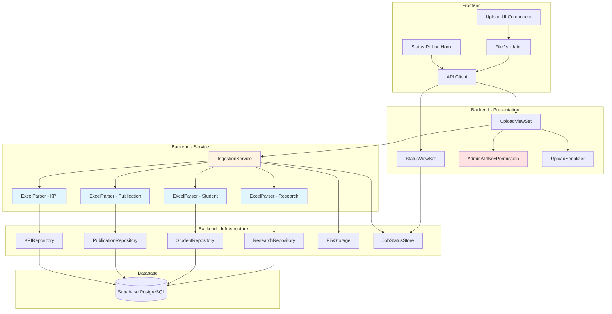

# CSV/Excel 파일 업로드 기능 구현 계획 (TDD 기반)

**기능명:** CSV/Excel 파일 업로드 및 데이터 파싱
**작성일:** 2025-11-02
**버전:** 1.0
**작성자:** Plan Writer Agent
**기반 문서:** docs/001-csv-upload/spec.md

---

## 1. 개요

### 1.1 목표
TDD(Test-Driven Development) 원칙에 따라 CSV/Excel 파일 업로드 기능을 안정적이고 테스트 가능한 모듈로 구현합니다.

### 1.2 핵심 모듈 목록
- **Backend - Presentation Layer**: API 엔드포인트 및 권한 검증
- **Backend - Service Layer**: 비즈니스 로직 (파일 파싱, 작업 조정)
- **Backend - Infrastructure Layer**: DB 저장 및 파일 시스템
- **Frontend - Upload UI**: 파일 업로드 인터페이스
- **Frontend - Status Polling**: 작업 상태 추적

### 1.3 TDD 적용 범위
- **Unit Tests (70%)**: Pandas 파싱 로직, 검증 로직
- **Integration Tests (20%)**: DRF API 엔드포인트, DB 저장
- **Acceptance Tests (10%)**: E2E 업로드 플로우

### 1.4 MVP 간소화 전략
- UTF-8 인코딩만 지원 (자동 감지 제외)
- 메모리 기반 작업 상태 저장 (Redis 제외)
- ThreadPoolExecutor 순차 처리 (worker=1)
- 전체 교체 모드만 지원 (UPSERT 제외)

### 1.5 환경 변수 요구사항

**Backend (.env):**
- `ADMIN_API_KEY`: 하드코딩된 관리자 API 키 (예: "your-secret-key-here")
- `DATABASE_URL`: Supabase PostgreSQL 연결 문자열
- `DEBUG`: True/False (Django 디버그 모드)
- `ALLOWED_HOSTS`: 쉼표로 구분된 호스트명

**Frontend (.env.local):**
- `REACT_APP_API_BASE_URL`: 백엔드 API URL (예: "https://api.example.com")
- `REACT_APP_ADMIN_MODE`: "true"로 설정하여 관리자 업로드 페이지 접근 활성화

---

## 2. Architecture Diagram



**레이어 색상 범례:**
- 파란색: 핵심 비즈니스 로직 (Pandas Parser - 높은 테스트 커버리지)
- 노란색: 유스케이스 조정 (Ingestion Service)
- 빨간색: 보안 계층 (Permission)

---

## 3. Implementation Plan

### 3.1 Backend - Infrastructure Layer

#### 3.1.1 Django Models
**Location:** `backend/data_ingestion/infrastructure/models.py`

**Responsibility:**
- 4개 테이블 정의 (ResearchProject, Student, Publication, DepartmentKPI)
- PK, 인덱스, 제약 조건 설정

**Test Strategy:** Integration Test (Django TestCase)

**Test Scenarios:**
- **Arrange-Act-Assert:**
  - Red: 모델 인스턴스 생성 → DB 저장 → 조회 성공
  - Red: PK 중복 삽입 시 IntegrityError 발생
  - Red: NOT NULL 제약 위반 시 ValidationError 발생

**Implementation Order:**
1. Red: 모델 정의 테스트 작성 (테이블 존재 확인)
2. Green: Django 모델 클래스 작성
3. Refactor: Meta 옵션 추가 (인덱스, verbose_name)
4. Red: 제약 조건 테스트 (UNIQUE, NOT NULL)
5. Green: validators 추가
6. Migration 생성 및 적용

**Dependencies:** None (가장 먼저 구현)

---

#### 3.1.1.1 Domain Entities

**Location:** `backend/data_ingestion/domain/entities.py`

**Responsibility:**
- 비즈니스 도메인 엔티티 정의 (Pure Python)
- 인프라 독립적 데이터 구조

**Implementation:**
```python
from dataclasses import dataclass
from datetime import date
from typing import Optional

@dataclass
class ResearchFunding:
    execution_id: str
    department: str
    total_budget: int
    execution_date: date
    execution_amount: int

@dataclass
class Student:
    student_id: str
    department: str
    grade: int
    program_type: str  # 학사/석사/박사
    enrollment_status: str  # 재학/휴학/졸업

@dataclass
class Publication:
    publication_id: str
    department: str
    journal_tier: str  # SCIE/KCI
    impact_factor: Optional[float]

@dataclass
class DepartmentKPI:
    evaluation_year: int
    department: str
    employment_rate: float  # 백분율
    tech_transfer_revenue: float  # 억원
```

---

#### 3.1.2 Repositories (Data Access Layer)
**Location:** `backend/data_ingestion/infrastructure/repositories.py`

**Responsibility:**
- Pandas DataFrame → Django Model Bulk Insert
- 전체 교체 모드 구현 (DELETE + INSERT)
- 트랜잭션 관리

**Test Strategy:** Integration Test

**Test Scenarios (TDD Cycle):**

**Red Phase:**
```python
def test_save_research_funding_replaces_existing_data():
    # Arrange: 기존 데이터 생성
    ResearchProject.objects.create(execution_id='OLD001', ...)
    df = pd.DataFrame([{'execution_id': 'NEW001', ...}])

    # Act: 전체 교체 저장
    save_research_funding_data(df, replace=True)

    # Assert: 기존 데이터 삭제, 신규 데이터만 존재
    assert ResearchProject.objects.count() == 1
    assert ResearchProject.objects.filter(execution_id='OLD001').count() == 0
    assert ResearchProject.objects.filter(execution_id='NEW001').count() == 1
```

**Green Phase:**
```python
from django.db import transaction

def save_research_funding_data(dataframe, replace=True):
    with transaction.atomic():
        if replace:
            ResearchProject.objects.all().delete()

        records = [
            ResearchProject(**row)
            for row in dataframe.to_dict('records')
        ]
        ResearchProject.objects.bulk_create(records)
```

**Refactor Phase:**
- 공통 로직 추출 (save_data_with_replace 제네릭 함수)
- 배치 크기 최적화 (bulk_create batch_size=1000)

**Edge Cases:**
- Red: DB 연결 실패 시 DatabaseError 발생
- Red: 빈 DataFrame 전달 시 데이터 삭제만 수행
- Red: 트랜잭션 롤백 동작 검증

**Implementation Order:**
1. Red: save_research_funding_data 테스트 (전체 교체)
2. Green: 기본 구현
3. Refactor: 트랜잭션 추가
4. Red: 나머지 3개 타입 테스트 (students, publications, kpis)
5. Green: 반복 구현
6. Refactor: 제네릭 함수로 통합

**Dependencies:** models.py (Django Models)

---

#### 3.1.3 File Storage
**Location:** `backend/data_ingestion/infrastructure/file_storage.py`

**Responsibility:**
- 임시 파일 저장 (`/tmp/upload_{uuid}/`)
- 파일 정리 (처리 완료 후 자동 삭제)

**Test Strategy:** Unit Test

**Test Scenarios:**
- **Red:** 파일 저장 후 경로 반환 검증
- **Red:** 임시 디렉토리 생성 권한 검증
- **Red:** 파일 정리 함수 호출 시 디렉토리 삭제 확인
- **Red:** 존재하지 않는 디렉토리 정리 시 에러 미발생

**Implementation Order:**
1. Red: save_uploaded_file 테스트
2. Green: pathlib 사용 구현
3. Refactor: UUID 생성 함수 분리
4. Red: cleanup_temp_files 테스트
5. Green: shutil.rmtree 구현
6. Refactor: Context Manager 패턴 적용 고려

**Dependencies:** None

---

#### 3.1.4 Job Status Store (Thread-safe)
**Location:** `backend/data_ingestion/infrastructure/job_status_store.py`

**Responsibility:**
- 메모리 기반 작업 상태 저장 (Dictionary)
- Thread-safe 접근 제어 (threading.Lock)
- 상태 조회/업데이트 API

**Test Strategy:** Unit Test

**Test Scenarios:**
- **Red:** 작업 상태 생성 → 조회 성공
- **Red:** 존재하지 않는 job_id 조회 시 None 반환
- **Red:** 멀티스레드 동시 업데이트 시 데이터 무결성 유지
- **Red:** 작업 상태 필드 업데이트 (status, progress, files)

**Implementation Order:**
1. Red: create_job, get_job_status 테스트
2. Green: Dictionary + Lock 구현
3. Refactor: JobStatus 클래스 정의 (TypedDict)
4. Red: update_job_status 테스트
5. Green: Lock 내부 업데이트 로직
6. Red: 동시성 테스트 (threading.Thread 10개 동시 실행)
7. Refactor: 메서드 분리 (status만 업데이트, progress만 업데이트)

**Dependencies:** None

---

### 3.2 Backend - Service Layer

#### 3.2.1 Excel Parser - Pure Pandas Logic (핵심 모듈)
**Location:** `backend/data_ingestion/services/excel_parser.py`

**Responsibility:**
- CSV/Excel 파일 → Pandas DataFrame 변환
- 필수 컬럼 검증
- 데이터 타입 변환 (날짜, 숫자, 문자열)
- 데이터 정제 (NaN 제거, 중복 제거, 범위 검증)
- 비즈니스 로직 검증 (집행금액 ≤ 총연구비 등)

**Test Strategy:** Unit Test (70% 커버리지 목표)

**Test Scenarios (Outside-In 전략):**

**파일 타입별 파서 함수:**
- `parse_research_project_data(file_path) -> (DataFrame, Stats)`
- `parse_student_roster(file_path) -> (DataFrame, Stats)`
- `parse_publication_list(file_path) -> (DataFrame, Stats)`
- `parse_department_kpi(file_path) -> (DataFrame, Stats)`

**Red Phase - Research Project Data:**

```python
# tests/unit/services/test_excel_parser.py
import pytest
import pandas as pd
from data_ingestion.services.excel_parser import parse_research_project_data

def test_parse_valid_research_project_data():
    # Arrange
    file_path = 'tests/fixtures/research_valid.csv'

    # Act
    df, stats = parse_research_project_data(file_path)

    # Assert
    assert len(df) > 0
    assert stats['rows_processed'] == stats['rows_inserted']
    assert '집행ID' in df.columns
    assert df['총연구비'].dtype in [np.int64, np.float64]
    assert df['집행일자'].dtype == 'datetime64[ns]'
```

**Green Phase:**
```python
def parse_research_project_data(file_path):
    # 1. 파일 로드
    df = pd.read_csv(file_path, encoding='utf-8')

    # 2. 필수 컬럼 검증
    required_columns = ['집행ID', '소속학과', '총연구비', '집행일자', '집행금액']
    if not all(col in df.columns for col in required_columns):
        raise ValueError("필수 컬럼 누락")

    # 3. 데이터 타입 변환
    df['집행일자'] = pd.to_datetime(df['집행일자'], errors='coerce')
    df['총연구비'] = pd.to_numeric(df['총연구비'], errors='coerce')
    df['집행금액'] = pd.to_numeric(df['집행금액'], errors='coerce')

    # 4. 결측값 제거
    df = df.dropna(subset=required_columns)

    # 5. 중복 제거
    df = df.drop_duplicates(subset=['집행ID'], keep='last')

    # 통계 반환
    stats = {
        'rows_processed': len(df),
        'rows_inserted': len(df)
    }

    return df, stats
```

**Refactor Phase:**
- 컬럼명 상수화
- 타입 변환 함수 분리
- 에러 메시지 개선

**추가 Red Phase 시나리오 (Edge Cases):**

```python
def test_parse_missing_required_column():
    # Arrange: '집행ID' 컬럼 누락된 CSV
    file_path = 'tests/fixtures/research_missing_column.csv'

    # Act & Assert
    with pytest.raises(ValueError, match="필수 컬럼 누락"):
        parse_research_project_data(file_path)

def test_parse_invalid_date_format():
    # Arrange: 날짜 컬럼에 'abc' 값
    file_path = 'tests/fixtures/research_invalid_date.csv'

    # Act
    df, stats = parse_research_project_data(file_path)

    # Assert: 해당 행 제외
    assert stats['rows_processed'] > stats['rows_inserted']

def test_parse_duplicate_pk():
    # Arrange: 동일 집행ID 2건
    file_path = 'tests/fixtures/research_duplicate.csv'

    # Act
    df, stats = parse_research_project_data(file_path)

    # Assert: 마지막 행만 유지
    assert df['집행ID'].nunique() == len(df)

def test_parse_business_logic_validation():
    # Arrange: 집행금액 > 총연구비
    file_path = 'tests/fixtures/research_invalid_amount.csv'

    # Act
    df, stats = parse_research_project_data(file_path)

    # Assert: 해당 행 제외
    assert all(df['집행금액'] <= df['총연구비'])
```

**Implementation Order (TDD Cycle):**
1. Red: parse_valid_research_project_data 테스트
2. Green: 최소 구현 (파일 로드 + 컬럼 검증)
3. Refactor: 타입 변환 추가
4. Red: parse_missing_required_column 테스트
5. Green: ValueError 예외 발생
6. Red: parse_invalid_date_format 테스트
7. Green: errors='coerce' + dropna 구현
8. Red: parse_duplicate_pk 테스트
9. Green: drop_duplicates 추가
10. Red: parse_business_logic_validation 테스트
11. Green: 비즈니스 로직 필터링
12. Refactor: 공통 로직 함수 분리
13. Red ~ Refactor: 나머지 3개 파서 반복 구현

**Dependencies:** None (인프라 독립적)

---

#### 3.2.2 Ingestion Service - Orchestration
**Location:** `backend/data_ingestion/services/ingestion_service.py`

**Responsibility:**
- 파일 업로드 → 파싱 → 저장 플로우 조정
- 백그라운드 작업 관리 (ThreadPoolExecutor)
- 작업 상태 업데이트
- 에러 핸들링 및 임시 파일 정리

**Test Strategy:** Integration Test (Mock 사용)

**Test Scenarios:**

**Red Phase:**
```python
from unittest.mock import patch, MagicMock
from data_ingestion.services.ingestion_service import submit_upload_job

def test_submit_upload_job_returns_job_id():
    # Arrange
    files = {'research_funding': MagicMock()}

    # Act
    job_id = submit_upload_job(files)

    # Assert
    assert job_id is not None
    assert isinstance(job_id, str)
    assert len(job_id) == 36  # UUID 길이

def test_process_upload_updates_job_status():
    # Arrange
    job_id = 'test-job-id'
    files = {'research_funding': 'tests/fixtures/research_valid.csv'}

    # Act
    process_upload(job_id, files)

    # Assert
    status = get_job_status(job_id)
    assert status['status'] == 'completed'
    assert status['progress'] == 100
```

**Green Phase:**
```python
from concurrent.futures import ThreadPoolExecutor
import uuid

executor = ThreadPoolExecutor(max_workers=1)

def submit_upload_job(files):
    job_id = str(uuid.uuid4())
    create_job(job_id, status='processing', progress=0)

    executor.submit(process_upload, job_id, files)

    return job_id

def process_upload(job_id, files):
    try:
        # 1. 파일 저장
        temp_dir = save_uploaded_files(files)

        # 2. 파싱
        df, stats = parse_research_project_data(temp_dir + '/research.csv')

        # 3. DB 저장
        save_research_funding_data(df, replace=True)

        # 4. 상태 업데이트
        update_job_status(job_id, status='completed', progress=100)
    except Exception as e:
        update_job_status(job_id, status='failed', error=str(e))
    finally:
        cleanup_temp_files(temp_dir)
```

**Refactor Phase:**
- 파일 타입별 처리 루프
- 부분 성공 처리 (파일별 독립 트랜잭션)
- 에러 로깅 추가

**Edge Cases:**
- Red: DB 에러 발생 시 status='failed' 업데이트
- Red: 파싱 에러 발생 시 에러 메시지 저장
- Red: 임시 파일 정리 실패 시 로그만 기록 (작업은 성공 처리)

**Implementation Order:**
1. Red: submit_upload_job 테스트
2. Green: ThreadPoolExecutor 기본 구현
3. Red: process_upload 성공 시나리오
4. Green: 파싱 + 저장 통합
5. Refactor: try-except-finally 구조
6. Red: 파싱 에러 시나리오
7. Green: 에러 핸들링
8. Refactor: 4개 파일 타입 루프 처리

**Dependencies:**
- excel_parser.py
- repositories.py
- file_storage.py
- job_status_store.py

---

### 3.3 Backend - Presentation Layer

#### 3.3.1 Admin API Key Permission
**Location:** `backend/data_ingestion/api/permissions.py`

**Responsibility:**
- HTTP 헤더 `X-Admin-Key` 검증
- 환경 변수와 비교하여 권한 확인

**Test Strategy:** Unit Test

**Test Scenarios:**
```python
def test_admin_api_key_permission_valid_key():
    # Arrange
    request = MagicMock()
    request.META = {'HTTP_X_ADMIN_KEY': settings.ADMIN_API_KEY}
    permission = AdminAPIKeyPermission()

    # Act
    result = permission.has_permission(request, None)

    # Assert
    assert result is True

def test_admin_api_key_permission_invalid_key():
    # Arrange
    request = MagicMock()
    request.META = {'HTTP_X_ADMIN_KEY': 'wrong_key'}
    permission = AdminAPIKeyPermission()

    # Act
    result = permission.has_permission(request, None)

    # Assert
    assert result is False
```

**Implementation Order:**
1. Red: 테스트 작성
2. Green: BasePermission 상속 구현
3. Refactor: 에러 메시지 추가

**Dependencies:** None

---

#### 3.3.1.1 API Response Schema

**Upload API Response (POST /api/upload/)**

**202 Accepted:**
```json
{
  "status": "processing",
  "job_id": "uuid-v4-string",
  "message": "파일 업로드가 시작되었습니다.",
  "estimated_time": "약 30초 소요 예상"
}
```

**Status API Response (GET /api/upload/status/{job_id}/)**

**200 OK:**
```json
{
  "job_id": "uuid-v4-string",
  "status": "completed",
  "progress": 100,
  "files": [
    {
      "file_type": "research_funding",
      "status": "completed",
      "rows_processed": 1523,
      "rows_inserted": 1498,
      "rows_skipped": 25,
      "errors": []
    }
  ],
  "completed_at": "2025-11-02T14:35:22Z"
}
```

---

#### 3.3.2 Upload Serializer
**Location:** `backend/data_ingestion/api/serializers.py`

**Responsibility:**
- 파일 업로드 요청 데이터 검증
- 파일 크기, 형식 검증
- MIME 타입 검증

**Test Strategy:** Unit Test

**Test Scenarios:**
```python
def test_upload_serializer_valid_file():
    # Arrange
    file = SimpleUploadedFile('test.csv', b'data', content_type='text/csv')
    data = {'research_funding': file}

    # Act
    serializer = UploadSerializer(data=data)

    # Assert
    assert serializer.is_valid()

def test_upload_serializer_file_too_large():
    # Arrange: 11MB 파일
    file = SimpleUploadedFile('test.csv', b'x' * 11 * 1024 * 1024)
    data = {'research_funding': file}

    # Act
    serializer = UploadSerializer(data=data)

    # Assert
    assert not serializer.is_valid()
    assert 'research_funding' in serializer.errors
```

**Implementation Order:**
1. Red: 파일 크기 검증 테스트
2. Green: validate_file_size 메서드
3. Red: MIME 타입 검증 테스트
4. Green: python-magic 사용 구현
5. Refactor: 검증 로직 분리

**Dependencies:** None

---

#### 3.3.2.1 보안 검증 체크리스트

**Security Validations:**
- ✅ CSRF Token: DRF `@csrf_exempt` for API endpoints (JWT/API Key auth)
- ✅ XSS Prevention: DRF auto-escapes JSON responses
- ✅ File Upload Validation: MIME type check + file extension whitelist (.csv, .xlsx)
- ✅ SQL Injection: Django ORM parameterized queries (no raw SQL)
- ✅ API Rate Limiting: `[POST-MVP]` DRF throttling

**Test Scenarios:**
```python
def test_invalid_api_key_returns_403():
    """Assert: 잘못된 API Key로 403 Forbidden 응답"""
    client = APIClient()
    client.credentials(HTTP_X_ADMIN_KEY='wrong_key')
    response = client.post('/api/upload/', {})
    assert response.status_code == 403

def test_file_mime_type_validation():
    """Assert: .exe 파일 업로드 시 ValidationError"""
    file = SimpleUploadedFile('malware.exe', b'binary_data', content_type='application/x-msdownload')
    data = {'research_funding': file}
    serializer = UploadSerializer(data=data)
    assert not serializer.is_valid()
    assert 'research_funding' in serializer.errors
```

---

#### 3.3.3 Upload ViewSet
**Location:** `backend/data_ingestion/api/views.py`

**Responsibility:**
- POST /api/upload/ 엔드포인트
- 파일 수신 및 Serializer 검증
- IngestionService 호출
- HTTP 202 응답 반환

**Test Strategy:** Integration Test (DRF TestCase)

**Test Scenarios:**
```python
from django.test import TestCase
from rest_framework.test import APIClient

class UploadViewSetTest(TestCase):
    def setUp(self):
        self.client = APIClient()
        self.client.credentials(HTTP_X_ADMIN_KEY=settings.ADMIN_API_KEY)

    def test_upload_api_success(self):
        # Arrange
        file = open('tests/fixtures/research_valid.csv', 'rb')

        # Act
        response = self.client.post('/api/upload/', {
            'research_funding': file
        }, format='multipart')

        # Assert
        assert response.status_code == 202
        assert 'job_id' in response.data
        assert response.data['status'] == 'processing'

    def test_upload_api_no_api_key(self):
        # Arrange
        self.client.credentials()  # 헤더 제거

        # Act
        response = self.client.post('/api/upload/', {})

        # Assert
        assert response.status_code == 403
```

**Implementation Order:**
1. Red: 성공 시나리오 테스트
2. Green: ViewSet 기본 구현
3. Refactor: Permission 적용
4. Red: 권한 없음 시나리오
5. Green: AdminAPIKeyPermission 적용
6. Refactor: 에러 응답 통일

**Dependencies:**
- permissions.py
- serializers.py
- ingestion_service.py

---

#### 3.3.4 Status ViewSet
**Location:** `backend/data_ingestion/api/views.py`

**Responsibility:**
- GET /api/upload/status/{job_id}/ 엔드포인트
- JobStatusStore에서 상태 조회
- 상태 응답 반환

**Test Strategy:** Integration Test

**Test Scenarios:**
```python
def test_status_api_processing():
    # Arrange
    job_id = create_job('test-job', status='processing', progress=50)

    # Act
    response = self.client.get(f'/api/upload/status/{job_id}/')

    # Assert
    assert response.status_code == 200
    assert response.data['status'] == 'processing'
    assert response.data['progress'] == 50

def test_status_api_job_not_found():
    # Act
    response = self.client.get('/api/upload/status/invalid-id/')

    # Assert
    assert response.status_code == 404
```

**Implementation Order:**
1. Red: 상태 조회 성공 테스트
2. Green: ViewSet 구현
3. Red: 존재하지 않는 job_id 테스트
4. Green: 404 응답 처리
5. Refactor: Serializer 추가 (응답 구조화)

**Dependencies:** job_status_store.py

---

### 3.4 Frontend - Upload UI

#### 3.4.1 File Upload Component
**Location:** `frontend/src/components/upload/FileUploadForm.jsx`

**Responsibility:**
- 파일 선택 UI (드래그앤드롭 또는 버튼)
- 클라이언트 검증 (크기, 확장자)
- API 호출 (dataApiClient)

**Test Strategy:** Unit Test (React Testing Library)

**Test Scenarios:**
```javascript
import { render, screen, fireEvent } from '@testing-library/react'
import FileUploadForm from './FileUploadForm'

test('renders file upload form', () => {
  render(<FileUploadForm />)
  expect(screen.getByText(/파일 선택/i)).toBeInTheDocument()
})

test('shows error for file too large', () => {
  const file = new File(['x'.repeat(11 * 1024 * 1024)], 'test.csv')
  render(<FileUploadForm />)

  const input = screen.getByLabelText(/파일 선택/i)
  fireEvent.change(input, { target: { files: [file] } })

  expect(screen.getByText(/파일 크기가 10MB를 초과합니다/i)).toBeInTheDocument()
})
```

**Implementation Order:**
1. Red: 기본 렌더링 테스트
2. Green: 컴포넌트 기본 구조
3. Red: 파일 크기 검증 테스트
4. Green: 검증 로직 추가
5. Refactor: Custom Hook 분리 (useFileValidator)

**Dependencies:** None

---

#### 3.4.2 Status Polling Hook
**Location:** `frontend/src/hooks/useUploadStatus.js`

**Responsibility:**
- 3초 간격 상태 폴링
- 완료/실패 시 폴링 중단
- 상태 데이터 반환

**Test Strategy:** Unit Test (jest 타이머 Mock)

**Test Scenarios:**
```javascript
import { renderHook, waitFor } from '@testing-library/react'
import useUploadStatus from './useUploadStatus'

test('polls status every 3 seconds', async () => {
  jest.useFakeTimers()
  const mockFetch = jest.fn().mockResolvedValue({ status: 'processing' })

  const { result } = renderHook(() => useUploadStatus('job-id', mockFetch))

  jest.advanceTimersByTime(3000)
  await waitFor(() => expect(mockFetch).toHaveBeenCalledTimes(1))

  jest.advanceTimersByTime(3000)
  await waitFor(() => expect(mockFetch).toHaveBeenCalledTimes(2))
})

test('stops polling when status is completed', async () => {
  const mockFetch = jest.fn()
    .mockResolvedValueOnce({ status: 'processing' })
    .mockResolvedValueOnce({ status: 'completed' })

  const { result } = renderHook(() => useUploadStatus('job-id', mockFetch))

  await waitFor(() => expect(result.current.status).toBe('completed'))

  jest.advanceTimersByTime(3000)
  expect(mockFetch).toHaveBeenCalledTimes(2) // 더 이상 호출 안 됨
})
```

**Implementation Order:**
1. Red: 폴링 간격 테스트
2. Green: setInterval 구현
3. Red: 완료 시 폴링 중단 테스트
4. Green: clearInterval 조건 추가
5. Refactor: useEffect cleanup

**Dependencies:** dataApiClient.js

---

### 3.5 QA Sheet (Manual Testing - Presentation Layer)

| 시나리오 | 단계 | 기대 결과 | 상태 |
|---------|------|----------|------|
| 파일 업로드 성공 | 1. 관리자 페이지 접근<br>2. 유효한 CSV 파일 4개 선택<br>3. 업로드 시작 클릭<br>4. 상태 폴링 대기<br>5. 완료 메시지 확인 | 모든 파일 성공, "총 XXX건의 데이터가 등록되었습니다" 표시 | ☐ |
| 권한 없는 접근 차단 | 1. 잘못된 API Key로 접근 시도 | 403 Forbidden 에러, "관리자 권한이 없습니다" 메시지 | ☐ |
| 파일 크기 초과 검증 | 1. 11MB 파일 업로드 시도 | "파일 크기가 10MB를 초과합니다" 에러 표시, 업로드 중단 | ☐ |
| 필수 컬럼 누락 처리 | 1. '학과' 컬럼 없는 CSV 업로드 | "필수 컬럼 '학과'가 누락되었습니다" 에러 표시 | ☐ |
| 부분 성공 시나리오 | 1. 4개 파일 중 1개 실패<br>2. 재업로드 옵션 확인 | 3개 성공 표시, 실패한 1개 파일만 재업로드 가능 | ☐ |
| 네트워크 단절 복구 | 1. 업로드 중 네트워크 차단<br>2. 재연결 후 수동 재시도 | "네트워크 연결을 확인하세요" 메시지, 재시도 버튼 활성화 | ☐ |

---

## 4. TDD Workflow

### 4.1 구현 순서 (Inside-Out 전략)

**Phase 1: Infrastructure (1-2일)**
1. Django Models (테스트 → 구현 → Migration)
2. Repositories (전체 교체 모드)
3. File Storage (임시 파일 관리)
4. Job Status Store (Thread-safe)

**Phase 2: Core Logic (2-3일)**
1. Excel Parser - Research (TDD 사이클 5회 이상)
2. Excel Parser - Student
3. Excel Parser - Publication
4. Excel Parser - KPI
5. 공통 로직 Refactoring

**Phase 3: Service Orchestration (1-2일)**
1. Ingestion Service (Mock 기반 테스트)
2. 백그라운드 작업 통합
3. 에러 핸들링 추가

**Phase 4: API Layer (1일)**
1. Admin API Key Permission
2. Upload Serializer
3. Upload ViewSet (Integration Test)
4. Status ViewSet

**Phase 5: Frontend (2-3일)**
1. File Upload Component
2. Status Polling Hook
3. UI 통합 및 QA

**Phase 6: E2E Testing (1일)**
1. Happy Path E2E 테스트
2. 버그 수정 및 최종 검증

### 4.2 Commit 포인트 제안

- ✅ Red: Models 테스트 작성
- ✅ Green: Models 구현 완료
- ✅ Refactor: Migration 생성
- ✅ Red: Repository 테스트 추가
- ✅ Green: Repository 구현 완료
- ✅ Red: ExcelParser - Research 첫 테스트
- ✅ Green: ExcelParser - Research 기본 구현
- ✅ Refactor: 타입 변환 로직 분리
- ✅ Red: ExcelParser - 모든 Edge Case 테스트
- ✅ Green: ExcelParser - 완전 구현
- ✅ Refactor: 4개 파서 공통 로직 통합
- ✅ Red: IngestionService 테스트
- ✅ Green: IngestionService 구현
- ✅ Red: Upload API Integration Test
- ✅ Green: Upload API 완료
- ✅ Red: Frontend 테스트
- ✅ Green: Frontend 구현
- ✅ E2E: Happy Path 통과

### 4.3 완료 기준

**All Tests Green:**
- Unit Tests: 50개 이상, 모두 통과
- Integration Tests: 10개 이상, 모두 통과
- E2E Tests: 1개 (Happy Path), 통과

**Code Quality:**
- ExcelParser 코드 커버리지 90% 이상
- Refactoring 완료 (중복 코드 제거)
- 에러 메시지 명확성 확인

**Manual QA:**
- QA Sheet 6개 시나리오 모두 통과

---

## 5. Risk Mitigation (TDD 기반)

### 5.1 높은 리스크 영역

| 영역 | 리스크 | TDD 완화 전략 |
|------|--------|--------------|
| Pandas 파싱 | 예상치 못한 데이터 형식 | Edge Case 테스트 15개 이상 작성 |
| 동시성 | 멀티스레드 데이터 경합 | Threading Lock 단위 테스트 |
| DB 트랜잭션 | 부분 저장 또는 롤백 실패 | Integration Test로 트랜잭션 검증 |
| 네트워크 | 폴링 중 연결 끊김 | Mock 기반 네트워크 실패 시뮬레이션 |

### 5.2 테스트 우선순위

**P0 (구현 전 필수):**
- ExcelParser 모든 Edge Case
- Repository 트랜잭션 테스트
- JobStatusStore Thread-safe 테스트

**P1 (구현 중 필수):**
- Upload API Integration Test
- Frontend 파일 검증 테스트

**P2 (구현 후 선택):**
- E2E 네트워크 실패 시나리오
- 성능 테스트 (10MB 파일 처리 시간)

---

## 6. 핵심 원칙 재확인

### FIRST Principles
- ✅ **Fast**: Unit Tests < 100ms, Integration Tests < 3s
- ✅ **Independent**: 각 테스트 격리 (DB Fixture 초기화)
- ✅ **Repeatable**: Mock 기반 외부 의존성 제거
- ✅ **Self-validating**: assert 명확, 수동 확인 불필요
- ✅ **Timely**: 코드보다 테스트 먼저 작성

### Test Pyramid
- Unit Tests: 50-60개 (70%)
- Integration Tests: 10-15개 (20%)
- E2E Tests: 1-2개 (10%)

### Red → Green → Refactor
- **Small Steps**: 한 번에 하나의 시나리오만
- **Fast Feedback**: 테스트 실행 < 5초
- **Commit Frequently**: Green 상태마다 커밋

---

## 문서 변경 이력

| 버전 | 날짜 | 변경 사항 | 작성자 |
|------|------|-----------|--------|
| 1.0 | 2025-11-02 | TDD 기반 모듈화 설계 초안 작성 | Plan Writer Agent |

---

## 승인 및 검토

**작성자:** Plan Writer Agent
**검토자:** CTO
**승인일:** 2025-11-02

본 구현 계획은 TDD 원칙에 따라 테스트 우선 접근 방식으로 설계되었으며, MVP에 필요한 최소한의 기능만 포함합니다.

---

**문서 끝**
