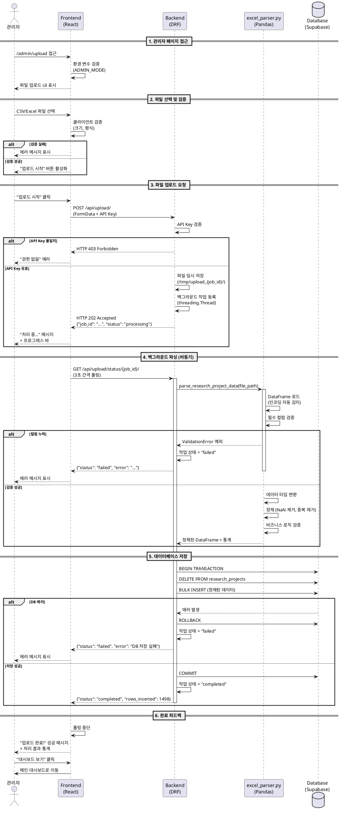

# CSV/Excel 파일 업로드 기능 상세 유스케이스 명세

**기능명:** CSV/Excel 파일 업로드 및 데이터 파싱 (P0-MVP)
**작성일:** 2025-11-02
**버전:** 1.2 (CTO 검증 피드백 반영)
**작성자:** Spec Writer Agent
**수정자:** Claude Code

---

## 1. 기능 개요

### 1.1 목적
관리자가 Ecount 시스템에서 추출한 4가지 타입의 CSV/Excel 데이터 파일을 웹 대시보드에 업로드하고, 백그라운드에서 비동기 파싱/검증/저장하여 시각화 대시보드에 최신 데이터를 제공하는 기능

### 1.2 범위
- **포함:**
  - 관리자 페이지 접근 제어 (하드코딩 API Key)
  - 4가지 파일 타입 업로드: research_project_data.csv, student_roster.csv, publication_list.csv, department_kpi.csv
  - 클라이언트/서버 파일 검증 (크기, 형식, 필수 컬럼)
  - 비동기 백그라운드 처리 (Python threading)
  - Pandas 데이터 파싱/정제/검증
  - Supabase 저장 (전체 교체 모드)
  - 작업 상태 폴링 (3초 간격)
  - 업로드 성공/실패 피드백

- **제외 (POST-MVP):**
  - DB 기반 사용자 인증 시스템
  - 증분 업데이트 (UPSERT)
  - 파일 프리뷰 기능
  - 부분 성공 처리
  - 에러 로그 다운로드
  - 자동 백업/롤백

### 1.3 제약 사항
- 최대 파일 크기: 10MB
- 지원 형식: .csv, .xlsx, .xls
- 비동기 처리 필수 (Non-blocking UI)
- 인증: 하드코딩된 API Key만 사용

---

## 2. 구현 전 필수 검증 사항

### 2.1 Ecount CSV 샘플 데이터 검증 (P0 - 구현 시작 전 필수)

**목적:** 스펙에 정의된 컬럼명/타입이 실제 Ecount 추출 CSV와 일치하는지 검증

**작업 절차:**
1. **샘플 데이터 확보**
   - 관리자에게 Ecount 시스템에서 4가지 CSV 파일 추출 요청
   - 각 파일은 최소 10~50행의 실제 데이터 포함
   - 저장 경로: `docs/db/samples/`

2. **Pandas 로드 테스트**
   ```python
   import pandas as pd

   # 각 CSV 파일 로드 테스트
   files = [
       'research_project_data.csv',
       'student_roster.csv',
       'publication_list.csv',
       'department_kpi.csv'
   ]

   for file in files:
       try:
           df = pd.read_csv(f'docs/db/samples/{file}', encoding='utf-8')
           print(f"\n=== {file} ===")
           print(f"컬럼: {df.columns.tolist()}")
           print(f"데이터 타입:\n{df.dtypes}")
           print(f"샘플 데이터:\n{df.head(3)}")
           print(f"결측값:\n{df.isnull().sum()}")
       except Exception as e:
           print(f"ERROR loading {file}: {e}")
   ```

3. **검증 체크리스트**
   - [ ] 컬럼명이 스펙(5.2.1절)과 정확히 일치
   - [ ] 데이터 타입이 예상과 일치 (날짜, 숫자, 문자열)
   - [ ] 인코딩이 UTF-8인지 확인 (또는 EUC-KR/CP949)
   - [ ] 숨겨진 컬럼/행이 없는지 확인 (Excel에서 확인)
   - [ ] 예상치 못한 특수문자/공백이 없는지 확인

4. **불일치 발견 시 조치**
   - 컬럼명 불일치: 스펙 5.2.1절 CSV-Django 매핑 테이블 수정
   - 데이터 타입 불일치: 파서 로직 조정 (excel_parser.py)
   - 인코딩 문제: 인코딩 전략 재검토 (UTF-8 외 지원 필요 여부)

**완료 조건:**
- 4개 CSV 샘플 파일 확보 완료
- Pandas 로드 성공 확인 (에러 없음)
- 컬럼명 정확성 검증 완료
- 스펙 업데이트 필요 시 반영 완료

**책임자:** 백엔드 개발자 + 데이터 관리자
**기한:** 구현 시작 전 (1일 이내)

---

## 3. 사용자 스토리

### 3.1 Primary Actor
**관리자 (Admin User)**
- Ecount 시스템 데이터 추출 권한 보유
- 대시보드 데이터 업로드 책임
- 기술적 숙련도: 중급

### 3.2 사용자 스토리 (GIVEN-WHEN-THEN)

**Story 1: 파일 업로드 성공**
```
GIVEN 관리자가 관리자 페이지에 접근 권한이 있고
  AND 유효한 4가지 CSV 파일을 준비했을 때
WHEN 파일 선택 후 "업로드 시작" 버튼을 클릭하면
THEN 파일이 비동기로 처리되고
  AND 처리 진행 상태가 실시간 표시되며
  AND 완료 시 성공 메시지와 함께 처리 결과를 확인할 수 있다
```

**Story 2: 파일 검증 실패**
```
GIVEN 관리자가 잘못된 형식의 파일을 선택했을 때
WHEN 파일 선택 시점 또는 업로드 요청 시
THEN 구체적인 에러 메시지가 표시되고
  AND 업로드가 중단되며
  AND 파일 수정 후 재시도할 수 있다
```

**Story 3: 데이터 파싱 실패**
```
GIVEN 파일 업로드는 성공했으나
  AND 데이터에 필수 컬럼 누락 또는 타입 오류가 있을 때
WHEN 백그라운드 파싱 중
THEN 작업 상태가 "failed"로 변경되고
  AND 구체적인 에러 정보(파일명, 행 번호, 에러 내용)가 표시되며
  AND 관리자가 데이터 수정 후 재업로드할 수 있다
```

---

## 3. 상세 유스케이스

### 3.1 관리자 페이지 접근 및 인증

#### Precondition
- 사용자: 관리자 권한 보유
- 시스템: 백엔드 API 서버 및 Supabase 정상 작동

#### Trigger
- 관리자가 `/admin/upload` URL 직접 접근
- 또는 메인 대시보드에서 "데이터 업로드" 버튼 클릭 (관리자 모드 활성화 시)

#### Main Scenario
1. 사용자가 데이터 업로드 페이지 URL 접근
2. React 앱에서 `process.env.ADMIN_MODE === 'true'` 또는 하드코딩된 API Key 검증
3. 권한 확인 성공 시 파일 업로드 UI 렌더링
   - 4가지 파일 타입별 업로드 영역 표시
   - 드래그앤드롭 또는 파일 선택 버튼 제공
   - 지원 형식 및 크기 제한 안내 표시

#### Edge Cases
- **권한 없음:** 메인 대시보드로 리디렉션 + "관리자 권한이 필요합니다" 토스트 알림
- **환경 변수 미설정:** "시스템 관리자에게 문의하세요" 에러 페이지
- **API Key 만료/변경:** "인증 정보가 유효하지 않습니다" 에러 메시지

#### Business Rules
- BR-001: 관리자 접근 제어는 환경 변수 또는 하드코딩된 API Key로만 구현 (DB 기반 인증 금지)
- BR-002: 권한 없는 사용자는 업로드 페이지 접근 불가

---

### 3.2 파일 선택 및 클라이언트 검증

#### Precondition
- 사용자: 데이터 업로드 페이지 접근 완료
- 시스템: 파일 업로드 UI 렌더링 완료

#### Trigger
- 사용자가 파일 선택 다이얼로그에서 파일 선택
- 또는 파일을 업로드 영역에 드래그앤드롭

#### Main Scenario
1. 사용자가 CSV/Excel 파일 선택 (1~4개)
2. 프런트엔드에서 즉시 검증:
   - 파일 확장자: `.csv`, `.xlsx`, `.xls`만 허용
   - 파일 크기: 최대 10MB
   - (선택적) 파일명 패턴 매칭
3. 검증 통과 시:
   - 선택된 파일 정보 카드 표시 (파일명, 크기, 타입)
   - "준비됨" 상태 아이콘 표시
   - "업로드 시작" 버튼 활성화
4. 검증 실패 시:
   - 해당 파일 하이라이트
   - 구체적인 에러 메시지 표시
   - "업로드 시작" 버튼 비활성화

#### Edge Cases
- **동일 파일 중복 선택:** 최신 선택 파일로 교체 + "기존 파일이 교체됩니다" 경고
- **비표준 인코딩 (EUC-KR, CP949):** UTF-8, EUC-KR, CP949 순서로 자동 감지 시도
- **빈 파일 (0 byte):** "빈 파일입니다. 데이터가 포함된 파일을 선택하세요" 경고
- **숨겨진 행/컬럼 (Excel):** Pandas에서 자동으로 숨겨진 데이터 포함하여 파싱

#### Business Rules
- BR-003: 지원 형식: CSV (.csv), Excel (.xlsx, .xls)만 허용
- BR-004: 최대 파일 크기: 10MB (초과 시 업로드 거부)
- BR-005: 클라이언트 검증은 사용자 경험 개선용, 서버 검증 필수

---

### 3.3 파일 업로드 요청 및 백그라운드 처리 시작

#### Precondition
- 사용자: 1개 이상의 유효한 파일 선택 완료
- 시스템: "업로드 시작" 버튼 활성화 상태

#### Trigger
- 사용자가 "업로드 시작" 버튼 클릭

#### Main Scenario
1. 프런트엔드에서 FormData 객체 생성
   - 각 파일 바이너리 데이터 추가
   - 파일 타입 정보 (research_funding, students, publications, kpi) 포함
   - 업로드 타임스탬프 추가
2. HTTP 요청 헤더에 하드코딩된 API Key 포함: `X-Admin-Key: <키값>`
3. `POST /api/upload/` 엔드포인트 호출 (Content-Type: multipart/form-data, Timeout: 60초)
4. DRF View에서 요청 수신 및 처리:
   - **API Key 검증 (View 레벨 Custom Permission Class 사용)**
   - Request Serializer를 통한 파일 형식 재검증
   - 파일을 임시 저장 경로에 저장 (`/tmp/upload_{uuid4()}/` - UUID로 충돌 방지)
5. 비동기 백그라운드 작업 등록:
   - **`concurrent.futures.ThreadPoolExecutor`에 파싱 작업 제출 (최대 3개 worker)**
   - 고유한 `job_id` (UUID) 생성
   - **작업 상태 저장소: 메모리 기반 Dictionary** (`job_status_store = {}`)
   - 작업 상태 초기화: `job_status_store[job_id] = {"status": "processing", "progress": 0}`
6. 즉시 HTTP 202 Accepted 응답 반환 (Non-blocking)
   ```json
   {
     "status": "processing",
     "job_id": "a1b2c3d4-e5f6-7890-abcd-ef1234567890",
     "message": "파일 업로드가 시작되었습니다. 처리가 완료되면 알려드리겠습니다.",
     "estimated_time": "약 30초 소요 예상"
   }
   ```
7. 프런트엔드 UI 변경:
   - "업로드 중... 데이터를 처리하고 있습니다" 메시지
   - 각 파일별 프로그레스 바 애니메이션
   - 작업 상태 폴링 시작 (3초 간격, `GET /api/upload/status/{job_id}/`)

#### 3.3.1 기술 구현 세부사항

**API Key 검증 (View 레벨):**
```python
# api/permissions.py
from rest_framework.permissions import BasePermission
from django.conf import settings

class AdminAPIKeyPermission(BasePermission):
    def has_permission(self, request, view):
        api_key = request.META.get('HTTP_X_ADMIN_KEY')
        return api_key == settings.ADMIN_API_KEY
```

**백그라운드 작업 관리 (ThreadPoolExecutor):**
```python
# services/ingestion_service.py
from concurrent.futures import ThreadPoolExecutor
import uuid

# 모듈 레벨 변수
executor = ThreadPoolExecutor(max_workers=3)
job_status_store = {}  # {job_id: {"status": "...", "progress": 0, ...}}

def submit_upload_job(files):
    job_id = str(uuid.uuid4())
    job_status_store[job_id] = {"status": "processing", "progress": 0}

    # 백그라운드 작업 제출
    executor.submit(process_upload, job_id, files)

    return job_id
```

**작업 상태 저장소 (MVP - 메모리 기반):**
- **저장소**: Python Dictionary (메모리 기반)
- **제약**: 서버 재시작 시 상태 손실 (POST-MVP에서 Redis/DB 전환 고려)
- **동시성 제어**: Dictionary는 Thread-safe하지 않으므로 `threading.Lock()` 사용 필수 (아래 구현 예시 참조)
- **임시 파일 경로**: `/tmp/upload_{uuid4()}/` (UUID v4로 충돌 방지, 디렉토리 권한 0o700)

#### 3.3.2 메모리 기반 저장소 제약 사항 및 동시성 제어

**MVP 허용 제약:**
1. **서버 재시작 시 진행 중인 작업 상태 손실**
   - 백그라운드 처리는 계속 진행되지만, UI에서 상태 추적 불가
   - 사용자 액션: 새로고침 후 "작업 정보를 찾을 수 없습니다" 메시지 표시
   - 해결: POST-MVP에서 Redis/DB 전환

2. **동시성 제어 구현 (필수)**
   - Dictionary는 Thread-safe하지 않으므로 `threading.Lock()` 사용
   ```python
   import threading

   # 모듈 레벨 변수
   job_status_store = {}
   job_lock = threading.Lock()

   def update_job_status(job_id, status_data):
       """Thread-safe하게 작업 상태 업데이트"""
       with job_lock:
           job_status_store[job_id] = status_data

   def get_job_status(job_id):
       """Thread-safe하게 작업 상태 조회"""
       with job_lock:
           return job_status_store.get(job_id)
   ```

**CTO 승인 사항:**
- 내부 베타 테스트 기간 중 서버 재배포는 업무 외 시간에만 수행
- 작업 진행 중 재배포 필요 시 사전 공지

#### Edge Cases
- **API Key 불일치 (403 Forbidden):** "관리자 권한이 없습니다" 에러 모달 + 메인 대시보드 리디렉션
- **파일 검증 실패 (400 Bad Request):** 구체적인 검증 에러 메시지 표시 (파일명, 누락 컬럼 등)
- **서버 에러 (500 Internal Server Error):** "서버 오류가 발생했습니다. 잠시 후 다시 시도하세요" 토스트 + "재시도" 버튼
- **네트워크 단절:** 타임아웃 → "네트워크 연결을 확인하세요" 메시지 + 수동 재시도 버튼 (자동 재시도는 POST-MVP)
- **동시 다중 업로드:** 작업 큐에서 순차 또는 병렬 처리 (서버 리소스 기반)
- **파일 전송 중 사용자 이탈:** 브라우저 새로고침/이탈 확인 모달, 백그라운드 처리는 계속 진행

#### Business Rules
- BR-006: 비동기 백그라운드 처리 필수 (사용자 UI 블로킹 금지)
- BR-007: 작업 ID (UUID)로 진행 상태 추적 가능
- BR-008: HTTP 202 Accepted 즉시 반환 (처리 완료 대기 금지)
- BR-009: API Key 검증 실패 시 403 Forbidden 반환

---

### 3.4 백그라운드 데이터 파싱 (Pandas 로직)

#### Precondition
- 시스템: 파일이 임시 저장 경로에 저장 완료
- 시스템: 백그라운드 작업 큐에 파싱 작업 등록 완료

#### Trigger
- 백그라운드 Thread에서 파싱 함수 자동 실행

#### Main Scenario
1. 파일 타입별 전용 파서 선택 (`excel_parser.py`):
   - `parse_research_project_data(file_path)`
   - `parse_student_roster(file_path)`
   - `parse_publication_list(file_path)`
   - `parse_department_kpi(file_path)`

2. Pandas DataFrame 로드:
   - `pd.read_csv()` 또는 `pd.read_excel()` 사용
   - **MVP: UTF-8 인코딩만 지원** (실패 시 "UTF-8 인코딩으로 저장 후 재업로드" 안내)
   - POST-MVP: Ecount 기본 인코딩 확인 후 EUC-KR/CP949 지원 고려
   - 헤더 행 자동 감지 및 컬럼명 정규화

3. 필수 컬럼 존재 여부 검증:
   - **research_project_data:** `['집행ID', '소속학과', '총연구비', '집행일자', '집행금액']`
   - **student_roster:** `['학번', '학과', '학년', '과정구분', '학적상태']`
   - **publication_list:** `['논문ID', '학과', '저널등급', 'Impact Factor']`
   - **department_kpi:** `['평가년도', '학과', '졸업생 취업률(%)', '연간 기술이전 수입액(억원)']`
   - 누락 시 즉시 예외 발생 → 작업 상태 "failed"

4. 데이터 타입 변환:
   - 날짜 컬럼: `pd.to_datetime(df['집행일자'], errors='coerce')`
   - 금액/숫자: 쉼표 제거 → `pd.to_numeric(df['총연구비'], errors='coerce')`
   - 문자열: 양쪽 공백 제거 `df['소속학과'].str.strip()`

5. 데이터 정제 (Cleaning):
   - **결측값(NaN) 처리:**
     - 필수 컬럼: NaN 존재 시 해당 행 제외 + 경고 로그
     - 선택적 컬럼 (Impact Factor): NaN 허용 (NULL 저장)
   - **중복 제거:**
     - PK 기준 중복 검사 (학번, 논문ID, 집행ID)
     - 중복 발견 시 마지막 행 유지 (`df.drop_duplicates(subset=['PK'], keep='last')`)
     - 경고 로그: "중복 데이터 X건 발견, 최신 데이터로 유지"
   - **데이터 범위 검증:**
     - 학년: 1~4, 날짜: 미래 날짜 불허, 금액: 음수 불허, 취업률: 0~100%
     - 범위 위반 시 해당 행 제외 + 상세 에러 로그

6. 비즈니스 로직 검증:
   - 연구비: `집행금액 <= 총연구비`
   - 학생: `학적상태 IN ('재학', '휴학', '졸업')`
   - 논문: `저널등급 IN ('SCIE', 'KCI', ...)`

7. 정제 완료된 DataFrame 반환 + 파싱 통계 (총 행 수, 유효 행 수, 제외 행 수, 에러 로그)

#### Edge Cases
- **파싱 중 메모리 부족:** MVP에서는 10MB 제한으로 발생 가능성 낮음. 발생 시 "파일이 너무 큽니다" 에러 반환 (청크 처리는 POST-MVP)
- **인코딩 감지 실패:** UTF-8 파싱 실패 시 "UTF-8 인코딩으로 저장 후 재업로드하세요" 에러
- **빈 DataFrame (헤더만):** "데이터 행이 없습니다" 에러 반환
- **수십만 행 데이터:** POST-MVP (MVP는 10MB 제한으로 방지)

#### Business Rules
- BR-010: Pandas 파싱 로직은 인프라 독립적 (높은 테스트 용이성)
- BR-011: 필수 컬럼 누락 시 전체 파일 처리 실패
- BR-012: 데이터 타입 변환 실패 시 해당 행 제외 (전체 실패 아님)
- BR-013: 중복 PK는 최신 데이터 유지 (Last-Write-Wins)
- BR-014: Impact Factor는 NULL 허용 (필수 아님)

---

### 3.5 데이터베이스 저장 (Repositories 레이어)

#### Precondition
- 시스템: Pandas 파싱 성공 및 정제된 DataFrame 준비
- 시스템: Supabase (PostgreSQL) 정상 작동

#### Trigger
- `ingestion_service.py`에서 파싱 완료 후 Repository 함수 자동 호출

#### Main Scenario
1. Repository 함수 호출:
   - `repositories.py`의 `save_research_funding_data(dataframe, replace=True)`
   - (각 파일 타입별 저장 함수 존재)

2. 데이터 저장 전략 (MVP: 파일별 독립 트랜잭션):
   - **트랜잭션 범위**: 파일별 독립 트랜잭션 (4개 파일 → 4개 트랜잭션)
   - **이유**: 부분 성공 허용 (3개 성공, 1개 실패 시나리오 대응), 대용량 파일 처리 시 타임아웃 방지
   - Django ORM 트랜잭션 시작
   ```python
   from django.db import transaction

   with transaction.atomic():
       # 기존 데이터 삭제
       ResearchProject.objects.all().delete()
       # Bulk Insert
       ResearchProject.objects.bulk_create([
           ResearchProject(**row) for row in dataframe.to_dict('records')
       ])
   ```

3. 저장 결과 검증:
   - 삽입된 행 수 확인
   - 예상 행 수와 실제 삽입 행 수 비교
   - 불일치 시 경고 로그

4. 작업 상태 업데이트:
   - 성공 시: `status = "completed"`, 메타데이터 저장 (처리 행 수, 삽입 행 수, 소요 시간)
   - 실패 시: 트랜잭션 롤백, `status = "failed"`, 에러 정보 저장

5. 임시 파일 정리 (`finally` 블록):
   ```python
   import shutil
   import os

   temp_dir = f"/tmp/upload_{job_id}/"
   try:
       # 파싱 및 저장 로직
       pass
   finally:
       # 성공/실패 무관하게 임시 파일 정리
       if os.path.exists(temp_dir):
           try:
               shutil.rmtree(temp_dir)
           except Exception as e:
               logger.warning(f"임시 파일 정리 실패: {temp_dir}, 오류: {e}")
               # 정리 실패해도 작업 자체는 성공 처리
   ```

#### Edge Cases
- **DB 연결 실패:** 재시도 로직 (지수 백오프, 최대 3회), 모두 실패 시 에러 상태
- **DB 저장 공간 부족:** "데이터베이스 용량이 부족합니다" 에러 메시지
- **중복 PK 충돌:** 전체 교체 모드에서는 발생하지 않음 (기존 데이터 삭제 후 삽입)
- **외래 키 제약 위반:** 관련 데이터 누락 시 에러 메시지와 함께 실패 처리
- **트랜잭션 타임아웃:** 대용량 데이터 삽입 시 배치 크기 조정 (1000건씩)

#### Business Rules
- BR-015: MVP에서는 전체 교체 모드만 지원 (증분 업데이트 POST-MVP)
- BR-016: Django ORM 트랜잭션으로 원자성 보장 (All-or-Nothing)
- BR-017: 트랜잭션 실패 시 자동 롤백 (데이터 무결성 유지)
- BR-018: 재업로드 시 기존 데이터 전체 삭제 후 교체

---

### 3.5.1 부분 성공 시 UX 플로우

#### Precondition
- 사용자: 4개 파일 업로드 요청 완료
- 시스템: 파일별 독립 트랜잭션 처리 진행

#### Trigger
- 백그라운드 처리 결과: 일부 파일 성공, 일부 파일 실패

#### Main Scenario (부분 성공: 3개 성공, 1개 실패)

1. **상태 폴링 응답:**
   ```json
   {
     "job_id": "...",
     "status": "partial_success",
     "progress": 100,
     "files": [
       {
         "file_type": "research_funding",
         "status": "completed",
         "rows_inserted": 1498
       },
       {
         "file_type": "students",
         "status": "failed",
         "error_message": "필수 컬럼 '학과'가 누락되었습니다.",
         "error_details": "3번째 행부터 '학과' 컬럼 값이 비어있습니다."
       },
       {
         "file_type": "publications",
         "status": "completed",
         "rows_inserted": 856
       },
       {
         "file_type": "kpi",
         "status": "completed",
         "rows_inserted": 120
       }
     ]
   }
   ```

2. **프런트엔드 UI 표시:**
   - 주황색 경고 아이콘 + "업로드가 부분적으로 완료되었습니다"
   - 성공 파일 리스트: "research_funding, publications, kpi (총 3개)"
   - 실패 파일 상세:
     ```
     ❌ students.csv 처리 실패
     원인: 필수 컬럼 '학과'가 누락되었습니다.
     상세: 3번째 행부터 '학과' 컬럼 값이 비어있습니다.
     ```
   - 권장 조치: "Excel에서 해당 파일을 수정한 후 다시 업로드하세요"

3. **액션 옵션 제공:**
   - **[실패한 파일만 재업로드]** 버튼 (권장)
     - 클릭 시: 파일 선택 다이얼로그 열림 (students.csv만 선택 가능하도록 안내)
     - 업로드 시: 기존 성공한 3개 파일 데이터는 유지
     - 실패한 1개 파일만 다시 파싱/저장
   - **[전체 다시 업로드]** 버튼
     - 클릭 시: 페이지 초기화, 4개 파일 모두 재선택 가능

4. **실패한 파일만 재업로드 시 처리:**
   - POST 요청에 `retry_mode=true&file_type=students` 파라미터 추가
   - 백엔드에서 students 테이블만 DELETE → INSERT
   - 나머지 3개 테이블 데이터는 변경 없음

#### Edge Cases
- **4개 모두 실패:** `status: "failed"` (전체 실패 UI 표시)
- **4개 모두 성공:** `status: "completed"` (성공 UI 표시)
- **재업로드 중 또 실패:** 동일한 부분 성공 UI 반복, 무제한 재시도 가능

#### Business Rules
- BR-022: 파일별 독립 트랜잭션으로 부분 성공 허용
- BR-023: 부분 성공 시 실패한 파일만 재업로드 옵션 제공 (사용자 편의성)
- BR-024: 재업로드 시 성공한 파일 데이터는 변경하지 않음

---

### 3.6 업로드 상태 확인 및 사용자 피드백

#### Precondition
- 사용자: 파일 업로드 요청 완료 및 `job_id` 수신
- 시스템: 백그라운드 작업 진행 중 또는 완료

#### Trigger
- 프런트엔드에서 3초 간격 자동 폴링 시작
- 또는 사용자가 "상태 새로고침" 버튼 클릭 (선택적)

#### Main Scenario
1. 상태 조회 API 호출:
   - `GET /api/upload/status/<job_id>/`
   - 백엔드에서 작업 ID에 해당하는 현재 상태 조회

2. 상태 응답 구조:
   ```json
   {
     "job_id": "a1b2c3d4-e5f6-7890-abcd-ef1234567890",
     "status": "completed",  // "processing", "failed"
     "progress": 100,  // 0~100
     "files": [
       {
         "file_type": "research_funding",
         "status": "completed",
         "rows_processed": 1523,
         "rows_inserted": 1498,
         "rows_skipped": 25,
         "errors": []
       },
       {
         "file_type": "students",
         "status": "failed",
         "error_message": "필수 컬럼 '학과'가 누락되었습니다.",
         "error_details": "3번째 행부터 '학과' 컬럼 값이 비어있습니다."
       }
     ],
     "completed_at": "2025-11-02T14:35:22Z"
   }
   ```

3. 프런트엔드 상태 처리:
   - **processing:** 폴링 계속, 프로그레스 바 업데이트, "데이터 처리 중... (약 XX초 소요)"
   - **completed:** 폴링 중단, 성공 UI 표시
   - **failed:** 폴링 중단, 에러 UI 표시

4. **완료 시 UI:**
   - 녹색 체크 아이콘 + "업로드가 완료되었습니다!"
   - 세부 통계: "총 X개 파일 중 Y개 성공", "총 XXX건의 데이터가 등록되었습니다", "처리 시간: X분 Y초"
   - 액션 버튼: "대시보드 보기" (메인 대시보드 이동), "추가 업로드" (페이지 초기화)

5. **실패 시 UI:**
   - 빨간색 경고 아이콘 + "업로드 중 오류가 발생했습니다"
   - 파일별 상세 에러: "student_roster.csv 처리 실패 - 원인: 3번째 행에서 '학과' 컬럼이 비어있습니다"
   - 권장 조치: "Excel에서 해당 행을 수정한 후 다시 업로드하세요"
   - 액션 버튼: "다시 시도" (파일 재선택)

#### Edge Cases
- **폴링 중 네트워크 단절:** 3회 연속 실패 시 "네트워크 연결을 확인하세요" 경고, 재연결 시 폴링 재개
- **장시간 처리 (3분 이상):** "처리 시간이 예상보다 길어지고 있습니다. 파일 크기가 크거나 복잡한 데이터일 수 있습니다" 경고 + 추정 완료 시간
- **작업 ID 만료/없음:** "작업 정보를 찾을 수 없습니다" 메시지 + "새로 업로드하기" 버튼

#### Business Rules
- BR-019: 작업 상태 폴링 간격: 3초
- BR-020: 완료/실패 시 폴링 즉시 중단
- BR-021: 사용자는 폴링 중 다른 페이지 이동 가능 (백그라운드 처리 계속)
- BR-022: **부분 성공 허용** (파일별 독립 트랜잭션으로 3개 성공, 1개 실패 가능)

---

## 4. API 명세

### 4.1 POST /api/upload/

**목적:** CSV/Excel 파일 업로드 및 백그라운드 처리 시작

**인증:** Header `X-Admin-Key: <하드코딩된_키_값>`

**요청:**
```http
POST /api/upload/ HTTP/1.1
Host: example.com
Content-Type: multipart/form-data; boundary=----WebKitFormBoundary
X-Admin-Key: secret_admin_key_12345

------WebKitFormBoundary
Content-Disposition: form-data; name="research_funding"; filename="research_project_data.csv"
Content-Type: text/csv

[파일 바이너리 데이터]
------WebKitFormBoundary
Content-Disposition: form-data; name="students"; filename="student_roster.csv"
Content-Type: text/csv

[파일 바이너리 데이터]
------WebKitFormBoundary--
```

**성공 응답 (HTTP 202 Accepted):**
```json
{
  "status": "processing",
  "job_id": "a1b2c3d4-e5f6-7890-abcd-ef1234567890",
  "message": "파일 업로드가 시작되었습니다. 처리가 완료되면 알려드리겠습니다.",
  "estimated_time": "약 30초 소요 예상"
}
```

**에러 응답:**
- **403 Forbidden (API Key 불일치):**
  ```json
  {
    "error": "forbidden",
    "message": "관리자 권한이 없습니다. 접근이 거부되었습니다."
  }
  ```

- **400 Bad Request (파일 검증 실패):**
  ```json
  {
    "error": "validation_error",
    "details": {
      "file": "publication_list.csv",
      "issue": "필수 컬럼 'Impact Factor'가 누락되었습니다.",
      "required_columns": ["논문ID", "학과", "저널등급", "Impact Factor"]
    }
  }
  ```

- **500 Internal Server Error:**
  ```json
  {
    "error": "server_error",
    "message": "서버 오류가 발생했습니다. 잠시 후 다시 시도하세요."
  }
  ```

---

### 4.2 GET /api/upload/status/{job_id}/

**목적:** 업로드 작업 진행 상태 조회

**인증:** 없음 (job_id로 접근 제어)

**요청:**
```http
GET /api/upload/status/a1b2c3d4-e5f6-7890-abcd-ef1234567890/ HTTP/1.1
Host: example.com
```

**성공 응답 (HTTP 200 OK):**
```json
{
  "job_id": "a1b2c3d4-e5f6-7890-abcd-ef1234567890",
  "status": "completed",
  "progress": 100,
  "files": [
    {
      "file_type": "research_funding",
      "status": "completed",
      "rows_processed": 1523,
      "rows_inserted": 1498,
      "rows_skipped": 25,
      "errors": []
    },
    {
      "file_type": "students",
      "status": "completed",
      "rows_processed": 856,
      "rows_inserted": 850,
      "rows_skipped": 6,
      "errors": []
    }
  ],
  "completed_at": "2025-11-02T14:35:22Z"
}
```

**처리 중 응답:**
```json
{
  "job_id": "a1b2c3d4-e5f6-7890-abcd-ef1234567890",
  "status": "processing",
  "progress": 45,
  "files": [
    {
      "file_type": "research_funding",
      "status": "completed",
      "rows_processed": 1523,
      "rows_inserted": 1498
    },
    {
      "file_type": "students",
      "status": "processing",
      "progress": 60
    }
  ]
}
```

**실패 응답:**
```json
{
  "job_id": "a1b2c3d4-e5f6-7890-abcd-ef1234567890",
  "status": "failed",
  "progress": 30,
  "files": [
    {
      "file_type": "research_funding",
      "status": "completed"
    },
    {
      "file_type": "students",
      "status": "failed",
      "error_message": "필수 컬럼 '학과'가 누락되었습니다.",
      "error_details": "3번째 행부터 '학과' 컬럼 값이 비어있습니다."
    }
  ],
  "failed_at": "2025-11-02T14:32:10Z"
}
```

**404 Not Found (job_id 없음):**
```json
{
  "error": "not_found",
  "message": "작업 정보를 찾을 수 없습니다."
}
```

---

## 5. 데이터 검증 규칙

### 5.1 파일 레벨 검증

| 검증 항목 | 규칙 | 처리 시점 | 에러 메시지 |
|----------|------|----------|------------|
| 파일 형식 | `.csv`, `.xlsx`, `.xls`만 허용 | 클라이언트 + 서버 | "지원되지 않는 파일 형식입니다. CSV 또는 Excel 파일을 선택하세요." |
| 파일 크기 | 최대 10MB | 클라이언트 + 서버 | "파일 크기가 10MB를 초과합니다. (현재: XX.X MB)" |
| 파일 인코딩 | UTF-8, EUC-KR, CP949 자동 감지 | 서버 (Pandas) | "파일 인코딩을 감지할 수 없습니다." |
| 빈 파일 | 0 byte 불허 | 클라이언트 | "빈 파일입니다. 데이터가 포함된 파일을 선택하세요." |

### 5.2 스키마 검증 (필수 컬럼)

### 5.2.1 CSV 컬럼 → Django Model 필드 매핑

**research_project_data.csv:**
| CSV 컬럼명 | Django Model 필드명 | 데이터 타입 | 제약 조건 |
|-----------|-------------------|-----------|----------|
| 집행ID | execution_id | CharField(max_length=100) | primary_key=True |
| 소속학과 | department | CharField(max_length=100) | null=False |
| 총연구비 | total_budget | BigIntegerField | null=False, validators=[MinValueValidator(0)] |
| 집행일자 | execution_date | DateField | null=False |
| 집행금액 | execution_amount | BigIntegerField | null=False, validators=[MinValueValidator(0)] |

**research_project_data.csv 검증 규칙:**
| 필수 컬럼 | 데이터 타입 | 검증 규칙 |
|----------|-----------|----------|
| 집행ID | String | NOT NULL, 중복 시 최신 유지 |
| 소속학과 | String | NOT NULL, 공백 제거 |
| 총연구비 | Integer/Float | NOT NULL, >= 0 |
| 집행일자 | Date | NOT NULL, <= 현재 날짜 |
| 집행금액 | Integer/Float | NOT NULL, >= 0, <= 총연구비 |

**student_roster.csv:**
| CSV 컬럼명 | Django Model 필드명 | 데이터 타입 | 제약 조건 |
|-----------|-------------------|-----------|----------|
| 학번 | student_id | CharField(max_length=20) | primary_key=True |
| 학과 | department | CharField(max_length=100) | null=False |
| 학년 | grade | IntegerField | null=False, validators=[MinValueValidator(1), MaxValueValidator(4)] |
| 과정구분 | program_type | CharField(max_length=20) | null=False, choices=['학사', '석사', '박사'] |
| 학적상태 | enrollment_status | CharField(max_length=20) | null=False, choices=['재학', '휴학', '졸업'] |

**student_roster.csv 검증 규칙:**
| 필수 컬럼 | 데이터 타입 | 검증 규칙 |
|----------|-----------|----------|
| 학번 | String | NOT NULL, 중복 시 최신 유지 |
| 학과 | String | NOT NULL, 공백 제거 |
| 학년 | Integer | NOT NULL, 1~4 |
| 과정구분 | String | NOT NULL, IN ('학사', '석사', '박사') |
| 학적상태 | String | NOT NULL, IN ('재학', '휴학', '졸업') |

**publication_list.csv:**
| CSV 컬럼명 | Django Model 필드명 | 데이터 타입 | 제약 조건 |
|-----------|-------------------|-----------|----------|
| 논문ID | publication_id | CharField(max_length=100) | primary_key=True |
| 학과 | department | CharField(max_length=100) | null=False |
| 저널등급 | journal_tier | CharField(max_length=20) | null=False, choices=['SCIE', 'KCI', '기타'] |
| Impact Factor | impact_factor | FloatField | null=True, validators=[MinValueValidator(0)] |

**publication_list.csv 검증 규칙:**
| 필수 컬럼 | 데이터 타입 | 검증 규칙 |
|----------|-----------|----------|
| 논문ID | String | NOT NULL, 중복 시 최신 유지 |
| 학과 | String | NOT NULL, 공백 제거 |
| 저널등급 | String | NOT NULL, IN ('SCIE', 'KCI', ...) |
| Impact Factor | Float | NULL 허용, >= 0 |

**department_kpi.csv:**
| CSV 컬럼명 | Django Model 필드명 | 데이터 타입 | 제약 조건 |
|-----------|-------------------|-----------|----------|
| 평가년도 | evaluation_year | IntegerField | null=False, validators=[MinValueValidator(2000)], **복합 PK 구성요소** |
| 학과 | department | CharField(max_length=100) | null=False, **복합 PK 구성요소** |
| 졸업생 취업률(%) | employment_rate | FloatField | null=False, validators=[MinValueValidator(0), MaxValueValidator(100)] |
| 연간 기술이전 수입액(억원) | tech_transfer_revenue | FloatField | null=False, validators=[MinValueValidator(0)] |

**복합 PK 정의:**
```python
class DepartmentKPI(models.Model):
    evaluation_year = models.IntegerField(validators=[MinValueValidator(2000)])
    department = models.CharField(max_length=100)
    employment_rate = models.FloatField(validators=[MinValueValidator(0), MaxValueValidator(100)])
    tech_transfer_revenue = models.FloatField(validators=[MinValueValidator(0)])

    class Meta:
        constraints = [
            models.UniqueConstraint(
                fields=['evaluation_year', 'department'],
                name='unique_year_department_kpi'
            )
        ]
        verbose_name = 'Department KPI'
        verbose_name_plural = 'Department KPIs'
```

**이유:** 동일 학과의 여러 년도 데이터가 존재하므로 (평가년도 + 학과) 조합을 복합 PK로 사용

### 5.2.2 인덱스 전략

**MVP 필수 인덱스:**
1. **자동 생성 인덱스:**
   - 각 테이블의 PK (Django 자동 생성)
   - DepartmentKPI의 복합 UNIQUE 제약 조건 (인덱스 자동 생성)

2. **명시적 추가 인덱스 (필터링/정렬 성능 최적화):**
   - `department` (모든 테이블) - 학과별 필터링 쿼리 최적화
   - `execution_date` (ResearchProject) - 기간별 필터링/정렬 최적화
   - `evaluation_year` (DepartmentKPI) - 연도별 필터링 최적화

**Django Model 구현 예시:**
```python
class ResearchProject(models.Model):
    execution_id = models.CharField(max_length=100, primary_key=True)
    department = models.CharField(max_length=100)
    total_budget = models.BigIntegerField(validators=[MinValueValidator(0)])
    execution_date = models.DateField()
    execution_amount = models.BigIntegerField(validators=[MinValueValidator(0)])

    class Meta:
        indexes = [
            models.Index(fields=['department'], name='idx_rp_dept'),
            models.Index(fields=['execution_date'], name='idx_rp_date'),
        ]

class StudentRoster(models.Model):
    student_id = models.CharField(max_length=20, primary_key=True)
    department = models.CharField(max_length=100)
    grade = models.IntegerField(validators=[MinValueValidator(1), MaxValueValidator(4)])
    program_type = models.CharField(max_length=20, choices=[('학사', '학사'), ('석사', '석사'), ('박사', '박사')])
    enrollment_status = models.CharField(max_length=20, choices=[('재학', '재학'), ('휴학', '휴학'), ('졸업', '졸업')])

    class Meta:
        indexes = [
            models.Index(fields=['department'], name='idx_sr_dept'),
        ]
```

**성능 고려사항:**
- MVP 단계: 데이터 양이 적으므로 (수천~수만 건) 인덱스 효과 미미
- 인덱스 추가는 INSERT 성능 저하 (전체 교체 모드에서 중요)
- **권장:** 초기 MVP는 PK 인덱스만 사용, 성능 이슈 발생 시 추가

**department_kpi.csv 검증 규칙:**
| 필수 컬럼 | 데이터 타입 | 검증 규칙 |
|----------|-----------|----------|
| 평가년도 | Integer | NOT NULL, 2000~현재년도 |
| 학과 | String | NOT NULL, 공백 제거 |
| 졸업생 취업률(%) | Float | NOT NULL, 0~100 |
| 연간 기술이전 수입액(억원) | Float | NOT NULL, >= 0 |

### 5.3 데이터 품질 검증

| 검증 항목 | 규칙 | 처리 방식 |
|----------|------|----------|
| 결측값 (NaN) | 필수 컬럼: 불허 / 선택적 컬럼: 허용 | 필수 컬럼 NaN 시 해당 행 제외 + 경고 로그 |
| 중복 PK | 동일 PK 중복 발견 시 | 최신 행 유지 (Last-Write-Wins) |
| 데이터 타입 변환 실패 | 날짜/숫자 변환 실패 시 | 해당 행 제외 + 상세 에러 로그 (행 번호, 컬럼, 값) |
| 범위 위반 | 학년, 취업률, 금액 등 | 해당 행 제외 + 상세 에러 로그 |

---

## 6. 보안 요구사항

### 6.1 인증 및 권한

| 요구사항 | 구현 방식 | 우선순위 |
|----------|----------|----------|
| 관리자 접근 제어 | 하드코딩된 API Key (환경 변수) | P0-MVP |
| API Key 검증 | DRF 미들웨어 또는 View 레벨 검증 | P0-MVP |
| DB 기반 인증 | 미구현 (MVP 제외) | POST-MVP |

**API Key 관리:**
- 백엔드: `settings.py`에서 환경 변수 `ADMIN_API_KEY` 로드
- 프런트엔드: `.env.local`에서 `VITE_ADMIN_API_KEY` 로드
- 프로덕션: Railway 환경 변수로 관리

### 6.2 입력 검증

| 위협 | 완화 방법 | 우선순위 |
|------|----------|----------|
| 파일 업로드 공격 (malicious file) | 파일 형식 화이트리스트 (.csv, .xlsx, .xls) + MIME 타입 검증 | P0-MVP |
| 대용량 파일 DoS | 최대 크기 10MB 제한 | P0-MVP |
| SQL Injection | Django ORM 사용 (Parameterized Query 자동) | P0-MVP |
| XSS | React 기본 이스케이핑 + DOMPurify (필요 시) | P1-MVP |
| CSRF | API Key 인증 사용으로 CSRF 불필요 | P0-MVP |

#### 6.2.1 파일 MIME 타입 검증
악성 파일이 확장자를 위장하는 것을 방지하기 위해 실제 파일 MIME 타입을 검증합니다.

```python
import magic

def validate_file_type(file):
    """파일의 실제 MIME 타입을 검증"""
    # 파일의 처음 2048 바이트로 MIME 타입 판별
    mime = magic.from_buffer(file.read(2048), mime=True)
    file.seek(0)  # 파일 포인터 초기화

    allowed_mimes = [
        'text/csv',
        'text/plain',  # CSV 파일이 이렇게 인식될 수도 있음
        'application/vnd.ms-excel',  # .xls
        'application/vnd.openxmlformats-officedocument.spreadsheetml.sheet'  # .xlsx
    ]

    if mime not in allowed_mimes:
        raise ValidationError(f"허용되지 않은 파일 형식입니다: {mime}")
```

**라이브러리**: `python-magic` (requirements.txt에 추가)

#### 6.2.2 CSRF 보호 전략
- **적용 범위**: API Key 기반 인증을 사용하므로 CSRF 체크 불필요
- **이유**: CSRF는 세션 쿠키 기반 인증에서만 필요. API Key는 HTTP 헤더로 전송되므로 브라우저의 자동 쿠키 전송 메커니즘과 무관
- **DRF 설정**: `permission_classes = [AdminAPIKeyPermission]` 사용 시 자동으로 CSRF exempt

### 6.3 데이터 보호

| 요구사항 | 구현 방식 | 우선순위 |
|----------|----------|----------|
| 전송 중 암호화 | HTTPS 필수 (Railway 자동 제공) | P0-MVP |
| 임시 파일 보안 | 처리 완료 후 `/tmp/upload_{job_id}/` 자동 삭제 | P1-MVP |
| DB 접근 제어 | Supabase Row Level Security (POST-MVP) | POST-MVP |

---

## 7. 테스트 요구사항

### 7.1 Unit Tests (70%)

**테스트 대상:** `excel_parser.py` (Pandas 로직)

| 테스트 케이스 | 입력 | 기대 출력 | 우선순위 |
|-------------|------|----------|----------|
| 정상 CSV 파싱 | 유효한 research_project_data.csv | DataFrame 반환, 모든 행 유효 | P0 |
| 필수 컬럼 누락 | '집행ID' 컬럼 없는 CSV | ValidationError 예외 발생 | P0 |
| 데이터 타입 변환 | 날짜 컬럼에 "abc" 값 | 해당 행 제외 + 에러 로그 | P0 |
| 중복 PK | 동일 집행ID 2건 | 마지막 행만 유지 | P0 |
| 결측값 처리 | 필수 컬럼에 NaN | 해당 행 제외 + 경고 로그 | P0 |
| 범위 검증 | 학년 = 10 | 해당 행 제외 + 에러 로그 | P1 |
| 비표준 인코딩 | EUC-KR 파일 | 자동 감지 후 파싱 성공 | P1 |
| 빈 DataFrame | 헤더만 있는 CSV | "데이터 행이 없습니다" 에러 | P1 |

**테스트 예시 (pytest):**
```python
def test_parse_research_project_data_success():
    # GIVEN: 유효한 CSV 파일
    file_path = "tests/fixtures/research_project_data_valid.csv"

    # WHEN: 파싱 함수 호출
    df, stats = parse_research_project_data(file_path)

    # THEN: DataFrame 반환 및 통계 확인
    assert len(df) > 0
    assert stats['rows_processed'] == stats['rows_inserted']
    assert '집행ID' in df.columns
    assert df['집행금액'].dtype in [np.int64, np.float64]
```

### 7.1.1 Unit Test Mock 전략

**원칙:**
- `excel_parser.py` Unit Test는 **DB 접근 금지**
- 파일 I/O만 허용 (테스트 fixture CSV/Excel 파일 사용)
- 외부 의존성 없는 순수 Pandas 로직 테스트

**Integration Test Mock 전략:**
- Django TestCase 사용 (자동 DB 트랜잭션 롤백)
- 외부 API 호출 Mock (Supabase는 테스트 DB 사용)
- 백그라운드 작업 동기 실행 (ThreadPoolExecutor Mock)

**Mock 예시:**
```python
from unittest.mock import patch, MagicMock

def test_upload_with_db_error():
    # GIVEN: DB 저장 실패 상황 Mock
    with patch('data_ingestion.repositories.save_research_funding_data') as mock_save:
        mock_save.side_effect = DatabaseError("Connection refused")

        # WHEN: 업로드 처리 실행
        result = process_upload_job(job_id, files)

        # THEN: 에러 처리 확인
        assert result['status'] == 'failed'
        assert 'ERR_DB_001' in result['error_code']
        assert "데이터베이스 저장 중 오류" in result['error_message']

def test_upload_with_background_task_mock():
    # GIVEN: ThreadPoolExecutor를 동기 실행으로 Mock
    with patch('concurrent.futures.ThreadPoolExecutor') as mock_executor:
        # submit()을 즉시 실행하도록 설정
        mock_executor.return_value.submit.side_effect = lambda fn, *args: fn(*args)

        # WHEN: 업로드 API 호출
        response = client.post('/api/upload/', files, **headers)

        # THEN: 동기 실행으로 즉시 완료 확인
        job_id = response.json()['job_id']
        status = get_job_status(job_id)
        assert status['status'] == 'completed'
```

**Fixture 관리:**
- `tests/fixtures/` 폴더에 샘플 CSV/Excel 파일 저장
- 정상 케이스, 에러 케이스 (컬럼 누락, 타입 오류 등) 각각 준비
- 파일명 컨벤션: `{file_type}_{scenario}.csv` (예: `research_valid.csv`, `students_missing_column.csv`)

### 7.2 Integration Tests (20%)

**테스트 대상:** DRF API Endpoints

| 테스트 케이스 | API | 입력 | 기대 출력 | 우선순위 |
|-------------|-----|------|----------|----------|
| 업로드 성공 | POST /api/upload/ | 유효한 4개 파일 + API Key | HTTP 202 + job_id | P0 |
| API Key 불일치 | POST /api/upload/ | 잘못된 API Key | HTTP 403 | P0 |
| 파일 크기 초과 | POST /api/upload/ | 12MB 파일 | HTTP 400 | P0 |
| 상태 조회 성공 | GET /api/upload/status/{job_id}/ | 유효한 job_id | HTTP 200 + 상태 정보 | P0 |
| 상태 조회 실패 | GET /api/upload/status/{invalid_id}/ | 잘못된 job_id | HTTP 404 | P1 |

**테스트 예시 (DRF TestCase):**
```python
def test_upload_api_success(self):
    # GIVEN: 유효한 파일 및 API Key
    files = {
        'research_funding': open('tests/fixtures/research_valid.csv', 'rb'),
        'students': open('tests/fixtures/students_valid.csv', 'rb'),
    }
    headers = {'HTTP_X_ADMIN_KEY': settings.ADMIN_API_KEY}

    # WHEN: POST /api/upload/ 호출
    response = self.client.post('/api/upload/', files, **headers)

    # THEN: HTTP 202 및 job_id 반환
    self.assertEqual(response.status_code, 202)
    self.assertIn('job_id', response.json())
```

### 7.3 Acceptance Tests (10%)

**테스트 대상:** E2E 유저플로우

| 시나리오 | 단계 | 기대 결과 | 우선순위 |
|---------|------|----------|----------|
| 전체 업로드 플로우 (Happy Path) | 1. 관리자 페이지 접근<br>2. 파일 선택<br>3. 업로드 시작<br>4. 폴링 완료 대기<br>5. 대시보드 확인 | 모든 단계 성공, 대시보드에 최신 데이터 표시 | P0 (MVP 필수) |
| 파일 검증 실패 처리 | 1. 잘못된 파일 선택<br>2. 에러 메시지 확인<br>3. 파일 수정<br>4. 재업로드 | 구체적인 에러 메시지 표시 후 재시도 성공 | P2 (Integration Test로 대체) |
| 네트워크 오류 복구 | 1. 업로드 중 네트워크 단절<br>2. 수동 재시도<br>3. 연결 복구 후 폴링 재개 | 수동 재시도 후 정상 완료 | P2 (Integration Test로 대체) |

**테스트 도구:** Playwright (프런트엔드 E2E)

**우선순위 조정 이유:**
- **E2E 테스트는 느리고 불안정함 (flaky tests)**
- MVP에서는 Happy Path만 P0로 보장
- 에러 처리 시나리오는 Integration Test로 충분히 검증 가능
- POST-MVP에서 CI/CD 안정화 후 E2E 범위 확대

**MVP E2E 테스트 범위:**
- 1개 시나리오만 구현: 전체 업로드 플로우 Happy Path
- 실행 빈도: 수동 (배포 전 체크리스트)
- 자동화: POST-MVP (CI/CD 파이프라인 통합)

---

## 8. 에러 처리

### 8.1 에러 코드 정의

| 에러 코드 | HTTP Status | 에러 메시지 | 사용자 액션 |
|----------|------------|------------|------------|
| ERR_AUTH_001 | 403 | "관리자 권한이 없습니다. 접근이 거부되었습니다." | 메인 대시보드 이동 |
| ERR_FILE_001 | 400 | "지원되지 않는 파일 형식입니다. CSV 또는 Excel 파일을 선택하세요." | 파일 재선택 |
| ERR_FILE_002 | 400 | "파일 크기가 10MB를 초과합니다. (현재: XX.X MB)" | 파일 분할 또는 축소 |
| ERR_FILE_003 | 400 | "빈 파일입니다. 데이터가 포함된 파일을 선택하세요." | 파일 재선택 |
| ERR_SCHEMA_001 | 400 | "필수 컬럼 '{컬럼명}'가 누락되었습니다." | Ecount 추출 설정 확인 후 재업로드 |
| ERR_DATA_001 | 400 | "'{파일명}' {행번호}번째 행의 '{컬럼명}' 컬럼에 유효하지 않은 값이 있습니다." | Excel에서 해당 행 수정 후 재업로드 |
| ERR_PARSE_001 | 500 | "파일 인코딩을 감지할 수 없습니다." | UTF-8 인코딩으로 저장 후 재업로드 |
| ERR_DB_001 | 500 | "데이터베이스 저장 중 오류가 발생했습니다." | 잠시 후 재시도 |
| ERR_NETWORK_001 | 0 | "네트워크 연결을 확인하세요." | 연결 확인 후 재시도 |

### 8.2 에러 로깅

**로깅 레벨:**
- ERROR: 사용자 액션 필요 (파일 검증 실패, DB 에러 등)
- WARNING: 자동 복구 가능 (중복 데이터, 일부 행 제외 등)
- INFO: 정상 작업 진행 (파싱 시작, 완료 등)

**로그 포맷:**
```
[2025-11-02 14:32:10] ERROR [job_id=a1b2c3d4] ERR_SCHEMA_001: 필수 컬럼 '학과'가 누락되었습니다. (파일: student_roster.csv)
```

---

## 9. 성능 요구사항

### 9.1 MVP 성능 목표 (내부 베타 테스트 기준)

| 지표 | 목표 | 측정 방법 | 비고 |
|------|------|----------|------|
| 파일 업로드 응답 시간 | < 5초 (HTTP 202 반환) | API 응답 시간 측정 | 파일 임시 저장 + 작업 등록 시간 |
| 10MB 파일 파싱 시간 | < 2분 | 백그라운드 작업 소요 시간 | 전체 DataFrame 로드 방식 |
| 상태 폴링 응답 시간 | < 2초 | API 응답 시간 측정 | 메모리 기반 상태 조회 |
| 동시 업로드 처리 | 단일 작업 순차 처리 | 부하 테스트 | 큐 대기, POST-MVP에서 병렬화 |

**MVP 목표 설정 이유:**
- **사용자 규모:** 내부 관리자 소수(< 10명)만 접근
- **사용 빈도:** 주 1~2회 데이터 업로드
- **우선순위:** 성능보다 안정성 및 기능 완성도 우선
- **최적화 시점:** 성능 이슈 보고 시 ThreadPool worker 증가 등으로 대응

### 9.2 성능 최적화 전략

**MVP 구현:**
- Pandas 전체 DataFrame 로드 (청크 처리 제외)
- Django ORM Bulk Insert: 배치 크기 1000건
- 백그라운드 Thread Pool: 최대 1개 worker (순차 처리)

**POST-MVP 고려사항:**
- ThreadPoolExecutor worker 증가 (3~5개)
- Pandas 청크 처리 (대용량 파일 지원 시)
- Redis 기반 작업 큐 (Celery)
- APM 도구 도입 (New Relic, DataDog)

### 9.3 성능 측정 방법

**MVP:**
- 수동 측정: 브라우저 Network 탭, Django Debug Toolbar
- 로그 기반 측정: 각 단계별 타임스탬프 로깅

**POST-MVP:**
- APM 도구 연동 (자동 성능 모니터링)
- 커스텀 메트릭 수집 (Supabase Analytics)

---

## 10. 의존성

### 10.1 외부 시스템 의존성

| 시스템 | 용도 | 가용성 요구사항 |
|--------|------|----------------|
| Supabase (PostgreSQL) | 데이터 저장 | 99.9% 가용성 |
| Railway | 백엔드 호스팅 | 99.9% 가용성 |

### 10.2 라이브러리 의존성

**백엔드 (Python):**
- Django 4.x
- Django Rest Framework 3.x
- Pandas 2.x
- openpyxl (Excel 파싱)

**프런트엔드 (JavaScript):**
- React 18.x
- Axios (HTTP 클라이언트)
- React Query (상태 관리, 선택적)

---

## 11. Out of Scope (MVP 제외)

### 11.1 POST-MVP 기능
- DB 기반 사용자 인증 시스템
- 증분 업데이트 (UPSERT)
- 파일 프리뷰 기능
- 에러 로그 다운로드
- 자동 백업/롤백
- 데이터 변경 이력 추적 (Audit Log)
- 대용량 파일 청크 업로드
- 업로드 취소 기능
- Redis 기반 작업 상태 저장 (서버 재시작 시 상태 보존)

### 11.2 확장 고려 사항
- 다른 데이터 소스 지원 (API, DB 직접 연동 등)
- 스케줄링 자동 업로드
- 데이터 품질 대시보드
- 알림 시스템 (업로드 완료 이메일 등)

---

## 12. Sequence Diagram (PlantUML)



---

## 문서 변경 이력

| 버전 | 날짜 | 변경 사항 | 작성자 |
|------|------|-----------|--------|
| 1.0 | 2025-11-02 | 초기 유스케이스 명세 작성 | Spec Writer Agent |
| 1.1 | 2025-11-02 | Critical Issues 반영: CSV-Django 매핑 테이블 추가, 백그라운드 작업 상태 저장소 명시(메모리), 트랜잭션 전략 명확화(파일별 독립), API Key 검증 위치 명시(View 레벨), ThreadPoolExecutor 사용 명시, 임시 파일 정리 로직 추가, MIME 타입 검증 추가, CSRF 전략 명확화 | Claude Code |
| 1.2 | 2025-11-02 | **CTO 검증 피드백 반영 (speccheck.md 기반):**<br>- **P0 수정:** 복합 PK 정의 추가 (department_kpi), 메모리 저장소 동시성 제어 (threading.Lock), 성능 요구사항 완화 (MVP 적정 수준), Ecount CSV 샘플 검증 섹션 추가<br>- **P1 개선:** 부분 성공 UX 플로우 추가 (3.5.1), 인덱스 전략 명시 (5.2.2), Mock 테스트 전략 추가 (7.1.1), E2E 테스트 우선순위 조정<br>- **MVP 간소화:** 청크 처리 제거, UTF-8만 지원, 자동 재시도 제거<br>- **상세:** 권장-001~014 반영 완료 | Claude Code |

---

## 승인 및 검토

**작성자:** Spec Writer Agent
**검토자:** CTO
**승인일:** 2025-11-02

본 유스케이스 명세는 MVP 범위에 맞춘 실행 가능한 수준으로 작성되었으며, TDD 원칙에 따라 테스트 요구사항이 포함되었습니다.

---

**문서 끝**
