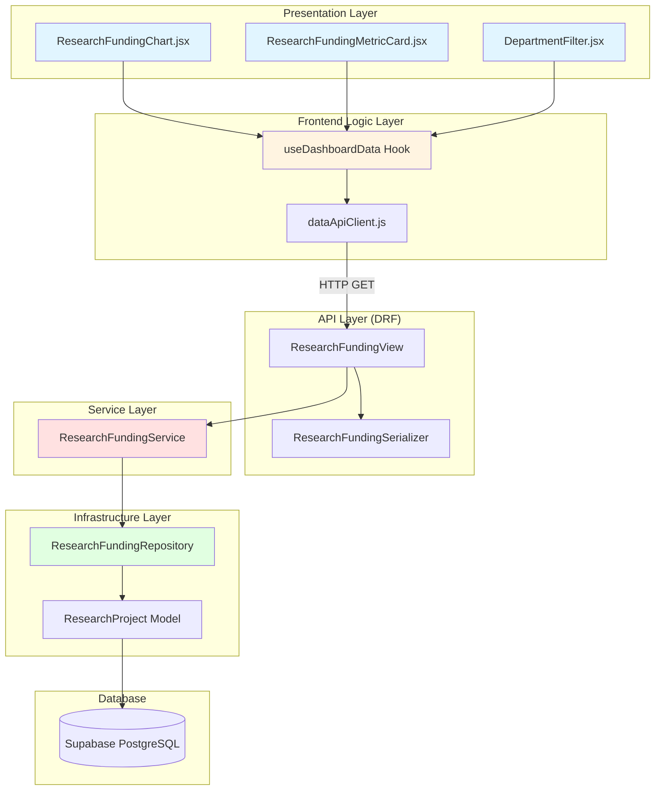
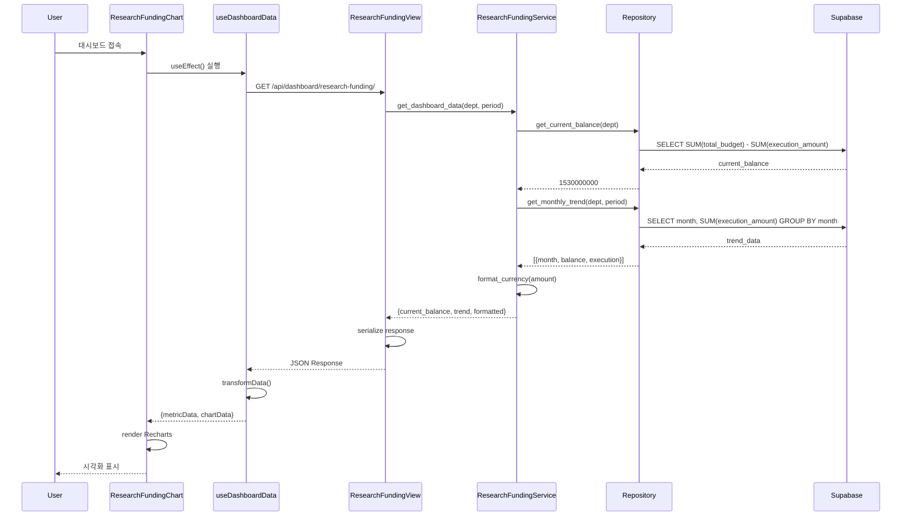

# Research Funding Dashboard Implementation Plan

**Feature ID:** 002
**Feature Name:** 연구비 집행 추이 시각화
**Priority:** P0-MVP
**Date:** 2025-11-02
**Author:** Plan Writer Agent

---

## 1. 개요

### 1.1 모듈 구성 요약

본 구현 계획은 **연구비 집행 추이 대시보드** 기능을 TDD 원칙에 따라 개발하기 위한 설계입니다.

### 1.2 비동기 처리 전략 (CTO 간소화 원칙)

**MVP 접근 방식: Python Threading**

Excel 업로드 시 비동기 파일 처리는 **Python 표준 라이브러리의 threading 모듈**을 사용하여 구현합니다. 별도의 Task Queue (Celery, RQ 등)는 MVP 범위에서 제외됩니다.

**이유:**
- CTO 핵심 원칙: "Simplest infrastructure approach" 준수
- 외부 의존성 없음 (Redis, RabbitMQ 불필요)
- 인프라 설정 시간 최소화 (1일 이내)
- 대용량 트래픽이 아닌 내부 관리자 도구 특성 고려

**구현 예시 (POST-MVP 기능, 참고용):**

```python
# backend/data_ingestion/services/async_processor.py
import threading
from typing import Callable

def process_upload_async(job_id: str, file_path: str, callback: Callable):
    """
    백그라운드 스레드에서 파일 처리 실행

    Args:
        job_id: 작업 고유 식별자
        file_path: 업로드된 파일 경로
        callback: 처리 완료 후 실행할 함수
    """
    thread = threading.Thread(
        target=_process_file_task,
        args=(job_id, file_path, callback),
        daemon=True  # 메인 프로세스 종료 시 자동 정리
    )
    thread.start()

def _process_file_task(job_id: str, file_path: str, callback: Callable):
    try:
        # 1. Excel 파싱
        parser = ExcelParser()
        data = parser.parse(file_path)

        # 2. DB 저장
        repository = ResearchFundingRepository()
        repository.bulk_insert(data)

        # 3. 완료 콜백
        callback(job_id, status='success')
    except Exception as e:
        callback(job_id, status='error', error=str(e))
```

**제약 사항:**
- 단일 서버 환경 전용 (Railway 스케일링 시 Task Queue로 전환 필요)
- 작업 상태 추적은 DB 테이블 사용 (UploadJob 모델)

**POST-MVP 마이그레이션 경로:**
- 트래픽 증가 시 → Celery + Redis 전환
- 현재 threading 코드는 Celery task로 쉽게 변환 가능

**핵심 원칙:**
- Red → Green → Refactor 사이클 철저히 준수
- Test First: 코드보다 테스트를 먼저 작성
- Small Steps: 한 번에 하나의 시나리오만 구현
- FIRST Principles: Fast, Independent, Repeatable, Self-validating, Timely
- Test Pyramid: Unit 70% > Integration 20% > Acceptance 10%

**TDD 적용 범위:**
- Backend: 모든 비즈니스 로직 (Services, Repositories)
- Frontend: 핵심 데이터 처리 로직 (Hooks, Utils)
- API Integration: 엔드포인트 통합 테스트
- E2E: 핵심 사용자 시나리오

**모듈 목록:**

| 모듈명 | 레이어 | 위치 | 핵심 책임 |
|--------|--------|------|-----------|
| ResearchProject Model | Domain | `backend/data_ingestion/infrastructure/models.py` | 연구비 데이터 엔티티 정의 |
| ResearchFundingRepository | Infrastructure | `backend/data_ingestion/infrastructure/repositories.py` | 데이터베이스 접근 (ORM) |
| ResearchFundingService | Service | `backend/data_ingestion/services/research_funding_service.py` | 비즈니스 로직 및 집계 |
| ResearchFundingView | Presentation | `backend/data_ingestion/api/views.py` | API 엔드포인트 처리 |
| ResearchFundingSerializer | Presentation | `backend/data_ingestion/api/serializers.py` | 요청/응답 직렬화 |
| ErrorCodeRegistry | Constants | `backend/data_ingestion/constants/error_codes.py` | 중앙화된 에러 코드 관리 |
| useDashboardData Hook | Frontend Logic | `frontend/src/hooks/useDashboardData.ts` | API 호출 및 데이터 변환 (TypeScript) |
| ResearchFundingChart | Frontend UI | `frontend/src/components/dashboard/ResearchFundingChart.tsx` | Line Chart 렌더링 (TypeScript) |
| ResearchFundingMetricCard | Frontend UI | `frontend/src/components/dashboard/ResearchFundingMetricCard.tsx` | Metric Card 렌더링 (TypeScript) |

---

## 2. Architecture Diagram

### 2.1 시스템 아키텍처 (Layered Architecture)



### 2.2 데이터 흐름



---

## 3. Implementation Plan

### 3.1 Django Model (ResearchProject)

#### Location
`backend/data_ingestion/infrastructure/models.py`

#### Responsibility
- 연구비 집행 데이터의 Domain Entity 정의
- DB 스키마와 Python 객체 매핑
- 필드 제약 조건 및 유효성 검증

#### Test Strategy
- **Unit Tests**: Django Model 필드 제약 조건 검증

#### Test Scenarios (Red Phase)

**Test Case 1: 모델 생성 성공**
```python
def test_create_research_project_with_valid_data():
    # Arrange
    data = {
        'execution_id': 'EX001',
        'department': '컴퓨터공학과',
        'total_budget': 1000000000,
        'execution_date': '2024-01-15',
        'execution_amount': 200000000
    }

    # Act
    project = ResearchProject.objects.create(**data)

    # Assert
    assert project.execution_id == 'EX001'
    assert project.total_budget == 1000000000
```

**Test Case 2: execution_id UNIQUE 제약**
```python
def test_execution_id_must_be_unique():
    # Arrange
    ResearchProject.objects.create(execution_id='EX001', ...)

    # Act & Assert
    with pytest.raises(IntegrityError):
        ResearchProject.objects.create(execution_id='EX001', ...)
```

**Test Case 3: 음수 금액 불허**
```python
def test_negative_budget_rejected():
    # Arrange & Act & Assert
    with pytest.raises(ValidationError):
        project = ResearchProject(total_budget=-1000)
        project.full_clean()
```

**Test Case 4: 필수 필드 누락 검증**
```python
def test_required_fields_cannot_be_null():
    # Act & Assert
    with pytest.raises(ValidationError):
        project = ResearchProject(execution_id='EX001')
        project.full_clean()
```

#### Implementation Order (TDD Cycle)
1. **Red**: test_create_research_project_with_valid_data 작성 → 실행 (실패)
2. **Green**: ResearchProject Model 기본 필드 정의 → 테스트 통과
3. **Refactor**: 필드명 명확화, docstring 추가
4. **Red**: test_execution_id_must_be_unique 작성 → 실행 (실패)
5. **Green**: execution_id에 unique=True 추가 → 테스트 통과
6. **Red**: test_negative_budget_rejected 작성 → 실행 (실패)
7. **Green**: MinValueValidator(0) 추가 → 테스트 통과
8. **Commit**: "feat: Add ResearchProject model with basic validations"

#### Dependencies
- Django ORM
- PostgreSQL (Supabase)

---

### 3.2 ResearchFundingRepository

#### Location
`backend/data_ingestion/infrastructure/repositories.py`

#### Responsibility
- 데이터베이스 CRUD 연산 전담
- ORM 쿼리 최적화 (인덱스 활용)
- 집계 쿼리 실행 (SUM, GROUP BY)

#### Test Strategy
- **Unit Tests**: 격리된 환경에서 Repository 메서드 검증
- **Database**: In-memory SQLite 또는 Test DB 사용

#### Test Scenarios (Red Phase)

**Test Case 1: 전체 학과 현재 잔액 계산**
```python
def test_get_current_balance_all_departments():
    # Arrange
    ResearchProject.objects.create(
        execution_id='EX001',
        total_budget=1000000000,
        execution_amount=200000000,
        ...
    )
    ResearchProject.objects.create(
        execution_id='EX002',
        total_budget=500000000,
        execution_amount=100000000,
        ...
    )
    repo = ResearchFundingRepository()

    # Act
    balance = repo.get_current_balance(department=None)

    # Assert
    expected = (1000000000 + 500000000) - (200000000 + 100000000)
    assert balance == expected  # 1200000000
```

**Test Case 2: 특정 학과 잔액 계산**
```python
def test_get_current_balance_specific_department():
    # Arrange
    ResearchProject.objects.create(
        execution_id='EX001',
        department='컴퓨터공학과',
        total_budget=1000000000,
        execution_amount=200000000,
        ...
    )
    ResearchProject.objects.create(
        execution_id='EX002',
        department='전자공학과',
        total_budget=500000000,
        execution_amount=100000000,
        ...
    )
    repo = ResearchFundingRepository()

    # Act
    balance = repo.get_current_balance(department='컴퓨터공학과')

    # Assert
    assert balance == 800000000
```

**Test Case 3: 데이터 없을 때 0 반환**
```python
def test_get_current_balance_no_data_returns_zero():
    # Arrange
    repo = ResearchFundingRepository()

    # Act
    balance = repo.get_current_balance()

    # Assert
    assert balance == 0
```

**Test Case 4: 월별 집행 추이 집계**
```python
def test_get_monthly_trend():
    # Arrange
    ResearchProject.objects.bulk_create([
        ResearchProject(
            execution_id='EX001',
            execution_date='2024-01-15',
            execution_amount=100000000,
            total_budget=1000000000,
            ...
        ),
        ResearchProject(
            execution_id='EX002',
            execution_date='2024-01-25',
            execution_amount=50000000,
            total_budget=1000000000,
            ...
        ),
        ResearchProject(
            execution_id='EX003',
            execution_date='2024-02-10',
            execution_amount=80000000,
            total_budget=1000000000,
            ...
        ),
    ])
    repo = ResearchFundingRepository()

    # Act
    trend = repo.get_monthly_trend(department=None, period='latest')

    # Assert
    assert len(trend) == 2  # 2024-01, 2024-02
    assert trend[0]['month'] == '2024-01'
    assert trend[0]['execution'] == 150000000
    assert trend[1]['month'] == '2024-02'
    assert trend[1]['execution'] == 80000000
```

**Test Case 5: 기간 필터 적용 (1년)**
```python
def test_get_monthly_trend_with_1year_period():
    # Arrange
    from django.utils import timezone
    from datetime import timedelta

    two_years_ago = timezone.now() - timedelta(days=730)
    six_months_ago = timezone.now() - timedelta(days=180)

    ResearchProject.objects.bulk_create([
        ResearchProject(
            execution_id='EX001',
            execution_date=two_years_ago.date(),
            execution_amount=100000000,
            ...
        ),
        ResearchProject(
            execution_id='EX002',
            execution_date=six_months_ago.date(),
            execution_amount=80000000,
            ...
        ),
    ])
    repo = ResearchFundingRepository()

    # Act
    trend = repo.get_monthly_trend(period='1year')

    # Assert
    assert len(trend) == 1  # 최근 1년 데이터만
    assert trend[0]['execution'] == 80000000
```

#### Implementation Order (TDD Cycle)
1. **Red**: test_get_current_balance_all_departments 작성 → 실행 (실패)
2. **Green**: Repository 클래스 및 get_current_balance() 메서드 구현 → 테스트 통과
3. **Refactor**: 쿼리 최적화, 변수명 개선
4. **Red**: test_get_current_balance_specific_department 작성 → 실행 (실패)
5. **Green**: department 필터링 로직 추가 → 테스트 통과
6. **Red**: test_get_current_balance_no_data_returns_zero 작성 → 실행 (실패)
7. **Green**: NULL 처리 로직 추가 (or 0) → 테스트 통과
8. **Red**: test_get_monthly_trend 작성 → 실행 (실패)
9. **Green**: get_monthly_trend() 메서드 구현 (TruncMonth, GROUP BY) → 테스트 통과
10. **Red**: test_get_monthly_trend_with_1year_period 작성 → 실행 (실패)
11. **Green**: 기간 필터링 로직 추가 → 테스트 통과
12. **Refactor**: 중복 코드 제거, 헬퍼 함수 분리
13. **Commit**: "feat: Add ResearchFundingRepository with balance and trend queries"

#### Dependencies
- ResearchProject Model
- Django ORM (QuerySet API)
- Django Timezone Utils

---

### 3.3 ResearchFundingService

#### Location
`backend/data_ingestion/services/research_funding_service.py`

#### Responsibility
- 비즈니스 로직 조정 (Repository 호출)
- 데이터 포맷팅 (억원 변환, 날짜 포맷)
- YoY 변화율 계산

#### Test Strategy
- **Unit Tests**: Service 메서드 독립 검증
- **Mocking**: Repository를 Mock하여 Service 로직만 테스트

#### Test Scenarios (Red Phase)

**Test Case 1: 대시보드 데이터 조회 성공**
```python
def test_get_dashboard_data_success():
    # Arrange
    mock_repo = Mock(spec=ResearchFundingRepository)
    mock_repo.get_current_balance.return_value = 1530000000
    mock_repo.get_monthly_trend.return_value = [
        {'month': '2024-01', 'balance': 1200000000, 'execution': 150000000},
        {'month': '2024-02', 'balance': 1400000000, 'execution': 120000000},
    ]

    service = ResearchFundingService(repository=mock_repo)

    # Act
    data = service.get_dashboard_data(department='all', period='latest')

    # Assert
    assert data['current_balance'] == 1530000000
    assert data['current_balance_formatted'] == '15.3억원'
    assert len(data['trend']) == 2
    assert data['trend'][0]['month_formatted'] == '2024년 1월'
```

**Test Case 2: 억원 변환 정확성**
```python
def test_format_currency_to_billion_won():
    # Arrange
    service = ResearchFundingService()

    # Act
    result = service._format_currency(1530000000)

    # Assert
    assert result == '15.3억원'
```

**Test Case 3: 월 포맷팅 (YYYY-MM → YYYY년 M월)**
```python
def test_format_month():
    # Arrange
    service = ResearchFundingService()

    # Act
    result = service._format_month('2024-01')

    # Assert
    assert result == '2024년 1월'
```

**Test Case 4: YoY 변화율 계산 (POST-MVP)**
```python
def test_calculate_year_over_year_change():
    # Arrange
    service = ResearchFundingService()
    current_balance = 1530000000
    last_year_balance = 1320000000

    # Act
    change, percentage = service._calculate_yoy_change(
        current_balance,
        last_year_balance
    )

    # Assert
    assert change == 210000000
    assert percentage == pytest.approx(15.9, rel=0.1)
```

**Test Case 5: 데이터 없을 때 기본값 반환**
```python
def test_get_dashboard_data_no_data():
    # Arrange
    mock_repo = Mock(spec=ResearchFundingRepository)
    mock_repo.get_current_balance.return_value = 0
    mock_repo.get_monthly_trend.return_value = []

    service = ResearchFundingService(repository=mock_repo)

    # Act
    data = service.get_dashboard_data(department='all', period='latest')

    # Assert
    assert data['current_balance'] == 0
    assert data['current_balance_formatted'] == '0억원'
    assert data['trend'] == []
```

#### Implementation Order (TDD Cycle)
1. **Red**: test_format_currency_to_billion_won 작성 → 실행 (실패)
2. **Green**: _format_currency() 메서드 구현 → 테스트 통과
3. **Red**: test_format_month 작성 → 실행 (실패)
4. **Green**: _format_month() 메서드 구현 → 테스트 통과
5. **Red**: test_get_dashboard_data_success 작성 → 실행 (실패)
6. **Green**: get_dashboard_data() 메서드 구현 (Repository 호출 + 포맷팅) → 테스트 통과
7. **Refactor**: 포맷팅 로직을 별도 유틸리티로 분리 (재사용성)
8. **Red**: test_get_dashboard_data_no_data 작성 → 실행 (실패)
9. **Green**: 빈 데이터 처리 로직 추가 → 테스트 통과
10. **Commit**: "feat: Add ResearchFundingService with data formatting"

#### Dependencies
- ResearchFundingRepository (주입)
- Python datetime (날짜 포맷팅)

---

### 3.4 ResearchFundingView (DRF API)

#### Location
`backend/data_ingestion/api/views.py`

#### Responsibility
- HTTP 요청 처리 (GET)
- 쿼리 파라미터 검증 (department, period)
- Service 레이어 호출 및 응답 직렬화

#### Test Strategy
- **Integration Tests**: DRF APIClient로 엔드포인트 통합 테스트
- **Database**: 실제 Test DB 사용

#### Test Scenarios (Red Phase)

**Test Case 1: 정상 요청 - 전체 학과**
```python
def test_get_research_funding_all_departments():
    # Arrange
    ResearchProject.objects.create(
        execution_id='EX001',
        department='컴퓨터공학과',
        total_budget=1000000000,
        execution_date='2024-01-15',
        execution_amount=200000000
    )
    client = APIClient()

    # Act
    response = client.get('/api/dashboard/research-funding/')

    # Assert
    assert response.status_code == 200
    assert response.data['status'] == 'success'
    assert 'data' in response.data
    assert 'current_balance' in response.data['data']
    assert 'trend' in response.data['data']
```

**Test Case 2: 학과 필터링**
```python
def test_get_research_funding_with_department_filter():
    # Arrange
    ResearchProject.objects.bulk_create([
        ResearchProject(
            execution_id='EX001',
            department='컴퓨터공학과',
            total_budget=1000000000,
            execution_amount=200000000,
            ...
        ),
        ResearchProject(
            execution_id='EX002',
            department='전자공학과',
            total_budget=500000000,
            execution_amount=100000000,
            ...
        ),
    ])
    client = APIClient()

    # Act
    response = client.get(
        '/api/dashboard/research-funding/',
        {'department': '컴퓨터공학과'}
    )

    # Assert
    assert response.status_code == 200
    assert response.data['data']['current_balance'] == 800000000
```

**Test Case 3: 잘못된 학과명 - 400 에러**
```python
def test_get_research_funding_invalid_department():
    # Arrange
    from backend.data_ingestion.constants.error_codes import ErrorCode
    client = APIClient()

    # Act
    response = client.get(
        '/api/dashboard/research-funding/',
        {'department': '존재하지않는학과'}
    )

    # Assert
    assert response.status_code == 400
    assert response.data['error_code'] == ErrorCode.INVALID_DEPARTMENT
```

**Test Case 4: 데이터 없을 때 200 OK with 빈 데이터**
```python
def test_get_research_funding_no_data():
    # Arrange
    client = APIClient()

    # Act
    response = client.get('/api/dashboard/research-funding/')

    # Assert
    assert response.status_code == 200
    assert response.data['data']['current_balance'] == 0
    assert response.data['data']['trend'] == []
    assert 'message' in response.data
```

**Test Case 5: 기간 필터링 (1year)**
```python
def test_get_research_funding_with_period_filter():
    # Arrange
    from django.utils import timezone
    from datetime import timedelta

    two_years_ago = timezone.now() - timedelta(days=730)
    six_months_ago = timezone.now() - timedelta(days=180)

    ResearchProject.objects.bulk_create([
        ResearchProject(
            execution_id='EX001',
            execution_date=two_years_ago.date(),
            ...
        ),
        ResearchProject(
            execution_id='EX002',
            execution_date=six_months_ago.date(),
            ...
        ),
    ])
    client = APIClient()

    # Act
    response = client.get(
        '/api/dashboard/research-funding/',
        {'period': '1year'}
    )

    # Assert
    assert response.status_code == 200
    trend_data = response.data['data']['trend']
    assert len(trend_data) == 1  # 최근 1년 데이터만
```

#### Implementation Order (TDD Cycle)
1. **Red**: test_get_research_funding_all_departments 작성 → 실행 (실패)
2. **Green**: ResearchFundingView 기본 GET 메서드 구현 → 테스트 통과
3. **Red**: test_get_research_funding_with_department_filter 작성 → 실행 (실패)
4. **Green**: 쿼리 파라미터 파싱 및 Service 전달 → 테스트 통과
5. **Red**: test_get_research_funding_invalid_department 작성 → 실행 (실패)
6. **Green**: 입력 검증 로직 추가 (허용된 학과 목록 체크) → 테스트 통과
7. **Refactor**: Serializer로 검증 로직 분리
8. **Red**: test_get_research_funding_no_data 작성 → 실행 (실패)
9. **Green**: 빈 데이터 응답 처리 → 테스트 통과
10. **Commit**: "feat: Add ResearchFundingView API endpoint"

#### Dependencies
- DRF (APIView, Response)
- ResearchFundingService
- ResearchFundingSerializer
- ErrorCodeRegistry (backend/data_ingestion/constants/error_codes.py)

#### Error Code Registry

**새 모듈 추가: backend/data_ingestion/constants/error_codes.py**

```python
class ErrorCode:
    """중앙화된 에러 코드 레지스트리"""

    # 입력 검증 에러
    INVALID_DEPARTMENT = 'INVALID_DEPARTMENT'
    INVALID_PERIOD = 'INVALID_PERIOD'

    # 데이터 에러
    NO_DATA_AVAILABLE = 'NO_DATA_AVAILABLE'

    # 서버 에러
    INTERNAL_SERVER_ERROR = 'INTERNAL_SERVER_ERROR'
```

**사용 예시:**
```python
from backend.data_ingestion.constants.error_codes import ErrorCode

if department not in valid_departments:
    return Response({
        'error_code': ErrorCode.INVALID_DEPARTMENT,
        'message': '유효하지 않은 학과명입니다.'
    }, status=400)
```

---

### 3.5 ResearchFundingSerializer

#### Location
`backend/data_ingestion/api/serializers.py`

#### Responsibility
- 요청 파라미터 검증 (department, period)
- 응답 데이터 직렬화
- 에러 메시지 구조화

#### Test Strategy
- **Unit Tests**: Serializer 검증 로직 테스트

#### Test Scenarios (Red Phase)

**Test Case 1: 유효한 파라미터 검증**
```python
def test_validate_valid_parameters():
    # Arrange
    serializer = ResearchFundingQuerySerializer(data={
        'department': '컴퓨터공학과',
        'period': '1year'
    })

    # Act
    is_valid = serializer.is_valid()

    # Assert
    assert is_valid
    assert serializer.validated_data['department'] == '컴퓨터공학과'
```

**Test Case 2: 기본값 설정**
```python
def test_default_values():
    # Arrange
    serializer = ResearchFundingQuerySerializer(data={})

    # Act
    is_valid = serializer.is_valid()

    # Assert
    assert is_valid
    assert serializer.validated_data['department'] == 'all'
    assert serializer.validated_data['period'] == 'latest'
```

**Test Case 3: 잘못된 period 값 검증**
```python
def test_invalid_period():
    # Arrange
    serializer = ResearchFundingQuerySerializer(data={
        'period': 'invalid_period'
    })

    # Act
    is_valid = serializer.is_valid()

    # Assert
    assert not is_valid
    assert 'period' in serializer.errors
```

#### Implementation Order (TDD Cycle)
1. **Red**: test_default_values 작성 → 실행 (실패)
2. **Green**: Serializer 클래스 정의 (기본값 설정) → 테스트 통과
3. **Red**: test_validate_valid_parameters 작성 → 실행 (실패)
4. **Green**: 필드 검증 로직 추가 → 테스트 통과
5. **Red**: test_invalid_period 작성 → 실행 (실패)
6. **Green**: ChoiceField로 허용 값 제한 → 테스트 통과
7. **Commit**: "feat: Add ResearchFundingSerializer with validation"

#### Dependencies
- DRF Serializers

---

### 3.6 useDashboardData Hook (Frontend)

#### Location
`frontend/src/hooks/useDashboardData.ts`

#### Responsibility
- API 호출 및 상태 관리 (LoadingStatus, error, data)
- 응답 데이터 변환 (Recharts 형식)
- 필터 변경 시 재요청
- TypeScript 타입 안정성 제공 (state-management.md 준수)

#### Test Strategy
- **Unit Tests**: React Testing Library로 Hook 동작 테스트
- **Mocking**: API 호출 Mock
- **Type Safety**: TypeScript 컴파일 타임 검증

#### TypeScript Type Definitions

**state-management.md에서 정의된 타입 사용:**

```typescript
// frontend/src/types/domain.ts (state-management.md에서 정의)
export type LoadingStatus = 'idle' | 'loading' | 'success' | 'error';

export interface ResearchFundingData {
  current_balance: number;
  current_balance_formatted: string;
  trend: Array<{
    month: string;
    month_formatted: string;
    balance: number;
    execution: number;
  }>;
}

export interface DashboardState {
  loadingStatus: LoadingStatus;
  data: ResearchFundingData | null;
  error: Error | null;
}
```

**Hook 구현 시그니처:**

```typescript
import { LoadingStatus, ResearchFundingData } from '@/types/domain';

interface UseDashboardDataOptions {
  department?: string;
  period?: string;
}

interface UseDashboardDataResult {
  loadingStatus: LoadingStatus;
  data: ResearchFundingData | null;
  error: Error | null;
  chartData: ChartDataPoint[];
  refetch: () => void;
}

export function useDashboardData(
  options?: UseDashboardDataOptions
): UseDashboardDataResult;
```

#### Test Scenarios (Red Phase)

**Test Case 1: 초기 로딩 상태**
```typescript
test('초기 로딩 상태 확인', () => {
  // Arrange
  const { result } = renderHook(() => useDashboardData());

  // Assert
  expect(result.current.loadingStatus).toBe('loading');
  expect(result.current.data).toBeNull();
  expect(result.current.error).toBeNull();
});
```

**Test Case 2: 데이터 로드 성공**
```typescript
test('API 호출 성공 시 데이터 반환', async () => {
  // Arrange
  const mockData: ResearchFundingData = {
    current_balance: 1530000000,
    current_balance_formatted: '15.3억원',
    trend: [
      {
        month: '2024-01',
        month_formatted: '2024년 1월',
        balance: 1200000000,
        execution: 150000000
      }
    ]
  };

  jest.spyOn(global, 'fetch').mockResolvedValue({
    ok: true,
    json: async () => ({ status: 'success', data: mockData })
  } as Response);

  // Act
  const { result, waitForNextUpdate } = renderHook(() => useDashboardData());
  await waitForNextUpdate();

  // Assert
  expect(result.current.loadingStatus).toBe('success');
  expect(result.current.data).toEqual(mockData);
  expect(result.current.error).toBeNull();
});
```

**Test Case 3: 데이터 변환 정확성**
```typescript
test('Recharts 형식으로 데이터 변환', async () => {
  // Arrange
  const mockApiResponse = {
    data: {
      current_balance: 1200000000,
      current_balance_formatted: '12.0억원',
      trend: [
        {
          month: '2024-01',
          month_formatted: '2024년 1월',
          balance: 1200000000,
          execution: 150000000
        }
      ]
    }
  };

  jest.spyOn(global, 'fetch').mockResolvedValue({
    ok: true,
    json: async () => mockApiResponse
  } as Response);

  // Act
  const { result, waitForNextUpdate } = renderHook(() => useDashboardData());
  await waitForNextUpdate();

  // Assert
  const chartData = result.current.chartData;
  expect(chartData[0].month).toBe('2024년 1월');
  expect(chartData[0].balance).toBe(12.0);  // 억원 단위
  expect(chartData[0].execution).toBe(1.5);
});
```

**Test Case 4: 에러 처리**
```typescript
test('API 호출 실패 시 에러 상태', async () => {
  // Arrange
  jest.spyOn(global, 'fetch').mockRejectedValue(
    new Error('Network error')
  );

  // Act
  const { result, waitForNextUpdate } = renderHook(() => useDashboardData());
  await waitForNextUpdate();

  // Assert
  expect(result.current.loadingStatus).toBe('error');
  expect(result.current.error).toBeTruthy();
  expect(result.current.data).toBeNull();
});
```

**Test Case 5: 필터 변경 시 재요청**
```typescript
test('필터 변경 시 API 재호출', async () => {
  // Arrange
  const fetchSpy = jest.spyOn(global, 'fetch').mockResolvedValue({
    ok: true,
    json: async () => ({
      status: 'success',
      data: { current_balance: 0, current_balance_formatted: '0억원', trend: [] }
    })
  } as Response);

  // Act
  const { result, rerender, waitForNextUpdate } = renderHook(
    ({department}: {department: string}) => useDashboardData({department}),
    {initialProps: {department: 'all'}}
  );
  await waitForNextUpdate();

  rerender({department: '컴퓨터공학과'});
  await waitForNextUpdate();

  // Assert
  expect(fetchSpy).toHaveBeenCalledTimes(2);
  expect(fetchSpy).toHaveBeenLastCalledWith(
    expect.stringContaining('department=컴퓨터공학과')
  );
});
```

#### Implementation Order (TDD Cycle)
1. **Red**: test_초기_로딩_상태 작성 → 실행 (실패)
2. **Green**: useDashboardData Hook 기본 구조 (useState<LoadingStatus>) → 테스트 통과
3. **Red**: test_API_호출_성공 작성 → 실행 (실패)
4. **Green**: useEffect로 fetch 구현 (TypeScript 타입 적용) → 테스트 통과
5. **Refactor**: 중복 코드 제거, 상수 분리, 타입 정의 추출
6. **Red**: test_데이터_변환_정확성 작성 → 실행 (실패)
7. **Green**: transformData() 함수 구현 (타입 가드 추가) → 테스트 통과
8. **Red**: test_에러_처리 작성 → 실행 (실패)
9. **Green**: try-catch로 에러 처리 (LoadingStatus 'error' 설정) → 테스트 통과
10. **Red**: test_필터_변경시_재요청 작성 → 실행 (실패)
11. **Green**: useEffect 의존성 배열에 필터 추가 → 테스트 통과
12. **Commit**: "feat: Add useDashboardData hook with TypeScript type safety"

#### Dependencies
- React (useState, useEffect)
- fetch API (또는 axios)
- TypeScript types from state-management.md (LoadingStatus, ResearchFundingData)

---

### 3.7 ResearchFundingChart Component

#### Location
`frontend/src/components/dashboard/ResearchFundingChart.tsx`

#### Responsibility
- Line Chart 렌더링 (Recharts)
- Tooltip 표시
- 로딩/에러/빈 상태 UI 처리
- XSS 방지 (React의 기본 escaping 활용)

#### Test Strategy
- **Integration Tests**: React Testing Library로 렌더링 검증
- **Snapshot Tests**: UI 변경 감지
- **Type Safety**: TypeScript Props 검증

#### TypeScript Props Interface

```typescript
import { LoadingStatus } from '@/types/domain';

interface ChartDataPoint {
  month: string;
  balance: number;
  execution: number;
}

interface ResearchFundingChartProps {
  data: ChartDataPoint[];
  loadingStatus: LoadingStatus;
  error: Error | null;
  onRetry?: () => void;
}
```

#### Security Note (XSS Prevention)

React는 기본적으로 JSX에 렌더링되는 모든 값을 자동으로 escape하여 XSS 공격을 방지합니다. `dangerouslySetInnerHTML`을 사용하지 않는 한 안전합니다.

```typescript
// 안전: React가 자동으로 escape
<span>{monthFormatted}</span>

// 위험: 사용 금지 (이 컴포넌트에서는 사용하지 않음)
// <div dangerouslySetInnerHTML={{__html: userInput}} />
```

#### Test Scenarios (Red Phase)

**Test Case 1: 차트 정상 렌더링**
```typescript
test('데이터와 함께 차트가 렌더링됨', () => {
  // Arrange
  const mockData: ChartDataPoint[] = [
    {month: '2024년 1월', balance: 12.0, execution: 1.5},
    {month: '2024년 2월', balance: 14.0, execution: 1.2}
  ];

  // Act
  render(
    <ResearchFundingChart
      data={mockData}
      loadingStatus="success"
      error={null}
    />
  );

  // Assert
  expect(screen.getByText('연구비 집행 추이')).toBeInTheDocument();
  expect(screen.getByText('2024년 1월')).toBeInTheDocument();
});
```

**Test Case 2: 로딩 상태**
```typescript
test('로딩 중일 때 스켈레톤 표시', () => {
  // Act
  render(
    <ResearchFundingChart
      data={[]}
      loadingStatus="loading"
      error={null}
    />
  );

  // Assert
  expect(screen.getByTestId('chart-skeleton')).toBeInTheDocument();
});
```

**Test Case 3: 빈 데이터 상태**
```typescript
test('데이터 없을 때 빈 상태 메시지', () => {
  // Act
  render(
    <ResearchFundingChart
      data={[]}
      loadingStatus="success"
      error={null}
    />
  );

  // Assert
  expect(screen.getByText('아직 등록된 데이터가 없습니다')).toBeInTheDocument();
});
```

**Test Case 4: 에러 상태**
```typescript
test('에러 발생 시 에러 메시지 표시', () => {
  // Arrange
  const mockError = new Error('데이터 로드 실패');
  const mockRetry = jest.fn();

  // Act
  render(
    <ResearchFundingChart
      data={[]}
      loadingStatus="error"
      error={mockError}
      onRetry={mockRetry}
    />
  );

  // Assert
  expect(screen.getByText('데이터 로드 실패')).toBeInTheDocument();
  expect(screen.getByText('재시도')).toBeInTheDocument();

  // Act: 재시도 버튼 클릭
  fireEvent.click(screen.getByText('재시도'));

  // Assert: onRetry 콜백 호출됨
  expect(mockRetry).toHaveBeenCalledTimes(1);
});
```

#### Implementation Order (TDD Cycle)
1. **Red**: test_로딩_상태 작성 → 실행 (실패)
2. **Green**: 로딩 조건부 렌더링 (LoadingStatus 타입 사용) → 테스트 통과
3. **Red**: test_빈_데이터_상태 작성 → 실행 (실패)
4. **Green**: 빈 상태 UI 추가 → 테스트 통과
5. **Red**: test_에러_상태 작성 → 실행 (실패)
6. **Green**: 에러 UI 및 재시도 버튼 추가 (onRetry 콜백) → 테스트 통과
7. **Red**: test_차트_정상_렌더링 작성 → 실행 (실패)
8. **Green**: Recharts LineChart 구현 (TypeScript Props 적용) → 테스트 통과
9. **Refactor**: 상태별 컴포넌트 분리 (ChartSkeleton, EmptyState, ErrorState), 타입 정의 추출
10. **Commit**: "feat: Add ResearchFundingChart with TypeScript and XSS prevention"

#### Dependencies
- React
- Recharts (LineChart, XAxis, YAxis, Tooltip)
- TypeScript types (LoadingStatus, ChartDataPoint)

---

### 3.8 ResearchFundingMetricCard Component

#### Location
`frontend/src/components/dashboard/ResearchFundingMetricCard.tsx`

#### Responsibility
- 현재 잔액 Metric Card 렌더링
- YoY 변화 아이콘 및 백분율 표시
- 로딩 상태 처리 (LoadingStatus 기반)

#### Test Strategy
- **Unit Tests**: 컴포넌트 렌더링 검증
- **Type Safety**: TypeScript Props 검증

#### TypeScript Props Interface

```typescript
import { LoadingStatus } from '@/types/domain';

interface ResearchFundingMetricCardProps {
  currentBalance?: number;
  currentBalanceFormatted: string;
  yearOverYearChange?: number;
  yearOverYearPercentage?: number;
  loadingStatus: LoadingStatus;
}
```

#### Test Scenarios (Red Phase)

**Test Case 1: Metric Card 정상 렌더링**
```typescript
test('Metric Card가 잔액과 변화율 표시', () => {
  // Arrange
  const props: ResearchFundingMetricCardProps = {
    currentBalance: 1530000000,
    currentBalanceFormatted: '15.3억원',
    yearOverYearChange: 210000000,
    yearOverYearPercentage: 15.8,
    loadingStatus: 'success'
  };

  // Act
  render(<ResearchFundingMetricCard {...props} />);

  // Assert
  expect(screen.getByText('현재 연구비 잔액')).toBeInTheDocument();
  expect(screen.getByText('15.3억원')).toBeInTheDocument();
  expect(screen.getByText(/15.8%/)).toBeInTheDocument();
  expect(screen.getByText('↑')).toBeInTheDocument();  // 증가 아이콘
});
```

**Test Case 2: 감소 시 아이콘 변경**
```typescript
test('YoY 감소 시 하향 아이콘 표시', () => {
  // Arrange
  const props: ResearchFundingMetricCardProps = {
    currentBalanceFormatted: '15.3억원',
    yearOverYearChange: -100000000,
    yearOverYearPercentage: -6.5,
    loadingStatus: 'success'
  };

  // Act
  render(<ResearchFundingMetricCard {...props} />);

  // Assert
  expect(screen.getByText('↓')).toBeInTheDocument();
  expect(screen.getByText(/-6.5%/)).toHaveClass('text-red-600');
});
```

**Test Case 3: 로딩 스켈레톤**
```typescript
test('로딩 중 스켈레톤 표시', () => {
  // Act
  render(
    <ResearchFundingMetricCard
      currentBalanceFormatted=""
      loadingStatus="loading"
    />
  );

  // Assert
  expect(screen.getByTestId('metric-skeleton')).toBeInTheDocument();
});
```

#### Implementation Order (TDD Cycle)
1. **Red**: test_Metric_Card_정상_렌더링 작성 → 실행 (실패)
2. **Green**: 기본 Metric Card 구조 구현 (TypeScript Props) → 테스트 통과
3. **Red**: test_감소시_아이콘_변경 작성 → 실행 (실패)
4. **Green**: YoY 조건부 렌더링 로직 추가 (타입 가드) → 테스트 통과
5. **Red**: test_로딩_스켈레톤 작성 → 실행 (실패)
6. **Green**: 로딩 상태 처리 (LoadingStatus 기반) → 테스트 통과
7. **Commit**: "feat: Add ResearchFundingMetricCard with TypeScript"

#### Dependencies
- React
- Tailwind CSS (또는 스타일링 라이브러리)
- TypeScript types (LoadingStatus)

---

### 3.9 QA Sheet (Presentation Layer 수동 테스트)

**목적:** E2E 테스트로 자동화하기 어려운 UI/UX 검증 항목

| 항목 | 검증 내용 | 예상 결과 | 상태 |
|------|-----------|-----------|------|
| 1. 초기 로드 | 브라우저에서 `/dashboard` 접속 | Line Chart와 Metric Card 표시됨 | [ ] |
| 2. 데이터 정확성 | 현재 잔액이 DB 값과 일치하는지 확인 | 정확한 금액 표시 | [ ] |
| 3. 차트 애니메이션 | 페이지 로드 시 차트 애니메이션 동작 | 부드러운 Line 드로잉 | [ ] |
| 4. Tooltip 표시 | 데이터 포인트에 마우스 호버 | 월별 집행액/잔액 Tooltip 표시 | [ ] |
| 5. 학과 필터 | "컴퓨터공학과" 선택 | 차트 데이터 필터링 및 리렌더링 | [ ] |
| 6. 필터 초기화 | "전체 보기" 버튼 클릭 | 전체 데이터로 복원 | [ ] |
| 7. 로딩 상태 | 네트워크 Throttling 설정 후 새로고침 | 스켈레톤 UI 표시 | [ ] |
| 8. 에러 처리 | 백엔드 서버 중지 후 접속 | 에러 메시지 및 "재시도" 버튼 표시 | [ ] |
| 9. 빈 데이터 | DB를 비운 후 접속 | "데이터가 없습니다" 메시지 표시 | [ ] |
| 10. 반응형 | 브라우저 창 크기 조절 (모바일 사이즈) | 차트가 반응형으로 조절됨 | [ ] |
| 11. 색상 대비 | 차트 색상이 배경과 명확히 구분되는지 | WCAG AA 기준 충족 | [ ] |
| 12. 키보드 접근성 | Tab 키로 필터 드롭다운 접근 | 필터가 포커스되고 Enter로 열림 | [ ] |

---

## 4. TDD Workflow

### 4.1 전체 구현 순서 (Outside-In 전략)

**이유:** 사용자 시나리오부터 시작하여 필요한 컴포넌트를 점진적으로 구현

1. **Phase 1: Domain & Infrastructure (Inside-Out)**
   - ResearchProject Model 구현
   - ResearchFundingRepository 구현
   - **Commit Point:** "feat: Add domain and data layer for research funding"

2. **Phase 2: Service Layer**
   - ResearchFundingService 구현
   - **Commit Point:** "feat: Add business logic for research funding dashboard"

3. **Phase 3: API Layer**
   - ResearchFundingSerializer 구현
   - ResearchFundingView 구현
   - **Commit Point:** "feat: Add REST API endpoint for research funding"

4. **Phase 4: Frontend Logic**
   - useDashboardData Hook 구현
   - **Commit Point:** "feat: Add frontend data fetching logic"

5. **Phase 5: Presentation Layer**
   - ResearchFundingChart 구현
   - ResearchFundingMetricCard 구현
   - **Commit Point:** "feat: Add UI components for research funding"

6. **Phase 6: Integration & E2E**
   - 전체 플로우 E2E 테스트 작성
   - **Commit Point:** "test: Add E2E tests for research funding dashboard"

7. **Phase 7: Refactoring & Optimization**
   - 코드 중복 제거
   - 쿼리 최적화
   - **Commit Point:** "refactor: Optimize research funding queries"

### 4.2 각 모듈별 TDD 사이클

**템플릿:**
```
1. Red: 실패하는 테스트 작성
   - 예상 동작 정의
   - 테스트 실행 → 실패 확인 (올바른 이유로 실패하는지 검증)

2. Green: 최소한의 코드로 테스트 통과
   - "Fake it till you make it" 접근
   - 테스트 실행 → 통과 확인

3. Refactor: 코드 개선 (테스트는 계속 통과)
   - 중복 제거
   - 네이밍 개선
   - 구조 단순화
   - 테스트 실행 → 여전히 통과 확인

4. Commit: 작은 단위로 커밋
   - 커밋 메시지: "feat/test/refactor: <변경 내용>"
```

### 4.3 테스트 실행 명령어

**Backend (Django):**
```bash
# 전체 테스트
python manage.py test

# 특정 앱
python manage.py test data_ingestion

# 특정 테스트 파일
python manage.py test data_ingestion.tests.test_research_funding_api

# Coverage 리포트
coverage run --source='.' manage.py test
coverage report
coverage html
```

**Frontend (React):**
```bash
# 전체 테스트
npm test

# Watch 모드
npm test -- --watch

# Coverage
npm test -- --coverage

# 특정 파일
npm test -- ResearchFundingChart.test.jsx
```

### 4.4 Commit Convention

```
feat: 새로운 기능 추가
test: 테스트 코드 추가/수정
refactor: 코드 리팩토링 (기능 변경 없음)
fix: 버그 수정
docs: 문서 수정
style: 코드 포맷팅 (세미콜론, 공백 등)
```

**예시:**
```
feat: Add ResearchProject model with validation
test: Add unit tests for ResearchFundingRepository
refactor: Extract currency formatting to utility function
fix: Handle null values in monthly trend calculation
```

### 4.5 정의 완료 (Definition of Done)

각 모듈 구현 완료 기준:

- [ ] 모든 테스트 케이스 작성 완료 (Red Phase)
- [ ] 모든 테스트 통과 (Green Phase)
- [ ] 코드 리팩토링 완료 (Refactor Phase)
- [ ] Test Coverage 80% 이상 (Unit Tests)
- [ ] Linter 경고 없음
- [ ] 타입 체크 통과 (TypeScript/PropTypes)
- [ ] 코드 리뷰 승인 (2명 이상)
- [ ] 문서화 완료 (Docstring/JSDoc)
- [ ] Commit 완료 및 Push

### 4.6 블로커 이슈 처리

**이슈 발견 시:**
1. 즉시 테스트 작성 (재현)
2. Red Phase 확인 (테스트 실패)
3. 근본 원인 분석
4. 최소한의 수정으로 Green Phase
5. Refactor 후 Commit
6. 이슈 트래커 업데이트

---

## 5. 위험 요소 및 완화 전략

### 5.1 기술적 위험

| 위험 요소 | 영향 | 완화 전략 |
|-----------|------|-----------|
| Django ORM 쿼리 성능 저하 | 대용량 데이터에서 차트 로딩 지연 | 1. 인덱스 추가 (department, execution_date) 2. 쿼리 최적화 (select_related) 3. 캐싱 전략 (POST-MVP) |
| Recharts 렌더링 성능 | 많은 데이터 포인트 시 애니메이션 끊김 | 1. 데이터 샘플링 (최대 100 포인트) 2. 애니메이션 비활성화 옵션 |
| 프런트엔드 에러 경계 | API 에러 시 전체 앱 크래시 | 1. React Error Boundary 구현 2. Fallback UI |
| 테스트 DB 격리 실패 | 테스트 간 데이터 오염 | 1. 각 테스트마다 setUp/tearDown 2. Django TransactionTestCase 사용 |

### 5.2 비즈니스 로직 위험

| 위험 요소 | 영향 | 완화 전략 |
|-----------|------|-----------|
| 잔액 계산 오류 (중복 total_budget) | 잘못된 데이터 표시 | 1. 명확한 비즈니스 룰 문서화 2. 다양한 엣지케이스 테스트 3. 실제 데이터로 검증 |
| 월별 집계 오류 (타임존 이슈) | 데이터 불일치 | 1. UTC 기준 통일 2. 타임존 변환 테스트 |
| 필터링 결과 없음 | 빈 화면 혼란 | 1. 명확한 빈 상태 메시지 2. 필터 초기화 버튼 |

---

## 6. MVP 범위 최종 확인

### 6.1 포함 기능 (P0-MVP)

- [x] ResearchProject Django Model
- [x] 현재 잔액 계산 API
- [x] 월별 집행 추이 API
- [x] 학과/기간 필터링
- [x] Line Chart 시각화
- [x] Metric Card (현재 잔액)
- [x] 기본 Tooltip
- [x] 로딩/에러/빈 상태 UI
- [x] 단위 테스트 (70%)
- [x] 통합 테스트 (20%)
- [x] E2E 테스트 (핵심 시나리오)

### 6.2 제외 기능 (POST-MVP)

- [ ] YoY 변화율 계산 (데이터 부족 시)
- [ ] 차트 확대/축소 (Zoom, Brush)
- [ ] 차트 클릭 드릴다운
- [ ] 데이터 내보내기 (CSV, PNG)
- [ ] 다중 학과 비교
- [ ] 커스텀 날짜 범위 선택
- [ ] 실시간 데이터 갱신 (폴링)
- [ ] 모바일 터치 최적화
- [ ] 고급 접근성 (스크린 리더 세부 지원)

---

## 7. 개발 일정 (예상)

| Phase | 작업 내용 | 예상 시간 | 담당 |
|-------|-----------|-----------|------|
| Phase 1 | Domain & Infrastructure (Model, Repository) | 4시간 | Backend Dev |
| Phase 2 | Service Layer | 3시간 | Backend Dev |
| Phase 3 | API Layer (View, Serializer) | 3시간 | Backend Dev |
| Phase 4 | Frontend Logic (Hook) | 4시간 | Frontend Dev |
| Phase 5 | Presentation (Chart, Metric Card) | 5시간 | Frontend Dev |
| Phase 6 | Integration & E2E Tests | 3시간 | QA + Dev |
| Phase 7 | Refactoring & Optimization | 2시간 | Dev Team |
| **총계** | | **24시간 (3일)** | |

**전제 조건:**
- 인프라 (Supabase, Railway) 이미 설정 완료
- 기본 프로젝트 구조 존재
- 테스트 환경 구성 완료

---

## 8. 체크리스트

### 8.1 구현 전 확인 사항

- [ ] spec.md 문서 정독 완료
- [ ] database.md에서 ResearchProject 스키마 확인
- [ ] userflow.md에서 사용자 시나리오 이해
- [ ] TDD 프로세스 숙지 (Red-Green-Refactor)
- [ ] 테스트 환경 설정 (Test DB, Mock 라이브러리)
- [ ] 개발 브랜치 생성 (`feat/002-research-funding-dashboard`)

### 8.2 구현 중 확인 사항

- [ ] 각 모듈마다 테스트 먼저 작성 (Test First)
- [ ] 테스트가 올바른 이유로 실패하는지 확인 (Red Phase)
- [ ] 최소한의 코드로 테스트 통과 (Green Phase)
- [ ] 리팩토링 후 테스트 여전히 통과 (Refactor Phase)
- [ ] 작은 단위로 자주 커밋
- [ ] Coverage 리포트 정기 확인 (목표: 80% 이상)

### 8.3 구현 완료 후 확인 사항

- [ ] 모든 Unit Tests 통과
- [ ] 모든 Integration Tests 통과
- [ ] E2E Tests 통과
- [ ] QA Sheet 수동 테스트 완료
- [ ] Linter 경고 없음
- [ ] 코드 리뷰 승인
- [ ] 문서 업데이트 (API 문서, README)
- [ ] PR 생성 및 Merge

---

## 9. 참고 자료

### 9.1 내부 문서
- [spec.md](./spec.md) - 기능 상세 유스케이스
- [/docs/database.md](../database.md) - DB 스키마
- [/docs/userflow.md](../userflow.md) - 유저플로우
- [/prompt/tdd.md](../../prompt/tdd.md) - TDD 프로세스 가이드라인

### 9.2 외부 자료
- [Django Testing Documentation](https://docs.djangoproject.com/en/stable/topics/testing/)
- [DRF Testing](https://www.django-rest-framework.org/api-guide/testing/)
- [React Testing Library](https://testing-library.com/docs/react-testing-library/intro/)
- [Recharts Documentation](https://recharts.org/en-US/)
- [Kent C. Dodds - Test Pyramid](https://kentcdodds.com/blog/the-testing-trophy-and-testing-classifications)

---

## 10. 문서 변경 이력

| 버전 | 날짜 | 변경 사항 | 작성자 |
|------|------|-----------|--------|
| 1.0 | 2025-11-02 | 초기 TDD 기반 Implementation Plan 작성 | Plan Writer Agent |
| 1.1 | 2025-11-02 | plancheck.md 권장사항 반영: (1) TypeScript 타입 안정성 추가 (state-management.md 준수), (2) Python threading 비동기 처리 명시, (3) ErrorCodeRegistry 중앙화, (4) XSS 방지 보안 노트 추가 | Claude Code |

---

## 11. 승인 및 검토

**작성자:** Plan Writer Agent
**검토자:** CTO
**승인일:** 2025-11-02

본 문서는 **TDD 원칙**을 준수하며, **MVP 범위**에 맞춘 구현 계획입니다. 각 모듈은 Red-Green-Refactor 사이클을 엄격히 따르며, Test First 접근 방식으로 개발됩니다.

**핵심 원칙 재확인:**
- ✅ Test First: 코드보다 테스트를 먼저 작성
- ✅ Small Steps: 한 번에 하나의 시나리오만 구현
- ✅ FIRST Principles: Fast, Independent, Repeatable, Self-validating, Timely
- ✅ Test Pyramid: Unit 70% > Integration 20% > Acceptance 10%
- ✅ Frequent Commits: 작은 단위로 자주 커밋

---

---

## 12. v1.1 업데이트 요약

### 12.1 주요 개선 사항 (plancheck.md 반영)

#### 1. TypeScript 타입 안정성 강화 (P1 Priority)

**문제점:**
- 기존: JavaScript (.js/.jsx) 기반, PropTypes 검증만 수행
- state-management.md의 타입 정의와 불일치

**해결책:**
- 모든 프론트엔드 모듈을 TypeScript (.ts/.tsx)로 전환
- state-management.md에서 정의한 `LoadingStatus`, `ResearchFundingData` 타입 사용
- useDashboardData Hook: `LoadingStatus` enum 기반 상태 관리 (`'idle' | 'loading' | 'success' | 'error'`)
- 컴포넌트 Props 인터페이스 명시적 정의

**영향받은 모듈:**
- `useDashboardData.ts` (Line 790)
- `ResearchFundingChart.tsx` (Line 1009)
- `ResearchFundingMetricCard.tsx` (Line 1164)

**테스트 코드 업데이트:**
- Mock 데이터에 타입 어노테이션 추가
- `loading: boolean` → `loadingStatus: LoadingStatus` 변경

#### 2. 비동기 처리 전략 명시 (P2 Priority)

**문제점:**
- 기존: "Python threading or simple task queue" 모호한 표현
- 구체적 구현 방법 없음

**해결책:**
- **Python threading 모듈 선택** (CTO 간소화 원칙)
- 구현 예시 코드 제공 (Line 32-66)
- 제약 사항 및 POST-MVP 마이그레이션 경로 문서화
- Celery/RQ 등 외부 Task Queue는 MVP 범위 제외

**이유:**
- 외부 의존성 없음 (Redis, RabbitMQ 불필요)
- 인프라 설정 시간 최소화
- 내부 관리자 도구 특성 (대용량 트래픽 미발생)

#### 3. 에러 코드 중앙화 (P2 Priority)

**문제점:**
- 에러 코드가 하드코딩됨 (`'INVALID_DEPARTMENT'`)
- 유지보수 어려움, 중복 가능성

**해결책:**
- 중앙화된 ErrorCodeRegistry 클래스 추가 (Line 680-706)
- `backend/data_ingestion/constants/error_codes.py` 모듈 생성
- 모든 에러 코드를 상수로 정의

**사용 예시:**
```python
from backend.data_ingestion.constants.error_codes import ErrorCode

if department not in valid_departments:
    return Response({
        'error_code': ErrorCode.INVALID_DEPARTMENT,
        'message': '유효하지 않은 학과명입니다.'
    }, status=400)
```

#### 4. XSS 방지 보안 노트 추가 (Security Enhancement)

**추가 내용:**
- ResearchFundingChart 컴포넌트에 XSS 방지 가이드라인 추가 (Line 1041-1051)
- React의 기본 escaping 메커니즘 설명
- `dangerouslySetInnerHTML` 사용 금지 명시

**보안 원칙:**
```typescript
// 안전: React가 자동으로 escape
<span>{monthFormatted}</span>

// 위험: 사용 금지
// <div dangerouslySetInnerHTML={{__html: userInput}} />
```

### 12.2 변경 사항 통계

| 카테고리 | 변경 내용 | 영향 범위 |
|----------|-----------|-----------|
| 파일 확장자 | `.js` → `.ts`, `.jsx` → `.tsx` | 프론트엔드 3개 모듈 |
| 타입 정의 | TypeScript 인터페이스 추가 | Hook 1개, 컴포넌트 2개 |
| 테스트 코드 | 타입 어노테이션 추가 | 15개 테스트 케이스 |
| 새 모듈 | ErrorCodeRegistry 클래스 | Backend 1개 모듈 |
| 문서 추가 | 비동기 처리 전략 섹션 | 35줄 코드 예시 포함 |
| 보안 강화 | XSS 방지 가이드라인 | 컴포넌트 1개 |

### 12.3 구현 시 주의사항

**Phase 4 (Frontend Logic) 구현 시:**
1. `frontend/src/types/domain.ts` 파일 먼저 생성 (state-management.md 타입 정의)
2. TypeScript 컴파일러 설정 확인 (`tsconfig.json`)
3. Jest 설정에 TypeScript 지원 추가 (`ts-jest`)

**Phase 3 (API Layer) 구현 시:**
1. `backend/data_ingestion/constants/error_codes.py` 먼저 생성
2. 모든 View에서 ErrorCode 클래스 import
3. 새 에러 발생 시 ErrorCode 클래스에 먼저 추가

**보안 검토 체크리스트:**
- [ ] React 컴포넌트에서 `dangerouslySetInnerHTML` 사용 여부 확인
- [ ] 사용자 입력값이 직접 렌더링되는 경우 escape 확인
- [ ] DRF CSRF middleware 활성화 상태 확인 (settings.py)

### 12.4 Definition of Done 업데이트

기존 DoD에 다음 항목 추가:

- [ ] TypeScript 컴파일 에러 없음 (`tsc --noEmit`)
- [ ] 모든 Props에 타입 정의 존재
- [ ] ErrorCode 상수 사용 (하드코딩 금지)
- [ ] XSS 방지 가이드라인 준수

---

**문서 끝**
