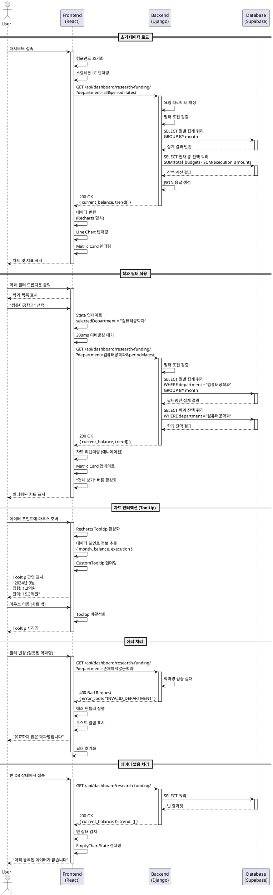

# 연구비 집행 추이 대시보드 기능 상세 유스케이스

**기능 ID:** 002
**기능명:** 연구비 집행 추이 시각화 (P0-MVP)
**작성일:** 2025년 11월 2일
**작성자:** Spec Writer Agent
**수정자:** Claude Code
**버전:** 1.2 (speccheck.md P0 이슈 반영)

---

## 1. 기능 개요

본 기능은 대학교 연구비 집행 데이터를 시간에 따른 추이로 시각화하여, 연구비 잔액과 집행 패턴을 직관적으로 파악할 수 있도록 지원합니다. Line Chart를 통해 월별 집행 추이를 보여주고, Metric Card로 현재 총 연구비 잔액을 강조하여 표시합니다.

**핵심 가치:**
- 연구비 집행 추이를 한눈에 파악하여 예산 관리 의사결정 지원
- 학과별/기간별 필터링을 통한 세밀한 데이터 분석
- 인터랙티브한 차트로 상세 정보 확인

**데이터 소스:** `research_project_data.csv`
- 집행ID (String, PK)
- 소속학과 (String)
- 총연구비 (Int/Float)
- 집행일자 (Date)
- 집행금액 (Int/Float)

**기술 스택:**
- Backend: Django Rest Framework, Pandas
- Frontend: React, Recharts
- Data Fetching: useDashboardData Hook
- API: RESTful JSON API

---

## 2. 사용자 스토리

### 2.1 주요 사용자 스토리 (GIVEN-WHEN-THEN)

**스토리 1: 연구비 추이 조회**
```
GIVEN 내부 직원이 메인 대시보드에 접속했을 때
WHEN 연구비 집행 추이 차트가 로드되면
THEN 월별 연구비 잔액 추이가 Line Chart로 표시되고
AND 현재 총 연구비 잔액이 Metric Card에 표시된다
```

**스토리 2: 학과별 필터링**
```
GIVEN 사용자가 연구비 추이를 확인하고 있을 때
WHEN 학과 필터 드롭다운에서 "컴퓨터공학과"를 선택하면
THEN 해당 학과의 연구비 집행 추이만 차트에 표시되고
AND Metric Card도 해당 학과의 잔액으로 업데이트된다
```

**스토리 3: 상세 정보 확인**
```
GIVEN 사용자가 차트를 보고 있을 때
WHEN 특정 데이터 포인트에 마우스를 올리면
THEN Tooltip이 표시되어 해당 월의 집행금액과 잔액을 보여준다
```

**스토리 4: 데이터 없음 처리**
```
GIVEN 관리자가 아직 연구비 데이터를 업로드하지 않았을 때
WHEN 사용자가 대시보드에 접속하면
THEN 빈 상태 메시지와 함께 "데이터를 업로드하세요" 안내가 표시된다
```

---

## 3. 상세 유스케이스

### 3.1 Use Case: 연구비 추이 데이터 로드

**Primary Actor:** 내부 직원 (Viewer)

**Precondition:**
- 사용자가 메인 대시보드 URL에 접속
- 관리자가 `research_project_data.csv` 파일을 업로드 완료

**Trigger:** 메인 대시보드 페이지 로드

**Main Scenario:**
1. React 앱이 초기화되고 메인 대시보드 컴포넌트가 렌더링됨
2. `useDashboardData` Hook이 실행되어 API 요청 전송
   - `GET /api/dashboard/research-funding/?department=all&period=latest`
3. 백엔드 DRF View가 요청을 수신하고 쿼리 파라미터 파싱
4. Django ORM을 통해 Supabase에서 연구비 데이터 조회
5. 월별 집계 쿼리 실행:
   ```sql
   SELECT
       DATE_TRUNC('month', execution_date) AS month,
       SUM(total_budget) - SUM(execution_amount) AS balance,
       SUM(execution_amount) AS monthly_execution
   FROM research_projects
   GROUP BY month
   ORDER BY month ASC
   ```
6. 현재 총 잔액 계산:
   ```sql
   SELECT SUM(total_budget) - SUM(execution_amount) AS current_balance
   FROM research_projects
   ```
7. JSON 응답 생성 및 반환:
   ```json
   {
     "current_balance": 1530000000,
     "trend": [
       {"month": "2024-01", "balance": 1200000000, "execution": 150000000},
       {"month": "2024-02", "balance": 1400000000, "execution": 120000000},
       {"month": "2024-03", "balance": 1530000000, "execution": 100000000}
     ],
     "last_updated": "2025-11-02T14:35:22Z"
   }
   ```
8. 프런트엔드가 응답 데이터를 수신하고 Recharts 형식으로 변환
9. Line Chart 렌더링 (X축: 월, Y축: 잔액)
10. Metric Card 렌더링 (현재 잔액: 15.3억원)

**Edge Cases:**
- 데이터 없음: 빈 상태 UI 표시 ("아직 등록된 데이터가 없습니다")
- API 타임아웃: 에러 메시지 표시 및 재시도 버튼 제공
- 부분 데이터 로드 실패: 성공한 데이터는 표시, 실패 영역은 에러 카드
- 네트워크 단절: "네트워크 연결을 확인하세요" 경고 표시

**Business Rules:**
- **잔액 계산: `연구과제별 고유 total_budget 합계 - 모든 execution_amount 합계`**
  - 동일 연구과제에서 여러 번 집행 시 total_budget 중복 제거 필요
  - MVP에서는 execution_id별로 DISTINCT 처리하여 간소화
  - 예: 연구과제 A(100억)에서 2회 집행(10억, 20억) → 잔액 = 100억 - 30억 = 70억
- 월별 추이: 매월 말 시점의 누적 잔액 = `연구과제별 고유 총연구비 합계 - 해당 월까지의 누적 집행액`
- 월별 집계: 집행일자를 기준으로 월 단위 GROUP BY
- 금액 단위: 억원 (소수점 1자리까지 표시)
- 기본 필터: 전체 학과, 최근 1년

---

### 3.2 Use Case: 학과별 필터링

**Primary Actor:** 내부 직원 (Viewer)

**Precondition:**
- 연구비 추이 차트가 이미 로드된 상태
- 여러 학과의 데이터가 존재

**Trigger:** 학과 필터 드롭다운에서 특정 학과 선택

**Main Scenario:**
1. 사용자가 학과 필터 드롭다운 클릭
2. 학과 목록 표시 ("전체 학과", "컴퓨터공학과", "전자공학과", ...)
3. 사용자가 "컴퓨터공학과" 선택
4. React State 업데이트 (selectedDepartment: "컴퓨터공학과")
5. 300ms 디바운싱 후 API 재호출
   - `GET /api/dashboard/research-funding/?department=컴퓨터공학과&period=latest`
6. 백엔드에서 필터링된 쿼리 실행:
   ```sql
   SELECT
       DATE_TRUNC('month', execution_date) AS month,
       SUM(total_budget) - SUM(execution_amount) AS balance,
       SUM(execution_amount) AS monthly_execution
   FROM research_projects
   WHERE department = '컴퓨터공학과'
   GROUP BY month
   ORDER BY month ASC
   ```
7. 필터링된 데이터로 JSON 응답 반환
8. 차트 리렌더링 (애니메이션 효과)
9. Metric Card 업데이트 (해당 학과 잔액)
10. 필터 드롭다운에 선택된 값 표시
11. "전체 보기" 버튼 활성화

**Edge Cases:**
- 필터 결과 없음: "선택한 학과의 데이터가 없습니다" 메시지 표시
- 빠른 연속 선택: 디바운싱으로 마지막 선택만 적용
- API 에러: 기존 차트 유지, 에러 토스트 표시
- 잘못된 학과명: 400 Bad Request, 필터 초기화

**Business Rules:**
- 학과 필터는 단일 선택만 가능 (복수 선택 불가)
- 필터 적용 시 URL 쿼리 파라미터 업데이트 (POST-MVP)
- 필터 조합: department + period는 AND 조건
- 전체 학과 선택 시 WHERE 절 제거

---

### 3.3 Use Case: 차트 인터랙션 (Tooltip)

**Primary Actor:** 내부 직원 (Viewer)

**Precondition:**
- 연구비 추이 차트가 렌더링된 상태
- 차트에 최소 1개 이상의 데이터 포인트 존재

**Trigger:** 사용자가 Line Chart의 데이터 포인트에 마우스 호버

**Main Scenario:**
1. 사용자가 차트의 특정 데이터 포인트에 마우스 커서 이동
2. Recharts의 Tooltip 컴포넌트가 활성화됨
3. 해당 데이터 포인트의 정보 추출:
   - 월 (month): "2024년 3월"
   - 집행금액 (execution): 1.2억원
   - 잔액 (balance): 15.3억원
4. 커스텀 Tooltip 템플릿에 데이터 바인딩
5. 커서 근처에 Tooltip 팝업 표시:
   ```
   ┌─────────────────────────┐
   │ 2024년 3월              │
   │ 집행: 1.2억원           │
   │ 잔액: 15.3억원          │
   └─────────────────────────┘
   ```
6. 커서 이동 시 Tooltip 내용 자동 업데이트
7. 커서가 차트 영역을 벗어나면 Tooltip 사라짐

**Edge Cases:**
- 모바일 터치: 데이터 포인트 탭하여 Tooltip 고정 표시
- 여러 포인트 근접: 가장 가까운 포인트의 Tooltip만 표시
- 긴 텍스트: 최대 너비 설정, 줄바꿈 처리
- 데이터 포인트 1개: Tooltip 정상 작동

**Business Rules:**
- Tooltip 표시 위치: 커서 상단 우측 (차트 밖으로 나가지 않도록)
- 금액 포맷: 억원 단위, 쉼표 구분, 소수점 1자리
- 날짜 포맷: "YYYY년 M월" (예: "2024년 3월")
- 애니메이션: 페이드 인/아웃 (200ms)

---

## 4. API 명세

### 4.1 GET /api/dashboard/research-funding/

**용도:** 연구비 집행 추이 데이터 조회

**Method:** GET

**Request Headers:**
```
Content-Type: application/json
```

**Query Parameters:**

| 파라미터 | 타입 | 필수 | 기본값 | 설명 |
|---------|------|------|--------|------|
| department | String | No | "all" | 학과 필터 ("all" 또는 학과명) |
| period | String | No | "latest" | 기간 필터 ("latest", "1year", "3years", "2024") |
| start_date | Date | No | - | 시작 날짜 (YYYY-MM-DD) - POST-MVP |
| end_date | Date | No | - | 종료 날짜 (YYYY-MM-DD) - POST-MVP |

**Request Example:**
```
GET /api/dashboard/research-funding/?department=컴퓨터공학과&period=1year
```

**Response (Success - 200 OK):**
```json
{
  "status": "success",
  "data": {
    "current_balance": 1530000000,
    "current_balance_formatted": "15.3억원",
    "year_over_year_change": 210000000,
    "year_over_year_percentage": 15.8,
    "trend": [
      {
        "month": "2024-01",
        "month_formatted": "2024년 1월",
        "balance": 1200000000,
        "balance_formatted": "12.0억원",
        "execution": 150000000,
        "execution_formatted": "1.5억원"
      },
      {
        "month": "2024-02",
        "month_formatted": "2024년 2월",
        "balance": 1400000000,
        "balance_formatted": "14.0억원",
        "execution": 120000000,
        "execution_formatted": "1.2억원"
      },
      {
        "month": "2024-03",
        "month_formatted": "2024년 3월",
        "balance": 1530000000,
        "balance_formatted": "15.3억원",
        "execution": 100000000,
        "execution_formatted": "1.0억원"
      }
    ],
    "last_updated": "2025-11-02T14:35:22Z"
  }
}
```

**Response (No Data - 200 OK):**
```json
{
  "status": "success",
  "data": {
    "current_balance": 0,
    "current_balance_formatted": "0억원",
    "year_over_year_change": 0,
    "year_over_year_percentage": 0,
    "trend": [],
    "last_updated": null
  },
  "message": "데이터가 없습니다."
}
```

**Response (Error - 400 Bad Request):**
```json
{
  "status": "error",
  "error_code": "INVALID_DEPARTMENT",
  "message": "유효하지 않은 학과명입니다.",
  "details": {
    "field": "department",
    "value": "잘못된학과",
    "allowed_values": ["all", "컴퓨터공학과", "전자공학과", "..."]
  }
}
```

**Response (Error - 500 Internal Server Error):**
```json
{
  "status": "error",
  "error_code": "DATABASE_ERROR",
  "message": "데이터 조회 중 오류가 발생했습니다.",
  "details": null
}
```

---

## 5. 데이터 집계 로직

### 5.0 데이터베이스 스키마 (Django Model)

#### ResearchProject Model

**파일:** `backend/data_ingestion/infrastructure/models.py`

```python
from django.db import models
from django.core.validators import MinValueValidator

class ResearchProject(models.Model):
    """연구비 집행 데이터 모델"""

    # 비즈니스 PK (집행ID)
    execution_id = models.CharField(
        max_length=100,
        unique=True,  # 중복 방지
        verbose_name="집행ID"
    )

    # 연구과제 식별자 (중복 제거용) - POST-MVP 고려
    project_number = models.CharField(
        max_length=100,
        null=True,
        blank=True,
        verbose_name="과제번호",
        help_text="동일 연구과제 그룹핑을 위한 식별자 (예: NRF-2023-015)"
    )

    department = models.CharField(
        max_length=100,
        verbose_name="소속학과"
    )

    total_budget = models.BigIntegerField(
        validators=[MinValueValidator(0)],
        verbose_name="총연구비"
    )

    execution_date = models.DateField(
        verbose_name="집행일자"
    )

    execution_amount = models.BigIntegerField(
        validators=[MinValueValidator(0)],
        verbose_name="집행금액"
    )

    # 메타데이터
    created_at = models.DateTimeField(auto_now_add=True)
    updated_at = models.DateTimeField(auto_now=True)

    class Meta:
        db_table = 'research_projects'
        indexes = [
            models.Index(fields=['department']),
            models.Index(fields=['execution_date']),
        ]
        verbose_name = "연구비 집행 데이터"
        verbose_name_plural = "연구비 집행 데이터 목록"

    def __str__(self):
        return f"{self.execution_id} - {self.department}"
```

**필드 명세:**

| 필드명 | 타입 | 제약 조건 | 설명 |
|--------|------|----------|------|
| execution_id | CharField(100) | unique=True | 집행ID (비즈니스 PK) |
| project_number | CharField(100) | null=True, blank=True | 과제번호 (동일 연구과제 그룹핑용, POST-MVP) |
| department | CharField(100) | null=False | 소속학과 |
| total_budget | BigIntegerField | validators=[MinValueValidator(0)] | 총연구비 (단위: 원) |
| execution_date | DateField | null=False | 집행일자 |
| execution_amount | BigIntegerField | validators=[MinValueValidator(0)] | 집행금액 (단위: 원) |
| created_at | DateTimeField | auto_now_add=True | 생성일시 |
| updated_at | DateTimeField | auto_now=True | 수정일시 |

**인덱스:**
- `department` (필터링 쿼리 최적화)
- `execution_date` (월별 집계 쿼리 최적화)
- `project_number` (POST-MVP: 연구과제별 그룹핑 최적화)

**CSV 컬럼 매핑:**

| CSV 컬럼명 | Model 필드명 | 변환 로직 | MVP 포함 여부 |
|-----------|------------|----------|-------------|
| 집행ID | execution_id | 문자열 그대로 | ✅ 필수 |
| 과제번호 | project_number | 문자열 그대로 | 🔵 선택 (POST-MVP) |
| 소속학과 | department | 문자열 그대로 | ✅ 필수 |
| 총연구비 | total_budget | int(value) | ✅ 필수 |
| 집행일자 | execution_date | pd.to_datetime(value) | ✅ 필수 |
| 집행금액 | execution_amount | int(value) | ✅ 필수 |

**참고:** CSV 파일에는 추가 컬럼(과제명, 연구책임자, 지원기관, 집행항목, 상태, 비고)이 있으나, MVP 대시보드에서는 미사용

#### 데이터 구조 가정 (Business Rules 명확화)

**연구비 데이터 구조:**
- 각 `execution_id`는 특정 연구과제의 1회 집행 건을 의미
- `total_budget`은 해당 연구과제의 전체 예산으로, 여러 execution_id에서 중복될 수 있음
- 동일 연구과제에서 여러 번 집행하는 경우, 각 집행 건마다 별도의 execution_id가 부여됨

**예시 데이터:**
```
연구과제 A (예산 100억원):
  - EX001: execution_id=EX001, total_budget=100억, execution_amount=10억 (1차 집행)
  - EX002: execution_id=EX002, total_budget=100억, execution_amount=20억 (2차 집행)

연구과제 B (예산 50억원):
  - EX003: execution_id=EX003, total_budget=50억, execution_amount=15억 (1차 집행)
```

**잔액 계산 로직:**
```
전체 잔액 = (연구과제별 고유 total_budget 합계) - (모든 execution_amount 합계)
         = (100억 + 50억) - (10억 + 20억 + 15억)
         = 150억 - 45억
         = 105억
```

**중요:**
- `total_budget` 합산 시 연구과제 중복 제거가 필요
- MVP에서는 `execution_id` 기준으로 DISTINCT 처리 (간소화)
- POST-MVP에서는 `project_id` 같은 별도 컬럼으로 연구과제 그룹핑 고려

**실제 CSV 데이터 구조 확인 (docs/db/research_project_data.csv):**
- CSV에는 `과제번호` 컬럼이 존재하여 동일 연구과제 식별 가능
- 예시: "NRF-2023-015" 과제는 T2301001, T2301003 두 개의 집행ID를 가짐
- 두 집행 건 모두 총연구비 500,000,000원을 공유
- **MVP 구현 시:** `과제번호` 컬럼을 Django Model에 추가하여 정확한 잔액 계산 가능
- **또는 간소화:** execution_id 기준 DISTINCT 유지 (샘플 데이터 확인 후 결정)

### 5.1 레이어 아키텍처 (CLAUDE.md 원칙 준수)

이 기능은 다음과 같은 레이어 분리를 따릅니다:

```
api/views.py (Presentation Layer)
  → services/research_funding_service.py (Business Logic Layer)
    → infrastructure/repositories.py (Data Access Layer)
      → models.py (Domain Layer)
```

**Presentation Layer (API View):**
```python
# api/views.py
from rest_framework.views import APIView
from rest_framework.response import Response
from services.research_funding_service import ResearchFundingService

class ResearchFundingView(APIView):
    def get(self, request):
        department = request.query_params.get('department', 'all')
        period = request.query_params.get('period', 'latest')

        service = ResearchFundingService()
        data = service.get_dashboard_data(department, period)

        return Response({"status": "success", "data": data})
```

**Service Layer (Business Logic):**
```python
# services/research_funding_service.py
from infrastructure.repositories import ResearchFundingRepository

class ResearchFundingService:
    def __init__(self):
        self.repository = ResearchFundingRepository()

    def get_dashboard_data(self, department, period):
        current_balance = self.repository.get_current_balance(department)
        monthly_trend = self.repository.get_monthly_trend(department, period)

        return {
            'current_balance': current_balance,
            'current_balance_formatted': self._format_currency(current_balance),
            'trend': [
                {
                    'month': item['month'],
                    'balance': item['balance'],
                    'execution': item['execution']
                }
                for item in monthly_trend
            ]
        }

    def _format_currency(self, amount):
        return f"{amount / 100000000:.1f}억원"
```

**Repository Layer (Data Access):**
```python
# infrastructure/repositories.py
from django.db.models import Sum
from django.db.models.functions import TruncMonth
from infrastructure.models import ResearchProject

class ResearchFundingRepository:
    def get_current_balance(self, department=None):
        queryset = ResearchProject.objects.all()

        if department and department != "all":
            queryset = queryset.filter(department=department)

        result = queryset.aggregate(
            total_budget=Sum('total_budget'),
            total_execution=Sum('execution_amount')
        )

        total_budget = result['total_budget'] or 0
        total_execution = result['total_execution'] or 0
        current_balance = total_budget - total_execution

        return current_balance
```

**월별 추이 데이터 집계:**
```python
from django.db.models import Sum, Q
from django.db.models.functions import TruncMonth
from django.utils import timezone
from datetime import timedelta

def get_monthly_trend(department=None, period='latest'):
    queryset = ResearchProject.objects.all()

    if department and department != "all":
        queryset = queryset.filter(department=department)

    # 기간 필터 적용
    if period == "1year":
        one_year_ago = timezone.now() - timedelta(days=365)
        queryset = queryset.filter(execution_date__gte=one_year_ago)
    elif period == "3years":
        three_years_ago = timezone.now() - timedelta(days=1095)
        queryset = queryset.filter(execution_date__gte=three_years_ago)

    # 전체 총연구비 (중복 제거: execution_id 기준 DISTINCT)
    # MVP 간소화: 동일 total_budget을 가진 execution_id들이 같은 연구과제로 간주
    # 실제로는 각 execution_id가 고유하므로 distinct() 사용
    unique_budgets = queryset.values('execution_id', 'total_budget').distinct()
    total_budget = sum([item['total_budget'] for item in unique_budgets])

    # 또는 Django ORM으로 구현:
    # total_budget = queryset.values('execution_id').annotate(
    #     budget=Sum('total_budget')
    # ).aggregate(
    #     total=Sum('budget')
    # )['total'] or 0

    # 월별 집행액 집계
    trend_data = queryset.annotate(
        month=TruncMonth('execution_date')
    ).values('month').annotate(
        monthly_execution=Sum('execution_amount')
    ).order_by('month')

    # 월별 누적 잔액 계산
    cumulative_execution = 0
    result = []

    for item in trend_data:
        monthly_execution = item['monthly_execution']
        cumulative_execution += monthly_execution

        # 잔액 = 연구과제별 고유 총연구비 - 누적 집행액
        balance = total_budget - cumulative_execution

        result.append({
            'month': item['month'].strftime('%Y-%m'),
            'balance': balance,
            'execution': monthly_execution
        })

    return result
```

**로직 설명:**
1. **전체 총연구비 계산:** execution_id별로 DISTINCT하여 중복 제거
   - 예: EX001(100억), EX002(100억) → 실제로는 각각 고유하므로 200억 (MVP 간소화)
   - POST-MVP: project_id 컬럼 추가하여 동일 연구과제 그룹핑
2. **월별 집행액 집계:** 집행일자 기준 월별 GROUP BY
3. **누적 잔액 계산:** 전체 총연구비 - 누적 집행액 (매월 업데이트)

**중요 가정 (MVP):**
- 현재 CSV 데이터에서 각 execution_id는 고유한 집행 건
- 동일 연구과제 구분을 위한 project_id 컬럼 없음
- 따라서 각 execution_id의 total_budget을 합산
- **실제 데이터 구조에 따라 로직 조정 필요** (샘플 CSV 확인 후)

### 5.2 데이터 변환 로직 (Frontend)

**Recharts 형식으로 변환:**
```javascript
// hooks/useDashboardData.js
function transformResearchFundingData(apiResponse) {
  const { data } = apiResponse;

  // Metric Card 데이터
  const metricData = {
    currentBalance: data.current_balance,
    currentBalanceFormatted: data.current_balance_formatted,
    yearOverYearChange: data.year_over_year_change,
    yearOverYearPercentage: data.year_over_year_percentage,
    lastUpdated: data.last_updated
  };

  // Chart 데이터
  const chartData = data.trend.map(item => ({
    month: item.month_formatted,
    balance: item.balance / 100000000, // 억원 단위
    execution: item.execution / 100000000,
    balanceFormatted: item.balance_formatted,
    executionFormatted: item.execution_formatted
  }));

  return { metricData, chartData };
}
```

---

## 6. UI 컴포넌트 구조

### 6.1 React 컴포넌트 트리

```
DashboardPage
├── DashboardHeader
│   ├── PageTitle
│   ├── FilterDropdowns
│   │   ├── DepartmentFilter
│   │   └── PeriodFilter
│   └── LastUpdatedInfo
├── MetricsRow
│   ├── ResearchFundingMetricCard
│   ├── StudentCountMetricCard
│   ├── PublicationMetricCard
│   └── KPIMetricCard
└── ChartsGrid
    ├── ResearchFundingChart (Line Chart)
    ├── StudentDistributionChart (Stacked Bar)
    ├── PublicationChart (Doughnut)
    └── KPITrendChart (Dual Line)
```

### 6.2 ResearchFundingChart 컴포넌트

**파일:** `frontend/src/components/dashboard/ResearchFundingChart.jsx`

**Props:**
```typescript
interface ResearchFundingChartProps {
  data: ChartDataPoint[];
  loading: boolean;
  error: Error | null;
  onRetry?: () => void;
}

interface ChartDataPoint {
  month: string;
  balance: number;
  execution: number;
  balanceFormatted: string;
  executionFormatted: string;
}
```

**Recharts 구조:**
```jsx
import { LineChart, Line, XAxis, YAxis, CartesianGrid, Tooltip, ResponsiveContainer } from 'recharts';

function ResearchFundingChart({ data, loading, error, onRetry }) {
  if (loading) return <ChartSkeleton />;
  if (error) return <ChartError message={error.message} onRetry={onRetry} />;
  if (data.length === 0) return <EmptyChartState />;

  return (
    <div className="chart-container">
      <h3 className="chart-title">연구비 집행 추이</h3>
      <ResponsiveContainer width="100%" height={400}>
        <LineChart data={data} margin={{ top: 5, right: 30, left: 20, bottom: 5 }}>
          <CartesianGrid strokeDasharray="3 3" stroke="#e0e0e0" />
          <XAxis
            dataKey="month"
            stroke="#666"
            style={{ fontSize: '12px' }}
          />
          <YAxis
            stroke="#666"
            style={{ fontSize: '12px' }}
            label={{ value: '억원', angle: -90, position: 'insideLeft' }}
          />
          <Tooltip content={<CustomTooltip />} />
          <Line
            type="monotone"
            dataKey="balance"
            stroke="#2563eb"
            strokeWidth={2}
            dot={{ r: 4 }}
            activeDot={{ r: 6 }}
          />
        </LineChart>
      </ResponsiveContainer>
    </div>
  );
}
```

**CustomTooltip 컴포넌트:**
```jsx
function CustomTooltip({ active, payload, label }) {
  if (!active || !payload || !payload.length) return null;

  const data = payload[0].payload;

  return (
    <div className="custom-tooltip">
      <p className="tooltip-label">{label}</p>
      <p className="tooltip-execution">
        집행: <span className="value">{data.executionFormatted}</span>
      </p>
      <p className="tooltip-balance">
        잔액: <span className="value">{data.balanceFormatted}</span>
      </p>
    </div>
  );
}
```

### 6.3 ResearchFundingMetricCard 컴포넌트

**파일:** `frontend/src/components/dashboard/ResearchFundingMetricCard.jsx`

**Props:**
```typescript
interface MetricCardProps {
  currentBalance: number;
  currentBalanceFormatted: string;
  yearOverYearChange: number;
  yearOverYearPercentage: number;
  loading: boolean;
}
```

**렌더링 구조:**
```jsx
function ResearchFundingMetricCard({
  currentBalance,
  currentBalanceFormatted,
  yearOverYearChange,
  yearOverYearPercentage,
  loading
}) {
  if (loading) return <MetricCardSkeleton />;

  const isIncrease = yearOverYearChange > 0;
  const changeIcon = isIncrease ? '↑' : '↓';
  const changeColor = isIncrease ? 'text-green-600' : 'text-red-600';

  return (
    <div className="metric-card">
      <h4 className="metric-title">현재 연구비 잔액</h4>
      <p className="metric-value">{currentBalanceFormatted}</p>
      <div className={`metric-change ${changeColor}`}>
        <span className="change-icon">{changeIcon}</span>
        <span className="change-text">
          {Math.abs(yearOverYearChange / 100000000).toFixed(1)}억원
          ({yearOverYearPercentage.toFixed(1)}%)
        </span>
      </div>
      <p className="metric-description">전년 대비</p>
    </div>
  );
}
```

---

## 7. 테스트 요구사항 (TDD)

### 7.1 Unit Tests (백엔드)

**파일:** `backend/data_ingestion/tests/test_research_funding_api.py`

**테스트 케이스:**

```python
import pytest
from django.urls import reverse
from rest_framework.test import APIClient
from data_ingestion.infrastructure.models import ResearchProject

@pytest.mark.django_db
class TestResearchFundingAPI:

    def test_get_current_balance_all_departments(self):
        """전체 학과 잔액 조회 성공"""
        # Given: 연구비 데이터가 DB에 존재
        ResearchProject.objects.create(
            execution_id="EX001",
            department="컴퓨터공학과",
            total_budget=1000000000,
            execution_date="2024-01-15",
            execution_amount=200000000
        )

        # When: API 호출
        client = APIClient()
        response = client.get(reverse('research-funding-list'))

        # Then: 잔액 계산 정확성 검증
        assert response.status_code == 200
        assert response.data['data']['current_balance'] == 800000000

    def test_get_trend_with_department_filter(self):
        """학과 필터 적용 시 추이 데이터 조회"""
        # Given: 여러 학과 데이터
        ResearchProject.objects.bulk_create([
            ResearchProject(execution_id="EX001", department="컴퓨터공학과", ...),
            ResearchProject(execution_id="EX002", department="전자공학과", ...)
        ])

        # When: 특정 학과 필터 적용
        response = client.get(
            reverse('research-funding-list'),
            {'department': '컴퓨터공학과'}
        )

        # Then: 해당 학과 데이터만 반환
        assert len(response.data['data']['trend']) > 0
        for item in response.data['data']['trend']:
            assert "컴퓨터공학과" in str(item)

    def test_get_empty_data(self):
        """데이터 없을 때 빈 응답 반환"""
        # Given: 빈 DB

        # When: API 호출
        response = client.get(reverse('research-funding-list'))

        # Then: 빈 데이터 구조 반환
        assert response.status_code == 200
        assert response.data['data']['current_balance'] == 0
        assert response.data['data']['trend'] == []

    def test_invalid_department_parameter(self):
        """잘못된 학과명 파라미터 에러 처리"""
        # When: 존재하지 않는 학과명
        response = client.get(
            reverse('research-funding-list'),
            {'department': '존재하지않는학과'}
        )

        # Then: 400 에러
        assert response.status_code == 400
        assert response.data['error_code'] == 'INVALID_DEPARTMENT'
```

### 7.2 Integration Tests (프런트엔드)

**파일:** `frontend/src/components/dashboard/ResearchFundingChart.test.jsx`

**테스트 케이스:**

```javascript
import { render, screen, waitFor } from '@testing-library/react';
import userEvent from '@testing-library/user-event';
import ResearchFundingChart from './ResearchFundingChart';

describe('ResearchFundingChart', () => {

  test('차트가 데이터와 함께 렌더링됨', async () => {
    // Given: 정상 데이터
    const mockData = [
      { month: '2024년 1월', balance: 12.0, execution: 1.5, ... },
      { month: '2024년 2월', balance: 14.0, execution: 1.2, ... }
    ];

    // When: 컴포넌트 렌더링
    render(<ResearchFundingChart data={mockData} loading={false} error={null} />);

    // Then: 차트 제목과 데이터 포인트 표시
    expect(screen.getByText('연구비 집행 추이')).toBeInTheDocument();
    await waitFor(() => {
      expect(screen.getByText('2024년 1월')).toBeInTheDocument();
    });
  });

  test('로딩 중일 때 스켈레톤 표시', () => {
    // When: 로딩 상태
    render(<ResearchFundingChart data={[]} loading={true} error={null} />);

    // Then: 스켈레톤 UI
    expect(screen.getByTestId('chart-skeleton')).toBeInTheDocument();
  });

  test('데이터 없을 때 빈 상태 메시지 표시', () => {
    // When: 빈 데이터
    render(<ResearchFundingChart data={[]} loading={false} error={null} />);

    // Then: 빈 상태 메시지
    expect(screen.getByText('아직 등록된 데이터가 없습니다')).toBeInTheDocument();
  });

  test('에러 발생 시 에러 메시지와 재시도 버튼 표시', () => {
    // Given: 에러 상태
    const mockError = new Error('데이터 로드 실패');
    const mockRetry = jest.fn();

    // When: 에러와 함께 렌더링
    render(<ResearchFundingChart data={[]} loading={false} error={mockError} onRetry={mockRetry} />);

    // Then: 에러 메시지와 재시도 버튼
    expect(screen.getByText('데이터 로드 실패')).toBeInTheDocument();
    const retryButton = screen.getByText('재시도');
    userEvent.click(retryButton);
    expect(mockRetry).toHaveBeenCalled();
  });
});
```

### 7.3 E2E Tests

**파일:** `frontend/cypress/e2e/research-funding-dashboard.cy.js`

**테스트 시나리오:**

```javascript
describe('연구비 집행 추이 대시보드 E2E', () => {

  beforeEach(() => {
    // Given: 테스트 데이터 시드
    cy.seedDatabase('research_funding');
    cy.visit('/dashboard');
  });

  it('사용자가 연구비 추이를 조회할 수 있다', () => {
    // When: 대시보드 로드

    // Then: Metric Card와 차트 표시
    cy.contains('현재 연구비 잔액').should('be.visible');
    cy.contains('15.3억원').should('be.visible');
    cy.get('[data-testid="research-funding-chart"]').should('be.visible');
  });

  it('학과 필터를 적용하여 특정 학과 데이터를 조회할 수 있다', () => {
    // When: 학과 필터 드롭다운 클릭
    cy.get('[data-testid="department-filter"]').click();
    cy.contains('컴퓨터공학과').click();

    // Then: 차트가 필터링된 데이터로 업데이트됨
    cy.wait('@getFilteredData');
    cy.get('[data-testid="metric-card"]').should('contain', '컴퓨터공학과');
  });

  it('차트 데이터 포인트 호버 시 Tooltip이 표시된다', () => {
    // When: 데이터 포인트에 마우스 호버
    cy.get('[data-testid="research-funding-chart"]')
      .find('.recharts-line-dot')
      .first()
      .trigger('mouseover');

    // Then: Tooltip 표시
    cy.get('.custom-tooltip').should('be.visible');
    cy.contains('2024년 1월').should('be.visible');
    cy.contains('집행:').should('be.visible');
    cy.contains('잔액:').should('be.visible');
  });

  it('데이터가 없을 때 빈 상태 메시지가 표시된다', () => {
    // Given: 빈 DB
    cy.clearDatabase('research_projects');

    // When: 대시보드 로드
    cy.visit('/dashboard');

    // Then: 빈 상태 UI
    cy.contains('아직 등록된 데이터가 없습니다').should('be.visible');
  });
});
```

---

## 8. 에러 처리

### 8.1 백엔드 에러 코드

| 에러 코드 | HTTP Status | 설명 | 사용자 메시지 |
|----------|-------------|------|--------------|
| `INVALID_DEPARTMENT` | 400 | 유효하지 않은 학과명 | "유효하지 않은 학과명입니다." |
| `INVALID_PERIOD` | 400 | 유효하지 않은 기간 파라미터 | "유효하지 않은 기간 설정입니다." |
| `INVALID_DATE_RANGE` | 400 | 시작일이 종료일보다 늦음 | "날짜 범위가 올바르지 않습니다." |
| `DATABASE_ERROR` | 500 | DB 조회 실패 | "데이터 조회 중 오류가 발생했습니다." |
| `NO_DATA` | 200 | 데이터 없음 (에러 아님) | "데이터가 없습니다." |

### 8.2 프런트엔드 에러 처리

**API 연결 에러:**
```javascript
try {
  const response = await fetchResearchFundingData(filters);
  setChartData(response.data);
} catch (error) {
  if (error.response?.status === 400) {
    showToast('error', error.response.data.message);
  } else if (error.response?.status === 500) {
    showToast('error', '서버 오류가 발생했습니다. 잠시 후 다시 시도하세요.');
  } else if (error.code === 'ECONNABORTED') {
    showToast('error', '요청 시간이 초과되었습니다.');
  } else {
    showToast('error', '네트워크 연결을 확인하세요.');
  }
  setError(error);
}
```

**차트 렌더링 에러:**
```javascript
// Error Boundary로 Recharts 렌더링 에러 캐치
class ChartErrorBoundary extends React.Component {
  state = { hasError: false };

  static getDerivedStateFromError(error) {
    return { hasError: true };
  }

  render() {
    if (this.state.hasError) {
      return (
        <div className="chart-error">
          <p>차트를 표시할 수 없습니다.</p>
          <button onClick={() => window.location.reload()}>새로고침</button>
        </div>
      );
    }
    return this.props.children;
  }
}
```

### 8.3 데이터 없음 처리

**빈 상태 UI:**
```jsx
function EmptyChartState() {
  return (
    <div className="empty-state">
      <svg className="empty-icon" width="120" height="120">
        {/* 빈 상태 일러스트레이션 */}
      </svg>
      <h3>아직 등록된 데이터가 없습니다</h3>
      <p>관리자가 데이터를 업로드하면 여기에 시각화가 표시됩니다.</p>
    </div>
  );
}
```

---

## 9. 성능 요구사항

### 9.1 로딩 시간 목표

| 메트릭 | 목표 | 측정 방법 |
|-------|------|----------|
| 초기 차트 로드 | < 2초 | Time to Interactive (TTI) |
| 필터 적용 후 리렌더링 | < 500ms | React DevTools Profiler |
| API 응답 시간 | < 1초 | Django Debug Toolbar |
| 차트 애니메이션 | 60fps | Chrome DevTools Performance |

### 9.2 최적화 전략

**백엔드:**
- DB 인덱스: `department`, `execution_date` 컬럼
- 쿼리 최적화: `select_related`, `prefetch_related` 사용 (필요시)
- 응답 데이터 최소화: 필요한 필드만 선택

**프런트엔드:**
- React.memo로 불필요한 리렌더링 방지
- useMemo로 데이터 변환 로직 캐싱
- 디바운싱으로 API 호출 최소화
- Lazy Loading으로 초기 번들 크기 감소

**캐싱 (POST-MVP):**
- React Query로 API 응답 캐싱 (5분)
- SWR (Stale-While-Revalidate) 전략

---

## 10. 접근성 (Accessibility)

### 10.1 ARIA 라벨

**차트 컨테이너:**
```jsx
<div
  role="img"
  aria-label="연구비 집행 추이 Line Chart. 월별 연구비 잔액 변화를 보여줍니다."
>
  <LineChart ... />
</div>
```

**Metric Card:**
```jsx
<div role="region" aria-labelledby="metric-title">
  <h4 id="metric-title">현재 연구비 잔액</h4>
  <p aria-label="잔액 15.3억원">15.3억원</p>
</div>
```

**필터 드롭다운:**
```jsx
<label htmlFor="department-filter">학과 선택</label>
<select
  id="department-filter"
  aria-label="학과 필터 선택"
  aria-describedby="filter-help"
>
  <option value="all">전체 학과</option>
  ...
</select>
<span id="filter-help" className="sr-only">
  학과를 선택하면 해당 학과의 연구비 데이터만 표시됩니다.
</span>
```

### 10.2 키보드 네비게이션

- Tab: 필터 드롭다운, 버튼 간 이동
- Enter/Space: 드롭다운 열기, 버튼 클릭
- Arrow Keys: 드롭다운 옵션 선택
- Esc: 드롭다운 닫기

### 10.3 색상 대비

- WCAG 2.1 Level AA 준수 (대비율 4.5:1 이상)
- 차트 라인: 파란색 (#2563eb) - 배경 대비 충분
- 텍스트: 진한 회색 (#333) - 흰 배경 대비 충분

---

## 11. 보안 요구사항

### 11.1 API 보안

**입력 검증 (Input Validation):**
| 파라미터 | 검증 규칙 | 에러 코드 |
|---------|----------|----------|
| department | 화이트리스트 기반 (DB에서 허용된 학과명 조회 후 검증) | INVALID_DEPARTMENT |
| period | IN ('latest', '1year', '3years', '2024') | INVALID_PERIOD |
| start_date | YYYY-MM-DD 형식, 미래 날짜 불허 | INVALID_DATE |
| end_date | start_date 이후 날짜 | INVALID_DATE_RANGE |

**SQL Injection 방어:**
- Django ORM의 Parameterized Query 자동 사용
- Raw SQL 사용 금지

**XSS 방어:**
- React 기본 이스케이핑 적용
- 사용자 입력 데이터는 서버에서도 sanitize

**Rate Limiting (POST-MVP):**
- 동일 IP에서 초당 10회 요청 제한

### 11.2 인증 및 권한 (MVP 간소화)

**MVP에서:**
- 모든 사용자가 조회 가능 (내부 직원 대상 가정)
- API Key 불필요

**POST-MVP:**
- JWT 기반 인증
- Role-based Access Control (관리자, 직원, 게스트)

---

## 12. Out of Scope (MVP 제외 기능)

다음 기능은 MVP에서 제외되며, 베타 피드백 후 우선순위 재평가:

1. **차트 확대/축소 (Zoom, Brush)**
   - 사용자가 특정 기간 구간을 확대하여 상세 조회
   - Recharts Brush 컴포넌트 사용

2. **차트 클릭 드릴다운**
   - 데이터 포인트 클릭 시 해당 학과/기간으로 자동 필터 적용
   - 상세 데이터 모달 표시

3. **데이터 내보내기**
   - CSV, PNG, PDF 형식으로 차트 다운로드
   - Excel 리포트 생성

4. **다중 학과 선택**
   - 여러 학과를 동시에 선택하여 비교
   - 각 학과별 라인을 다른 색상으로 표시

5. **커스텀 날짜 범위 선택**
   - 캘린더 UI로 시작일-종료일 직접 선택
   - 프리셋 (최근 1년, 3년) 외 자유 설정

6. **실시간 데이터 갱신**
   - 30초 간격 자동 폴링
   - 데이터 변경 시 알림

7. **모바일 최적화**
   - 터치 제스처 (스와이프, 핀치 줌)
   - 반응형 차트 크기 조정

8. **데이터 비교 모드**
   - 작년 동기 대비 비교 라인 표시
   - 예산 목표 대비 진행률

---

## 12. Sequence Diagram (PlantUML)



---

## 문서 변경 이력

| 버전 | 날짜 | 변경 사항 | 작성자 |
|------|------|-----------|--------|
| 1.0 | 2025-11-02 | 초기 상세 유스케이스 문서 작성 | Spec Writer Agent |
| 1.1 | 2025-11-02 | Critical Issues 반영: 비즈니스 로직 오류 수정(잔액 계산식), Service 레이어 아키텍처 추가, 보안 요구사항 섹션 추가 | Claude Code |
| 1.2 | 2025-11-02 | speccheck.md P0 이슈 반영: Django Model 정의 추가 (5.0절), 데이터 구조 가정 및 중복 제거 로직 명확화, Business Rules 상세화 | Claude Code |

---

## 승인 및 검토

**작성자:** Spec Writer Agent
**검토자:** CTO
**승인일:** 2025-11-02

본 문서는 MVP 범위의 연구비 집행 추이 대시보드 기능에 대한 상세 유스케이스입니다. TDD 원칙(Red-Green-Refactor, FIRST, Test Pyramid)을 준수하며, 오버엔지니어링 없이 필수 기능만 포함합니다.

---

**문서 끝**
