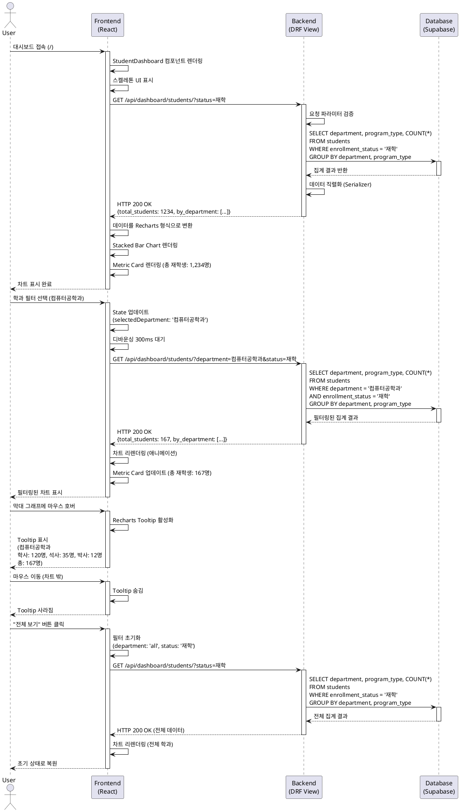

# 학과별 학생 현황 대시보드 기능 상세 유스케이스

**프로젝트:** 대학교 사내 데이터 시각화 대시보드 MVP
**기능 ID:** UC-003
**기능명:** 학과별 학생 현황 시각화 (P0-MVP)
**작성일:** 2025-11-02
**최종 수정일:** 2025-11-02
**수정자:** Claude Code
**버전:** 2.1 (오버엔지니어링 요소 제거, MVP 집중)
**참조:** userflow.md 섹션 3.2.2, prd.md 섹션 3.1

**변경 이력 (v2.1):**
- 미사용 DB 칼럼 저장 제거 (YAGNI 원칙 적용)
- API 응답 간소화 (by_grade, filters_applied 제거)
- POST-MVP 기능 제거 (Redis 캐싱, Rate Limiting, 경고 배지)
- Integration Test 비율 축소 (20% → 10%)
- 브라우저 폴백 전략 단순화

---

## 1. 기능 개요

학과별/과정별/학년별 학생 분포를 Stacked Bar Chart로 시각화하여 대학 내부 직원이 학생 현황을 한눈에 파악할 수 있도록 지원하는 기능입니다.

**핵심 가치:**
- 학과별 학생 수 비교를 통한 자원 배분 의사결정 지원
- 과정별(학사/석사/박사) 학생 구성 비율 파악
- 학적상태별 필터링을 통한 재학생 현황 모니터링

**범위:**
- Recharts 라이브러리 기반 Stacked Bar Chart 구현
- 학과별/학적상태별 필터링 지원
- 총 재학생 수 Metric Card 표시
- 호버 시 상세 정보 Tooltip 제공
- 학과 수가 많을 경우 가로 스크롤 지원

---

## 2. 사용자 스토리 (GIVEN-WHEN-THEN)

### 스토리 1: 학과별 학생 현황 조회
```gherkin
GIVEN 관리자가 student_roster.csv 파일을 업로드하여 학생 데이터가 DB에 저장된 상태
WHEN 내부 직원이 메인 대시보드에 접속하여 학생 현황 차트를 조회할 때
THEN 학과별로 과정별(학사/석사/박사) 학생 수가 누적 막대 그래프로 표시되어야 한다
AND 총 재학생 수가 Metric Card로 상단에 표시되어야 한다
```

### 스토리 2: 학과 필터링
```gherkin
GIVEN 학생 현황 차트가 로드된 상태
WHEN 사용자가 학과 필터 드롭다운에서 "컴퓨터공학과"를 선택할 때
THEN 해당 학과의 학생 분포만 차트에 표시되어야 한다
AND 총 재학생 수 Metric Card가 해당 학과 학생 수로 업데이트되어야 한다
```

### 스토리 3: 학적상태 필터링
```gherkin
GIVEN 학생 현황 차트가 로드된 상태
WHEN 사용자가 학적상태 필터에서 "재학"만 선택할 때
THEN 재학생만 집계된 데이터가 차트에 표시되어야 한다
AND 휴학생 및 졸업생은 차트에서 제외되어야 한다
```

### 스토리 4: 차트 인터랙션
```gherkin
GIVEN 학생 현황 차트가 표시된 상태
WHEN 사용자가 특정 학과의 막대 그래프에 마우스를 올릴 때
THEN Tooltip이 표시되어야 하며
AND "학과명: 컴퓨터공학과, 학사: 120명, 석사: 35명, 박사: 12명, 총: 167명" 형식의 정보가 표시되어야 한다
```

---

## 2.5 CSV 칼럼 처리 방침

### 필수 칼럼 (MVP에서 사용)

| CSV 칼럼 | Django Model Field | 용도 |
|---------|-------------------|------|
| 학번 | student_id (PK) | 고유 식별자 |
| 학과 | department | 집계 및 필터링 |
| 학년 | grade | POST-MVP 확장용 (현재 API 응답에만 포함) |
| 과정구분 | program_type | 스택 바 차트 구분 (학사/석사/박사) |
| 학적상태 | enrollment_status | 필터링 (재학/휴학/졸업) |

### 선택 칼럼 처리 방침 (MVP)

**YAGNI 원칙 적용:**
- CSV에 추가 칼럼이 있어도 **무시하고 파싱 성공**
- 필수 칼럼(학번, 학과, 학년, 과정구분, 학적상태)만 DB에 저장
- POST-MVP 확장 시 Django Migration으로 칼럼 추가

### 데이터 파싱 규칙 (excel_parser.py)

- 필수 칼럼 누락 시: ValidationError 발생, 파일 업로드 실패
- 선택 칼럼은 파싱 과정에서 무시 (DB 저장 안 함)

---

## 3. 상세 유스케이스

### Primary Actor
- 내부 직원 (Internal Staff / Viewer)

### Precondition
- 관리자가 student_roster.csv 파일을 업로드하여 students 테이블에 데이터가 존재함
- 사용자가 메인 대시보드에 접속함
- 브라우저가 Recharts 렌더링을 지원함 (Chrome, Firefox, Edge 최신 버전)

### Trigger
- 사용자가 메인 대시보드 페이지(/) 또는 대시보드 URL(/dashboard)에 접속

### Main Scenario

#### 시나리오 1: 초기 데이터 로드 및 차트 렌더링

**단계 1: 대시보드 접속 및 API 요청**
1. 사용자가 브라우저에서 메인 대시보드 URL 접속
2. React 앱이 로드되고 StudentDashboard 컴포넌트 렌더링 시작
3. useDashboardData Hook이 초기 필터 상태 설정 (department: "all", status: "재학")
4. 스켈레톤 UI 표시 (로딩 인디케이터)
5. 프런트엔드가 `GET /api/dashboard/students/?department=all&status=재학` API 호출

**단계 2: 백엔드 데이터 집계**
6. DRF View가 요청 수신 및 쿼리 파라미터 검증
7. Django ORM을 통해 students 테이블 조회:
   ```python
   queryset = Student.objects.filter(enrollment_status='재학')
   # GROUP BY department, program_type
   aggregated_data = queryset.values('department', 'program_type').annotate(count=Count('id'))
   ```
8. 집계 결과를 JSON 형식으로 직렬화:
   ```json
   {
     "total_students": 1234,
     "by_department": [
       {
         "department": "컴퓨터공학과",
         "학사": 120,
         "석사": 35,
         "박사": 12,
         "total": 167
       },
       {
         "department": "전자공학과",
         "학사": 98,
         "석사": 28,
         "박사": 9,
         "total": 135
       }
     ]
   }
   ```
9. HTTP 200 OK 응답 반환

**단계 3: 프런트엔드 데이터 처리 및 차트 렌더링**
10. useDashboardData Hook이 API 응답 수신
11. 데이터를 Recharts 형식으로 변환:
    ```javascript
    const chartData = response.by_department.map(dept => ({
      name: dept.department,
      학사: dept.학사,
      석사: dept.석사,
      박사: dept.박사
    }));
    ```
12. Stacked Bar Chart 컴포넌트에 데이터 바인딩
13. 차트 렌더링 완료:
    - X축: 학과명 (가로 배치)
    - Y축: 학생 수 (0부터 자동 스케일링)
    - 스택 바: 학사(파랑), 석사(초록), 박사(주황) 색상 구분
    - 범례: 상단 또는 우측에 과정 구분 표시
14. 총 재학생 수 Metric Card 렌더링: "총 재학생: 1,234명"

**단계 4: 사용자 피드백**
- 차트가 화면에 표시됨
- 로딩 인디케이터 제거
- 최종 업데이트 시간 표시: "마지막 업데이트: 2025-11-02 14:35"

#### 시나리오 2: 학과 필터링

**단계 1: 필터 선택**
1. 사용자가 학과 필터 드롭다운 클릭
2. 학과 목록 표시: "전체 학과", "컴퓨터공학과", "전자공학과", ...
3. 사용자가 "컴퓨터공학과" 선택

**단계 2: 필터 적용 및 API 재요청**
4. React State 업데이트 (selectedDepartment: "컴퓨터공학과")
5. 디바운싱 300ms 대기
6. `GET /api/dashboard/students/?department=컴퓨터공학과&status=재학` API 호출
7. 짧은 로딩 스피너 표시 (1초 미만)

**단계 3: 필터링된 데이터 조회**
8. 백엔드에서 WHERE 절 추가하여 조회:
   ```python
   queryset = Student.objects.filter(
       department='컴퓨터공학과',
       enrollment_status='재학'
   )
   ```
9. 해당 학과 데이터만 집계하여 응답

**단계 4: 차트 업데이트**
10. 프런트엔드에서 새 데이터로 차트 리렌더링
11. Recharts 애니메이션 효과 (부드러운 전환)
12. 총 재학생 수 업데이트: "총 재학생: 167명 (컴퓨터공학과)"
13. 필터 드롭다운에 선택된 값 표시
14. "전체 보기" 버튼 활성화

#### 시나리오 3: 학적상태 필터링

**단계 1: 학적상태 필터 선택**
1. 사용자가 학적상태 라디오 버튼 영역 확인
2. 기본값 "재학" 선택됨
3. 사용자가 "전체" 라디오 버튼 클릭

**단계 2: 필터 적용**
4. React State 업데이트 (enrollmentStatus: "all")
5. `GET /api/dashboard/students/?department=all&status=all` API 호출

**단계 3: 전체 학생 데이터 조회**
6. 백엔드에서 enrollment_status 필터 제거:
   ```python
   queryset = Student.objects.all()
   # 재학, 휴학, 졸업 모두 포함
   ```
7. 전체 학생 집계 데이터 반환

**단계 4: 차트 업데이트**
8. 차트가 재학생+휴학생+졸업생 합산 데이터로 업데이트됨
9. 총 학생 수 증가: "총 학생: 2,156명 (재학+휴학+졸업)"

#### 시나리오 4: 차트 인터랙션 (Tooltip)

**단계 1: 마우스 호버**
1. 사용자가 "컴퓨터공학과" 막대 그래프에 마우스 커서 올림
2. Recharts Tooltip 컴포넌트 활성화

**단계 2: Tooltip 표시**
3. 커서 근처에 Tooltip 팝업 표시:
   ```
   컴퓨터공학과
   ─────────────
   학사: 120명
   석사: 35명
   박사: 12명
   ─────────────
   총: 167명
   ```
4. Tooltip은 마우스 움직임에 따라 위치 자동 조정

**단계 3: 호버 종료**
5. 사용자가 마우스를 차트 밖으로 이동
6. Tooltip 자동 숨김

---

## 4. API 명세

### 엔드포인트

```
GET /api/dashboard/students/
```

### 요청 파라미터

| 파라미터 | 타입 | 필수 | 기본값 | 설명 |
|---------|------|------|--------|------|
| department | string | N | "all" | 학과 필터 ("all" 또는 학과명) |
| status | string | N | "재학" | 학적상태 필터 ("all", "재학", "휴학", "졸업") |

### 응답 형식 (성공 - HTTP 200)

```json
{
  "total_students": 1234,
  "by_department": [
    {
      "department": "컴퓨터공학과",
      "학사": 120,
      "석사": 35,
      "박사": 12,
      "total": 167
    },
    {
      "department": "전자공학과",
      "학사": 98,
      "석사": 28,
      "박사": 9,
      "total": 135
    }
  ],
  "updated_at": "2025-11-02T14:35:22Z"
}
```

### 에러 응답

**400 Bad Request - 잘못된 파라미터**
```json
{
  "error": "invalid_parameter",
  "message": "학적상태 값이 유효하지 않습니다. ('재학', '휴학', '졸업', 'all' 중 선택)",
  "field": "status",
  "received_value": "invalid_status"
}
```

**404 Not Found - 데이터 없음**
```json
{
  "error": "no_data",
  "message": "학생 데이터가 존재하지 않습니다. 관리자가 student_roster.csv 파일을 업로드해야 합니다."
}
```

**500 Internal Server Error - 서버 오류**
```json
{
  "error": "server_error",
  "message": "데이터를 조회하는 중 오류가 발생했습니다.",
  "details": "Database connection timeout"
}
```

---

## 5. 백엔드 아키텍처 구현 (Layered Architecture)

### 5.1 레이어별 책임 (CLAUDE.md 준수)

#### Presentation Layer: `api/views.py`

```python
# api/views.py
from rest_framework.views import APIView
from rest_framework.response import Response
from rest_framework import status
from .serializers import StudentDashboardSerializer
from ..services.student_dashboard_service import StudentDashboardService

class StudentDashboardView(APIView):
    """Thin Controller - 요청 검증 및 Service 위임만 수행"""

    def get(self, request):
        # 1. 요청 파라미터 검증
        department = request.query_params.get('department', 'all')
        enrollment_status = request.query_params.get('status', '재학')

        # 2. Service Layer 호출
        service = StudentDashboardService()
        try:
            data = service.get_student_dashboard_data(department, enrollment_status)
        except ValidationError as e:
            return Response({'error': str(e)}, status=status.HTTP_400_BAD_REQUEST)

        # 3. 직렬화 및 응답
        serializer = StudentDashboardSerializer(data)
        return Response(serializer.data, status=status.HTTP_200_OK)
```

#### Service Layer: `services/student_dashboard_service.py`

```python
# services/student_dashboard_service.py
from django.db.models import Q, Count
from django.utils import timezone
from django.core.exceptions import ValidationError
from ..infrastructure.repositories import StudentRepository

class StudentDashboardService:
    """Business Logic - 집계 로직 및 데이터 변환"""

    ALLOWED_STATUSES = ['all', '재학', '휴학', '졸업']

    def __init__(self):
        self.student_repo = StudentRepository()

    def get_student_dashboard_data(self, department, status):
        """학생 대시보드 데이터 조회 및 집계"""
        # 1. 입력 검증
        self._validate_inputs(department, status)

        # 2. Repository를 통한 데이터 조회
        students = self.student_repo.get_students_by_filter(department, status)

        # 3. 집계 로직 (비즈니스 규칙 적용)
        by_department = self._aggregate_by_department(students)
        total_students = students.count()

        # 4. 응답 데이터 구조화
        return {
            'total_students': total_students,
            'by_department': by_department,
            'updated_at': timezone.now()
        }

    def _validate_inputs(self, department, status):
        """입력 파라미터 검증"""
        # 학적상태 화이트리스트 검증
        if status not in self.ALLOWED_STATUSES:
            raise ValidationError(f"유효하지 않은 학적상태: {status}")

        # 학과 존재 여부 검증
        if department != 'all':
            all_departments = self.student_repo.get_all_departments()
            if department not in all_departments:
                raise ValidationError(f"존재하지 않는 학과: {department}")

    def _aggregate_by_department(self, queryset):
        """학과별/과정별 집계 (DB 레벨에서 한 번에 피봇 집계)"""
        aggregated = queryset.values('department').annotate(
            학사=Count('id', filter=Q(program_type='학사')),
            석사=Count('id', filter=Q(program_type='석사')),
            박사=Count('id', filter=Q(program_type='박사')),
            total=Count('id')
        ).order_by('-total')  # 비즈니스 규칙 4: 학생 수 내림차순

        return list(aggregated)
```

#### Infrastructure Layer: `infrastructure/repositories.py`

```python
# infrastructure/repositories.py
from .models import Student
from django.db.models import Q

class StudentRepository:
    """Data Access Layer - DB 조회 전담"""

    def get_students_by_filter(self, department='all', status='all'):
        """필터 조건에 맞는 학생 QuerySet 반환"""
        queryset = Student.objects.all()

        # 학과 필터
        if department != 'all':
            queryset = queryset.filter(department=department)

        # 학적상태 필터
        if status != 'all':
            queryset = queryset.filter(enrollment_status=status)

        return queryset

    def get_all_departments(self):
        """전체 학과 목록 조회 (중복 제거)"""
        return Student.objects.values_list('department', flat=True).distinct()
```

### 5.2 Serializer (데이터 직렬화)

```python
# serializers.py
from rest_framework import serializers

class StudentDashboardSerializer(serializers.Serializer):
    total_students = serializers.IntegerField()
    by_department = serializers.ListField(
        child=serializers.DictField()
    )
    updated_at = serializers.DateTimeField()
```

### 5.3 SQL 쿼리 (참고용)

**학과별/과정별 집계 SQL:**
```sql
SELECT
    department,
    COUNT(CASE WHEN program_type = '학사' THEN 1 END) AS 학사,
    COUNT(CASE WHEN program_type = '석사' THEN 1 END) AS 석사,
    COUNT(CASE WHEN program_type = '박사' THEN 1 END) AS 박사,
    COUNT(*) AS total
FROM students
WHERE enrollment_status = '재학'
GROUP BY department
ORDER BY total DESC;
```

### 5.4 집계 성능 최적화

**인덱스 활용:**
- `students.department` 인덱스로 학과 필터링 성능 향상
- `students.enrollment_status` 인덱스로 학적상태 필터링 최적화

**쿼리 최적화:**
- `values()` + `annotate()`로 DB 레벨 집계 수행 (Python 레벨 루프 회피)
- `SELECT_RELATED` / `PREFETCH_RELATED` 불필요 (JOIN 없음)

---

## 6. UI 컴포넌트 구조

### 6.1 컴포넌트 계층 구조

```
StudentDashboard (Page)
├── StudentMetricCard (총 재학생 수 표시)
├── FilterPanel
│   ├── DepartmentFilter (드롭다운)
│   └── EnrollmentStatusFilter (라디오 버튼)
├── StudentBarChart (Recharts Wrapper)
│   ├── BarChart (Recharts)
│   ├── XAxis
│   ├── YAxis
│   ├── Tooltip (커스텀)
│   ├── Legend
│   └── Bar (학사/석사/박사 각각)
└── ErrorBoundary (렌더링 에러 처리)
```

### 6.2 주요 컴포넌트 상세

#### StudentBarChart.jsx

```jsx
import React from 'react';
import { BarChart, Bar, XAxis, YAxis, CartesianGrid, Tooltip, Legend, ResponsiveContainer } from 'recharts';

const StudentBarChart = ({ data, loading }) => {
  if (loading) {
    return <SkeletonLoader />;
  }

  if (!data || data.length === 0) {
    return <EmptyState message="학생 데이터가 없습니다." />;
  }

  return (
    <ResponsiveContainer width="100%" height={400}>
      <BarChart
        data={data}
        margin={{ top: 20, right: 30, left: 20, bottom: 5 }}
      >
        <CartesianGrid strokeDasharray="3 3" />
        <XAxis dataKey="name" />
        <YAxis label={{ value: '학생 수', angle: -90, position: 'insideLeft' }} />
        <Tooltip content={<CustomTooltip />} />
        <Legend />
        <Bar dataKey="학사" stackId="a" fill="#3B82F6" />
        <Bar dataKey="석사" stackId="a" fill="#10B981" />
        <Bar dataKey="박사" stackId="a" fill="#F59E0B" />
      </BarChart>
    </ResponsiveContainer>
  );
};

const CustomTooltip = ({ active, payload, label }) => {
  if (!active || !payload) return null;

  const total = payload.reduce((sum, item) => sum + item.value, 0);

  return (
    <div className="custom-tooltip">
      <p className="label">{label}</p>
      <hr />
      {payload.map((item, index) => (
        <p key={index} style={{ color: item.color }}>
          {item.name}: {item.value}명
        </p>
      ))}
      <hr />
      <p className="total">총: {total}명</p>
    </div>
  );
};
```

#### useDashboardData.js (Hook)

```javascript
import { useState, useEffect } from 'react';
import { fetchStudentData } from '../api/dataApiClient';

export const useStudentDashboardData = () => {
  const [data, setData] = useState(null);
  const [loading, setLoading] = useState(true);
  const [error, setError] = useState(null);
  const [filters, setFilters] = useState({
    department: 'all',
    status: '재학'
  });

  useEffect(() => {
    const loadData = async () => {
      setLoading(true);
      try {
        const response = await fetchStudentData(filters);
        setData(response);
        setError(null);
      } catch (err) {
        setError(err.message);
      } finally {
        setLoading(false);
      }
    };

    // 디바운싱 300ms
    const timeoutId = setTimeout(loadData, 300);
    return () => clearTimeout(timeoutId);
  }, [filters]);

  const updateFilter = (key, value) => {
    setFilters(prev => ({ ...prev, [key]: value }));
  };

  const resetFilters = () => {
    setFilters({ department: 'all', status: '재학' });
  };

  return { data, loading, error, filters, updateFilter, resetFilters };
};
```

---

## 7. 테스트 요구사항 (TDD)

### 7.1 Unit Tests (70%)

#### 백엔드 테스트 (DRF + Django ORM)

**tests/test_student_dashboard_api.py**
```python
from django.test import TestCase
from rest_framework.test import APIClient
from data_ingestion.infrastructure.models import Student

class StudentDashboardAPITest(TestCase):
    def setUp(self):
        self.client = APIClient()
        # 테스트 데이터 생성
        Student.objects.create(
            student_id='2024001',
            department='컴퓨터공학과',
            grade=3,
            program_type='학사',
            enrollment_status='재학'
        )
        # ... 더 많은 테스트 데이터

    def test_get_all_students_returns_200(self):
        response = self.client.get('/api/dashboard/students/')
        self.assertEqual(response.status_code, 200)
        self.assertIn('total_students', response.json())

    def test_filter_by_department(self):
        response = self.client.get('/api/dashboard/students/?department=컴퓨터공학과')
        data = response.json()
        self.assertEqual(len(data['by_department']), 1)
        self.assertEqual(data['by_department'][0]['department'], '컴퓨터공학과')

    def test_filter_by_enrollment_status(self):
        response = self.client.get('/api/dashboard/students/?status=재학')
        data = response.json()
        # 재학생만 포함되어야 함
        self.assertTrue(all(item['total'] > 0 for item in data['by_department']))

    def test_invalid_status_returns_400(self):
        response = self.client.get('/api/dashboard/students/?status=invalid')
        self.assertEqual(response.status_code, 400)
        self.assertIn('error', response.json())

    def test_no_data_returns_404(self):
        Student.objects.all().delete()
        response = self.client.get('/api/dashboard/students/')
        self.assertEqual(response.status_code, 404)
```

#### 프런트엔드 테스트 (Jest + React Testing Library)

**StudentBarChart.test.jsx**
```javascript
import { render, screen } from '@testing-library/react';
import StudentBarChart from './StudentBarChart';

describe('StudentBarChart', () => {
  const mockData = [
    { name: '컴퓨터공학과', 학사: 120, 석사: 35, 박사: 12 },
    { name: '전자공학과', 학사: 98, 석사: 28, 박사: 9 }
  ];

  it('renders chart with data', () => {
    render(<StudentBarChart data={mockData} loading={false} />);
    expect(screen.getByText('컴퓨터공학과')).toBeInTheDocument();
    expect(screen.getByText('전자공학과')).toBeInTheDocument();
  });

  it('shows loading state', () => {
    render(<StudentBarChart data={null} loading={true} />);
    expect(screen.getByTestId('skeleton-loader')).toBeInTheDocument();
  });

  it('shows empty state when no data', () => {
    render(<StudentBarChart data={[]} loading={false} />);
    expect(screen.getByText('학생 데이터가 없습니다.')).toBeInTheDocument();
  });

  it('displays custom tooltip on hover', async () => {
    const { container } = render(<StudentBarChart data={mockData} loading={false} />);
    // Recharts 호버 시뮬레이션은 복잡하므로 Tooltip 컴포넌트 유닛 테스트로 분리
  });
});
```

**useStudentDashboardData.test.js**
```javascript
import { renderHook, waitFor } from '@testing-library/react';
import { useStudentDashboardData } from './useStudentDashboardData';
import * as api from '../api/dataApiClient';

jest.mock('../api/dataApiClient');

describe('useStudentDashboardData', () => {
  it('loads data on mount', async () => {
    api.fetchStudentData.mockResolvedValue({
      total_students: 1234,
      by_department: []
    });

    const { result } = renderHook(() => useStudentDashboardData());

    expect(result.current.loading).toBe(true);

    await waitFor(() => expect(result.current.loading).toBe(false));
    expect(result.current.data.total_students).toBe(1234);
  });

  it('updates data when filters change', async () => {
    api.fetchStudentData.mockResolvedValue({ total_students: 100 });

    const { result } = renderHook(() => useStudentDashboardData());

    await waitFor(() => expect(result.current.loading).toBe(false));

    act(() => {
      result.current.updateFilter('department', '컴퓨터공학과');
    });

    await waitFor(() => expect(api.fetchStudentData).toHaveBeenCalledWith({
      department: '컴퓨터공학과',
      status: '재학'
    }));
  });

  it('handles error gracefully', async () => {
    api.fetchStudentData.mockRejectedValue(new Error('Network error'));

    const { result } = renderHook(() => useStudentDashboardData());

    await waitFor(() => expect(result.current.error).toBe('Network error'));
  });
});
```

### 7.2 Integration Tests (10%)

**핵심 플로우만 테스트:**

**tests/integration/test_student_dashboard_flow.py**
```python
from django.test import TestCase
from rest_framework.test import APIClient
from data_ingestion.infrastructure.models import Student

class StudentDashboardIntegrationTest(TestCase):
    def setUp(self):
        """테스트 데이터 직접 생성"""
        Student.objects.bulk_create([
            Student(student_id='2024001', department='컴퓨터공학과', grade=1,
                   program_type='학사', enrollment_status='재학'),
            Student(student_id='2024002', department='컴퓨터공학과', grade=2,
                   program_type='석사', enrollment_status='재학'),
            Student(student_id='2024003', department='전자공학과', grade=1,
                   program_type='학사', enrollment_status='휴학'),
        ])

    def test_api_to_db_aggregation_flow(self):
        """API 호출 → DB 집계 → JSON 응답 검증"""
        client = APIClient()
        response = client.get('/api/dashboard/students/?status=재학')

        self.assertEqual(response.status_code, 200)
        data = response.json()
        self.assertEqual(data['total_students'], 2)
        self.assertEqual(len(data['by_department']), 2)

    def test_combined_filters(self):
        """학과 + 학적상태 필터 조합 테스트"""
        client = APIClient()
        response = client.get('/api/dashboard/students/?department=컴퓨터공학과&status=재학')

        data = response.json()
        self.assertEqual(data['total_students'], 2)
        self.assertEqual(data['by_department'][0]['department'], '컴퓨터공학과')
```

**NOTE:** CSV 업로드 플로우는 UC-001의 Integration Test에서 검증

### 7.3 E2E Tests (10%)

**cypress/e2e/student_dashboard.cy.js**
```javascript
describe('Student Dashboard E2E', () => {
  beforeEach(() => {
    cy.visit('/dashboard');
  });

  it('displays student chart on initial load', () => {
    cy.get('[data-testid="student-bar-chart"]').should('be.visible');
    cy.get('[data-testid="total-students-metric"]').should('contain', '명');
  });

  it('filters by department', () => {
    cy.get('[data-testid="department-filter"]').select('컴퓨터공학과');
    cy.wait(500); // 디바운싱
    cy.get('[data-testid="student-bar-chart"]').should('contain', '컴퓨터공학과');
    cy.get('[data-testid="total-students-metric"]').should('not.contain', '전체');
  });

  it('shows tooltip on hover', () => {
    cy.get('[data-testid="student-bar-chart"] .recharts-bar').first().trigger('mouseover');
    cy.get('.custom-tooltip').should('be.visible');
    cy.get('.custom-tooltip').should('contain', '총:');
  });

  it('resets filters', () => {
    cy.get('[data-testid="department-filter"]').select('전자공학과');
    cy.wait(500);
    cy.get('[data-testid="reset-filters-btn"]').click();
    cy.get('[data-testid="department-filter"]').should('have.value', 'all');
  });
});
```

---

## 8. Edge Cases (에러 처리)

### 8.1 데이터 관련 엣지케이스

#### 케이스 1: 학과 수가 많음 (10개 이상)
**문제:** 학과가 15개 이상일 때 차트가 가독성이 떨어짐

**해결 방안:**
- 차트 컨테이너 넓이 자동 확장 (`minWidth: 학과수 * 80px`)
- 가로 스크롤 바 표시
- 또는 페이지네이션: 상위 10개 학과 우선 표시, "더 보기" 버튼

**구현:**
```jsx
<ResponsiveContainer width="100%" height={400} minWidth={data.length * 80}>
  <BarChart data={data}>
    {/* ... */}
  </BarChart>
</ResponsiveContainer>
```

#### 케이스 2: 특정 학과에 데이터 없음
**문제:** 학과 필터링 결과 데이터가 0건

**해결 방안:**
- 빈 상태 일러스트레이션 표시
- 메시지: "선택한 학과에 해당하는 학생이 없습니다."
- "전체 보기" 버튼 강조

#### 케이스 3: 모든 학생이 한 과정에만 속함 (학사만 있음)
**문제:** 스택 바가 단일 색상으로만 표시됨

**해결 방안:**
- 정상 작동 (의도된 동작)
- 범례에는 학사/석사/박사 모두 표시하되, 해당 없는 과정은 "0명" 표시

#### 케이스 4: 학년 데이터 불균형 (1학년만 1000명, 나머지 각 10명)
**문제:** Y축 스케일이 극단적으로 커져서 소수 데이터가 보이지 않음

**해결 방안:**
- Recharts 자동 스케일링 신뢰 (로그 스케일은 MVP 제외)
- Tooltip으로 정확한 숫자 확인 가능

### 8.2 성능 관련 엣지케이스

#### 케이스 5: 학생 수 매우 많음 (10,000명 이상)
**문제:** DB 집계 쿼리가 느려질 수 있음

**해결 방안:**
- 인덱스 활용 (department, enrollment_status)
- DB 레벨 집계 사용 (Django ORM `annotate`)
- 타임아웃: 5초 초과 시 "데이터 로딩 지연" 경고

#### 케이스 6: 차트 렌더링 느림 (구형 브라우저)
**문제:** Recharts SVG 렌더링이 느림

**해결 방안:**
- 브라우저 요구사항 명시: Chrome/Firefox/Edge 최신 2개 버전만 지원
- 미지원 브라우저 접속 시 안내 페이지 표시

### 8.3 UI/UX 엣지케이스

#### 케이스 7: 모바일 화면에서 차트 가독성 저하
**문제:** 작은 화면에서 X축 레이블 겹침

**해결 방안 (POST-MVP):**
- X축 레이블 회전 (45도 또는 90도)
- 모바일에서는 카드 형식으로 대체 표시

#### 케이스 8: 필터 빠른 변경 (연속 클릭)
**문제:** API 요청 과다 발생

**해결 방안:**
- 디바운싱 300ms 적용

---

## 9. Business Rules

### 규칙 1: 학적상태 기본값
- 학생 현황 조회 시 **기본적으로 재학생만 집계**
- 휴학생 및 졸업생은 명시적으로 "전체" 선택 시에만 포함

### 규칙 2: 과정 구분 순서
- 차트 스택 순서: 학사(하단) → 석사(중간) → 박사(상단)
- 범례 순서도 동일하게 유지

### 규칙 3: 데이터 신선도
- 최종 업데이트 시간을 차트 하단에 표시 (`updated_at` 필드)

### 규칙 4: 학과 정렬 (최종 확정)
- **MVP:** 학생 수 내림차순 고정 (많은 학과 → 적은 학과 순)
- **POST-MVP:** 사용자가 정렬 방식 선택 가능 (학생 수 / 가나다 순)
- **구현:** `ORDER BY total DESC` (Service Layer의 `_aggregate_by_department` 메서드)

### 규칙 5: 숫자 포맷
- 1,000명 이상은 쉼표로 구분 표시: "1,234명"
- Tooltip에서도 동일한 포맷 사용

---

## 10. 보안 요구사항

### 10.1 API 접근 제어

**MVP:**
- 별도 인증 없이 내부 네트워크에서만 접근 가능 (Railway 환경 변수 설정)
- CORS 설정: 프런트엔드 도메인만 허용

**POST-MVP:**
- 하드코딩 API Key 또는 간단한 토큰 인증 도입

**구현 예시:**
```python
# settings.py
CORS_ALLOWED_ORIGINS = [
    os.environ.get('FRONTEND_URL', 'http://localhost:3000'),
]
```

### 10.2 입력 검증

**Query Parameter Validation:**

1. **학과 필터 (department):**
   - 화이트리스트 기반 검증 (DB에 존재하는 학과만 허용)
   - `StudentDashboardService._validate_inputs()` 메서드에서 검증
   - 존재하지 않는 학과 입력 시 400 Bad Request 반환

2. **학적상태 필터 (status):**
   - Enum 검증: `['all', '재학', '휴학', '졸업']` 중 하나만 허용
   - 유효하지 않은 값 입력 시 400 Bad Request 반환

**구현 예시:**
```python
# services/student_dashboard_service.py
ALLOWED_STATUSES = ['all', '재학', '휴학', '졸업']

def _validate_inputs(self, department, status):
    # 학적상태 화이트리스트 검증
    if status not in ALLOWED_STATUSES:
        raise ValidationError(f"유효하지 않은 학적상태: {status}")

    # 학과 존재 여부 검증
    if department != 'all':
        all_departments = self.student_repo.get_all_departments()
        if department not in all_departments:
            raise ValidationError(f"존재하지 않는 학과: {department}")
```

### 10.3 SQL Injection 방어

- Django ORM 사용 시 Parameterized Query 자동 처리로 SQL Injection 방어
- **Raw SQL 사용 금지** (모든 쿼리는 Django ORM을 통해서만 실행)
- `values()`, `annotate()`, `filter()` 등 ORM 메서드만 사용

### 10.4 XSS 방어 (프런트엔드)

**React 기본 방어 메커니즘 활용:**
- React는 기본적으로 JSX 내 문자열을 자동 이스케이프 처리
- `dangerouslySetInnerHTML` 사용 금지
- 학과명/과정명은 DB에서 가져온 신뢰 데이터로 추가 검증 불필요

---

## 11. 성능 요구사항 (MVP)

### 11.1 응답 시간 목표

- **API 응답 시간:** 평균 < 500ms (학생 데이터 10,000건 기준)
- **차트 초기 렌더링:** < 1초
- **필터 적용 후 리렌더링:** < 300ms

### 11.2 데이터 규모 제약

- 최대 학생 수: 50,000명
- 최대 학과 수: 50개

---

## 12. Sequence Diagram (PlantUML)



---

## 문서 변경 이력

| 버전 | 날짜 | 변경 사항 | 작성자 |
|------|------|-----------|--------|
| 1.0 | 2025-11-02 | 초기 유스케이스 문서 작성 | Spec Writer Agent |
| 2.0 | 2025-11-02 | P0 개선사항 적용: CSV 칼럼 매핑, Layered Architecture, 보안/성능 요구사항 추가 | Claude Code |
| 2.1 | 2025-11-02 | 오버엔지니어링 요소 제거 (미사용 칼럼, Redis 캐싱, Rate Limiting, 과도한 SLA), MVP 집중 | Claude Code |

---

## 승인 및 검토

**작성자:** Spec Writer Agent
**검토자:** CTO
**승인일:** 2025-11-02

본 유스케이스 문서는 MVP 범위에 맞춘 학과별 학생 현황 대시보드 기능의 상세 구현 가이드입니다. TDD 원칙에 따라 테스트 시나리오를 포함하며, 모든 엣지케이스 처리 방안을 명시합니다.

---

**문서 끝**
