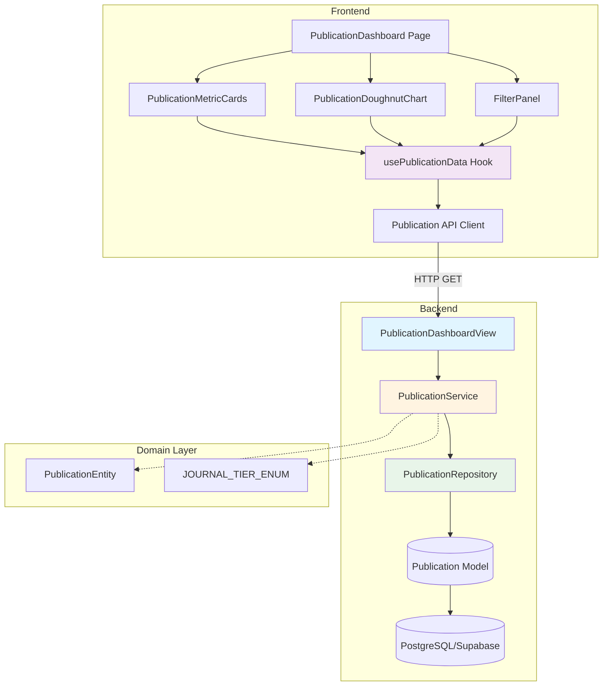

# 논문 실적 대시보드 구현 계획 (TDD 기반)

**기능 ID:** 004
**기능명:** 논문 실적 시각화
**우선순위:** P0-MVP
**작성일:** 2025-11-02
**버전:** 1.0

---

## 1. 개요

### 1.1 모듈 목록

본 구현 계획은 **TDD(Test-Driven Development) 원칙**에 따라 작성되었으며, Red-Green-Refactor 사이클을 기반으로 순차적 개발을 진행합니다.

#### Backend Modules
1. **Publication Model** (`backend/data_ingestion/infrastructure/models.py`)
   - 논문 데이터 스키마 정의
   - Test: Model validation, constraints

2. **Publication Repository** (`backend/data_ingestion/infrastructure/repositories.py`)
   - 데이터 접근 로직 (Django ORM)
   - Test: Query correctness, filtering logic

3. **Publication Service** (`backend/data_ingestion/services/publication_service.py`)
   - 비즈니스 로직 및 집계
   - Test: Business rules, aggregation accuracy

4. **Publication API View** (`backend/data_ingestion/api/views.py`)
   - DRF ViewSet (Thin Controller)
   - Test: HTTP responses, serialization

5. **Publication Serializer** (`backend/data_ingestion/api/serializers.py`)
   - Request/Response contract
   - Test: Data validation, format

#### Frontend Modules
6. **Publication Data Types** (`frontend/src/types/domain.ts`)
   - TypeScript interfaces
   - Test: Type safety (compile-time)

7. **Publication API Client** (`frontend/src/api/publicationApi.ts`)
   - Backend 통신 계층
   - Test: API call mocking, error handling

8. **usePublicationData Hook** (`frontend/src/hooks/usePublicationData.ts`)
   - 상태 관리 및 데이터 fetching
   - Test: State transitions, caching

9. **PublicationDoughnutChart Component** (`frontend/src/components/dashboard/PublicationDoughnutChart.tsx`)
   - Recharts Doughnut Chart
   - Test: Rendering, Tooltip, Empty state

10. **PublicationMetricCards Component** (`frontend/src/components/dashboard/PublicationMetricCards.tsx`)
    - 총 논문 수, 평균 IF 카드
    - Test: Data display, formatting

#### Shared/Common
11. **Constants** (`backend/data_ingestion/domain/constants.py`, `frontend/src/constants/publications.ts`)
    - 저널등급 Enum, 색상 매핑
    - Test: Value consistency

### 1.2 TDD 적용 범위

**Test Pyramid (70% Unit / 20% Integration / 10% E2E)**

- **Unit Tests (70%):**
  - Service Layer: 비즈니스 로직 (집계, 평균 계산, 필터링)
  - Repository Layer: ORM 쿼리 정확성
  - Frontend Hooks: 상태 전이 로직
  - API Client: Mocking 기반 단위 테스트

- **Integration Tests (20%):**
  - API Endpoint: DRF View → Service → Repository 전체 플로우
  - Frontend: Hook + API Client 통합

- **Acceptance Tests (10%):**
  - E2E: Playwright 기반 사용자 시나리오

---

## 2. Architecture Diagram



---

## 3. Implementation Plan

### Module 1: Publication Model

**Location:** `backend/data_ingestion/infrastructure/models.py`

**Responsibility:**
- Django ORM 모델 정의
- DB 테이블 스키마 매핑
- 기본 제약 조건 (NOT NULL, PK, Choices)

**Test Strategy:** Unit Tests

**Test Scenarios (Red Phase):**

```python
# tests/test_models.py

class PublicationModelTestCase(TestCase):
    """Publication 모델 단위 테스트"""

    def test_create_publication_with_valid_data(self):
        """유효한 데이터로 Publication 생성 시 성공"""
        # GIVEN: 유효한 논문 데이터
        publication = Publication(
            paper_id='P001',
            department='컴퓨터공학과',
            journal_tier='SCIE',
            impact_factor=3.5
        )

        # WHEN: 저장 시도
        publication.save()

        # THEN: DB에 저장 성공
        saved = Publication.objects.get(paper_id='P001')
        self.assertEqual(saved.journal_tier, 'SCIE')
        self.assertEqual(saved.impact_factor, 3.5)

    def test_impact_factor_can_be_null(self):
        """Impact Factor가 NULL일 수 있음"""
        # GIVEN: IF가 없는 논문
        publication = Publication(
            paper_id='P002',
            department='전자공학과',
            journal_tier='KCI',
            impact_factor=None
        )

        # WHEN: 저장
        publication.save()

        # THEN: NULL 허용
        saved = Publication.objects.get(paper_id='P002')
        self.assertIsNone(saved.impact_factor)

    def test_journal_tier_choices_validation(self):
        """허용되지 않은 저널등급 입력 시 실패"""
        # GIVEN: 잘못된 저널등급
        publication = Publication(
            paper_id='P003',
            department='기계공학과',
            journal_tier='INVALID_TIER',  # 허용 안 됨
            impact_factor=2.0
        )

        # WHEN/THEN: ValidationError 발생
        with self.assertRaises(ValidationError):
            publication.full_clean()

    def test_duplicate_paper_id_raises_error(self):
        """중복 논문ID 입력 시 IntegrityError"""
        # GIVEN: 동일 PK를 가진 논문 2개
        Publication.objects.create(
            paper_id='P001',
            department='컴공',
            journal_tier='SCIE'
        )

        # WHEN/THEN: 중복 삽입 시도
        with self.assertRaises(IntegrityError):
            Publication.objects.create(
                paper_id='P001',  # 중복
                department='전자공',
                journal_tier='KCI'
            )

    def test_string_representation(self):
        """__str__ 메서드가 올바른 형식 반환"""
        # GIVEN
        publication = Publication.objects.create(
            paper_id='P001',
            department='컴공',
            journal_tier='SCIE'
        )

        # WHEN/THEN
        self.assertEqual(str(publication), 'P001 (SCIE)')
```

**Implementation Order (TDD Cycle):**
1. Red: 위 테스트 작성 → 모두 실패
2. Green: Model 클래스 구현 (최소 코드로 테스트 통과)
3. Refactor: 인덱스 추가, Meta 옵션 정리

**Dependencies:** None (Pure Django Model)

---

### Module 2: Publication Repository

**Location:** `backend/data_ingestion/infrastructure/repositories.py`

**Responsibility:**
- Publication 데이터 조회 전담 (Data Access Layer)
- 필터링 쿼리 로직
- Django ORM 직접 사용 (추상화 없음, MVP 간소화)

**Test Strategy:** Unit Tests

**Test Scenarios (Red Phase):**

```python
# tests/test_repositories.py

class PublicationRepositoryTestCase(TestCase):
    """PublicationRepository 단위 테스트"""

    def setUp(self):
        """테스트 데이터 준비"""
        self.repo = PublicationRepository()

        # SCIE 논문 5편
        for i in range(5):
            Publication.objects.create(
                paper_id=f'SCIE_{i}',
                department='컴퓨터공학과',
                journal_tier='SCIE',
                impact_factor=3.0 + i * 0.5
            )

        # KCI 논문 3편
        for i in range(3):
            Publication.objects.create(
                paper_id=f'KCI_{i}',
                department='컴퓨터공학과',
                journal_tier='KCI',
                impact_factor=1.0 + i * 0.2
            )

    def test_get_all_publications(self):
        """전체 논문 조회"""
        # WHEN
        queryset = self.repo.get_publications_by_filter()

        # THEN
        self.assertEqual(queryset.count(), 8)

    def test_filter_by_department(self):
        """학과 필터링"""
        # GIVEN: 다른 학과 논문 추가
        Publication.objects.create(
            paper_id='OTHER_1',
            department='전자공학과',
            journal_tier='SCIE'
        )

        # WHEN: 컴공만 필터링
        queryset = self.repo.get_publications_by_filter(department='컴퓨터공학과')

        # THEN: 8편만 조회 (전자공 제외)
        self.assertEqual(queryset.count(), 8)

    def test_filter_by_journal_tier(self):
        """저널등급 필터링"""
        # WHEN: SCIE만 필터링
        queryset = self.repo.get_publications_by_filter(journal_tier='SCIE')

        # THEN: 5편만 조회
        self.assertEqual(queryset.count(), 5)

    def test_filter_by_department_and_tier(self):
        """학과 + 저널등급 복합 필터링 (AND 조건)"""
        # GIVEN
        Publication.objects.create(
            paper_id='OTHER_2',
            department='전자공학과',
            journal_tier='SCIE'
        )

        # WHEN: 컴공 + SCIE
        queryset = self.repo.get_publications_by_filter(
            department='컴퓨터공학과',
            journal_tier='SCIE'
        )

        # THEN: 5편 (전자공 SCIE 제외)
        self.assertEqual(queryset.count(), 5)

    def test_get_all_departments(self):
        """전체 학과 목록 조회 (중복 제거)"""
        # GIVEN
        Publication.objects.create(
            paper_id='OTHER_3',
            department='전자공학과',
            journal_tier='KCI'
        )

        # WHEN
        departments = self.repo.get_all_departments()

        # THEN
        self.assertEqual(set(departments), {'컴퓨터공학과', '전자공학과'})
```

**Implementation Order:**
1. Red: 테스트 작성 → 실패
2. Green: Repository 메서드 구현
3. Refactor: 쿼리 최적화 (select_related, prefetch_related 불필요하지만 확인)

**Dependencies:** Publication Model

---

### Module 3: Publication Service

**Location:** `backend/data_ingestion/services/publication_service.py`

**Responsibility:**
- 비즈니스 로직: 집계, 평균 계산, 비율 계산
- 입력 검증 (학과/저널등급 화이트리스트)
- Repository를 통한 데이터 조회

**Test Strategy:** Unit Tests (핵심 비즈니스 로직)

**Test Scenarios (Red Phase):**

```python
# tests/test_services.py

class PublicationServiceTestCase(TestCase):
    """PublicationService 비즈니스 로직 테스트"""

    def setUp(self):
        """테스트 데이터 준비"""
        self.service = PublicationService()

        # SCIE 3편 (IF: 3.0, 4.0, 5.0)
        Publication.objects.create(
            paper_id='S1', department='컴공',
            journal_tier='SCIE', impact_factor=3.0
        )
        Publication.objects.create(
            paper_id='S2', department='컴공',
            journal_tier='SCIE', impact_factor=4.0
        )
        Publication.objects.create(
            paper_id='S3', department='컴공',
            journal_tier='SCIE', impact_factor=5.0
        )

        # KCI 2편 (IF: 1.0, 1.5)
        Publication.objects.create(
            paper_id='K1', department='컴공',
            journal_tier='KCI', impact_factor=1.0
        )
        Publication.objects.create(
            paper_id='K2', department='컴공',
            journal_tier='KCI', impact_factor=1.5
        )

    def test_get_distribution_calculates_percentages_correctly(self):
        """저널 등급별 비율 계산 정확성"""
        # WHEN
        result = self.service.get_distribution()

        # THEN: 총 5편 (SCIE 3편 = 60%, KCI 2편 = 40%)
        self.assertEqual(result['total_papers'], 5)

        distribution = {item['journal_tier']: item for item in result['distribution']}
        self.assertAlmostEqual(distribution['SCIE']['percentage'], 60.0, places=1)
        self.assertAlmostEqual(distribution['KCI']['percentage'], 40.0, places=1)

    def test_get_distribution_calculates_avg_if_correctly(self):
        """평균 Impact Factor 계산 정확성"""
        # WHEN
        result = self.service.get_distribution()

        # THEN: 전체 평균 = (3+4+5+1+1.5)/5 = 2.9
        self.assertAlmostEqual(result['avg_impact_factor'], 2.9, places=2)

        # 등급별 평균
        distribution = {item['journal_tier']: item for item in result['distribution']}
        self.assertAlmostEqual(distribution['SCIE']['avg_if'], 4.0, places=2)  # (3+4+5)/3
        self.assertAlmostEqual(distribution['KCI']['avg_if'], 1.25, places=2)  # (1+1.5)/2

    def test_avg_if_excludes_null_values(self):
        """NULL IF는 평균 계산에서 제외"""
        # GIVEN: IF 없는 논문 추가
        Publication.objects.create(
            paper_id='N1', department='컴공',
            journal_tier='SCIE', impact_factor=None
        )

        # WHEN
        result = self.service.get_distribution()

        # THEN: 총 6편이지만 평균은 5편 기준
        self.assertEqual(result['total_papers'], 6)
        self.assertEqual(result['papers_with_if'], 5)
        self.assertAlmostEqual(result['avg_impact_factor'], 2.9, places=2)

    def test_all_null_if_returns_none(self):
        """모든 논문 IF가 NULL일 때 평균 None 반환"""
        # GIVEN: 모든 IF를 NULL로 변경
        Publication.objects.update(impact_factor=None)

        # WHEN
        result = self.service.get_distribution()

        # THEN
        self.assertIsNone(result['avg_impact_factor'])
        self.assertEqual(result['papers_with_if'], 0)

    def test_filter_by_department_applies_correctly(self):
        """학과 필터 적용 검증"""
        # GIVEN: 다른 학과 논문 추가
        Publication.objects.create(
            paper_id='E1', department='전자공',
            journal_tier='SCIE', impact_factor=2.0
        )

        # WHEN: 컴공만 필터링
        result = self.service.get_distribution(department='컴공')

        # THEN: 5편만 (전자공 제외)
        self.assertEqual(result['total_papers'], 5)

    def test_invalid_journal_tier_raises_validation_error(self):
        """허용되지 않은 저널등급 입력 시 ValidationError"""
        # WHEN/THEN
        with self.assertRaises(ValidationError) as ctx:
            self.service.get_distribution(journal_tier='INVALID')

        self.assertIn('유효하지 않은 저널등급', str(ctx.exception))

    def test_invalid_department_raises_validation_error(self):
        """존재하지 않는 학과 입력 시 ValidationError"""
        # WHEN/THEN
        with self.assertRaises(ValidationError) as ctx:
            self.service.get_distribution(department='존재하지않는학과')

        self.assertIn('존재하지 않는 학과', str(ctx.exception))

    def test_empty_dataset_returns_zero_values(self):
        """데이터 없을 때 0 반환"""
        # GIVEN: 모든 데이터 삭제
        Publication.objects.all().delete()

        # WHEN
        result = self.service.get_distribution()

        # THEN
        self.assertEqual(result['total_papers'], 0)
        self.assertIsNone(result['avg_impact_factor'])
        self.assertEqual(len(result['distribution']), 0)
```

**Edge Cases (추가 테스트):**

```python
def test_single_paper_displays_100_percent(self):
    """논문 1편만 있을 때 100% 표시"""
    # GIVEN
    Publication.objects.all().delete()
    Publication.objects.create(
        paper_id='ONLY_ONE', department='컴공',
        journal_tier='SCIE', impact_factor=3.0
    )

    # WHEN
    result = self.service.get_distribution()

    # THEN
    self.assertEqual(result['total_papers'], 1)
    self.assertEqual(result['distribution'][0]['percentage'], 100.0)

def test_percentage_sum_is_100(self):
    """비율 합계가 100% (반올림 오차 ±0.1 허용)"""
    # WHEN
    result = self.service.get_distribution()

    # THEN
    total_percentage = sum(item['percentage'] for item in result['distribution'])
    self.assertAlmostEqual(total_percentage, 100.0, delta=0.1)
```

**Implementation Order:**
1. Red: 테스트 작성
2. Green: Service 메서드 구현
3. Refactor: 집계 로직 최적화, 메서드 분리

**Dependencies:** PublicationRepository

---

### Module 4: Publication API View

**Location:** `backend/data_ingestion/api/views.py`

**Responsibility:**
- HTTP 요청 처리 (Thin Controller)
- Service Layer 호출
- 에러 핸들링 및 HTTP 응답

**Test Strategy:** Integration Tests (API 엔드포인트)

**Test Scenarios (Red Phase):**

```python
# tests/test_api.py

class PublicationAPITestCase(APITestCase):
    """Publication API 통합 테스트"""

    def setUp(self):
        """테스트 데이터 준비"""
        Publication.objects.create(
            paper_id='P1', department='컴공',
            journal_tier='SCIE', impact_factor=3.5
        )
        Publication.objects.create(
            paper_id='P2', department='컴공',
            journal_tier='KCI', impact_factor=1.2
        )

    def test_get_publications_distribution_success(self):
        """GET /api/dashboard/publications/ 정상 응답"""
        # WHEN
        response = self.client.get('/api/dashboard/publications/')

        # THEN
        self.assertEqual(response.status_code, 200)
        data = response.json()

        self.assertTrue(data['success'])
        self.assertEqual(data['data']['total_papers'], 2)
        self.assertIsNotNone(data['data']['avg_impact_factor'])
        self.assertEqual(len(data['data']['distribution']), 2)

    def test_filter_by_department_query_param(self):
        """department 쿼리 파라미터 필터링"""
        # GIVEN: 다른 학과 논문 추가
        Publication.objects.create(
            paper_id='P3', department='전자공',
            journal_tier='SCIE', impact_factor=2.0
        )

        # WHEN
        response = self.client.get('/api/dashboard/publications/?department=컴공')

        # THEN
        self.assertEqual(response.status_code, 200)
        data = response.json()['data']
        self.assertEqual(data['total_papers'], 2)  # 전자공 제외

    def test_filter_by_journal_tier_query_param(self):
        """journal_tier 쿼리 파라미터 필터링"""
        # WHEN
        response = self.client.get('/api/dashboard/publications/?journal_tier=SCIE')

        # THEN
        self.assertEqual(response.status_code, 200)
        data = response.json()['data']
        self.assertEqual(data['total_papers'], 1)  # SCIE만

    def test_invalid_department_returns_400(self):
        """잘못된 학과명 입력 시 400 Bad Request"""
        # WHEN
        response = self.client.get('/api/dashboard/publications/?department=존재하지않는학과')

        # THEN
        self.assertEqual(response.status_code, 400)
        error = response.json()
        self.assertEqual(error['error'], 'ERR_PUB_001')
        self.assertIn('잘못된 학과명', error['message'])

    def test_invalid_journal_tier_returns_400(self):
        """잘못된 저널등급 입력 시 400 Bad Request"""
        # WHEN
        response = self.client.get('/api/dashboard/publications/?journal_tier=INVALID')

        # THEN
        self.assertEqual(response.status_code, 400)
        error = response.json()
        self.assertEqual(error['error'], 'ERR_PUB_002')

    def test_no_data_returns_404(self):
        """데이터 없을 때 404 Not Found"""
        # GIVEN: 모든 데이터 삭제
        Publication.objects.all().delete()

        # WHEN
        response = self.client.get('/api/dashboard/publications/')

        # THEN
        self.assertEqual(response.status_code, 404)
        error = response.json()
        self.assertEqual(error['error'], 'ERR_PUB_003')

    def test_response_includes_last_updated_timestamp(self):
        """응답에 last_updated 포함"""
        # WHEN
        response = self.client.get('/api/dashboard/publications/')

        # THEN
        data = response.json()['data']
        self.assertIn('last_updated', data)
        # ISO 8601 형식 검증
        from datetime import datetime
        datetime.fromisoformat(data['last_updated'].replace('Z', '+00:00'))
```

**Implementation Order:**
1. Red: API 테스트 작성
2. Green: View 구현 (Service 호출)
3. Refactor: 에러 핸들링 개선

**Dependencies:** PublicationService, PublicationSerializer

---

### Module 5: Publication Serializer

**Location:** `backend/data_ingestion/api/serializers.py`

**Responsibility:**
- API 응답 데이터 직렬화
- 데이터 형식 검증

**Test Strategy:** Unit Tests

**Test Scenarios (Red Phase):**

```python
# tests/test_serializers.py

class PublicationDashboardSerializerTestCase(TestCase):
    """PublicationDashboardSerializer 테스트"""

    def test_valid_data_serialization(self):
        """유효한 데이터 직렬화"""
        # GIVEN
        data = {
            'total_papers': 156,
            'avg_impact_factor': 2.3,
            'papers_with_if': 145,
            'distribution': [
                {
                    'journal_tier': 'SCIE',
                    'count': 89,
                    'percentage': 57.1,
                    'avg_if': 3.2
                }
            ],
            'last_updated': '2025-11-02T14:35:22Z'
        }

        # WHEN
        serializer = PublicationDashboardSerializer(data=data)

        # THEN
        self.assertTrue(serializer.is_valid())

    def test_missing_required_field_raises_error(self):
        """필수 필드 누락 시 ValidationError"""
        # GIVEN: total_papers 누락
        data = {
            'avg_impact_factor': 2.3,
            'distribution': []
        }

        # WHEN
        serializer = PublicationDashboardSerializer(data=data)

        # THEN
        self.assertFalse(serializer.is_valid())
        self.assertIn('total_papers', serializer.errors)
```

**Implementation Order:**
1. Red: 직렬화 테스트
2. Green: Serializer 클래스 작성
3. Refactor: 필드 validation 추가

**Dependencies:** None (DRF Serializers)

---

### Module 6-10: Frontend Modules

#### Module 6: Publication Data Types

**Location:** `frontend/src/types/domain.ts`

**Test Strategy:** TypeScript Compile-time Type Checking

```typescript
// types/domain.ts

export interface PublicationData {
  total_papers: number;
  avg_impact_factor: number | null;
  papers_with_if: number;
  distribution: PublicationDistributionItem[];
  last_updated: string;
}

export interface PublicationDistributionItem {
  journal_tier: 'SCIE' | 'KCI' | '기타';
  count: number;
  percentage: number;
  avg_if: number | null;
}
```

**Dependencies:** None

---

#### Module 7: Publication API Client

**Location:** `frontend/src/api/publicationApi.ts`

**Test Strategy:** Unit Tests (Mocking)

```typescript
// tests/publicationApi.test.ts

describe('PublicationApi', () => {
  it('fetchPublicationData calls correct endpoint', async () => {
    // GIVEN: Mock axios
    const mockGet = jest.spyOn(axios, 'get').mockResolvedValue({
      data: {
        success: true,
        data: mockPublicationData
      }
    });

    // WHEN
    const result = await fetchPublicationData({ department: 'all' });

    // THEN
    expect(mockGet).toHaveBeenCalledWith(
      '/api/dashboard/publications/',
      { params: { department: 'all' } }
    );
    expect(result).toEqual(mockPublicationData);
  });

  it('handles API error correctly', async () => {
    // GIVEN: API 에러
    jest.spyOn(axios, 'get').mockRejectedValue(new Error('Network error'));

    // WHEN/THEN
    await expect(fetchPublicationData({})).rejects.toThrow('Network error');
  });
});
```

**Dependencies:** axios

---

#### Module 8: usePublicationData Hook

**Location:** `frontend/src/hooks/usePublicationData.ts`

**Test Strategy:** Unit Tests (React Testing Library)

```typescript
// tests/usePublicationData.test.ts

describe('usePublicationData', () => {
  it('fetches data on mount', async () => {
    // GIVEN: Mock API
    const mockFetch = jest.fn().mockResolvedValue(mockPublicationData);

    // WHEN
    const { result, waitForNextUpdate } = renderHook(() =>
      usePublicationData({ department: 'all' })
    );

    // THEN: 초기 로딩 상태
    expect(result.current.isLoading).toBe(true);

    await waitForNextUpdate();

    // THEN: 데이터 로드 완료
    expect(result.current.isLoading).toBe(false);
    expect(result.current.data).toEqual(mockPublicationData);
  });

  it('updates data when filters change', async () => {
    // GIVEN
    const { result, rerender } = renderHook(
      ({ filters }) => usePublicationData(filters),
      { initialProps: { filters: { department: 'all' } } }
    );

    // WHEN: 필터 변경
    rerender({ filters: { department: '컴퓨터공학과' } });

    // THEN: API 재호출
    expect(mockFetch).toHaveBeenCalledWith({ department: '컴퓨터공학과' });
  });

  it('sets error state on API failure', async () => {
    // GIVEN: API 에러
    jest.spyOn(api, 'fetchPublicationData').mockRejectedValue(new Error('Failed'));

    // WHEN
    const { result, waitForNextUpdate } = renderHook(() => usePublicationData({}));
    await waitForNextUpdate();

    // THEN
    expect(result.current.error).toBeTruthy();
    expect(result.current.data).toBeNull();
  });
});
```

**Dependencies:** Publication API Client

---

#### Module 9: PublicationDoughnutChart Component

**Location:** `frontend/src/components/dashboard/PublicationDoughnutChart.tsx`

**Test Strategy:** Unit Tests (Jest + React Testing Library)

```typescript
// tests/PublicationDoughnutChart.test.tsx

describe('PublicationDoughnutChart', () => {
  it('renders chart with correct data', () => {
    // GIVEN
    const mockData: PublicationDistributionItem[] = [
      { journal_tier: 'SCIE', count: 89, percentage: 57.1, avg_if: 3.2 },
      { journal_tier: 'KCI', count: 67, percentage: 42.9, avg_if: 1.1 }
    ];

    // WHEN
    render(<PublicationDoughnutChart data={mockData} totalPapers={156} />);

    // THEN: 중앙 텍스트 표시
    expect(screen.getByText('총 156편')).toBeInTheDocument();

    // 범례 표시
    expect(screen.getByText('SCIE')).toBeInTheDocument();
    expect(screen.getByText('KCI')).toBeInTheDocument();
  });

  it('displays empty state when no data', () => {
    // WHEN
    render(<PublicationDoughnutChart data={[]} totalPapers={0} />);

    // THEN
    expect(screen.getByText(/논문 데이터가 없습니다/i)).toBeInTheDocument();
  });

  it('shows tooltip on hover', async () => {
    // GIVEN
    const mockData = [
      { journal_tier: 'SCIE', count: 89, percentage: 57.1, avg_if: 3.2 }
    ];

    render(<PublicationDoughnutChart data={mockData} totalPapers={89} />);

    // WHEN: 차트 섹션 호버
    const scieSection = screen.getByRole('graphics-symbol', { name: /SCIE/i });
    fireEvent.mouseEnter(scieSection);

    // THEN: Tooltip 표시
    await waitFor(() => {
      expect(screen.getByText(/평균 IF: 3.2/i)).toBeInTheDocument();
    });
  });

  it('displays single tier as 100% doughnut', () => {
    // GIVEN: SCIE만 존재
    const mockData = [
      { journal_tier: 'SCIE', count: 50, percentage: 100.0, avg_if: 3.0 }
    ];

    // WHEN
    render(<PublicationDoughnutChart data={mockData} totalPapers={50} />);

    // THEN: 100% 표시
    expect(screen.getByText('100%')).toBeInTheDocument();
  });
});
```

**Dependencies:** Recharts, usePublicationData Hook

---

#### Module 10: PublicationMetricCards Component

**Location:** `frontend/src/components/dashboard/PublicationMetricCards.tsx`

**Test Strategy:** Unit Tests

```typescript
// tests/PublicationMetricCards.test.tsx

describe('PublicationMetricCards', () => {
  it('displays total papers count', () => {
    // WHEN
    render(<PublicationMetricCards totalPapers={156} avgImpactFactor={2.3} />);

    // THEN
    expect(screen.getByText('총 논문 수')).toBeInTheDocument();
    expect(screen.getByText('156편')).toBeInTheDocument();
  });

  it('displays average impact factor', () => {
    // WHEN
    render(<PublicationMetricCards totalPapers={156} avgImpactFactor={2.3} />);

    // THEN
    expect(screen.getByText('평균 Impact Factor')).toBeInTheDocument();
    expect(screen.getByText('2.3')).toBeInTheDocument();
  });

  it('shows "정보 없음" when avg IF is null', () => {
    // WHEN
    render(<PublicationMetricCards totalPapers={10} avgImpactFactor={null} />);

    // THEN
    expect(screen.getByText('정보 없음')).toBeInTheDocument();
  });
});
```

**Dependencies:** None (Presentational Component)

---

## 4. TDD Workflow

### 4.1 시작: Red Phase

**첫 번째 테스트 시나리오 (가장 기본적인 기능)**

```python
# tests/test_models.py
def test_create_publication_with_valid_data(self):
    """유효한 데이터로 Publication 생성 시 성공"""
    publication = Publication(
        paper_id='P001',
        department='컴퓨터공학과',
        journal_tier='SCIE',
        impact_factor=3.5
    )
    publication.save()

    saved = Publication.objects.get(paper_id='P001')
    self.assertEqual(saved.journal_tier, 'SCIE')
```

**실행:** `python manage.py test tests.test_models.PublicationModelTestCase.test_create_publication_with_valid_data`

**결과:** FAILED (Model 아직 구현 안 됨)

---

### 4.2 Green Phase

**최소 구현 (테스트 통과시키기)**

```python
# backend/data_ingestion/infrastructure/models.py

from django.db import models

class Publication(models.Model):
    JOURNAL_TIER_CHOICES = [
        ('SCIE', 'SCIE'),
        ('KCI', 'KCI'),
        ('기타', '기타'),
    ]

    paper_id = models.CharField(max_length=50, primary_key=True)
    department = models.CharField(max_length=100)
    journal_tier = models.CharField(max_length=20, choices=JOURNAL_TIER_CHOICES)
    impact_factor = models.FloatField(null=True, blank=True)
    created_at = models.DateTimeField(auto_now_add=True)
    updated_at = models.DateTimeField(auto_now=True)

    class Meta:
        db_table = 'publications'

    def __str__(self):
        return f"{self.paper_id} ({self.journal_tier})"
```

**실행:** 테스트 통과 확인

---

### 4.3 Refactor Phase

**코드 개선 (테스트는 여전히 통과)**

```python
# 인덱스 추가, Meta 옵션 정리

class Publication(models.Model):
    # ... (필드 동일)

    class Meta:
        db_table = 'publications'
        verbose_name = '논문'
        verbose_name_plural = '논문 목록'
        ordering = ['-created_at']
        indexes = [
            models.Index(fields=['department'], name='idx_pub_dept'),
            models.Index(fields=['journal_tier'], name='idx_pub_tier'),
        ]
```

**실행:** 모든 테스트 여전히 통과

---

### 4.4 순차적 구현 (모듈별)

**구현 순서:**

1. **Backend (Inside-Out 전략)**
   - Model → Repository → Service → View → Serializer
   - 각 모듈마다 Red-Green-Refactor 사이클 반복

2. **Frontend (Outside-In 전략)**
   - Types → API Client → Hook → Components
   - Mock 데이터로 UI 먼저 구현 후 실제 API 연동

---

### 4.5 Commit 포인트 제안

**Small Commits (각 Green Phase 완료 시)**

1. `feat(backend): Add Publication model with tests`
2. `feat(backend): Implement PublicationRepository with filtering tests`
3. `feat(backend): Add PublicationService business logic and tests`
4. `feat(backend): Implement Publication API endpoint with integration tests`
5. `feat(frontend): Add Publication TypeScript types`
6. `feat(frontend): Implement Publication API client with tests`
7. `feat(frontend): Add usePublicationData hook with tests`
8. `feat(frontend): Implement PublicationDoughnutChart component with tests`
9. `feat(frontend): Add PublicationMetricCards component with tests`
10. `test(e2e): Add Publication dashboard E2E tests`

---

### 4.6 완료 조건

**Definition of Done:**

- [ ] 모든 Unit Tests 통과 (70% 이상 커버리지)
- [ ] Integration Tests 통과 (API 엔드포인트)
- [ ] E2E Acceptance Tests 통과 (Playwright)
- [ ] Refactoring 완료 (중복 코드 제거, 네이밍 정리)
- [ ] Code Review 완료
- [ ] 문서 업데이트 (API 스펙, 컴포넌트 README)

---

## 5. QA Sheet (Presentation Layer)

### 5.1 Manual Test Scenarios

#### Scenario 1: 기본 데이터 로드
- [ ] 브라우저에서 대시보드 접속
- [ ] 논문 실적 Doughnut Chart 렌더링 확인
- [ ] Metric Card에 총 논문 수, 평균 IF 표시 확인
- [ ] 차트 색상이 SCIE(진한 파랑), KCI(연한 파랑)로 표시됨

#### Scenario 2: 학과 필터링
- [ ] 학과 드롭다운에서 "컴퓨터공학과" 선택
- [ ] 차트가 해당 학과 데이터로 업데이트됨
- [ ] Metric Card 수치 변경 확인
- [ ] "전체 보기" 버튼 클릭 시 초기화

#### Scenario 3: Tooltip 인터랙션
- [ ] 마우스를 SCIE 섹션에 올림
- [ ] Tooltip에 "SCIE: XX편 (YY%), 평균 IF: ZZ" 표시
- [ ] 다른 섹션으로 이동 시 Tooltip 업데이트

#### Scenario 4: Empty State
- [ ] DB에서 논문 데이터 전체 삭제 (또는 필터 결과 없음)
- [ ] "논문 데이터가 없습니다" 메시지 표시
- [ ] "전체 보기" 버튼 안내

#### Scenario 5: Error Handling
- [ ] 백엔드 서버 중단
- [ ] "데이터를 불러올 수 없습니다" 에러 카드 표시
- [ ] "새로고침" 버튼 동작 확인

#### Scenario 6: Performance
- [ ] 10,000건 이상 논문 데이터 로드
- [ ] 차트 렌더링 시간 1초 이내 확인
- [ ] 필터 변경 후 리렌더링 300ms 이내

---

## 6. 보안 요구사항

### 6.1 API 인증
- **관리자 API Key 검증:** DRF 미들웨어에서 `X-Admin-Key` 헤더 검증
- **환경 변수 기반:** `ADMIN_API_KEY` 환경 변수 사용 (코드에 하드코딩 금지)

### 6.2 입력 검증
- **화이트리스트 기반:** 학과명, 저널등급 허용 목록 검증
- **SQL Injection 방어:** Django ORM 사용 (Parameterized Queries)
- **최대 길이 검증:** 학과명 100자, 논문ID 50자 제한

**Test Scenarios:**
```python
def test_xss_prevention_in_department_filter():
    """학과 필터에 XSS 시도 시 차단"""
    response = self.client.get('/api/dashboard/publications/?department=<script>alert("XSS")</script>')
    assert response.status_code == 400
    assert 'ERR_PUB_001' in response.json()['error']

def test_sql_injection_prevention():
    """SQL Injection 시도 차단"""
    response = self.client.get('/api/dashboard/publications/?department=\'; DROP TABLE publications; --')
    assert response.status_code == 400
```

### 6.3 XSS 방어
- **React 기본 이스케이프:** JSX 렌더링 시 자동 이스케이프 활용
- **dangerouslySetInnerHTML 금지:** 사용자 입력 직접 렌더링 금지
- **DRF Serializer 이스케이프:** JSON 응답 자동 이스케이프

### 6.4 CSRF 방어
- **Django CSRF 미들웨어:** `django.middleware.csrf.CsrfViewMiddleware` 활성화
- **DRF 기본 설정:** API 엔드포인트는 CSRF 토큰 검증 (설정 확인 필요)

---

## 7. 에러 코드 명세

### 7.1 표준 에러 응답 형식

모든 에러는 다음 JSON 구조로 반환:

```json
{
  "error": "ERR_PUB_XXX",
  "message": "사용자 친화적 에러 메시지 (한글)",
  "details": "상세 정보 (선택적)",
  "timestamp": "2025-11-02T14:35:22Z"
}
```

### 7.2 에러 코드 매핑

| HTTP Status | Error Code | 발생 상황 | 메시지 예시 | 프론트엔드 처리 |
|-------------|------------|----------|-----------|--------------|
| 400 | ERR_PUB_001 | 잘못된 학과명 입력 | "유효하지 않은 학과명입니다" | 필터 초기화 버튼 표시 |
| 400 | ERR_PUB_002 | 잘못된 저널등급 입력 | "허용되지 않은 저널등급입니다" | 허용값 안내 (SCIE, KCI, 기타) |
| 400 | ERR_PUB_003 | 필수 파라미터 누락 | "필수 파라미터가 누락되었습니다" | 요청 재시도 |
| 404 | ERR_PUB_004 | 조건에 해당하는 데이터 없음 | "조건에 맞는 논문 데이터가 없습니다" | Empty State 표시 + 필터 초기화 안내 |
| 500 | ERR_PUB_500 | 서버 내부 오류 | "서버 오류가 발생했습니다" | "잠시 후 다시 시도하세요" 안내 |

### 7.3 에러 처리 테스트 시나리오

```python
# tests/test_api_errors.py

def test_error_response_structure():
    """에러 응답이 표준 구조를 따르는지 검증"""
    response = self.client.get('/api/dashboard/publications/?journal_tier=INVALID')

    assert response.status_code == 400
    data = response.json()
    assert 'error' in data
    assert 'message' in data
    assert 'timestamp' in data
    assert data['error'] == 'ERR_PUB_002'

def test_all_error_codes_have_korean_messages():
    """모든 에러 코드가 한글 메시지를 가지는지 검증"""
    error_codes = ['ERR_PUB_001', 'ERR_PUB_002', 'ERR_PUB_003', 'ERR_PUB_004', 'ERR_PUB_500']

    for code in error_codes:
        message = ERROR_MESSAGES.get(code)
        assert message is not None
        assert any(ord(char) >= 0xAC00 and ord(char) <= 0xD7A3 for char in message)  # 한글 포함 검증
```

---

## 8. 프론트엔드 에러 표시 UI

### 8.1 ErrorBoundary Component

**Location:** `frontend/src/components/ui/ErrorBoundary.tsx`

**Responsibility:**
- React 컴포넌트 렌더링 에러 캐치
- 사용자 친화적 폴백 UI 표시
- 에러 로그 기록 (POST-MVP: Sentry 연동)

**Test Scenarios:**
```typescript
describe('ErrorBoundary', () => {
  it('catches rendering errors and shows fallback UI', () => {
    const ThrowError = () => { throw new Error('Test error'); };

    render(
      <ErrorBoundary>
        <ThrowError />
      </ErrorBoundary>
    );

    expect(screen.getByText('문제가 발생했습니다')).toBeInTheDocument();
    expect(screen.getByText('새로고침')).toBeInTheDocument();
  });
});
```

### 8.2 ChartErrorCard Component

**Location:** `frontend/src/components/dashboard/ChartErrorCard.tsx`

**Responsibility:**
- 차트 로딩 실패 시 에러 카드 표시
- 재시도 버튼 제공
- 에러 타입별 아이콘 및 안내 메시지

**Props:**
```typescript
interface ChartErrorCardProps {
  errorCode: string;  // 'ERR_PUB_001', 'ERR_PUB_004' 등
  message: string;
  onRetry: () => void;
}
```

**Test Scenarios:**
```typescript
describe('ChartErrorCard', () => {
  it('displays error message with retry button', () => {
    const mockRetry = jest.fn();

    render(
      <ChartErrorCard
        errorCode="ERR_PUB_004"
        message="조건에 맞는 논문 데이터가 없습니다"
        onRetry={mockRetry}
      />
    );

    expect(screen.getByText('조건에 맞는 논문 데이터가 없습니다')).toBeInTheDocument();

    const retryButton = screen.getByText('다시 시도');
    fireEvent.click(retryButton);

    expect(mockRetry).toHaveBeenCalled();
  });
});
```

### 8.3 ErrorToast Component

**Location:** `frontend/src/components/ui/ErrorToast.tsx`

**Responsibility:**
- 일시적 에러 메시지 토스트 표시
- 3초 후 자동 사라짐
- 우측 상단 슬라이드 인 애니메이션

**Usage:**
```typescript
// hooks/usePublicationData.ts
import { showErrorToast } from '../components/ui/ErrorToast';

const fetchData = async () => {
  try {
    // API 호출
  } catch (error) {
    if (error.response?.status === 400) {
      showErrorToast(error.response.data.message);
    } else {
      showErrorToast('네트워크 오류가 발생했습니다');
    }
  }
};
```

---

## 9. 핵심 원칙 준수 체크리스트

### TDD Principles
- [x] **Test First:** 모든 모듈에 대해 테스트 먼저 작성
- [x] **Small Steps:** 한 번에 하나의 시나리오만 구현
- [x] **Red-Green-Refactor:** 각 사이클 명확히 구분
- [x] **FIRST:** Fast, Independent, Repeatable, Self-validating, Timely

### Test Pyramid
- [x] **Unit Tests 70%:** Service, Repository, Hook, Component
- [x] **Integration Tests 20%:** API Endpoint (View ↔ Service ↔ Repository)
- [x] **Acceptance Tests 10%:** E2E Playwright

### MVP Constraints
- [x] **간결한 구조:** 불필요한 추상화 배제 (Repository에 인터페이스 없음)
- [x] **당장 필요한 것만:** 복잡한 차트 인터랙션 제외 (기본 Tooltip만)
- [x] **쉬운 인프라:** Django ORM 직접 사용, Recharts 기본 설정

### Security Requirements
- [x] **API 인증:** X-Admin-Key 헤더 검증
- [x] **입력 검증:** 화이트리스트 기반, 최대 길이 검증
- [x] **XSS 방어:** React 이스케이프, dangerouslySetInnerHTML 금지
- [x] **CSRF 방어:** Django CSRF 미들웨어 활성화

---

## 10. Risk & Mitigation

### Risk 1: Recharts 렌더링 성능 이슈
- **완화 방안:** React.memo로 불필요한 리렌더링 방지, 데이터 1000건 이하로 제한

### Risk 2: NULL Impact Factor 처리 누락
- **완화 방안:** Service Layer에서 명시적 NULL 처리 테스트, 프론트엔드에서도 검증

### Risk 3: 비율 계산 반올림 오차
- **완화 방안:** 소수점 1자리로 반올림, 합계 99.9~100.1% 허용 범위 설정

---

## 문서 승인 및 검토

**작성자:** Plan Writer Agent
**검토자:** CTO
**승인일:** 2025-11-02
**현재 버전:** 1.0

본 구현 계획은 **TDD 원칙(Red-Green-Refactor)**을 엄격히 준수하며, Test Pyramid (Unit 70%, Integration 20%, Acceptance 10%)를 기반으로 작성되었습니다. MVP 범위에 맞춰 간결하면서도 확장 가능한 구조를 유지하고, 오버엔지니어링을 철저히 배제합니다.

---

**문서 끝**
