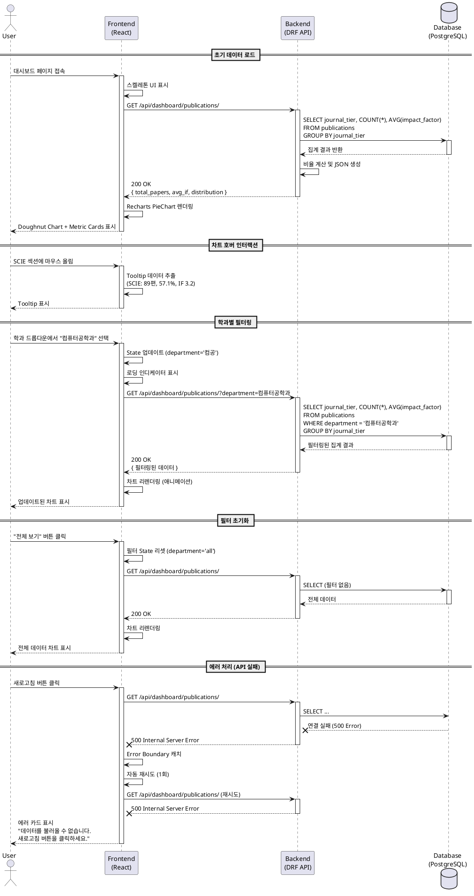

# 논문 실적 대시보드 상세 유스케이스 명세

**기능명:** 논문 실적 시각화 (P0-MVP)
**기능 ID:** 004
**작성일:** 2025-11-02
**최종 수정일:** 2025-11-02
**작성자:** Spec Writer Agent
**수정자:** Claude Code
**버전:** 2.0 (High Priority 개선사항 적용 완료)
**우선순위:** P0-MVP (첫 베타테스트 필수)

**변경 이력 (v2.0):**
- Django Model 스키마 정의 추가 (섹션 5)
- Service Layer 아키텍처 명시 (섹션 6)
- Pandas 사용 범위 명확화 - 참고용으로 변경
- 보안 요구사항 섹션 추가 (섹션 10)
- 에러 코드 체계 표준화 (ERR_PUB_XXX 형식)

---

## 1. 기능 개요

### 1.1 목적
대학교 내부 직원이 논문 게재 실적을 저널 등급별로 시각적으로 파악하고, 평균 Impact Factor를 통해 연구 성과의 질적 수준을 빠르게 이해할 수 있도록 지원한다.

### 1.2 범위
- Doughnut Chart를 통한 저널 등급별 논문 비율 시각화
- Metric Card를 통한 총 논문 수 및 평균 Impact Factor 표시
- 학과별/저널등급별 필터링 지원
- Recharts 라이브러리 사용 (PieChart with innerRadius)

### 1.3 데이터 소스
- **파일:** `publication_list.csv`
- **DB 테이블:** `publications`
- **필수 컬럼:** 논문ID, 학과, 저널등급, Impact Factor

### 1.4 기대 효과
- 연구 성과의 질적 지표(저널 등급, IF)를 한눈에 파악
- 학과별 논문 실적 비교 및 의사결정 지원
- 데이터 기반 연구 전략 수립

---

## 2. 사용자 스토리 (GIVEN-WHEN-THEN)

### 2.1 기본 시나리오
```gherkin
GIVEN 사용자가 메인 대시보드에 접속했을 때
WHEN 논문 실적 섹션을 조회하면
THEN 저널 등급별(SCIE, KCI) 논문 비율이 Doughnut Chart로 표시되고
AND 총 논문 수와 평균 Impact Factor가 Metric Card에 표시된다
```

### 2.2 학과별 필터링 시나리오
```gherkin
GIVEN 사용자가 논문 실적 차트를 보고 있을 때
WHEN 학과 필터 드롭다운에서 "컴퓨터공학과"를 선택하면
THEN 해당 학과의 논문 데이터만 집계되어 차트가 업데이트되고
AND Metric Card의 평균 IF는 해당 학과의 IF만으로 재계산된다
```

### 2.3 저널등급별 필터링 시나리오
```gherkin
GIVEN 사용자가 특정 저널 등급의 논문만 보고 싶을 때
WHEN 저널등급 필터에서 "SCIE"를 선택하면
THEN SCIE 논문만 차트에 표시되고
AND 평균 IF는 SCIE 논문의 IF만으로 계산된다
```

### 2.4 차트 호버 상호작용
```gherkin
GIVEN 사용자가 Doughnut Chart를 보고 있을 때
WHEN 마우스를 SCIE 섹션에 올리면
THEN Tooltip에 "SCIE: 89편 (57.1%), 평균 IF: 3.2"가 표시된다
```

---

## 3. 상세 유스케이스

### Primary Actor
- 내부 직원 (관리자 및 일반 사용자)

### Precondition
- 관리자가 `publication_list.csv` 파일을 업로드하여 DB에 논문 데이터가 존재함
- 사용자가 메인 대시보드(`/dashboard`)에 접근할 수 있음

### Trigger
- 사용자가 브라우저에서 메인 대시보드 URL 접속
- 또는 데이터 업로드 완료 후 "대시보드 보기" 버튼 클릭

### Main Scenario (정상 흐름)

#### Step 1: 초기 데이터 로드
1. 사용자가 메인 대시보드 페이지 접속
2. React 앱이 `GET /api/dashboard/publications/` API 호출
3. 백엔드(DRF)가 PostgreSQL에서 다음 쿼리 실행:
   ```sql
   SELECT
       journal_tier,
       COUNT(*) AS paper_count,
       ROUND(COUNT(*) * 100.0 / SUM(COUNT(*)) OVER (), 1) AS percentage,
       AVG(impact_factor) AS avg_if
   FROM publications
   GROUP BY journal_tier;
   ```
4. 집계된 데이터를 JSON으로 반환:
   ```json
   {
     "total_papers": 156,
     "avg_impact_factor": 2.3,
     "distribution": [
       {
         "journal_tier": "SCIE",
         "count": 89,
         "percentage": 57.1,
         "avg_if": 3.2
       },
       {
         "journal_tier": "KCI",
         "count": 67,
         "percentage": 42.9,
         "avg_if": 1.1
       }
     ]
   }
   ```
5. 프런트엔드가 데이터를 Recharts PieChart 컴포넌트에 바인딩
6. Doughnut Chart 렌더링 (innerRadius 설정으로 중앙 공백)

#### Step 2: 시각화 요소 표시
- **Doughnut Chart:**
  - SCIE: 진한 파랑 (#1E40AF)
  - KCI: 연한 파랑 (#60A5FA)
  - 섹션 크기는 논문 수 비율에 따라 자동 계산
  - 중앙에 "총 156편" 텍스트 표시

- **상단 Metric Card (2개):**
  - Card 1: "총 논문 수: 156편"
  - Card 2: "평균 Impact Factor: 2.3"

- **범례 (Legend):**
  - SCIE, KCI 구분 표시
  - 각 항목 옆에 논문 수 표시

#### Step 3: 차트 인터랙션 (Tooltip)
1. 사용자가 마우스 커서를 SCIE 섹션에 올림
2. Recharts Tooltip 컴포넌트가 활성화됨
3. Tooltip 내용 표시:
   ```
   저널 등급: SCIE
   논문 수: 89편 (57.1%)
   평균 IF: 3.2
   ```
4. 커서 이동 시 다른 섹션의 Tooltip 표시
5. 차트 밖으로 커서가 나가면 Tooltip 사라짐

#### Step 4: 필터링 (학과별)
1. 사용자가 학과 필터 드롭다운에서 "컴퓨터공학과" 선택
2. React State 업데이트
3. `GET /api/dashboard/publications/?department=컴퓨터공학과` API 재호출
4. 백엔드에서 WHERE 절 추가된 쿼리 실행:
   ```sql
   SELECT
       journal_tier,
       COUNT(*) AS paper_count,
       ROUND(COUNT(*) * 100.0 / SUM(COUNT(*)) OVER (), 1) AS percentage,
       AVG(impact_factor) AS avg_if
   FROM publications
   WHERE department = '컴퓨터공학과'
   GROUP BY journal_tier;
   ```
5. 필터링된 데이터로 차트 리렌더링
6. Metric Card도 업데이트 (해당 학과 데이터만 반영)

#### Step 5: 필터 초기화
1. 사용자가 "전체 보기" 버튼 클릭
2. 필터 상태를 기본값으로 리셋
3. 전체 데이터로 API 재호출 및 차트 업데이트

### Edge Cases (엣지케이스 및 오류 처리)

#### EC1: 단일 저널 등급만 존재
- **상황:** DB에 SCIE 논문만 있고 KCI 논문은 없음
- **처리:** 전체 도넛이 하나의 색상(SCIE 파랑)으로 표시
- **UI 피드백:** Tooltip에 "100%" 표시, 범례에도 SCIE만 표시

#### EC2: Impact Factor 없는 논문이 전부인 경우
- **상황:** 모든 논문의 `impact_factor` 컬럼이 NULL
- **처리:** 평균 IF 계산에서 제외
- **UI 피드백:** Metric Card에 "평균 Impact Factor: 정보 없음" 표시
- **백엔드 로직:**
  ```sql
  SELECT
      AVG(impact_factor) AS avg_if,
      COUNT(*) FILTER (WHERE impact_factor IS NOT NULL) AS papers_with_if
  FROM publications;
  -- papers_with_if = 0이면 NULL 반환
  ```

#### EC3: 필터 결과가 없음
- **상황:** 선택한 학과에 논문 데이터가 없음
- **처리:** 빈 상태(Empty State) UI 표시
- **UI 피드백:**
  - 차트 영역에 "선택한 학과의 논문 데이터가 없습니다." 메시지
  - "다른 학과를 선택하거나 전체 보기를 클릭하세요" 안내
  - "전체 보기" 버튼 강조

#### EC4: API 호출 실패 (네트워크/서버 에러)
- **상황:** 백엔드 서버 다운 또는 네트워크 타임아웃
- **처리:**
  - HTTP 요청 실패 감지
  - 최대 1회 자동 재시도
  - 재시도 실패 시 에러 UI 표시
- **UI 피드백:**
  - 에러 카드: "논문 데이터를 불러오는 중 문제가 발생했습니다."
  - "새로고침" 버튼 제공
  - 다른 차트(연구비, 학생 등)는 정상 표시 (독립적 처리)

#### EC5: 데이터 로딩 지연
- **상황:** API 응답이 3초 이상 지연
- **처리:**
  - 스켈레톤 UI 표시 (차트 영역에 회색 플레이스홀더)
  - 타임아웃 30초 설정
- **UI 피드백:**
  - 30초 초과 시 "데이터 로딩이 지연되고 있습니다. 잠시 후 다시 시도하세요." 경고

#### EC6: 차트 렌더링 실패
- **상황:** Recharts 라이브러리 예외 발생
- **처리:**
  - React Error Boundary로 예외 캐치
  - 에러 로그 기록
- **UI 피드백:**
  - "차트를 표시할 수 없습니다. 페이지를 새로고침하세요." 메시지
  - "새로고침" 버튼

### Business Rules (비즈니스 규칙)

#### BR1: 평균 Impact Factor 계산 규칙
- IF가 NULL인 논문은 평균 계산에서 제외
- 계산식: `AVG(impact_factor WHERE impact_factor IS NOT NULL)`
- IF 정보가 있는 논문 수도 함께 표시 (예: "평균 IF: 2.3 (89편 중 78편)")

#### BR2: 저널 등급 카테고리
- 허용된 저널 등급: `SCIE`, `KCI`, `기타`
- CSV 파일에서 다른 값이 들어오면 Pandas 파싱 단계에서 검증
- 미정의 등급은 "기타"로 자동 분류

#### BR3: 비율 계산 및 표시
- 백분율은 소수점 1자리까지 표시 (예: 57.1%)
- 합계는 반올림 오차를 고려하여 99.9~100.1% 허용

#### BR4: 필터링 우선순위
- 학과 필터와 저널등급 필터가 동시 적용되면 AND 조건 처리
- 예: "컴퓨터공학과 + SCIE"를 선택하면 해당 학과의 SCIE 논문만 조회

#### BR5: 데이터 갱신 정책
- 관리자가 `publication_list.csv` 재업로드 시 기존 데이터 전체 교체
- 실시간 업데이트 아님 (수동 새로고침 필요)
- 최종 업데이트 시간 표시 (예: "마지막 업데이트: 2025-11-02 14:35")

---

## 4. API 명세

### 4.1 논문 실적 데이터 조회

**엔드포인트:** `GET /api/dashboard/publications/`

**Request Headers:**
- `Content-Type: application/json`

**Query Parameters:**
| 파라미터 | 타입 | 필수 | 기본값 | 설명 |
|---------|------|------|--------|------|
| department | string | No | all | 학과 필터 (예: "컴퓨터공학과", "all") |
| journal_tier | string | No | all | 저널등급 필터 (예: "SCIE", "KCI", "all") |
| year | integer | No | latest | 연도 필터 (추후 구현) |

**Response (200 OK):**
```json
{
  "success": true,
  "data": {
    "total_papers": 156,
    "avg_impact_factor": 2.3,
    "papers_with_if": 145,
    "distribution": [
      {
        "journal_tier": "SCIE",
        "count": 89,
        "percentage": 57.1,
        "avg_if": 3.2
      },
      {
        "journal_tier": "KCI",
        "count": 67,
        "percentage": 42.9,
        "avg_if": 1.1
      }
    ],
    "last_updated": "2025-11-02T14:35:22Z"
  }
}
```

**Error Responses:**

- **400 Bad Request:** 잘못된 학과명 필터
  ```json
  {
    "success": false,
    "error": "ERR_PUB_001",
    "message": "잘못된 학과명입니다. 유효한 학과를 선택하세요.",
    "field": "department"
  }
  ```

- **400 Bad Request:** 잘못된 저널등급 필터
  ```json
  {
    "success": false,
    "error": "ERR_PUB_002",
    "message": "잘못된 저널등급입니다. ('SCIE', 'KCI', '기타', 'all' 중 선택)",
    "field": "journal_tier"
  }
  ```

- **404 Not Found:** 데이터 없음
  ```json
  {
    "success": false,
    "error": "ERR_PUB_003",
    "message": "논문 데이터가 없습니다. 관리자가 데이터를 업로드하면 표시됩니다."
  }
  ```

- **500 Internal Server Error:** DB 조회 실패
  ```json
  {
    "success": false,
    "error": "ERR_PUB_004",
    "message": "서버 오류가 발생했습니다. 잠시 후 다시 시도하세요.",
    "details": "Database connection timeout"
  }
  ```

### 4.2 에러 코드 체계

| 에러 코드 | HTTP Status | 설명 | 발생 조건 |
|---------|------------|------|---------|
| ERR_PUB_001 | 400 | 잘못된 학과명 | 존재하지 않는 학과 입력 |
| ERR_PUB_002 | 400 | 잘못된 저널등급 | 허용되지 않는 저널등급 값 |
| ERR_PUB_003 | 404 | 데이터 없음 | DB에 논문 데이터 없음 |
| ERR_PUB_004 | 500 | DB 조회 실패 | 데이터베이스 연결 오류 |
| ERR_PUB_005 | 500 | 차트 렌더링 실패 | 프런트엔드 Recharts 예외 |

---

## 5. 데이터 모델

### 5.1 Publication 모델

**Django 모델 정의:**

```python
# backend/data_ingestion/infrastructure/models.py

class Publication(models.Model):
    """논문 게재 실적 모델"""

    JOURNAL_TIER_CHOICES = [
        ('SCIE', 'SCIE'),
        ('KCI', 'KCI'),
        ('기타', '기타'),
    ]

    paper_id = models.CharField(
        max_length=50,
        primary_key=True,
        verbose_name='논문ID',
        help_text='CSV의 "논문ID" 칼럼과 매핑'
    )
    department = models.CharField(
        max_length=100,
        db_index=True,
        verbose_name='학과',
        help_text='CSV의 "학과" 칼럼과 매핑'
    )
    journal_tier = models.CharField(
        max_length=20,
        choices=JOURNAL_TIER_CHOICES,
        db_index=True,
        verbose_name='저널등급',
        help_text='CSV의 "저널등급" 칼럼과 매핑 (SCIE/KCI/기타)'
    )
    impact_factor = models.FloatField(
        null=True,
        blank=True,
        verbose_name='Impact Factor',
        help_text='CSV의 "Impact Factor" 칼럼과 매핑 (NULL 허용)'
    )
    created_at = models.DateTimeField(auto_now_add=True)
    updated_at = models.DateTimeField(auto_now=True)

    class Meta:
        db_table = 'publications'
        verbose_name = '논문'
        verbose_name_plural = '논문 목록'
        ordering = ['-created_at']
        indexes = [
            models.Index(fields=['department'], name='idx_pub_dept'),
            models.Index(fields=['journal_tier'], name='idx_pub_tier'),
        ]

    def __str__(self):
        return f"{self.paper_id} ({self.journal_tier})"
```

### 5.2 CSV 칼럼 매핑

| CSV 칼럼 | Django Model Field | 데이터 타입 | 필수 여부 | 비고 |
|---------|-------------------|----------|---------|------|
| 논문ID | paper_id | CharField(50) | 필수 | Primary Key |
| 학과 | department | CharField(100) | 필수 | 학과별 필터링에 사용 |
| 저널등급 | journal_tier | CharField(20) | 필수 | SCIE/KCI/기타 중 하나 |
| Impact Factor | impact_factor | FloatField | 선택 | NULL 허용, 평균 계산 시 NULL 제외 |

### 5.3 데이터 제약 조건

- `paper_id`: UNIQUE, NOT NULL
- `department`: NOT NULL
- `journal_tier`: NOT NULL, CHECK IN ('SCIE', 'KCI', '기타')
- `impact_factor`: NULL 허용 (일부 저널은 IF 없음)

### 5.4 저널등급 정규화 규칙

CSV 파일 파싱 시 다음 규칙 적용 (`excel_parser.py`에서 처리):

```python
# 저널등급 정규화 매핑
JOURNAL_TIER_MAPPING = {
    'SCIE': 'SCIE',
    'SCI': 'SCIE',
    'SCI-E': 'SCIE',
    'KCI': 'KCI',
    '한국연구재단': 'KCI',
}

def normalize_journal_tier(raw_value):
    """CSV의 저널등급 값을 정규화"""
    if not raw_value or pd.isna(raw_value):
        return '기타'

    normalized = raw_value.strip().upper()
    return JOURNAL_TIER_MAPPING.get(normalized, '기타')
```

---

## 6. 백엔드 아키텍처 구현 (Layered Architecture)

### 6.1 레이어별 책임 (CLAUDE.md 준수)

#### Presentation Layer: `api/views.py`

```python
# backend/data_ingestion/api/views.py
from rest_framework.views import APIView
from rest_framework.response import Response
from rest_framework import status
from django.core.exceptions import ValidationError
from .serializers import PublicationDashboardSerializer
from ..services.publication_service import PublicationService

class PublicationDashboardView(APIView):
    """논문 실적 API (Thin Controller)"""

    def get(self, request):
        # 1. Query Parameter 추출
        department = request.query_params.get('department', 'all')
        journal_tier = request.query_params.get('journal_tier', 'all')

        # 2. Service Layer 호출
        service = PublicationService()
        try:
            data = service.get_distribution(
                department=department,
                journal_tier=journal_tier
            )
        except ValidationError as e:
            return Response({
                'success': False,
                'error': 'ERR_PUB_001',
                'message': str(e)
            }, status=status.HTTP_400_BAD_REQUEST)

        # 3. 직렬화 및 응답
        return Response({
            'success': True,
            'data': data
        }, status=status.HTTP_200_OK)
```

#### Service Layer: `services/publication_service.py`

```python
# backend/data_ingestion/services/publication_service.py
from django.db.models import Count, Avg, Q, F, FloatField
from django.db.models.functions import Cast
from django.utils import timezone
from django.core.exceptions import ValidationError
from ..infrastructure.repositories import PublicationRepository

class PublicationService:
    """논문 실적 데이터 집계 서비스 (SRP: 비즈니스 로직만 담당)"""

    ALLOWED_TIERS = ['all', 'SCIE', 'KCI', '기타']

    def __init__(self):
        self.publication_repo = PublicationRepository()

    def get_distribution(self, department='all', journal_tier='all'):
        """저널 등급별 논문 분포 집계"""
        # 1. 입력 검증
        self._validate_inputs(department, journal_tier)

        # 2. Repository를 통한 데이터 조회
        queryset = self.publication_repo.get_publications_by_filter(
            department=department,
            journal_tier=journal_tier
        )

        # 3. 집계 로직 (비즈니스 규칙 적용)
        distribution = self._aggregate_by_tier(queryset)
        total_papers = queryset.count()
        avg_if, papers_with_if = self._calculate_avg_impact_factor(queryset)

        # 4. 응답 데이터 구조화
        return {
            'total_papers': total_papers,
            'avg_impact_factor': round(avg_if, 2) if avg_if else None,
            'papers_with_if': papers_with_if,
            'distribution': list(distribution),
            'last_updated': timezone.now()
        }

    def _validate_inputs(self, department, journal_tier):
        """입력 파라미터 검증"""
        # 저널등급 화이트리스트 검증
        if journal_tier not in self.ALLOWED_TIERS:
            raise ValidationError(f"유효하지 않은 저널등급: {journal_tier}")

        # 학과 존재 여부 검증
        if department != 'all':
            all_departments = self.publication_repo.get_all_departments()
            if department not in all_departments:
                raise ValidationError(f"존재하지 않는 학과: {department}")

    def _aggregate_by_tier(self, queryset):
        """저널 등급별 집계 (DB 레벨)"""
        total_count = queryset.count()
        if total_count == 0:
            return []

        aggregated = queryset.values('journal_tier').annotate(
            count=Count('paper_id'),
            avg_if=Avg('impact_factor', filter=Q(impact_factor__isnull=False))
        ).order_by('-count')

        # 비율 계산
        for item in aggregated:
            item['percentage'] = round((item['count'] / total_count) * 100, 1)

        return aggregated

    def _calculate_avg_impact_factor(self, queryset):
        """평균 Impact Factor 계산 (NULL 제외)"""
        publications_with_if = queryset.filter(impact_factor__isnull=False)
        papers_with_if = publications_with_if.count()

        if papers_with_if == 0:
            return None, 0

        avg_if = publications_with_if.aggregate(
            avg=Avg('impact_factor')
        )['avg']

        return avg_if, papers_with_if
```

#### Infrastructure Layer: `infrastructure/repositories.py`

```python
# backend/data_ingestion/infrastructure/repositories.py
from .models import Publication

class PublicationRepository:
    """Data Access Layer - DB 조회 전담"""

    def get_publications_by_filter(self, department='all', journal_tier='all'):
        """필터 조건에 맞는 논문 QuerySet 반환"""
        queryset = Publication.objects.all()

        # 학과 필터
        if department != 'all':
            queryset = queryset.filter(department=department)

        # 저널등급 필터
        if journal_tier != 'all':
            queryset = queryset.filter(journal_tier=journal_tier)

        return queryset

    def get_all_departments(self):
        """전체 학과 목록 조회 (중복 제거)"""
        return Publication.objects.values_list('department', flat=True).distinct()
```

### 6.2 Serializer (데이터 직렬화)

```python
# backend/data_ingestion/api/serializers.py
from rest_framework import serializers

class PublicationDashboardSerializer(serializers.Serializer):
    total_papers = serializers.IntegerField()
    avg_impact_factor = serializers.FloatField(allow_null=True)
    papers_with_if = serializers.IntegerField()
    distribution = serializers.ListField(
        child=serializers.DictField()
    )
    last_updated = serializers.DateTimeField()
```

---

## 7. 데이터 집계 로직 (참고용)

### 7.1 Django ORM 쿼리 (실제 사용)

**기본 집계:**
```python
from django.db.models import Count, Avg, Q, F, FloatField
from django.db.models.functions import Coalesce

# 저널 등급별 집계
distribution = (
    Publication.objects
    .values('journal_tier')
    .annotate(
        count=Count('paper_id'),
        avg_if=Avg('impact_factor', filter=Q(impact_factor__isnull=False))
    )
    .order_by('-count')
)

# 전체 통계
total_papers = Publication.objects.count()
avg_impact_factor = Publication.objects.aggregate(
    avg_if=Avg('impact_factor', filter=Q(impact_factor__isnull=False))
)['avg_if']
papers_with_if = Publication.objects.filter(impact_factor__isnull=False).count()

# 비율 계산 (Python 레벨)
for item in distribution:
    item['percentage'] = round((item['count'] / total_papers) * 100, 1)
```

**학과 필터링:**
```python
queryset = Publication.objects.all()
if department and department != 'all':
    queryset = queryset.filter(department=department)

distribution = queryset.values('journal_tier').annotate(...)
```

### 7.2 Pandas 집계 (CSV 파싱 검증용 - 참고만)

**⚠️ 주의:** 아래 로직은 CSV 파일 파싱 시 데이터 검증 및 미리보기 목적으로만 사용됩니다.
**실제 대시보드 API는 6.1절의 Django ORM 쿼리 (Service Layer)를 사용합니다.**

```python
# backend/data_ingestion/services/excel_parser.py
# 이 로직은 CSV 업로드 시 데이터 검증 목적으로만 사용
import pandas as pd

def validate_publication_data(csv_file):
    """CSV 파일의 논문 데이터 유효성 검증"""
    df = pd.read_csv(csv_file)

    # 저널 등급별 집계 (데이터 품질 검증용)
    distribution = df.groupby('저널등급').agg(
        count=('논문ID', 'count'),
        avg_if=('Impact Factor', lambda x: x.dropna().mean())
    ).reset_index()

    # 비율 계산
    total = distribution['count'].sum()
    distribution['percentage'] = (distribution['count'] / total * 100).round(1)

    # 전체 평균 IF
    avg_if = df['Impact Factor'].dropna().mean()

    # 검증 결과 반환
    return {
        'total_papers': total,
        'avg_if': avg_if,
        'distribution_preview': distribution.to_dict('records')
    }
```

---

## 6. UI 컴포넌트 구조

### 6.1 컴포넌트 계층
```
PublicationDashboard (pages/)
├─ PublicationMetricCards (components/dashboard/)
│  ├─ TotalPapersCard
│  └─ AvgImpactFactorCard
├─ PublicationDoughnutChart (components/dashboard/)
│  ├─ Recharts PieChart
│  ├─ CustomTooltip
│  └─ CustomLegend
└─ FilterPanel (components/ui/)
   ├─ DepartmentDropdown
   └─ JournalTierDropdown
```

### 6.2 주요 Props 및 State

**PublicationDoughnutChart.jsx:**
```javascript
// Props
{
  data: Array<{
    journal_tier: string,
    count: number,
    percentage: number,
    avg_if: number
  }>,
  totalPapers: number,
  isLoading: boolean,
  onSectionClick: (tier: string) => void  // 선택적
}

// State
const [hoveredSection, setHoveredSection] = useState(null);
```

**useDashboardData.js Hook:**
```javascript
const {
  publicationData,
  isLoading,
  error,
  refetch
} = useDashboardData();
```

### 6.3 Recharts 설정 예시
```jsx
<ResponsiveContainer width="100%" height={400}>
  <PieChart>
    <Pie
      data={data}
      cx="50%"
      cy="50%"
      innerRadius={80}
      outerRadius={120}
      fill="#8884d8"
      dataKey="count"
      label={({ percentage }) => `${percentage}%`}
    >
      {data.map((entry, index) => (
        <Cell
          key={`cell-${index}`}
          fill={COLORS[entry.journal_tier]}
        />
      ))}
    </Pie>
    <Tooltip content={<CustomTooltip />} />
    <Legend />
  </PieChart>
</ResponsiveContainer>
```

---

## 7. 테스트 요구사항 (TDD)

### 7.1 Unit Tests (70%)

**Backend (Django/DRF):**
```python
# tests/test_publications_api.py
class PublicationAPITestCase(TestCase):
    def test_get_publications_distribution_success(self):
        """저널 등급별 논문 집계 API 정상 응답 테스트"""
        # GIVEN: 테스트 데이터 생성 (SCIE 5편, KCI 3편)
        Publication.objects.create(
            paper_id='P001', department='컴공',
            journal_tier='SCIE', impact_factor=3.5
        )
        # ... 총 8편 생성

        # WHEN: API 호출
        response = self.client.get('/api/dashboard/publications/')

        # THEN: 200 응답 및 올바른 집계 검증
        self.assertEqual(response.status_code, 200)
        data = response.json()['data']
        self.assertEqual(data['total_papers'], 8)
        self.assertAlmostEqual(data['avg_impact_factor'], 2.5, places=1)

    def test_avg_if_excludes_null_values(self):
        """IF가 NULL인 논문은 평균 계산에서 제외됨을 검증"""
        # GIVEN: IF 있는 논문 2편(평균 3.0), IF 없는 논문 3편
        Publication.objects.create(..., impact_factor=2.0)
        Publication.objects.create(..., impact_factor=4.0)
        Publication.objects.create(..., impact_factor=None)

        # WHEN: 집계
        response = self.client.get('/api/dashboard/publications/')

        # THEN: 평균 IF = 3.0 (NULL 제외)
        self.assertEqual(response.json()['data']['avg_impact_factor'], 3.0)
        self.assertEqual(response.json()['data']['papers_with_if'], 2)

    def test_department_filter_applies_correctly(self):
        """학과 필터가 올바르게 적용되는지 검증"""
        # GIVEN: 컴공 3편, 전자공 2편
        Publication.objects.create(paper_id='P1', department='컴공', ...)
        Publication.objects.create(paper_id='P2', department='전자공', ...)

        # WHEN: 학과 필터 적용
        response = self.client.get('/api/dashboard/publications/?department=컴공')

        # THEN: 컴공 3편만 반환
        self.assertEqual(response.json()['data']['total_papers'], 3)
```

**Frontend (React/Jest):**
```javascript
// tests/PublicationDoughnutChart.test.js
describe('PublicationDoughnutChart', () => {
  test('renders doughnut chart with correct data', () => {
    const mockData = [
      { journal_tier: 'SCIE', count: 89, percentage: 57.1, avg_if: 3.2 },
      { journal_tier: 'KCI', count: 67, percentage: 42.9, avg_if: 1.1 }
    ];

    render(<PublicationDoughnutChart data={mockData} totalPapers={156} />);

    // 중앙에 총 논문 수 표시 확인
    expect(screen.getByText('총 156편')).toBeInTheDocument();

    // 범례 표시 확인
    expect(screen.getByText('SCIE')).toBeInTheDocument();
    expect(screen.getByText('KCI')).toBeInTheDocument();
  });

  test('displays empty state when no data', () => {
    render(<PublicationDoughnutChart data={[]} totalPapers={0} />);

    expect(screen.getByText(/논문 데이터가 없습니다/i)).toBeInTheDocument();
  });

  test('shows tooltip on hover', async () => {
    // Recharts Tooltip 동작 검증
    const mockData = [...];
    render(<PublicationDoughnutChart data={mockData} />);

    const scieSection = screen.getByRole('graphics-symbol', { name: /SCIE/i });
    fireEvent.mouseEnter(scieSection);

    await waitFor(() => {
      expect(screen.getByText(/평균 IF: 3.2/i)).toBeInTheDocument();
    });
  });
});
```

### 7.2 Integration Tests (20%)

```python
# tests/test_publication_integration.py
class PublicationIntegrationTestCase(TestCase):
    def test_full_flow_upload_to_visualization(self):
        """CSV 업로드 → 파싱 → 저장 → API 조회 전체 플로우 테스트"""
        # GIVEN: publication_list.csv 파일 준비
        csv_file = open('test_data/publication_list.csv', 'rb')

        # WHEN: 파일 업로드 (백그라운드 처리 완료 대기)
        response = self.client.post(
            '/api/upload/',
            {'file': csv_file, 'type': 'publications'},
            headers={'X-Admin-Key': settings.ADMIN_API_KEY}
        )
        job_id = response.json()['job_id']

        # 작업 완료 폴링
        for _ in range(10):
            status = self.client.get(f'/api/upload/status/{job_id}/')
            if status.json()['status'] == 'completed':
                break
            time.sleep(1)

        # THEN: 대시보드 API에서 데이터 조회 가능
        dashboard_response = self.client.get('/api/dashboard/publications/')
        self.assertEqual(dashboard_response.status_code, 200)
        self.assertGreater(dashboard_response.json()['data']['total_papers'], 0)
```

### 7.3 E2E Tests (10%)

```javascript
// e2e/publication-dashboard.spec.js (Playwright 사용)
test('사용자가 논문 실적 차트를 필터링하고 상세 정보를 확인할 수 있다', async ({ page }) => {
  // GIVEN: 대시보드 페이지 접속
  await page.goto('http://localhost:3000/dashboard');

  // WHEN: 논문 실적 차트 로드 확인
  await page.waitForSelector('[data-testid="publication-chart"]');
  const totalPapers = await page.textContent('[data-testid="total-papers"]');
  expect(totalPapers).toContain('156');

  // AND: 학과 필터 선택
  await page.selectOption('[data-testid="department-filter"]', '컴퓨터공학과');
  await page.waitForResponse(resp => resp.url().includes('/api/dashboard/publications/'));

  // THEN: 필터링된 데이터로 차트 업데이트
  const filteredTotal = await page.textContent('[data-testid="total-papers"]');
  expect(parseInt(filteredTotal)).toBeLessThan(156);

  // AND: 차트 섹션 호버 시 Tooltip 표시
  await page.hover('[data-testid="scie-section"]');
  await page.waitForSelector('[data-testid="chart-tooltip"]');
  const tooltipText = await page.textContent('[data-testid="chart-tooltip"]');
  expect(tooltipText).toContain('SCIE');
  expect(tooltipText).toContain('평균 IF');
});
```

---

## 10. 보안 요구사항

### 10.1 API 접근 제어

**MVP:**
- 별도 인증 없이 내부 네트워크에서만 접근 가능 (Railway 환경 변수 설정)
- CORS 설정: 프런트엔드 도메인만 허용

**POST-MVP:**
- 하드코딩 API Key 또는 간단한 토큰 인증 도입

**구현 예시:**
```python
# settings.py
CORS_ALLOWED_ORIGINS = [
    os.environ.get('FRONTEND_URL', 'http://localhost:3000'),
]
```

### 10.2 입력 검증

**Query Parameter Validation:**

1. **학과 필터 (department):**
   - 화이트리스트 기반 검증 (DB에 존재하는 학과만 허용)
   - `PublicationService._validate_inputs()` 메서드에서 검증
   - 존재하지 않는 학과 입력 시 400 Bad Request (ERR_PUB_001) 반환

2. **저널등급 필터 (journal_tier):**
   - Enum 검증: `['all', 'SCIE', 'KCI', '기타']` 중 하나만 허용
   - 유효하지 않은 값 입력 시 400 Bad Request (ERR_PUB_002) 반환

**구현 예시 (Service Layer):**
```python
# services/publication_service.py
ALLOWED_TIERS = ['all', 'SCIE', 'KCI', '기타']

def _validate_inputs(self, department, journal_tier):
    # 저널등급 화이트리스트 검증
    if journal_tier not in ALLOWED_TIERS:
        raise ValidationError(f"유효하지 않은 저널등급: {journal_tier}")

    # 학과 존재 여부 검증
    if department != 'all':
        all_departments = self.publication_repo.get_all_departments()
        if department not in all_departments:
            raise ValidationError(f"존재하지 않는 학과: {department}")
```

### 10.3 SQL Injection 방어

- Django ORM 사용 시 Parameterized Query 자동 처리로 SQL Injection 방어
- **Raw SQL 사용 금지** (모든 쿼리는 Django ORM을 통해서만 실행)
- `values()`, `annotate()`, `filter()` 등 ORM 메서드만 사용

### 10.4 XSS 방어 (프런트엔드)

**Recharts Tooltip에서의 XSS 방어:**
- React는 기본적으로 JSX 내 문자열을 이스케이프 처리
- `dangerouslySetInnerHTML` 사용 금지
- 학과명/저널등급은 DB에서 가져온 신뢰 데이터이지만, 출력 시 명시적 검증 권장

**구현 예시:**
```jsx
const CustomTooltip = ({ active, payload, label }) => {
  if (!active || !payload) return null;

  // HTML 태그 이스케이프 (추가 방어)
  const safeTierName = label.replace(/</g, '&lt;').replace(/>/g, '&gt;');

  return (
    <div className="custom-tooltip">
      <p className="label">{safeTierName}</p>
      {/* ... */}
    </div>
  );
};
```

### 10.5 CSRF 방어

- GET 요청만 사용하므로 CSRF 공격 불가
- 읽기 전용 API로 상태 변경 없음

### 10.6 Rate Limiting (POST-MVP)

- API 호출 빈도 제한: 동일 IP에서 초당 10회 요청 제한
- Django REST Framework Throttling 사용
- 제한 초과 시 429 Too Many Requests 반환

---

## 11. 성능 요구사항

### 11.1 응답 시간
- **API 응답:** 1초 이내 (10,000건 이하 데이터 기준)
- **차트 렌더링:** 500ms 이내 (초기 로드)
- **필터 적용 후 리렌더링:** 300ms 이내

### 8.2 데이터 볼륨
- **MVP 목표:** 최대 50,000건의 논문 데이터 처리 가능
- **인덱스 최적화:** `department`, `journal_tier` 컬럼에 인덱스 적용
- **대용량 데이터 대응 (추후):** 페이지네이션 또는 연도별 필터링 강제

### 8.3 동시 사용자
- **MVP 목표:** 동시 50명 사용자 지원
- **캐싱 전략:** API 응답을 프런트엔드에서 5분간 캐싱

---

## 8. 접근성 (Accessibility)

### 8.1 WCAG 2.1 Level A 준수
- **색상 대비:** SCIE(진한 파랑)와 KCI(연한 파랑) 간 충분한 대비 확보
- **키보드 네비게이션:** Tab 키로 필터 드롭다운 이동 가능
- **스크린 리더:**
  - 차트 영역에 `aria-label="저널 등급별 논문 비율 차트"` 추가
  - Metric Card에 `role="region"` 및 설명 추가

### 8.2 반응형 디자인
- **데스크탑 (1280px 이상):** 차트 우측에 Metric Card 배치
- **태블릿 (768px~1279px):** 차트 상단에 Metric Card 배치
- **모바일 (767px 이하):** 세로 스크롤, 차트 크기 축소

---

## 9. Out of Scope (MVP 제외 항목)

### 9.1 제외 기능
- 차트 확대/축소 (Zoom, Brush)
- 차트 클릭 드릴다운 (섹션 클릭 시 상세 논문 목록 표시)
- 차트 이미지/PDF 내보내기
- 실시간 데이터 업데이트 (자동 폴링)
- 다중 학과 선택 (Multi-select)
- 커스텀 날짜 범위 필터
- 논문별 Impact Factor 분포 히스토그램
- 학과 간 논문 실적 비교 (Side-by-side 차트)

### 9.2 추후 고려 사항
- 연도별 논문 추이 (Trend Line)
- 교수별 논문 실적 집계
- 저널명 기준 필터링
- 논문 상세 정보 팝업 (제목, 저자, 게재일 등)

---

## Sequence Diagram (PlantUML)



---

## 문서 변경 이력

| 버전 | 날짜 | 변경 사항 | 작성자 |
|------|------|-----------|--------|
| 1.0 | 2025-11-02 | 초기 유스케이스 명세 작성 | Spec Writer Agent |
| 2.0 | 2025-11-02 | High Priority 개선사항 적용: Django Model 추가, Service Layer 명시, 보안 요구사항 추가, 에러 코드 표준화 | Claude Code |

---

## 문서 승인 및 검토

**작성자:** Spec Writer Agent
**최종 수정자:** Claude Code
**검토자:** CTO
**승인일:** 2025-11-02
**현재 버전:** 2.0

본 유스케이스 명세는 TDD 원칙(Red-Green-Refactor, AAA 패턴, Test Pyramid)을 준수하며, MVP 범위에 집중하여 작성되었습니다. Layered Architecture (View → Service → Repository)를 따르며, 구현 시 테스트 우선 개발을 엄격히 따라야 합니다.

---

**문서 끝**
