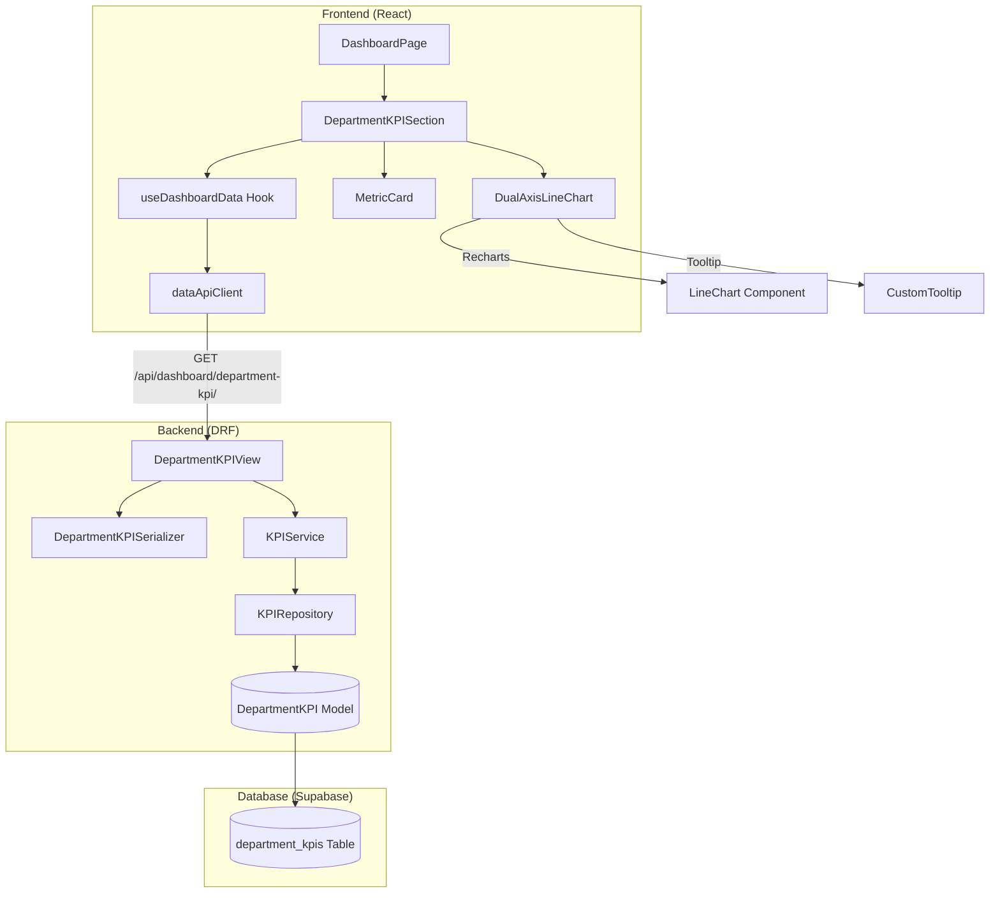

# 학과 KPI 추이 대시보드 구현 계획 (TDD 기반)

**Feature:** UC-005 학과 KPI 추이 시각화
**작성일:** 2025-11-02
**버전:** 1.0
**TDD 전략:** Outside-In (사용자 시나리오 → API → Service → Repository)

---

## 1. 개요

### 1.1 구현 모듈 목록

| 레이어 | 모듈 | 위치 | TDD 범위 |
|--------|------|------|----------|
| **Presentation** | DepartmentKPIView | `backend/data_ingestion/api/views.py` | Integration Tests |
| **Presentation** | DepartmentKPISerializer | `backend/data_ingestion/api/serializers.py` | Unit Tests |
| **Service** | KPIService | `backend/data_ingestion/services/kpi_service.py` | Unit Tests (핵심) |
| **Repository** | KPIRepository | `backend/data_ingestion/infrastructure/kpi_repository.py` | Unit Tests |
| **Database** | DepartmentKPI Model | `backend/data_ingestion/infrastructure/models.py` | Migration + Unit Tests |
| **Frontend Hook** | useDashboardData (KPI) | `frontend/src/hooks/useDashboardData.js` | Unit Tests |
| **Frontend UI** | DualAxisLineChart | `frontend/src/components/dashboard/DualAxisLineChart.jsx` | Unit Tests |
| **Frontend UI** | MetricCard | `frontend/src/components/dashboard/MetricCard.jsx` | Unit Tests |
| **E2E** | Department KPI Flow | `e2e/department-kpi.spec.js` | Acceptance Tests |

### 1.2 TDD 적용 범위

- **Unit Tests (70%)**: Service Layer, Repository, Hooks, Components
- **Integration Tests (20%)**: API Endpoints (DRF View + ORM)
- **Acceptance Tests (10%)**: E2E User Scenarios (US-005-1, US-005-2, US-005-5)

### 1.3 MVP 최소 기능

- 학과 KPI 데이터 조회 API (필터링: 학과, 년도 범위)
- Dual Y-axis Line Chart 렌더링 (Recharts)
- 평균 취업률 Metric Card 표시
- 에러 처리 (잘못된 파라미터, 데이터 없음)
- 빈 상태 UI

---

## 2. Architecture Diagram



---

## 3. Implementation Plan (TDD Workflow)

### 3.1 Phase 1: Database Layer (Foundation)

#### Module: DepartmentKPI Model
- **Location**: `backend/data_ingestion/infrastructure/models.py`
- **Responsibility**: 학과 KPI 데이터 스키마 정의 및 DB 제약 조건
- **Test Strategy**: Unit Tests (Model Validation)

**Test Scenarios (Red Phase):**
```python
# test_kpi_model.py
def test_create_department_kpi_with_valid_data():
    """유효한 데이터로 KPI 레코드 생성 성공"""
    # Given: 유효한 KPI 데이터
    # When: DepartmentKPI 객체 생성 및 저장
    # Then: 저장 성공, 필드 값 검증

def test_employment_rate_must_be_between_0_and_100():
    """취업률은 0~100 범위여야 함"""
    # Given: 취업률 101% 데이터
    # When: 저장 시도
    # Then: ValidationError 발생

def test_tech_transfer_income_cannot_be_negative():
    """기술이전 수입액은 음수 불가"""
    # Given: 음수 수입액
    # When: 저장 시도
    # Then: ValidationError 발생

def test_unique_constraint_on_year_and_department():
    """동일 년도+학과 중복 방지"""
    # Given: 이미 존재하는 년도+학과 조합
    # When: 동일 조합으로 재저장 시도
    # Then: IntegrityError 발생

def test_evaluation_year_must_be_after_2000():
    """평가년도는 2000년 이후여야 함"""
    # Given: 1999년 데이터
    # When: 저장 시도
    # Then: ValidationError 발생
```

**Implementation Order:**
1. Django Model 클래스 정의 (필드, validators)
2. Meta 클래스 (db_table, indexes, unique_together)
3. Migration 파일 생성 (`python manage.py makemigrations`)
4. Migration 실행 (`python manage.py migrate`)
5. 테스트 실행 → Green

**Dependencies**: Django, PostgreSQL (Supabase)

---

### 3.2 Phase 2: Repository Layer (Data Access)

#### Module: KPIRepository
- **Location**: `backend/data_ingestion/infrastructure/kpi_repository.py`
- **Responsibility**: Django ORM을 사용한 KPI 데이터 조회 (CRUD)
- **Test Strategy**: Unit Tests (Isolated with Test DB)

**Test Scenarios (Red Phase):**
```python
# test_kpi_repository.py
def test_find_by_department_and_year_returns_filtered_queryset():
    """학과 및 년도 범위로 필터링된 QuerySet 반환"""
    # Arrange: 테스트 데이터 삽입 (2019~2023, 컴공과/전자과)
    # Act: repository.find_by_department_and_year('컴퓨터공학과', 2020, 2022)
    # Assert: 컴공과 2020~2022 데이터만 반환

def test_find_by_department_all_returns_all_departments():
    """department='all' 시 모든 학과 반환"""
    # Arrange: 여러 학과 데이터 삽입
    # Act: repository.find_by_department_and_year('all', 2020, 2023)
    # Assert: 모든 학과 데이터 반환

def test_find_by_year_returns_single_year_data():
    """특정 년도 데이터만 조회"""
    # Arrange: 2019~2023 데이터 삽입
    # Act: repository.find_by_year(2022)
    # Assert: 2022년 데이터만 반환

def test_find_all_returns_all_records():
    """모든 KPI 데이터 조회"""
    # Arrange: 10개 레코드 삽입
    # Act: repository.find_all()
    # Assert: 10개 레코드 반환
```

**Edge Cases:**
```python
def test_empty_queryset_when_no_matching_data():
    """조건에 맞는 데이터 없을 때 빈 QuerySet 반환"""
    # Arrange: 컴공과 데이터만 삽입
    # Act: repository.find_by_department_and_year('물리학과', 2020, 2023)
    # Assert: QuerySet.count() == 0
```

**Implementation Order:**
1. KPIRepository 클래스 뼈대 작성
2. `find_by_department_and_year()` 메서드 구현 (ORM 쿼리)
3. `find_all()`, `find_by_year()` 메서드 구현
4. 테스트 실행 → Green
5. Refactor (쿼리 최적화, select_related/prefetch_related 검토)

**Dependencies**: DepartmentKPI Model, Django ORM

---

### 3.3 Phase 3: Service Layer (Business Logic) - 핵심

#### Module: KPIService
- **Location**: `backend/data_ingestion/services/kpi_service.py`
- **Responsibility**: 비즈니스 로직 검증, 데이터 집계, 메타 정보 생성
- **Test Strategy**: Unit Tests (Mocked Repository)

**Test Scenarios (Red Phase):**
```python
# test_kpi_service.py
def test_get_kpi_trend_returns_aggregated_data():
    """학과 KPI 추이 데이터 정상 집계"""
    # Arrange: Mock Repository (5개 년도 데이터)
    # Act: service.get_kpi_trend('all', 2019, 2023)
    # Assert:
    #   - data 배열 길이 5
    #   - 각 항목에 evaluation_year, avg_employment_rate, total_tech_income 포함
    #   - meta.overall_avg_employment_rate 계산 정확성

def test_get_kpi_trend_with_specific_department():
    """특정 학과 필터링 성공"""
    # Arrange: Mock Repository (컴공과 데이터만)
    # Act: service.get_kpi_trend('컴퓨터공학과', 2020, 2023)
    # Assert: meta.department_filter == '컴퓨터공학과'

def test_validate_year_range_raises_error_when_start_greater_than_end():
    """시작 년도 > 종료 년도 시 ValueError"""
    # Arrange: start_year=2024, end_year=2019
    # Act & Assert: service.get_kpi_trend() raises ValueError

def test_validate_year_range_raises_error_when_range_exceeds_20_years():
    """년도 범위 20년 초과 시 ValueError"""
    # Arrange: start_year=2000, end_year=2025
    # Act & Assert: raises ValueError('년도 범위는 최대 20년까지')

def test_validate_year_range_raises_error_when_future_year():
    """미래 년도 조회 시 ValueError"""
    # Arrange: end_year=2030 (현재 년도+1 초과)
    # Act & Assert: raises ValueError('종료 년도는 {current_year+1}을 초과할 수 없습니다')

def test_validate_year_range_raises_error_when_year_before_2000():
    """2000년 이전 데이터 조회 시 ValueError"""
    # Arrange: start_year=1999
    # Act & Assert: raises ValueError('시작 년도는 2000년 이후여야 합니다')

def test_overall_avg_employment_rate_is_null_when_no_data():
    """데이터 없을 때 overall_avg_employment_rate = null"""
    # Arrange: Mock Repository (빈 QuerySet)
    # Act: service.get_kpi_trend('물리학과', 2020, 2023)
    # Assert:
    #   - data == []
    #   - meta.overall_avg_employment_rate == None
    #   - meta.overall_total_tech_income == None
    #   - meta.total_count == 0
```

**Edge Cases:**
```python
def test_rounds_avg_employment_rate_to_one_decimal():
    """평균 취업률 소수점 첫째자리 반올림"""
    # Arrange: Mock data with 78.456% avg
    # Act: service.get_kpi_trend()
    # Assert: meta.overall_avg_employment_rate == 78.5

def test_handles_single_year_data():
    """단일 년도 데이터만 존재할 때 정상 처리"""
    # Arrange: Mock Repository (2023년 데이터만)
    # Act: service.get_kpi_trend('all', 2023, 2023)
    # Assert: data 배열 길이 1, meta 정상 생성
```

**Implementation Order:**
1. KPIService 클래스 뼈대 작성
2. `_validate_year_range()` 메서드 구현 (비즈니스 규칙 검증)
3. `get_kpi_trend()` 메서드 구현 (Repository 호출, 집계, 응답 생성)
4. 테스트 실행 → Green
5. Refactor (중복 제거, 가독성 개선)

**Dependencies**: KPIRepository (Mocked in tests)

---

### 3.4 Phase 4: Presentation Layer (API)

#### Module: DepartmentKPISerializer
- **Location**: `backend/data_ingestion/api/serializers.py`
- **Responsibility**: 쿼리 파라미터 검증 및 응답 직렬화
- **Test Strategy**: Unit Tests (Serializer Validation)

**Test Scenarios (Red Phase):**
```python
# test_kpi_serializer.py
def test_query_serializer_validates_default_values():
    """파라미터 없을 때 기본값 적용"""
    # Arrange: 빈 query_params
    # Act: serializer = DepartmentKPIQuerySerializer(data={})
    # Assert:
    #   - department == 'all'
    #   - start_year == current_year - 5
    #   - end_year == current_year

def test_query_serializer_accepts_valid_parameters():
    """유효한 파라미터 검증 성공"""
    # Arrange: valid params (department='컴공과', start=2020, end=2023)
    # Act: serializer.is_valid()
    # Assert: True

def test_query_serializer_rejects_invalid_year_range():
    """start_year > end_year 시 검증 실패"""
    # Arrange: start=2024, end=2019
    # Act: serializer.is_valid()
    # Assert: False, errors 포함

def test_query_serializer_rejects_year_below_2000():
    """2000년 미만 년도 거부"""
    # Arrange: start=1999
    # Act: serializer.is_valid()
    # Assert: False

def test_query_serializer_rejects_year_above_2100():
    """2100년 초과 년도 거부"""
    # Arrange: end=2101
    # Act: serializer.is_valid()
    # Assert: False
```

**Implementation Order:**
1. `DepartmentKPIQuerySerializer` 클래스 작성 (CharField, IntegerField)
2. `validate()` 메서드 구현 (년도 범위 체크)
3. 테스트 실행 → Green

---

#### Module: DepartmentKPIView
- **Location**: `backend/data_ingestion/api/views.py`
- **Responsibility**: HTTP 요청 처리 및 Service Layer 위임 (Thin Controller)
- **Test Strategy**: Integration Tests (DRF APITestCase)

**Test Scenarios (Red Phase):**
```python
# test_kpi_api.py
def test_get_kpi_data_all_departments_returns_200():
    """전체 학과 KPI 조회 성공"""
    # Arrange: DB에 테스트 데이터 삽입
    # Act: GET /api/dashboard/department-kpi/?department=all
    # Assert: status_code == 200, response.data['status'] == 'success'

def test_get_kpi_data_specific_department_filters_correctly():
    """특정 학과 필터링 성공"""
    # Arrange: 컴공과, 전자과 데이터 삽입
    # Act: GET /api/dashboard/department-kpi/?department=컴퓨터공학과
    # Assert: 응답 데이터에 컴공과만 포함

def test_get_kpi_data_year_range_filter():
    """년도 범위 필터링 성공"""
    # Arrange: 2019~2024 데이터 삽입
    # Act: GET /api/dashboard/department-kpi/?start_year=2020&end_year=2022
    # Assert: 응답 데이터 년도 범위 2020~2022

def test_invalid_year_range_returns_400():
    """잘못된 년도 범위 시 400 에러"""
    # Arrange: -
    # Act: GET /api/dashboard/department-kpi/?start_year=2024&end_year=2019
    # Assert:
    #   - status_code == 400
    #   - error_code == 'INVALID_YEAR_RANGE'

def test_no_data_returns_empty_list_with_200():
    """데이터 없을 때 빈 리스트 반환 (200 OK)"""
    # Arrange: DB 비어있음
    # Act: GET /api/dashboard/department-kpi/
    # Assert:
    #   - status_code == 200
    #   - data == []
    #   - meta.total_count == 0
```

**Edge Cases:**
```python
def test_future_year_returns_400():
    """미래 년도 조회 시 400 에러"""
    # Arrange: -
    # Act: GET /api/dashboard/department-kpi/?end_year=2030
    # Assert: status_code == 400, error_code == 'FUTURE_YEAR_NOT_ALLOWED'

def test_year_range_exceeds_20_years_returns_400():
    """20년 초과 범위 조회 시 400 에러"""
    # Arrange: -
    # Act: GET /api/dashboard/department-kpi/?start_year=2000&end_year=2025
    # Assert: status_code == 400, error_code == 'YEAR_RANGE_TOO_LARGE'

def test_invalid_department_returns_400():
    """존재하지 않는 학과 조회 시 400 에러"""
    # Arrange: DB에 '물리학과' 없음
    # Act: GET /api/dashboard/department-kpi/?department=존재하지않는학과
    # Assert:
    #   - status_code == 400
    #   - error_code == 'INVALID_DEPARTMENT'
    #   - error_message == '존재하지 않는 학과입니다'
```

**Implementation Order:**
1. `DepartmentKPIView` 클래스 작성 (APIView 상속)
2. `get()` 메서드 구현 (파라미터 추출, Serializer 검증, Service 호출)
3. URL 라우팅 추가 (`urls.py`)
4. 테스트 실행 → Green

**Dependencies**: KPIService, DepartmentKPISerializer, DepartmentKPI Model

---

### 3.5 Phase 5: Frontend Data Layer (Hook)

#### Module: useDashboardData Hook (KPI Extension)
- **Location**: `frontend/src/hooks/useDashboardData.js`
- **Responsibility**: API 호출, 에러 처리, 데이터 변환 (UI 독립적)
- **Test Strategy**: Unit Tests (Mocked Axios)

**Test Scenarios (Red Phase):**
```javascript
// useDashboardData.test.js
test('fetchKPIData calls API with correct parameters', async () => {
  // Arrange: Mock axios.get
  // Act: useDashboardData().fetchKPIData({ department: 'all', startYear: 2019 })
  // Assert: axios.get called with '/api/dashboard/department-kpi/?department=all&start_year=2019...'
});

test('fetchKPIData transforms API response to chart format', async () => {
  // Arrange: Mock API response
  // Act: const data = await fetchKPIData()
  // Assert: data[0] has { year, employmentRate, techIncome }
});

test('fetchKPIData sets loading state correctly', async () => {
  // Arrange: Mock delayed API response
  // Act: fetchKPIData()
  // Assert: loading == true → response → loading == false
});

test('fetchKPIData sets error state on API failure', async () => {
  // Arrange: Mock axios.get to throw error
  // Act: fetchKPIData()
  // Assert: error != null, error.message contains meaningful text
});

test('fetchKPIData returns empty array when API returns no data', async () => {
  // Arrange: Mock API response with data: []
  // Act: const data = await fetchKPIData()
  // Assert: data == []
});
```

**Edge Cases:**
```javascript
test('handles network timeout gracefully', async () => {
  // Arrange: Mock axios timeout error
  // Act: fetchKPIData()
  // Assert: error.message == '데이터 로딩이 지연되고 있습니다. 새로고침하세요'
});

test('calculates overall average employment rate from data', async () => {
  // Arrange: Mock API response with 3 years data
  // Act: const { meta } = await fetchKPIData()
  // Assert: meta.overallAvgEmploymentRate == (sum / 3)
});
```

**Implementation Order:**
1. `useDashboardData.js`에 `fetchKPIData()` 함수 추가
2. Axios 호출 및 에러 처리 로직
3. 응답 데이터 변환 (evaluation_year → year, avg_employment_rate → employmentRate)
4. 테스트 실행 → Green
5. Refactor (중복 제거, React Query 도입 검토)

**Dependencies**: Axios, dataApiClient

---

### 3.6 Phase 6: Frontend UI Layer (Components)

#### Module: MetricCard
- **Location**: `frontend/src/components/dashboard/MetricCard.jsx`
- **Responsibility**: KPI 지표 카드 렌더링 (재사용 가능한 UI)
- **Test Strategy**: Unit Tests (React Testing Library)

**Test Scenarios (Red Phase):**
```javascript
// MetricCard.test.js
test('renders metric card with title and value', () => {
  // Arrange: title='평균 취업률', value='78.5%'
  // Act: render(<MetricCard title={...} value={...} />)
  // Assert: getByText('평균 취업률'), getByText('78.5%')
});

test('renders positive change indicator', () => {
  // Arrange: change=2.3 (positive)
  // Act: render(<MetricCard change={2.3} />)
  // Assert: getByText('↑ 2.3%p'), text color green
});

test('renders negative change indicator', () => {
  // Arrange: change=-1.5 (negative)
  // Act: render(<MetricCard change={-1.5} />)
  // Assert: getByText('↓ 1.5%p'), text color red
});

test('does not render change when undefined', () => {
  // Arrange: change=undefined
  // Act: render(<MetricCard title="평균 취업률" value="78.5%" />)
  // Assert: change indicator not in document
});
```

**Implementation Order:**
1. MetricCard 컴포넌트 뼈대 작성 (props: title, value, change)
2. JSX 구조 작성 (title, value, change indicator)
3. 조건부 렌더링 (change 존재 시만 표시)
4. 테스트 실행 → Green
5. Refactor (Tailwind CSS 스타일 정리)

**Dependencies**: React, Tailwind CSS

---

#### Module: DualAxisLineChart
- **Location**: `frontend/src/components/dashboard/DualAxisLineChart.jsx`
- **Responsibility**: Recharts 기반 이중 축 라인 차트 렌더링
- **Test Strategy**: Unit Tests (Recharts 통합)

**Test Scenarios (Red Phase):**
```javascript
// DualAxisLineChart.test.js
test('renders chart with two lines', () => {
  // Arrange: mockData (3 years)
  // Act: render(<DualAxisLineChart data={mockData} />)
  // Assert: getByText('졸업생 취업률 (%)'), getByText('기술이전 수입액 (억원)')
});

test('renders empty state when data is empty', () => {
  // Arrange: data=[]
  // Act: render(<DualAxisLineChart data={[]} />)
  // Assert: getByText('학과 KPI 데이터가 없습니다')
});

test('displays tooltip on hover (snapshot test)', () => {
  // Arrange: mockData
  // Act: render(<DualAxisLineChart data={mockData} />)
  // Assert: Tooltip component exists (snapshot or DOM query)
});

test('chart has correct Y-axis domains', () => {
  // Arrange: mockData
  // Act: render(<DualAxisLineChart data={mockData} />)
  // Assert: Left YAxis domain [0, 100], Right YAxis domain [0, 'auto']
});
```

**Edge Cases:**
```javascript
test('handles single data point gracefully', () => {
  // Arrange: data with 1 year only
  // Act: render(<DualAxisLineChart data={[{year: 2023, ...}]} />)
  // Assert: chart renders without error, single dot visible
});

test('handles missing year data gracefully', () => {
  // Arrange: 데이터에 2021년 누락 (2019, 2020, 2022, 2023만 존재)
  // Act: render(<DualAxisLineChart data={dataWithGap} />)
  // Assert: 라인이 끊기거나 점선으로 연결됨 (connectNulls 옵션 검증)
});
```

**Implementation Order:**
1. DualAxisLineChart 컴포넌트 뼈대 작성
2. 빈 상태 처리 (data.length === 0)
3. Recharts LineChart 구조 작성 (XAxis, YAxis x2, Line x2, Tooltip, Legend)
4. CustomTooltip 컴포넌트 작성
5. 테스트 실행 → Green
6. Refactor (스타일, 색상 상수화)

**Dependencies**: Recharts, React

---

### 3.7 Phase 7: End-to-End Tests (Acceptance)

#### Module: Department KPI E2E Flow
- **Location**: `e2e/department-kpi.spec.js`
- **Responsibility**: 사용자 시나리오 검증 (US-005-1, US-005-2, US-005-5)
- **Test Strategy**: Acceptance Tests (Playwright)

**Test Scenarios:**
```javascript
// department-kpi.spec.js
test('US-005-1: User views KPI trend chart on dashboard', async ({ page }) => {
  // Given: 메인 대시보드 접속, DB에 KPI 데이터 존재
  // When: 페이지 로드
  // Then:
  //   - 학과 KPI 추이 차트 표시
  //   - 평균 취업률 Metric Card 표시
  //   - 이중 축 라인 차트 렌더링 (2개 라인)
});

test('US-005-2: User filters KPI by department', async ({ page }) => {
  // Given: 학과 KPI 차트 보고 있음
  // When: 학과 필터에서 '컴퓨터공학과' 선택
  // Then:
  //   - 차트 업데이트됨
  //   - Metric Card 평균 취업률 업데이트됨
  //   - URL 쿼리 파라미터 변경 (선택적)
});

test('US-005-5: Empty state displayed when no data', async ({ page }) => {
  // Given: DB에 KPI 데이터 없음
  // When: 대시보드 접속
  // Then: '학과 KPI 데이터가 없습니다' 빈 상태 메시지 표시
});
```

**Implementation Order:**
1. Playwright 설정 파일 작성
2. 테스트 데이터 시드 스크립트 작성 (DB setup)
3. E2E 테스트 시나리오 작성 (위 3개)
4. 테스트 실행 → Green
5. CI/CD 파이프라인에 E2E 테스트 추가

**Dependencies**: Playwright, Test Database

---

## 4. TDD Workflow

### 4.1 구현 순서 (Red → Green → Refactor)

```
1. Database Layer (Phase 1)
   └─ DepartmentKPI Model + Migration
   └─ Run tests → Green

2. Repository Layer (Phase 2)
   └─ KPIRepository (find_by_department_and_year)
   └─ Run tests → Green

3. Service Layer (Phase 3) - 핵심
   └─ KPIService (_validate_year_range)
   └─ Run tests → Green
   └─ KPIService (get_kpi_trend)
   └─ Run tests → Green
   └─ Refactor (중복 제거)

4. Presentation Layer (Phase 4)
   └─ DepartmentKPISerializer
   └─ Run tests → Green
   └─ DepartmentKPIView
   └─ Run integration tests → Green

5. Frontend Data Layer (Phase 5)
   └─ useDashboardData (fetchKPIData)
   └─ Run tests → Green

6. Frontend UI Layer (Phase 6)
   └─ MetricCard
   └─ Run tests → Green
   └─ DualAxisLineChart (빈 상태 먼저)
   └─ Run tests → Green
   └─ DualAxisLineChart (차트 렌더링)
   └─ Run tests → Green

7. E2E Tests (Phase 7)
   └─ US-005-1, US-005-2, US-005-5
   └─ Run acceptance tests → Green

8. Integration & Refactoring
   └─ 모든 테스트 재실행
   └─ 코드 리뷰 및 정리
   └─ 문서화 (API Swagger, Storybook)
```

### 4.2 Commit 포인트 제안

```bash
# Phase 1
git commit -m "feat: Add DepartmentKPI model with validators and indexes"

# Phase 2
git commit -m "feat: Implement KPIRepository for data access layer"

# Phase 3
git commit -m "feat: Add KPIService with year range validation"
git commit -m "feat: Implement KPI trend aggregation in KPIService"

# Phase 4
git commit -m "feat: Add DepartmentKPISerializer for query validation"
git commit -m "feat: Implement DepartmentKPIView API endpoint"

# Phase 5
git commit -m "feat: Add fetchKPIData to useDashboardData hook"

# Phase 6
git commit -m "feat: Create MetricCard component for KPI display"
git commit -m "feat: Implement DualAxisLineChart with Recharts"

# Phase 7
git commit -m "test: Add E2E tests for department KPI dashboard"

# Final
git commit -m "docs: Update API documentation and component Storybook"
```

### 4.3 완료 조건 (Definition of Done)

- [ ] 모든 Unit Tests 통과 (커버리지 목표: Service 100%, Repository 90%)
- [ ] 모든 Integration Tests 통과 (API 엔드포인트 100%)
- [ ] 모든 Acceptance Tests 통과 (US-005-1, US-005-2, US-005-5)
- [ ] 코드 리뷰 완료 (팀원 1명 이상 승인)
- [ ] API 문서 업데이트 (Swagger)
- [ ] 컴포넌트 Storybook 등록
- [ ] 에러 처리 완료 (spec.md Section 13 모든 에러 코드)
- [ ] 보안 요구사항 충족 (spec.md Section 19)
- [ ] CI/CD 파이프라인 통과 (테스트 실패 시 배포 차단)

---

## 5. QA Sheet (Manual Testing - Presentation Layer Only)

### 5.1 UI/UX 수동 테스트 항목

| 항목 | 테스트 시나리오 | 예상 결과 | 실제 결과 | 상태 |
|------|----------------|-----------|----------|------|
| 차트 렌더링 | 대시보드 접속 후 학과 KPI 차트 확인 | 이중 축 라인 차트 표시 (파란색/주황색) | | ⬜ |
| Metric Card | 평균 취업률 카드 확인 | "평균 취업률: XX.X%" 표시 | | ⬜ |
| Tooltip | 차트 데이터 포인트에 마우스 오버 | "YYYY년 / 취업률: XX% / 수입액: XX억원" 표시 | | ⬜ |
| 학과 필터 | 드롭다운에서 특정 학과 선택 | 차트 및 Metric Card 업데이트 | | ⬜ |
| 년도 필터 | "최근 3년" 선택 | X축 년도 범위 조정 | | ⬜ |
| 빈 상태 | DB 데이터 삭제 후 새로고침 | "학과 KPI 데이터가 없습니다" 메시지 표시 | | ⬜ |
| 에러 처리 | 잘못된 년도 파라미터로 API 호출 | 에러 토스트 "데이터 로딩 실패" 표시 | | ⬜ |
| 로딩 상태 | 느린 네트워크 시뮬레이션 | 스켈레톤 UI 표시 → 차트 전환 | | ⬜ |
| 반응형 | 모바일 화면 크기로 조정 | 차트 크기 자동 조정 (ResponsiveContainer) | | ⬜ |
| 접근성 | Tab 키로 필터 접근 | 키보드로 모든 UI 요소 접근 가능 | | ⬜ |
| 색상 대비 | WCAG AA 대비 검사 도구 사용 | 파란색/주황색 대비율 4.5:1 이상 | | ⬜ |

### 5.2 브라우저 호환성 테스트

| 브라우저 | 버전 | 차트 렌더링 | 인터랙션 | 상태 |
|---------|------|-----------|---------|------|
| Chrome | 최신 | | | ⬜ |
| Firefox | 최신 | | | ⬜ |
| Safari | 최신 | | | ⬜ |
| Edge | 최신 | | | ⬜ |

---

## 6. 리스크 및 대응 방안

### 6.1 기술적 리스크

| 리스크 | 영향도 | 대응 방안 |
|--------|--------|----------|
| Recharts 성능 이슈 (대량 데이터) | 중 | 데이터 포인트 20년 제한 (비즈니스 규칙) |
| Django ORM 쿼리 성능 저하 | 중 | 복합 인덱스 추가 (spec.md Section 10.4) |
| 프론트엔드 상태 관리 복잡도 | 낮 | React Query 도입 검토 (캐싱, 리페칭) |
| E2E 테스트 불안정성 | 중 | 테스트 DB 독립 환경, 명시적 wait 사용 |

### 6.2 일정 리스크

| 마일스톤 | 예상 소요 | 리스크 요인 | 대응 |
|---------|----------|-----------|------|
| Phase 1-2 (DB + Repository) | 0.5일 | Django ORM 학습 곡선 | 페어 프로그래밍 |
| Phase 3 (Service) | 1일 | 비즈니스 로직 복잡도 | TDD 엄격 준수 |
| Phase 4 (API) | 0.5일 | DRF Serializer 검증 | 기존 코드 참고 |
| Phase 5-6 (Frontend) | 1.5일 | Recharts 커스터마이징 | 공식 문서 예제 활용 |
| Phase 7 (E2E) | 0.5일 | Playwright 환경 설정 | 템플릿 재사용 |

**총 예상 소요 시간:** 4일 (여유 포함 5일)

---

## 7. 참고 자료

### 7.1 관련 문서
- `docs/005-department-kpi-dashboard/spec.md` - 상세 유스케이스
- `docs/database.md` - DepartmentKPI 모델 스키마
- `docs/techstack.md` - 기술 스택 근거
- `prompt/tdd.md` - TDD 프로세스 가이드라인

### 7.2 외부 라이브러리 문서
- [Django Validators](https://docs.djangoproject.com/en/4.2/ref/validators/)
- [DRF Serializers](https://www.django-rest-framework.org/api-guide/serializers/)
- [Recharts Documentation](https://recharts.org/en-US/api)
- [React Testing Library](https://testing-library.com/docs/react-testing-library/intro/)
- [Playwright](https://playwright.dev/docs/intro)

### 7.3 코드 예제 참고
- spec.md Section 10: 레이어드 아키텍처 코드 예제
- spec.md Section 11: Recharts 구현 예제
- spec.md Section 12: 테스트 코드 예제

---

## 8. 구현 체크리스트 (TodoWrite 연동용)

### Backend
- [ ] DepartmentKPI Model 구현 및 Migration
- [ ] KPIRepository 구현 (find_by_department_and_year, find_all, find_by_year)
- [ ] KPIService 구현 (_validate_year_range, get_kpi_trend)
- [ ] DepartmentKPISerializer 구현 (쿼리 파라미터 검증)
- [ ] DepartmentKPIView 구현 (API 엔드포인트)
- [ ] URL 라우팅 추가
- [ ] 단위 테스트 작성 및 통과 (최소 15개)
- [ ] 통합 테스트 작성 및 통과 (최소 6개 - INVALID_DEPARTMENT 포함)
- [ ] 에러 처리 구현 (9개 에러 코드 - INVALID_DEPARTMENT 포함)

### Frontend
- [ ] useDashboardData Hook에 fetchKPIData 추가
- [ ] MetricCard 컴포넌트 구현
- [ ] DualAxisLineChart 컴포넌트 구현
- [ ] CustomTooltip 컴포넌트 구현
- [ ] 빈 상태 UI 구현
- [ ] 에러 상태 UI 구현
- [ ] 로딩 스켈레톤 구현
- [ ] 학과/년도 필터 연동
- [ ] 년도 데이터 누락 처리 (connectNulls 옵션)
- [ ] 단위 테스트 작성 및 통과 (최소 9개 - 년도 데이터 누락 케이스 포함)
- [ ] E2E 테스트 작성 및 통과 (3개)

### Documentation
- [ ] API 문서 Swagger 추가
- [ ] 컴포넌트 Storybook 등록
- [ ] README 업데이트 (실행 방법)
- [ ] 보안 체크리스트 완료 (spec.md Section 19.6)

---

**문서 끝**

**작성자:** Plan Writer Agent
**검토자:** CTO
**승인일:** 2025-11-02
**버전:** 1.0 (TDD 기반 설계 완료)
