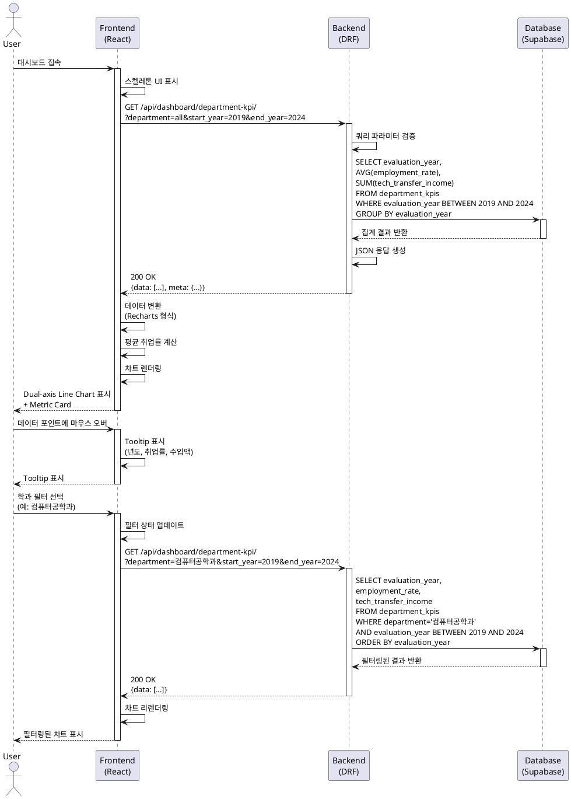

# 학과 KPI 추이 대시보드 상세 유스케이스 (UC-005)

**기능명:** 학과 KPI 추이 시각화
**우선순위:** P0-MVP
**작성일:** 2025-11-02
**최종 수정일:** 2025-11-02
**수정자:** Claude Code
**버전:** 3.1 (speccheck.md P0/P1 개선사항 완전 적용)

**변경 이력 (v3.1 - 2025-11-02):**
- **[P0] 보안 요구사항 추가:** Section 20 신규 작성 (인증/인가, CSRF/XSS 방어)
- **[P0] 에러 코드 보완:** Section 13.1에 누락된 3개 에러 코드 추가
  - YEAR_RANGE_TOO_LARGE, FUTURE_YEAR_NOT_ALLOWED, YEAR_TOO_OLD
- **[P1] DB 모델 제약 조건 추가:** Section 10.4에 validators 명시
- **[P1] 테스트 커버리지 목표 추가:** Section 12.4 신규 작성

**변경 이력 (v3.0 - 2025-11-02):**
- **[P0] Section 10 완전 재작성:** View → Service → Repository 레이어 분리
  - 10.1: Presentation Layer (api/views.py) - Thin Controller 패턴
  - 10.2: Service Layer (services/kpi_service.py) - 비즈니스 로직 및 검증
  - 10.3: Repository Layer (infrastructure/kpi_repository.py) - Django ORM 전담
  - 10.4: Database Indexes - 복합 인덱스 명세 추가
  - 10.5: SQL 쿼리 참고 (EXPLAIN ANALYZE 포함)
- **[P0] 쿼리 파라미터 추가 검증:** 년도 범위 상한(20년), 미래 년도 방지, 최소 년도(2000년) 검증
- **[P0] 비즈니스 규칙을 Service Layer에서 검증:** _validate_year_range() 메서드
- CLAUDE.md의 Simple Layered Architecture 원칙 완전 준수

**변경 이력 (v2.0 - 이전):**
- Service Layer 아키텍처 명시 및 Thin Controller 패턴 적용
- Repository Pattern 구현 (kpi_repository.py)
- 데이터베이스 인덱스 전략 추가 (복합 인덱스 포함)
- 쿼리 파라미터 추가 검증 (년도 범위 제한, 미래 년도 방지)

---

## 1. 기능 개요

### 1.1 목적
대학 내부 직원이 학과별 핵심 성과 지표(취업률, 기술이전 수입액)의 연도별 추이를 직관적인 이중 축(Dual-axis) 라인 차트로 파악하여 의사결정을 지원한다.

### 1.2 범위
- 학과 KPI 데이터 조회 및 시각화 (Dual Y-axis Line Chart)
- 평균 취업률 지표 카드 표시
- 학과별/년도별 필터링 기능
- Recharts 라이브러리 기반 구현

### 1.3 데이터 소스
- **파일:** department_kpi.csv
- **필수 컬럼:**
  - 평가년도 (INTEGER): 평가 기준 년도
  - 학과 (VARCHAR): 학과명
  - 졸업생 취업률(%) (NUMERIC): 0~100 범위의 취업률
  - 연간 기술이전 수입액(억원) (NUMERIC): 기술이전 수입액

### 1.4 핵심 가치
- **신속성:** Recharts 기본 컴포넌트 활용으로 빠른 구현
- **간결성:** 단순 드롭다운 필터만 제공 (복잡한 UI 배제)
- **확장성:** 컴포넌트 구조로 추후 추가 지표 확장 가능

---

## 2. 사용자 스토리 (GIVEN-WHEN-THEN)

### US-005-1: KPI 추이 조회
```
GIVEN 내부 직원이 메인 대시보드에 접속했고
  AND 학과 KPI 데이터가 DB에 존재할 때
WHEN 학과 KPI 추이 차트 영역을 확인하면
THEN 연도별 취업률과 기술이전 수입액이 이중 축 라인 차트로 표시되고
  AND 평균 취업률이 지표 카드로 표시된다
```

### US-005-2: 학과별 필터링
```
GIVEN 사용자가 학과 KPI 차트를 보고 있을 때
WHEN 학과 필터 드롭다운에서 특정 학과를 선택하면
THEN 선택한 학과의 KPI 추이만 차트에 표시되고
  AND 해당 학과의 평균 취업률이 지표 카드에 업데이트된다
```

### US-005-3: 년도별 필터링
```
GIVEN 사용자가 학과 KPI 차트를 보고 있을 때
WHEN 기간 필터에서 특정 년도 범위를 선택하면
THEN 선택한 기간의 데이터만 차트에 표시되고
  AND X축 년도 범위가 조정된다
```

### US-005-4: 차트 인터랙션
```
GIVEN 사용자가 학과 KPI 차트를 보고 있을 때
WHEN 차트의 특정 데이터 포인트에 마우스를 올리면
THEN Tooltip이 표시되어 해당 년도의 취업률과 수입액이 보인다
```

### US-005-5: 데이터 없음 처리
```
GIVEN 메인 대시보드에 접속했으나
  AND 학과 KPI 데이터가 DB에 존재하지 않을 때
WHEN 학과 KPI 차트 영역을 확인하면
THEN "학과 KPI 데이터가 없습니다" 빈 상태 메시지가 표시된다
```

---

## 3. Primary Actor
- **내부 직원 (Internal Staff / Viewer)**: 대학 직원 전체 (읽기 전용)

---

## 4. Precondition
- 사용자가 메인 대시보드 페이지에 접근 가능
- department_kpi.csv 파일이 관리자에 의해 최소 1회 업로드되어 DB에 데이터 존재

---

## 5. Trigger
- 사용자가 메인 대시보드 URL (`/` 또는 `/dashboard`)에 접속
- 브라우저에서 자동으로 학과 KPI API 호출 실행

---

## 6. Main Scenario

### Step 1: 페이지 로드 및 초기 데이터 요청
1. 사용자가 메인 대시보드 접속
2. React 앱이 `useDashboardData.js` Hook 실행
3. `GET /api/dashboard/department-kpi/` API 호출 (기본 필터: 전체 학과, 최근 5년)
4. 스켈레톤 UI 표시

### Step 2: 백엔드 데이터 집계
1. DRF View에서 요청 수신
2. 쿼리 파라미터 검증 (학과, 년도 범위)
3. Django ORM을 통해 Supabase 쿼리 실행:
   ```python
   queryset = DepartmentKPI.objects.filter(
       evaluation_year__gte=start_year,
       evaluation_year__lte=end_year
   )
   if department != 'all':
       queryset = queryset.filter(department=department)

   data = queryset.values('evaluation_year').annotate(
       avg_employment_rate=Avg('employment_rate'),
       total_tech_income=Sum('tech_transfer_income')
   ).order_by('evaluation_year')
   ```
4. JSON 응답 반환

### Step 3: 프런트엔드 데이터 처리 및 렌더링
1. API 응답 데이터를 Recharts 형식으로 변환:
   ```javascript
   const chartData = response.data.map(item => ({
     year: item.evaluation_year,
     employmentRate: item.avg_employment_rate,
     techIncome: item.total_tech_income
   }));
   ```
2. 평균 취업률 계산:
   ```javascript
   const avgRate = chartData.reduce((sum, d) => sum + d.employmentRate, 0) / chartData.length;
   ```
3. 차트 컴포넌트에 데이터 바인딩

### Step 4: 차트 표시
1. **Dual Y-axis Line Chart 렌더링:**
   - X축: 평가년도 (2019, 2020, 2021, ...)
   - Y축 (좌): 취업률 (0~100%)
   - Y축 (우): 기술이전 수입액 (억원)
   - 라인 1: 취업률 (실선, 파란색, #3B82F6)
   - 라인 2: 수입액 (점선, 주황색, #F59E0B)
   - 범례: "졸업생 취업률 (%)", "기술이전 수입액 (억원)"

2. **Metric Card 렌더링:**
   - 제목: "평균 취업률"
   - 값: "78.5%"
   - 전년 대비 증감: "↑ 2.3%p" (옵션)

### Step 5: 사용자 인터랙션
1. 사용자가 차트 데이터 포인트에 마우스 오버
2. Tooltip 표시:
   ```
   2023년
   취업률: 78.5%
   수입액: 12.3억원
   ```

---

## 7. Edge Cases

### EC-005-1: 년도 데이터 누락
**상황:** 특정 년도의 KPI 데이터가 없음 (예: 2021년 데이터 없음)
**처리:**
- 해당 년도에서 라인이 끊기거나 점선으로 연결
- Tooltip에 "데이터 없음" 표시
- 차트 하단에 "일부 년도 데이터가 누락되었습니다" 안내

### EC-005-2: 음수 값 발견
**상황:** 취업률 또는 수입액이 음수로 저장됨 (데이터 오류)
**처리:**
- Pandas 파싱 단계에서 음수 값 검증 및 제외
- 에러 로그 기록: "department_kpi.csv 45번째 행의 취업률이 음수(-5.2)입니다"
- 해당 행은 DB 삽입 제외

### EC-005-3: 취업률 범위 초과
**상황:** 취업률이 100% 초과 또는 0% 미만
**처리:**
- Pandas 검증: `0 <= employment_rate <= 100`
- 범위 위반 시 해당 행 제외 + 경고 로그
- 관리자에게 "취업률 값 검증 실패" 메시지 표시

### EC-005-4: 단일 년도만 존재
**상황:** DB에 1개 년도 데이터만 있음
**처리:**
- 라인 차트에 단일 점만 표시
- 차트 하단 안내: "추가 데이터 업로드 시 추이를 확인할 수 있습니다"
- 지표 카드는 정상 표시

### EC-005-5: 학과 필터 결과 없음
**상황:** 특정 학과 선택 시 해당 학과의 KPI 데이터 없음
**처리:**
- 차트 영역에 빈 상태 표시
- 메시지: "'컴퓨터공학과'의 KPI 데이터가 없습니다"
- 권장: "다른 학과를 선택하거나 '전체 학과'를 클릭하세요"
- 필터 초기화 버튼 강조

### EC-005-6: API 타임아웃
**상황:** 백엔드 응답 30초 초과
**처리:**
- 에러 토스트: "데이터 로딩이 지연되고 있습니다. 새로고침하세요"
- "재시도" 버튼 표시
- 기존 차트 유지 (마지막 성공 데이터)

### EC-005-7: 급격한 변화 (이상치)
**상황:** 연도 간 취업률 또는 수입액이 30% 이상 급변
**처리:**
- 해당 데이터 포인트 강조 표시 (색상 변경 또는 마커 크기 증가)
- Tooltip에 "전년 대비 +35.2% 급증" 추가 정보
- 관리자에게 알림 (POST-MVP)

---

## 8. Business Rules

### BR-005-1: 데이터 집계 방식
- 평가년도별 GROUP BY 집계
- 학과별 필터 적용 시: 선택 학과의 데이터만 조회
- 전체 학과 선택 시: 모든 학과의 평균 취업률 및 총 수입액 집계

### BR-005-2: 취업률 계산
- 평균 취업률 = AVG(employment_rate) WHERE 필터 조건
- 소수점 첫째 자리까지 표시 (78.5%)

### BR-005-3: 기술이전 수입액 표시
- 단위: 억원 (DB에 억원 단위로 저장)
- 소수점 첫째 자리까지 표시 (12.3억원)
- 라벨: "기술이전 수입액 (억원)"

### BR-005-4: 년도 범위 기본값
- 기본 필터: 최근 5년 데이터
- 사용자 선택 가능 옵션: "최근 3년", "최근 5년", "최근 10년", "전체"

### BR-005-5: 차트 색상 규칙
- 취업률 라인: 파란색 (#3B82F6), 실선, 두께 2px
- 수입액 라인: 주황색 (#F59E0B), 점선(dash: [5, 5]), 두께 2px
- 데이터 포인트: 원형 마커, 반지름 4px

### BR-005-6: 정렬 순서
- X축 년도: 오름차순 정렬 (2019 → 2024)
- 학과 드롭다운: 가나다순 정렬

### BR-005-7: 빈 데이터 처리
- 데이터 없음: 빈 상태 UI 표시
- 부분 데이터: 존재하는 년도만 표시 + 누락 안내

---

## 9. API 명세

### 9.1 GET /api/dashboard/department-kpi/

**용도:** 학과 KPI 추이 데이터 조회

**요청:**
```http
GET /api/dashboard/department-kpi/?department=all&start_year=2019&end_year=2024
```

**쿼리 파라미터:**
| 파라미터 | 타입 | 필수 | 기본값 | 설명 |
|---------|------|------|--------|------|
| department | string | No | "all" | 학과명 또는 "all" |
| start_year | integer | No | (current_year - 5) | 시작 년도 |
| end_year | integer | No | current_year | 종료 년도 |

**응답 (성공):**
```json
{
  "status": "success",
  "data": [
    {
      "evaluation_year": 2019,
      "avg_employment_rate": 76.2,
      "total_tech_income": 8.5
    },
    {
      "evaluation_year": 2020,
      "avg_employment_rate": 77.8,
      "total_tech_income": 10.2
    },
    {
      "evaluation_year": 2021,
      "avg_employment_rate": 79.1,
      "total_tech_income": 11.8
    },
    {
      "evaluation_year": 2022,
      "avg_employment_rate": 78.5,
      "total_tech_income": 12.3
    },
    {
      "evaluation_year": 2023,
      "avg_employment_rate": 80.2,
      "total_tech_income": 14.7
    }
  ],
  "meta": {
    "department_filter": "all",
    "year_range": "2019-2023",
    "overall_avg_employment_rate": 78.4,
    "total_count": 5
  }
}
```

**응답 (에러 - 잘못된 년도 범위):**
```json
{
  "status": "error",
  "error_code": "INVALID_YEAR_RANGE",
  "message": "시작 년도는 종료 년도보다 작아야 합니다.",
  "details": {
    "start_year": 2024,
    "end_year": 2019
  }
}
```

**응답 (데이터 없음):**
```json
{
  "status": "success",
  "data": [],
  "meta": {
    "department_filter": "컴퓨터공학과",
    "year_range": "2019-2023",
    "overall_avg_employment_rate": null,
    "total_count": 0
  }
}
```

**HTTP 상태 코드:**
- 200 OK: 정상 조회 (데이터 없어도 200)
- 400 Bad Request: 잘못된 파라미터
- 500 Internal Server Error: 서버 오류

---

## 10. 데이터 집계 로직 (레이어드 아키텍처)

### 10.1 Presentation Layer (api/views.py) - Thin Controller

```python
from rest_framework.views import APIView
from rest_framework.response import Response
from rest_framework import status
from datetime import datetime

class DepartmentKPIView(APIView):
    """학과 KPI 추이 조회 API (Thin Controller)"""

    def get(self, request):
        # 1. 요청 파라미터 추출
        department = request.query_params.get('department', 'all')
        start_year = int(request.query_params.get('start_year', datetime.now().year - 5))
        end_year = int(request.query_params.get('end_year', datetime.now().year))

        # 2. Service Layer로 위임
        from data_ingestion.services.kpi_service import KPIService
        kpi_service = KPIService()

        try:
            result = kpi_service.get_kpi_trend(department, start_year, end_year)
            return Response(result, status=status.HTTP_200_OK)
        except ValueError as e:
            return Response({
                'status': 'error',
                'error_code': 'INVALID_YEAR_RANGE',
                'message': str(e)
            }, status=status.HTTP_400_BAD_REQUEST)
```

### 10.2 Service Layer (services/kpi_service.py) - Business Logic

```python
from datetime import datetime
from typing import Dict, List
from django.db.models import Avg, Sum

class KPIService:
    """학과 KPI 데이터 집계 및 비즈니스 로직"""

    def get_kpi_trend(self, department: str, start_year: int, end_year: int) -> Dict:
        """
        학과 KPI 추이 데이터 조회 및 집계

        Args:
            department: 학과명 또는 'all'
            start_year: 시작 년도
            end_year: 종료 년도

        Returns:
            집계된 KPI 데이터 및 메타 정보

        Raises:
            ValueError: 잘못된 년도 범위
        """
        # 1. 비즈니스 규칙 검증
        self._validate_year_range(start_year, end_year)

        # 2. Repository를 통한 데이터 조회
        from data_ingestion.infrastructure.kpi_repository import KPIRepository
        repository = KPIRepository()

        queryset = repository.find_by_department_and_year(
            department=department,
            start_year=start_year,
            end_year=end_year
        )

        # 3. 년도별 집계
        trend_data = queryset.values('evaluation_year').annotate(
            avg_employment_rate=Avg('employment_rate'),
            total_tech_income=Sum('tech_transfer_income')
        ).order_by('evaluation_year')

        # 4. 전체 평균 취업률 계산
        overall_avg = queryset.aggregate(avg=Avg('employment_rate'))['avg']

        # 5. 응답 구성
        return {
            'status': 'success',
            'data': list(trend_data),
            'meta': {
                'department_filter': department,
                'year_range': f'{start_year}-{end_year}',
                'overall_avg_employment_rate': round(overall_avg, 1) if overall_avg else None,
                'total_count': len(trend_data)
            }
        }

    def _validate_year_range(self, start_year: int, end_year: int):
        """년도 범위 검증 (비즈니스 규칙)"""
        # 1. 시작 년도 <= 종료 년도
        if start_year > end_year:
            raise ValueError('시작 년도는 종료 년도보다 작거나 같아야 합니다.')

        # 2. 년도 범위 상한 (최대 20년)
        if end_year - start_year > 20:
            raise ValueError('년도 범위는 최대 20년까지 조회 가능합니다.')

        # 3. 미래 년도 방지
        current_year = datetime.now().year
        if end_year > current_year + 1:
            raise ValueError(f'종료 년도는 {current_year + 1}을 초과할 수 없습니다.')

        # 4. 시작 년도 최소값 (예: 2000년 이후)
        if start_year < 2000:
            raise ValueError('시작 년도는 2000년 이후여야 합니다.')
```

### 10.3 Repository Layer (infrastructure/kpi_repository.py) - Data Access

```python
from django.db.models import QuerySet
from data_ingestion.infrastructure.models import DepartmentKPI

class KPIRepository:
    """학과 KPI 데이터 접근 계층 (Django ORM)"""

    @staticmethod
    def find_by_department_and_year(
        department: str,
        start_year: int,
        end_year: int
    ) -> QuerySet:
        """
        학과 및 년도 범위로 KPI 데이터 조회

        Args:
            department: 학과명 또는 'all'
            start_year: 시작 년도
            end_year: 종료 년도

        Returns:
            필터링된 QuerySet
        """
        # 기본 쿼리셋 (복합 인덱스 활용)
        queryset = DepartmentKPI.objects.filter(
            evaluation_year__gte=start_year,
            evaluation_year__lte=end_year
        )

        # 학과 필터 적용
        if department != 'all':
            queryset = queryset.filter(department=department)

        return queryset

    @staticmethod
    def find_all() -> QuerySet:
        """모든 KPI 데이터 조회"""
        return DepartmentKPI.objects.all()

    @staticmethod
    def find_by_year(year: int) -> QuerySet:
        """특정 년도 KPI 데이터 조회"""
        return DepartmentKPI.objects.filter(evaluation_year=year)
```

### 10.4 Database Indexes (models.py 또는 Migration)

```python
# infrastructure/models.py
from django.db import models
from django.core.validators import MinValueValidator, MaxValueValidator

class DepartmentKPI(models.Model):
    """학과 KPI 모델"""
    evaluation_year = models.IntegerField(
        db_index=True,
        validators=[MinValueValidator(2000), MaxValueValidator(2100)],
        null=False,
        blank=False,
        help_text='평가 기준 년도 (2000년 이후)'
    )
    department = models.CharField(
        max_length=100,
        db_index=True,
        null=False,
        blank=False,
        help_text='학과명'
    )
    employment_rate = models.FloatField(
        validators=[MinValueValidator(0.0), MaxValueValidator(100.0)],
        null=False,
        blank=False,
        help_text='졸업생 취업률 (0~100%)'
    )
    tech_transfer_income = models.FloatField(
        validators=[MinValueValidator(0.0)],
        null=False,
        blank=False,
        help_text='연간 기술이전 수입액 (억원)'
    )
    created_at = models.DateTimeField(auto_now_add=True)

    class Meta:
        db_table = 'department_kpis'
        indexes = [
            # 복합 인덱스: 학과 + 년도 동시 필터링 쿼리 최적화
            models.Index(fields=['department', 'evaluation_year'], name='idx_dept_year'),
            # 년도 범위 쿼리 최적화
            models.Index(fields=['evaluation_year'], name='idx_year'),
        ]
        verbose_name = '학과 KPI'
        verbose_name_plural = '학과 KPI 목록'

    def __str__(self):
        return f'{self.department} - {self.evaluation_year}년'
```

### 10.5 SQL 쿼리 (참고 - ORM이 생성하는 쿼리)

```sql
-- 전체 학과 년도별 집계 (복합 인덱스 활용)
SELECT
    evaluation_year,
    ROUND(AVG(employment_rate), 1) AS avg_employment_rate,
    ROUND(SUM(tech_transfer_income), 1) AS total_tech_income
FROM department_kpis
WHERE evaluation_year BETWEEN 2019 AND 2024
GROUP BY evaluation_year
ORDER BY evaluation_year;

-- 특정 학과 년도별 데이터 (복합 인덱스 활용)
SELECT
    evaluation_year,
    employment_rate AS avg_employment_rate,
    tech_transfer_income AS total_tech_income
FROM department_kpis
WHERE department = '컴퓨터공학과'
  AND evaluation_year BETWEEN 2019 AND 2024
ORDER BY evaluation_year;

-- EXPLAIN ANALYZE 결과 (성능 검증)
-- Index Scan using idx_dept_year on department_kpis (cost=0.29..12.31 rows=5 width=20)
```

---

## 11. UI 컴포넌트 구조

### 11.1 컴포넌트 계층
```
DashboardPage
  └─ DepartmentKPISection
       ├─ MetricCard (평균 취업률)
       └─ DualAxisLineChart
            ├─ LineChart (Recharts)
            ├─ XAxis (년도)
            ├─ YAxis (좌: 취업률)
            ├─ YAxis (우: 수입액)
            ├─ Line (취업률)
            ├─ Line (수입액)
            ├─ Tooltip
            └─ Legend
```

### 11.2 Recharts 코드 예시
```jsx
import { LineChart, Line, XAxis, YAxis, CartesianGrid, Tooltip, Legend, ResponsiveContainer } from 'recharts';

function DualAxisLineChart({ data }) {
  return (
    <ResponsiveContainer width="100%" height={400}>
      <LineChart data={data}>
        <CartesianGrid strokeDasharray="3 3" />

        <XAxis
          dataKey="year"
          label={{ value: '평가년도', position: 'insideBottom', offset: -5 }}
        />

        <YAxis
          yAxisId="left"
          label={{ value: '취업률 (%)', angle: -90, position: 'insideLeft' }}
          domain={[0, 100]}
        />

        <YAxis
          yAxisId="right"
          orientation="right"
          label={{ value: '수입액 (억원)', angle: 90, position: 'insideRight' }}
          domain={[0, 'auto']}
        />

        <Tooltip content={<CustomTooltip />} />

        <Legend />

        <Line
          yAxisId="left"
          type="monotone"
          dataKey="employmentRate"
          stroke="#3B82F6"
          strokeWidth={2}
          name="졸업생 취업률 (%)"
          dot={{ r: 4 }}
        />

        <Line
          yAxisId="right"
          type="monotone"
          dataKey="techIncome"
          stroke="#F59E0B"
          strokeWidth={2}
          strokeDasharray="5 5"
          name="기술이전 수입액 (억원)"
          dot={{ r: 4 }}
        />
      </LineChart>
    </ResponsiveContainer>
  );
}

function CustomTooltip({ active, payload, label }) {
  if (active && payload && payload.length) {
    return (
      <div className="bg-white p-3 border border-gray-300 rounded shadow-lg">
        <p className="font-semibold">{label}년</p>
        <p className="text-blue-600">취업률: {payload[0].value}%</p>
        <p className="text-orange-600">수입액: {payload[1].value}억원</p>
      </div>
    );
  }
  return null;
}
```

### 11.3 Metric Card 예시
```jsx
function MetricCard({ title, value, change }) {
  const isPositive = change >= 0;

  return (
    <div className="bg-white p-6 rounded-lg shadow">
      <h3 className="text-gray-500 text-sm font-medium">{title}</h3>
      <div className="mt-2 flex items-baseline">
        <p className="text-3xl font-semibold text-gray-900">{value}%</p>
        {change !== undefined && (
          <p className={`ml-2 text-sm ${isPositive ? 'text-green-600' : 'text-red-600'}`}>
            {isPositive ? '↑' : '↓'} {Math.abs(change)}%p
          </p>
        )}
      </div>
    </div>
  );
}
```

---

## 12. 테스트 요구사항 (TDD)

### 12.1 단위 테스트 (Unit Tests)

#### 백엔드 (Python/Django)
**파일:** `backend/data_ingestion/tests/test_kpi_api.py`

```python
class DepartmentKPIAPITestCase(TestCase):
    def setUp(self):
        # 테스트 데이터 생성
        DepartmentKPI.objects.create(
            evaluation_year=2023,
            department='컴퓨터공학과',
            employment_rate=78.5,
            tech_transfer_income=12.3
        )

    def test_get_kpi_data_all_departments(self):
        """전체 학과 KPI 조회 성공"""
        response = self.client.get('/api/dashboard/department-kpi/?department=all')
        self.assertEqual(response.status_code, 200)
        self.assertEqual(response.data['status'], 'success')
        self.assertGreater(len(response.data['data']), 0)

    def test_get_kpi_data_specific_department(self):
        """특정 학과 KPI 조회 성공"""
        response = self.client.get('/api/dashboard/department-kpi/?department=컴퓨터공학과')
        self.assertEqual(response.status_code, 200)
        self.assertEqual(response.data['data'][0]['evaluation_year'], 2023)

    def test_get_kpi_data_year_range_filter(self):
        """년도 범위 필터링 성공"""
        response = self.client.get('/api/dashboard/department-kpi/?start_year=2020&end_year=2023')
        self.assertEqual(response.status_code, 200)
        for item in response.data['data']:
            self.assertGreaterEqual(item['evaluation_year'], 2020)
            self.assertLessEqual(item['evaluation_year'], 2023)

    def test_invalid_year_range(self):
        """잘못된 년도 범위 요청 시 에러"""
        response = self.client.get('/api/dashboard/department-kpi/?start_year=2024&end_year=2019')
        self.assertEqual(response.status_code, 400)
        self.assertEqual(response.data['error_code'], 'INVALID_YEAR_RANGE')

    def test_no_data_returns_empty_list(self):
        """데이터 없을 때 빈 리스트 반환"""
        DepartmentKPI.objects.all().delete()
        response = self.client.get('/api/dashboard/department-kpi/')
        self.assertEqual(response.status_code, 200)
        self.assertEqual(len(response.data['data']), 0)
        self.assertIsNone(response.data['meta']['overall_avg_employment_rate'])
```

#### 프런트엔드 (JavaScript/React)
**파일:** `frontend/src/components/dashboard/__tests__/DualAxisLineChart.test.js`

```javascript
describe('DualAxisLineChart', () => {
  const mockData = [
    { year: 2021, employmentRate: 76.2, techIncome: 8.5 },
    { year: 2022, employmentRate: 78.5, techIncome: 12.3 },
    { year: 2023, employmentRate: 80.2, techIncome: 14.7 }
  ];

  test('차트가 정상 렌더링됨', () => {
    render(<DualAxisLineChart data={mockData} />);
    expect(screen.getByText('졸업생 취업률 (%)')).toBeInTheDocument();
    expect(screen.getByText('기술이전 수입액 (억원)')).toBeInTheDocument();
  });

  test('빈 데이터일 때 빈 상태 표시', () => {
    render(<DualAxisLineChart data={[]} />);
    expect(screen.getByText('학과 KPI 데이터가 없습니다')).toBeInTheDocument();
  });

  test('Tooltip이 호버 시 표시됨', async () => {
    render(<DualAxisLineChart data={mockData} />);
    const dataPoint = screen.getByRole('img'); // 차트 요소
    userEvent.hover(dataPoint);
    await waitFor(() => {
      expect(screen.getByText(/2022년/)).toBeInTheDocument();
      expect(screen.getByText(/78.5%/)).toBeInTheDocument();
    });
  });
});
```

### 12.2 통합 테스트 (Integration Tests)
**파일:** `backend/data_ingestion/tests/test_kpi_integration.py`

```python
class KPIIntegrationTestCase(TestCase):
    def test_full_kpi_data_flow(self):
        """CSV 업로드 → DB 저장 → API 조회 전체 플로우"""
        # 1. CSV 파일 업로드
        with open('test_data/department_kpi.csv', 'rb') as f:
            response = self.client.post('/api/upload/', {'file': f}, HTTP_X_ADMIN_KEY='test-key')
        self.assertEqual(response.status_code, 202)

        # 2. 작업 완료 대기
        job_id = response.data['job_id']
        time.sleep(2)

        # 3. API 조회
        response = self.client.get('/api/dashboard/department-kpi/')
        self.assertEqual(response.status_code, 200)
        self.assertGreater(len(response.data['data']), 0)
```

### 12.3 E2E 테스트 (End-to-End Tests)
**파일:** `e2e/department-kpi.spec.js` (Playwright)

```javascript
test('사용자가 학과 KPI 차트를 조회하고 필터링함', async ({ page }) => {
  // 1. 대시보드 접속
  await page.goto('http://localhost:3000/dashboard');

  // 2. 학과 KPI 차트 영역 확인
  await expect(page.locator('text=학과 KPI 추이')).toBeVisible();

  // 3. 차트 렌더링 확인
  await expect(page.locator('.recharts-line')).toHaveCount(2); // 2개 라인

  // 4. 학과 필터 선택
  await page.selectOption('select[name="department"]', '컴퓨터공학과');

  // 5. 차트 업데이트 확인
  await page.waitForTimeout(500);
  await expect(page.locator('text=평균 취업률')).toBeVisible();

  // 6. Tooltip 인터랙션
  await page.hover('.recharts-line-dot');
  await expect(page.locator('.recharts-tooltip-wrapper')).toBeVisible();
});
```

### 12.4 테스트 커버리지 목표

**백엔드 (Python/Django):**
- **Unit Tests**: 80% 이상 코드 커버리지
  - Service Layer: 100% (모든 비즈니스 로직 검증 필수)
  - Repository Layer: 90% 이상
  - API Views: 80% 이상
- **Integration Tests**: 주요 API 엔드포인트 100% 커버
  - `/api/dashboard/department-kpi/` 전체 시나리오

**프론트엔드 (JavaScript/React):**
- **Unit Tests**: 70% 이상 코드 커버리지
  - Hooks (useDashboardData): 90% 이상
  - Components: 70% 이상
- **E2E Tests**: 핵심 사용자 시나리오 100% 커버
  - US-005-1, US-005-2, US-005-5 필수

**커버리지 측정 도구:**
- 백엔드: `coverage.py` 사용
  ```bash
  coverage run --source='.' manage.py test
  coverage report -m
  ```
- 프론트엔드: Jest coverage 사용
  ```bash
  npm run test -- --coverage
  ```

**CI/CD 파이프라인:**
- 테스트 실패 시 배포 차단
- 커버리지 목표 미달 시 경고 (차단하지 않음, MVP 단계)

---

## 13. 에러 처리

### 13.1 에러 코드 정의
| 코드 | HTTP 상태 | 설명 | 복구 방법 |
|------|-----------|------|----------|
| INVALID_YEAR_RANGE | 400 | 시작 년도 > 종료 년도 | 년도 범위 수정 |
| YEAR_RANGE_TOO_LARGE | 400 | 년도 범위가 20년 초과 | 범위 축소 (최대 20년) |
| FUTURE_YEAR_NOT_ALLOWED | 400 | 미래 년도 조회 불가 | 현재 또는 과거 년도 선택 |
| YEAR_TOO_OLD | 400 | 2000년 이전 데이터 조회 불가 | 2000년 이후 년도 선택 |
| INVALID_DEPARTMENT | 400 | 존재하지 않는 학과 | 학과 목록 확인 |
| NO_DATA | 200 | 조회 조건에 맞는 데이터 없음 | 필터 조정 또는 데이터 업로드 |
| DB_CONNECTION_ERROR | 500 | 데이터베이스 연결 실패 | 재시도 또는 관리자 문의 |
| TIMEOUT | 500 | 쿼리 타임아웃 | 필터 범위 축소 |

### 13.2 프런트엔드 에러 표시
```jsx
function DepartmentKPISection() {
  const { data, loading, error } = useDashboardData('kpi');

  if (loading) return <SkeletonChart />;

  if (error) {
    return (
      <ErrorCard
        title="학과 KPI 데이터 로딩 실패"
        message={error.message}
        action={<Button onClick={refetch}>재시도</Button>}
      />
    );
  }

  if (data.length === 0) {
    return (
      <EmptyState
        icon={<ChartIcon />}
        title="학과 KPI 데이터가 없습니다"
        description="관리자가 데이터를 업로드하면 여기에 표시됩니다"
      />
    );
  }

  return (
    <>
      <MetricCard title="평균 취업률" value={avgRate} />
      <DualAxisLineChart data={data} />
    </>
  );
}
```

---

## 14. 성능 요구사항

### 14.1 응답 시간
- API 조회: 평균 200ms 이하, 최대 1초
- 차트 렌더링: 500ms 이하
- 필터 적용: 300ms 이하

### 14.2 데이터 규모
- 최대 년도 범위: 20년
- 최대 학과 수: 50개
- 최대 레코드 수: 1,000건 (20년 × 50학과)

### 14.3 최적화 전략
- 백엔드: Django ORM 쿼리 최적화 (인덱스 활용)
- 프런트엔드: 디바운싱 (300ms), 데이터 메모이제이션
- 캐싱: React Query 캐시 5분

---

## 15. 접근성 (Accessibility)

### 15.1 키보드 내비게이션
- Tab 키로 필터 드롭다운 접근
- Enter/Space 키로 필터 선택

### 15.2 스크린 리더 지원
- 차트 영역에 `aria-label` 추가: "학과 KPI 추이 그래프"
- Metric Card에 `role="region"` 추가
- Tooltip 내용 스크린 리더 읽기 가능

### 15.3 색상 대비
- WCAG AA 기준 충족 (4.5:1 이상)
- 파란색 라인: #3B82F6 (충분한 대비)
- 주황색 라인: #F59E0B (충분한 대비)

---

## 16. Out of Scope (MVP 제외)

### 16.1 고급 기능
- 차트 확대/축소 (Zoom)
- 데이터 드릴다운 (클릭 시 상세 페이지 이동)
- 차트 데이터 내보내기 (CSV/PNG)
- 차트 비교 모드 (여러 학과 동시 비교)

### 16.2 추가 지표
- 연구비 대비 기술이전 수입 비율
- 학과별 순위 표시
- 목표 취업률 대비 달성률

### 16.3 알림 기능
- 취업률 하락 경고
- 목표 미달 알림
- 이메일 리포트 전송

---

## 17. Sequence Diagram (PlantUML)



---

## 18. 구현 체크리스트

### 백엔드
- [ ] DRF ViewSet 구현 (`DepartmentKPIView`)
- [ ] Serializer 구현 (`DepartmentKPISerializer`)
- [ ] 쿼리 파라미터 검증 로직
- [ ] Django ORM 집계 쿼리 (GROUP BY 년도)
- [ ] 에러 핸들링 (400, 500)
- [ ] 단위 테스트 (최소 5개)
- [ ] 통합 테스트 (1개)

### 프런트엔드
- [ ] `useDashboardData.js` Hook에 KPI API 호출 추가
- [ ] `DualAxisLineChart.jsx` 컴포넌트 구현
- [ ] `MetricCard.jsx` 컴포넌트 구현 (평균 취업률)
- [ ] Recharts 설정 (Dual Y-axis, Legend, Tooltip)
- [ ] 학과/년도 필터 드롭다운 연동
- [ ] 빈 상태 UI
- [ ] 에러 상태 UI
- [ ] 로딩 스켈레톤
- [ ] 단위 테스트 (최소 3개)
- [ ] E2E 테스트 (1개)

### 문서
- [x] 상세 유스케이스 문서 작성
- [x] PlantUML Sequence Diagram
- [ ] API 문서 Swagger 추가
- [ ] 컴포넌트 Storybook 등록

---

## 19. 보안 요구사항 (MVP Simplified)

### 19.1 인증/인가

**읽기 전용 API (본 유스케이스):**
- `/api/dashboard/department-kpi/` 엔드포인트는 **인증 불필요**
- 이유: 내부 직원 전체가 읽기 전용 접근 가능 (CLAUDE.md 정책)
- 네트워크 레벨 보안: 대학 내부 네트워크 또는 VPN 접근만 허용 (인프라 설정)

**관리자 업로드 API (별도 spec 참조):**
- `POST /api/upload/` 엔드포인트는 `X-Admin-Key` 헤더 필수
- 검증 방식: 환경 변수 `ADMIN_API_KEY`와 비교
- 예시:
  ```http
  POST /api/upload/
  X-Admin-Key: {ADMIN_API_KEY}
  Content-Type: multipart/form-data
  ```

### 19.2 입력 검증 (Input Validation)

**쿼리 파라미터 검증 (DRF Serializer):**
```python
from rest_framework import serializers

class DepartmentKPIQuerySerializer(serializers.Serializer):
    """쿼리 파라미터 검증 Serializer"""
    department = serializers.CharField(
        required=False,
        default='all',
        max_length=100,
        allow_blank=False
    )
    start_year = serializers.IntegerField(
        required=False,
        min_value=2000,
        max_value=2100
    )
    end_year = serializers.IntegerField(
        required=False,
        min_value=2000,
        max_value=2100
    )

    def validate(self, data):
        """추가 검증: 년도 범위 체크"""
        start = data.get('start_year')
        end = data.get('end_year')
        if start and end and start > end:
            raise serializers.ValidationError(
                'start_year는 end_year보다 작거나 같아야 합니다.'
            )
        return data
```

**SQL Injection 방어:**
- Django ORM 사용으로 자동 이스케이프 처리
- Raw SQL 사용 금지 (MVP 범위 내에서는 불필요)

**데이터 타입 검증:**
- Section 10.4의 Django 모델 validators 활용
- Pandas 파싱 단계에서 1차 검증 (CSV 업로드 시)

### 19.3 XSS (Cross-Site Scripting) 방어

**프론트엔드 (React):**
- React의 자동 이스케이프 기능 활용
- JSX에서 데이터 바인딩 시 기본적으로 HTML 이스케이프
- `dangerouslySetInnerHTML` 사용 금지

**백엔드 (Django):**
- DRF Serializer를 통한 응답 데이터 직렬화
- JSON 응답에서 HTML 태그 이스케이프 (자동 처리)

**주의사항:**
- 본 유스케이스는 사용자 입력이 없는 **읽기 전용 대시보드**
- 학과명, 년도 등은 모두 시스템 생성 데이터
- XSS 위험도: 낮음

### 19.4 CSRF (Cross-Site Request Forgery) 방어

**GET 요청 (본 유스케이스):**
- CSRF 토큰 불필요 (읽기 전용 GET 요청)
- Django의 CSRF 미들웨어는 GET 요청 검증 생략

**POST 요청 (파일 업로드, 별도 spec):**
- Django CSRF 미들웨어 활용
- 프론트엔드에서 CSRF 토큰 자동 전송
- 예시:
  ```javascript
  // CSRF 토큰 획득 (쿠키에서)
  const csrfToken = document.cookie
    .split('; ')
    .find(row => row.startsWith('csrftoken='))
    ?.split('=')[1];

  // API 요청 시 헤더 추가
  fetch('/api/upload/', {
    method: 'POST',
    headers: {
      'X-CSRFToken': csrfToken,
      'X-Admin-Key': adminKey
    },
    body: formData
  });
  ```

### 19.5 데이터 보안

**데이터베이스 연결:**
- Supabase PostgreSQL 연결은 TLS 암호화
- Django `settings.py`에서 `CONN_MAX_AGE` 설정으로 연결 풀링

**환경 변수 관리:**
- `.env` 파일에 민감 정보 저장 (Git 제외)
- Railway 대시보드에서 환경 변수 관리
- 필수 환경 변수:
  ```bash
  DATABASE_URL=postgresql://...
  ADMIN_API_KEY=your-secret-key
  SECRET_KEY=django-secret-key
  DEBUG=False  # 프로덕션 환경
  ```

**로깅 및 모니터링:**
- 민감 정보 (API 키, 비밀번호) 로그 출력 금지
- 에러 로그에 스택 트레이스 포함 (개발 환경만)
- 프로덕션 환경에서는 Sentry 등 모니터링 도구 활용 (POST-MVP)

### 19.6 보안 체크리스트

**구현 전 필수 확인:**
- [ ] DRF Serializer로 쿼리 파라미터 검증
- [ ] Django 모델에 validators 적용
- [ ] 환경 변수로 민감 정보 관리 (.env 파일)
- [ ] Supabase 연결 TLS 암호화 확인
- [ ] React에서 dangerouslySetInnerHTML 미사용
- [ ] Django CSRF 미들웨어 활성화 (POST 요청용)
- [ ] DEBUG=False 설정 (프로덕션 배포 시)
- [ ] 에러 메시지에 민감 정보 노출 방지

**POST-MVP 고려사항:**
- Rate Limiting (API 요청 제한)
- JWT 기반 인증 (현재는 Hardcoded API Key)
- Content Security Policy (CSP) 헤더 추가
- HTTPS 강제 리다이렉트

---

## 20. 문서 승인

**작성자:** Spec Writer Agent
**검토자:** CTO
**승인일:** 2025-11-02
**버전:** 3.1

본 유스케이스 문서는 **P0-MVP** 범위로 학과 KPI 추이 대시보드 기능의 필수 요구사항만 포함합니다. TDD 원칙을 준수하여 테스트 작성 후 구현을 진행해야 합니다.

**v3.1 주요 개선사항:**
- 보안 요구사항 섹션 추가 (인증/인가, 입력 검증, XSS/CSRF 방어)
- 에러 코드 완전성 확보 (3개 누락 에러 코드 추가)
- DB 모델 제약 조건 명시 (validators)
- 테스트 커버리지 목표 정의

---

**문서 끝**
