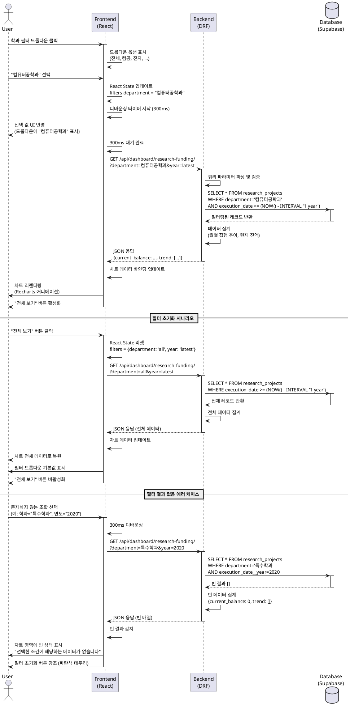

# 대시보드 필터링 기능 상세 유스케이스

**기능명:** 대시보드 필터링 (Dashboard Filtering)
**우선순위:** P0-MVP
**작성일:** 2025-11-02
**수정자:** Claude Code
**버전:** 2.0 (speccheck.md 개선사항 반영 완료)

**✅ 개선 완료**: speccheck.md 검토 보고서의 권장사항을 반영하여 다음 내용이 추가/개선되었습니다:
- 레이어 아키텍처 준수 명확화 (View/Service/Repository 분리)
- 보안 요구사항 구체화 (입력 검증, XSS/CSRF 방어, 로깅)
- 에러 코드 표준화 및 전체 목록
- 필터 옵션 동적 로딩 API 명세
- 프런트엔드 아키텍처 정합성 (Hook 역할 분리)
- 디바운싱 구현 세부사항 (useRef + cleanup)
- 차트 데이터 동기화 전략
- 테스트 데이터 준비 전략

---

## 1. 기능 개요

대시보드에서 사용자가 학과, 기간, 학적상태, 저널등급 등의 조건을 선택하여 특정 데이터만 조회할 수 있는 필터링 기능입니다. 프런트엔드에서 React State로 필터 상태를 관리하고, API 쿼리 파라미터로 백엔드에 전달하여 Django ORM WHERE 절을 적용합니다.

**핵심 가치:**
- 사용자가 관심 있는 데이터만 빠르게 조회
- 직관적이고 간단한 단일 선택 방식 (MVP 제약)
- 불필요한 API 호출 방지 (디바운싱)

**MVP 제약:**
- 단순 단일 선택만 지원 (복잡한 다중 선택 제외)
- 커스텀 날짜 범위 선택 제외 (프리셋만 제공)
- URL 쿼리 파라미터 공유 기능은 POST-MVP

---

## 2. 사용자 스토리 (GIVEN-WHEN-THEN)

### 스토리 1: 학과 필터 적용
```
GIVEN 내부 직원이 메인 대시보드에 접속한 상태에서
WHEN 학과 필터 드롭다운에서 "컴퓨터공학과"를 선택하면
THEN 모든 차트가 컴퓨터공학과 데이터만으로 업데이트되고
AND 필터 초기화 버튼이 활성화된다
```

### 스토리 2: 기간 필터 적용
```
GIVEN 학과 필터가 이미 적용된 상태에서
WHEN 기간 필터에서 "2024년"을 선택하면
THEN 2024년 + 컴퓨터공학과 데이터만 차트에 표시되고
AND 두 필터가 AND 조건으로 결합된다
```

### 스토리 3: 필터 결과 없음
```
GIVEN 사용자가 학과와 기간 필터를 적용한 상태에서
WHEN 해당 조건에 맞는 데이터가 없으면
THEN 차트 영역에 "선택한 조건에 해당하는 데이터가 없습니다" 메시지가 표시되고
AND 필터 초기화 버튼이 강조 표시된다
```

### 스토리 4: 필터 초기화
```
GIVEN 여러 필터가 적용된 상태에서
WHEN "전체 보기" 버튼을 클릭하면
THEN 모든 필터가 기본값으로 리셋되고
AND 전체 데이터로 차트가 복원된다
```

---

## 3. Primary Actor

**내부 직원 (Internal Staff / Viewer)**
- 대학교 전 직원에게 대시보드 조회 권한 부여
- 의사결정을 위해 특정 조건의 데이터 조회 필요
- 기술적 숙련도: 초급~중급 (드롭다운 사용 가능)

---

## 4. Precondition (사용자 관점)

1. 사용자가 메인 대시보드 페이지에 접속한 상태
2. 최소 1개 이상의 데이터 파일이 업로드되어 차트가 표시 중
3. 브라우저가 JavaScript를 지원하며 정상 작동 중

---

## 5. Trigger

- 사용자가 필터 드롭다운 또는 라디오 버튼/체크박스를 클릭
- 필터 값 선택 후 디바운싱(300ms) 타이머 만료
- 필터 초기화 버튼 클릭

---

## 6. Main Scenario

### 6.1 필터 조건 선택 및 적용

**Step 1: 사용자가 필터 UI 접근**
- 대시보드 상단 또는 우측에 필터 패널 표시
- 4가지 필터 옵션 제공:
  - 학과 필터 (드롭다운, 공통)
  - 기간 필터 (드롭다운, 공통)
  - 학적상태 필터 (라디오 버튼, 학생 차트 전용)
  - 저널등급 필터 (체크박스, 논문 차트 전용)

**Step 2: 필터 값 선택**
- 학과 드롭다운 옵션:
  - "전체 학과" (기본값)
  - "컴퓨터공학과", "전자공학과", ... (DB에서 동적 로드)
- 기간 드롭다운 옵션:
  - "최근 1년" (기본값)
  - "최근 3년"
  - "2024년", "2023년", "2022년", ...
- 학적상태 라디오 버튼:
  - "전체" (기본값)
  - "재학"
  - "졸업"
- 저널등급 체크박스:
  - "SCIE"
  - "KCI"
  - "전체" 선택 시 모든 체크 해제

**Step 3: React State 업데이트**
- 선택된 값을 React State에 저장
- 디바운싱 타이머 시작 (300ms)
- 선택된 필터 UI에 시각적 피드백 (하이라이트)

**Step 4: 디바운싱 후 API 호출**
- 300ms 동안 추가 변경이 없으면 API 호출 실행
- 필터 조건을 쿼리 파라미터로 변환
- 예시:
  ```
  GET /api/dashboard/research-funding/?department=컴퓨터공학과&year=2024
  GET /api/dashboard/students/?department=컴퓨터공학과&status=재학
  GET /api/dashboard/publications/?department=컴퓨터공학과&year=2024&tier=SCIE
  GET /api/dashboard/department-kpi/?year=2024
  ```

**Step 5: 백엔드 필터링 쿼리 실행**
- DRF View에서 쿼리 파라미터 파싱
- Django ORM WHERE 절 동적 구성:
  ```python
  queryset = ResearchProject.objects.all()
  if department != 'all':
      queryset = queryset.filter(department=department)
  if year != 'latest':
      queryset = queryset.filter(execution_date__year=year)
  ```
- 필터링된 데이터 집계 및 JSON 응답 반환

**Step 6: 차트 리렌더링**
- 프런트엔드에서 새 데이터 수신
- Recharts 컴포넌트 데이터 바인딩 업데이트
- 부드러운 애니메이션과 함께 차트 전환 (1초 미만)
- 로딩 스피너는 짧게 표시

**Step 7: 사용자 피드백**
- 필터링된 차트 표시
- 필터 드롭다운에 선택된 값 표시
- "전체 보기" 버튼 활성화

### 6.2 필터 초기화

**Step 1: 사용자가 "전체 보기" 버튼 클릭**
- 버튼 위치: 필터 패널 하단 또는 우측 상단

**Step 2: React State 리셋**
- 모든 필터 값을 기본값으로 변경:
  - 학과: "전체 학과"
  - 기간: "최근 1년"
  - 학적상태: "전체"
  - 저널등급: 전체 체크 해제

**Step 3: 기본 필터로 API 재호출**
- 기본 조건으로 데이터 요청
- 예시: `GET /api/dashboard/research-funding/?department=all&year=latest`

**Step 4: 차트 전체 데이터로 복원**
- 필터 드롭다운 기본값으로 리셋
- "전체 보기" 버튼 비활성화

---

## 7. Edge Cases

### Case 1: 필터 결과 데이터 없음
**발생 조건:** 선택한 필터 조건에 해당하는 레코드가 DB에 없음

**처리:**
- 차트 영역에 빈 상태 일러스트레이션 표시
- 메시지: "선택한 조건에 해당하는 데이터가 없습니다."
- 추천: "다른 필터 조건을 선택하거나 '전체 보기'를 클릭하세요."
- 필터 초기화 버튼 강조 (파란색 테두리)

### Case 2: 잘못된 필터 값 (URL 직접 수정)
**발생 조건:** 사용자가 URL을 직접 편집하여 유효하지 않은 필터 값 전달

**처리:**
- 백엔드에서 400 Bad Request 반환
- 프런트엔드에서 에러 토스트 표시: "유효하지 않은 필터 값입니다."
- 자동으로 필터 초기화 수행
- 전체 데이터로 차트 복원

### Case 3: 필터 빠른 연속 변경
**발생 조건:** 사용자가 드롭다운에서 여러 옵션을 빠르게 클릭

**처리:**
- 디바운싱으로 마지막 선택만 적용
- 중간 선택 값들은 무시
- 불필요한 API 호출 방지
- 예시: 300ms 내에 "컴퓨터공학과" → "전자공학과" 선택 시, "전자공학과"만 적용

### Case 4: API 호출 실패
**발생 조건:** 네트워크 오류 또는 서버 에러로 필터링 API 호출 실패

**처리:**
- 기존 차트 데이터 유지 (마지막 성공 데이터)
- 에러 토스트 알림: "필터 적용 중 오류가 발생했습니다. 다시 시도하세요."
- "재시도" 버튼 표시
- 필터 값은 UI에 유지 (사용자가 다시 선택하지 않아도 됨)

### Case 5: 다중 필터 조합으로 결과 과도하게 좁음
**발생 조건:** 학과 + 기간 + 학적상태 등 여러 필터 동시 적용 시 데이터 1~2건만 존재

**처리:**
- 정상적으로 필터링된 데이터 표시
- 하단에 인포 메시지: "필터 조건이 매우 구체적입니다. 더 많은 데이터를 보려면 필터를 완화하세요."
- 차트는 표시하되, 데이터 포인트가 매우 적다는 것을 시각적으로 표현

### Case 6: 필터 적용 중 페이지 새로고침
**발생 조건:** 사용자가 필터 적용 중 브라우저 새로고침 (F5)

**처리 (MVP):**
- 필터 상태 손실 (세션 내에서만 유지)
- 페이지 로드 시 기본 필터 값으로 초기화
- (POST-MVP: URL 쿼리 파라미터로 필터 상태 복원)

---

## 8. Business Rules

### BR1: 필터 조합 AND 조건
- 여러 필터가 선택되면 AND 조건으로 결합
- 예시: 학과="컴퓨터공학과" AND 기간="2024년"

### BR2: 기본 필터 값
- 학과: "전체 학과" (WHERE 절 미적용)
- 기간: "최근 1년" (현재 날짜 기준 -365일)

### BR3: 차트별 필터 독립성
- 공통 필터(학과, 기간)는 모든 차트에 적용
- 전용 필터(학적상태, 저널등급)는 특정 차트에만 적용
- 예시: 학적상태 필터는 학생 차트에만 영향

### BR4: 디바운싱 시간
- 필터 선택 후 300ms 대기
- 빠른 연속 선택 시 마지막 값만 API 호출

### BR5: 필터 UI 활성화 조건
- 데이터가 존재하는 필터 옵션만 활성화
- 예시: DB에 2024년 데이터만 있으면 "2023년" 옵션 비활성화 (또는 회색 표시)

---

## 9. API 명세

### 9.1 연구비 집행 필터링 API

**Endpoint:** `GET /api/dashboard/research-funding/`

**Query Parameters:**
| 파라미터 | 타입 | 필수 | 기본값 | 설명 |
|---------|------|------|--------|------|
| department | String | N | "all" | 학과명 또는 "all" |
| year | String | N | "latest" | YYYY 형식 또는 "latest" (최근 1년) |
| period | String | N | "1y" | "1y", "3y" (년수) |

**Response (200 OK):**
```json
{
  "current_balance": 1530000000,
  "trend": [
    {
      "month": "2024-01",
      "execution_amount": 120000000,
      "balance": 1530000000
    },
    {
      "month": "2024-02",
      "execution_amount": 98000000,
      "balance": 1432000000
    }
  ]
}
```

**Error Response (400 Bad Request):**
```json
{
  "error": "invalid_parameter",
  "message": "유효하지 않은 필터 값입니다.",
  "details": {
    "year": "올바른 연도 형식이 아닙니다. (YYYY)"
  }
}
```

### 9.2 학생 현황 필터링 API

**Endpoint:** `GET /api/dashboard/students/`

**Query Parameters:**
| 파라미터 | 타입 | 필수 | 기본값 | 설명 |
|---------|------|------|--------|------|
| department | String | N | "all" | 학과명 또는 "all" |
| status | String | N | "all" | "재학", "졸업", "all" |
| program_type | String | N | "all" | "학사", "석사", "박사", "all" |

**Response (200 OK):**
```json
{
  "total_students": 1234,
  "by_department": [
    {
      "department": "컴퓨터공학과",
      "program_breakdown": {
        "학사": 120,
        "석사": 35,
        "박사": 12
      }
    }
  ]
}
```

### 9.3 논문 실적 필터링 API

**Endpoint:** `GET /api/dashboard/publications/`

**Query Parameters:**
| 파라미터 | 타입 | 필수 | 기본값 | 설명 |
|---------|------|------|--------|------|
| department | String | N | "all" | 학과명 또는 "all" |
| year | String | N | "latest" | YYYY 형식 또는 "latest" |
| tier | String | N | "all" | "SCIE", "KCI", "all" |

**Response (200 OK):**
```json
{
  "total_papers": 156,
  "avg_impact_factor": 2.3,
  "by_tier": [
    {
      "tier": "SCIE",
      "count": 89,
      "percentage": 57.1,
      "avg_if": 3.2
    },
    {
      "tier": "KCI",
      "count": 67,
      "percentage": 42.9,
      "avg_if": null
    }
  ]
}
```

### 9.4 학과 KPI 필터링 API

**Endpoint:** `GET /api/dashboard/department-kpi/`

**Query Parameters:**
| 파라미터 | 타입 | 필수 | 기본값 | 설명 |
|---------|------|------|--------|------|
| year | String | N | "latest" | YYYY 형식 또는 "latest" |
| department | String | N | "all" | 학과명 또는 "all" |

**Response (200 OK):**
```json
{
  "trend": [
    {
      "year": 2023,
      "avg_employment_rate": 78.5,
      "total_tech_income": 123000000
    },
    {
      "year": 2024,
      "avg_employment_rate": 80.2,
      "total_tech_income": 145000000
    }
  ]
}
```

### 9.5 필터 옵션 메타데이터 API

**Endpoint:** `GET /api/dashboard/filter-options/`

**Query Parameters:** 없음

**Response (200 OK):**
```json
{
  "departments": [
    "전체 학과",
    "컴퓨터공학과",
    "전자공학과",
    "기계공학과",
    "화학공학과",
    "산업공학과"
  ],
  "years": [
    "최근 1년",
    "최근 3년",
    "2024년",
    "2023년",
    "2022년",
    "2021년"
  ],
  "student_statuses": [
    "전체",
    "재학",
    "졸업",
    "휴학"
  ],
  "journal_tiers": [
    "SCIE",
    "KCI"
  ]
}
```

**프런트엔드 처리:**
- 대시보드 마운트 시 1회 호출
- React Context 또는 전역 상태에 캐싱
- 실패 시 하드코딩된 기본값 사용 (Fallback)

```javascript
// hooks/useFilterOptions.js
import { useState, useEffect } from 'react';
import { dataApiClient } from '../api/dataApiClient';

const DEFAULT_OPTIONS = {
  departments: ['전체 학과', '컴퓨터공학과', '전자공학과'],
  years: ['최근 1년', '2024년', '2023년'],
  student_statuses: ['전체', '재학', '졸업'],
  journal_tiers: ['SCIE', 'KCI']
};

export const useFilterOptions = () => {
  const [options, setOptions] = useState(DEFAULT_OPTIONS);
  const [isLoading, setIsLoading] = useState(true);

  useEffect(() => {
    const fetchOptions = async () => {
      try {
        const response = await dataApiClient.get('/api/dashboard/filter-options/');
        setOptions(response.data);
      } catch (error) {
        console.warn('Failed to load filter options, using defaults', error);
        // 실패 시 기본값 유지
      } finally {
        setIsLoading(false);
      }
    };

    fetchOptions();
  }, []);

  return { options, isLoading };
};
```

**Error Response (500 Internal Server Error):**
```json
{
  "error": "server_error",
  "message": "필터 옵션을 불러오는 중 오류가 발생했습니다.",
  "timestamp": "2025-11-02T10:30:00Z"
}
```

---

## 10. 프런트엔드 아키텍처 정합성

### 10.1 레이어별 책임 분리

**CLAUDE.md 프런트엔드 구조 준수:**

**hooks/useDashboardFilter.js** (필터 상태 관리 전담)
- 필터 상태 관리 (React State)
- 디바운싱 로직
- 필터 변경 핸들러
- 필터 초기화 핸들러

**hooks/useDashboardData.js** (데이터 관리)
- API 호출 오케스트레이션
- 차트 데이터 변환 (UI 라이브러리 독립적)
- 로딩/에러 상태 관리

**api/dataApiClient.js** (API Contract Layer)
- HTTP 요청 전송 (Axios/Fetch)
- 쿼리 파라미터 직렬화
- 에러 응답 파싱
- 인증 헤더 관리 (필요 시)

**components/dashboard/FilterPanel.jsx** (Presentation Layer)
- 필터 UI 렌더링
- 사용자 입력 이벤트 핸들링
- useDashboardFilter Hook 사용

### 10.2 필터 상태 관리 (hooks/useDashboardFilter.js)

```javascript
// hooks/useDashboardFilter.js
import { useState, useRef, useEffect, useCallback } from 'react';

export const useDashboardFilter = () => {
  const [filters, setFilters] = useState({
    department: 'all',
    year: 'latest',
    period: '1y',
    studentStatus: 'all',
    journalTier: 'all'
  });

  const [isFilterApplied, setIsFilterApplied] = useState(false);
  const debounceTimerRef = useRef(null);

  // 필터 변경 핸들러 (디바운싱 포함)
  const handleFilterChange = useCallback((filterKey, value) => {
    // State 업데이트
    setFilters(prev => ({
      ...prev,
      [filterKey]: value
    }));

    // 디바운싱
    if (debounceTimerRef.current) {
      clearTimeout(debounceTimerRef.current);
    }

    debounceTimerRef.current = setTimeout(() => {
      // 필터 적용 상태 업데이트
      setIsFilterApplied(true);
    }, 300);
  }, []);

  // 필터 초기화
  const handleResetFilters = useCallback(() => {
    const defaultFilters = {
      department: 'all',
      year: 'latest',
      period: '1y',
      studentStatus: 'all',
      journalTier: 'all'
    };

    setFilters(defaultFilters);
    setIsFilterApplied(false);
  }, []);

  // Cleanup on unmount
  useEffect(() => {
    return () => {
      if (debounceTimerRef.current) {
        clearTimeout(debounceTimerRef.current);
      }
    };
  }, []);

  return {
    filters,
    isFilterApplied,
    handleFilterChange,
    handleResetFilters
  };
};
```

### 10.3 데이터 관리 (hooks/useDashboardData.js)

```javascript
// hooks/useDashboardData.js
import { useState, useEffect } from 'react';
import { dataApiClient } from '../api/dataApiClient';

export const useDashboardData = (filters) => {
  const [data, setData] = useState({
    researchFunding: null,
    students: null,
    publications: null,
    departmentKpi: null
  });
  const [isLoading, setIsLoading] = useState(false);
  const [error, setError] = useState(null);

  useEffect(() => {
    const fetchAllDashboardData = async () => {
      setIsLoading(true);
      setError(null);

      try {
        // 병렬 API 호출 (Promise.all)
        const [researchFunding, students, publications, departmentKpi] = await Promise.all([
          dataApiClient.get('/api/dashboard/research-funding/', { params: filters }),
          dataApiClient.get('/api/dashboard/students/', { params: filters }),
          dataApiClient.get('/api/dashboard/publications/', { params: filters }),
          dataApiClient.get('/api/dashboard/department-kpi/', { params: filters })
        ]);

        setData({
          researchFunding: researchFunding.data,
          students: students.data,
          publications: publications.data,
          departmentKpi: departmentKpi.data
        });
      } catch (err) {
        setError(err);
        console.error('Failed to fetch dashboard data', err);
      } finally {
        setIsLoading(false);
      }
    };

    fetchAllDashboardData();
  }, [filters]); // filters 변경 시 재호출

  return { data, isLoading, error };
};
```

### 10.4 차트 데이터 동기화 전략

**MVP 권장 방식: 병렬 API 호출 (Promise.all)**

**장점:**
- 기존 API 구조 유지 (각 대시보드 엔드포인트 독립적)
- 병렬 처리로 성능 확보 (최대 응답 시간 = 가장 느린 API)
- 모든 차트 데이터가 동시에 업데이트되어 일관성 유지

**구현:**
```javascript
// 모든 차트 데이터를 한 번에 가져옴
const fetchAllDashboardData = async (filters) => {
  const [researchFunding, students, publications, departmentKpi] = await Promise.all([
    dataApiClient.get('/api/dashboard/research-funding/', { params: filters }),
    dataApiClient.get('/api/dashboard/students/', { params: filters }),
    dataApiClient.get('/api/dashboard/publications/', { params: filters }),
    dataApiClient.get('/api/dashboard/department-kpi/', { params: filters })
  ]);

  return { researchFunding, students, publications, departmentKpi };
};
```

**대안 (POST-MVP): 단일 API 호출**
```javascript
// 모든 차트 데이터를 한 번의 API로 가져옴
const fetchAllDashboardData = async (filters) => {
  const response = await dataApiClient.get('/api/dashboard/all/', { params: filters });
  return {
    researchFunding: response.data.research_funding,
    students: response.data.students,
    publications: response.data.publications,
    departmentKpi: response.data.department_kpi
  };
};
```

### 10.5 컴포넌트 통합 예시

```javascript
// pages/Dashboard.jsx
import { useDashboardFilter } from '../hooks/useDashboardFilter';
import { useDashboardData } from '../hooks/useDashboardData';
import { FilterPanel } from '../components/dashboard/FilterPanel';
import { ResearchFundingChart } from '../components/dashboard/ResearchFundingChart';

export const Dashboard = () => {
  const { filters, isFilterApplied, handleFilterChange, handleResetFilters } = useDashboardFilter();
  const { data, isLoading, error } = useDashboardData(filters);

  if (isLoading) return <LoadingSpinner />;
  if (error) return <ErrorMessage error={error} />;

  return (
    <div className="dashboard">
      <FilterPanel
        filters={filters}
        onFilterChange={handleFilterChange}
        onReset={handleResetFilters}
        isApplied={isFilterApplied}
      />
      <ResearchFundingChart data={data.researchFunding} />
      <StudentChart data={data.students} />
      <PublicationChart data={data.publications} />
      <DepartmentKpiChart data={data.departmentKpi} />
    </div>
  );
};
```

---

## 11. 백엔드 레이어 아키텍처 준수

### 11.1 레이어별 책임 분리

**Simple Layered Architecture 준수:**
- **api/views.py** (Presentation Layer): Thin Controller - 파라미터 파싱 및 Service 위임
- **services/filtering_service.py** (Service Layer): 비즈니스 로직 - 필터 조건 구성, 집계 로직
- **infrastructure/repositories.py** (Persistence Layer): 데이터 접근 - Django ORM 쿼리

### 11.2 Thin Controller (api/views.py)

```python
# api/views.py
from rest_framework.decorators import api_view
from rest_framework.response import Response
from rest_framework.exceptions import ValidationError
from services.filtering_service import FilteringService

@api_view(['GET'])
def research_funding_view(request):
    """연구비 집행 필터링 API - Thin Controller"""
    # 1. 쿼리 파라미터 파싱
    department = request.query_params.get('department', 'all')
    year = request.query_params.get('year', 'latest')

    try:
        # 2. Service Layer로 위임
        result = FilteringService.get_research_funding(department, year)
        return Response(result)
    except ValidationError as e:
        return Response({
            'error': 'invalid_parameter',
            'message': str(e),
            'details': e.detail
        }, status=400)
```

### 11.3 Service Layer (services/filtering_service.py)

```python
# services/filtering_service.py
from datetime import datetime, timedelta
from infrastructure.repositories import ResearchProjectRepository
from api.validators import validate_filter_params

class FilteringService:
    """필터링 비즈니스 로직 담당"""

    @staticmethod
    def get_research_funding(department: str, year: str) -> dict:
        """연구비 집행 데이터 필터링 및 집계"""
        # 1. 필터 파라미터 검증
        validate_filter_params({'department': department, 'year': year})

        # 2. 필터 조건 구성
        filters = FilteringService._build_date_filter(year)
        if department != 'all':
            filters['department'] = department

        # 3. Repository Layer로 데이터 조회
        queryset = ResearchProjectRepository.find_by_filters(filters)

        # 4. 집계 로직
        current_balance = FilteringService._calculate_balance(queryset)
        trend_data = FilteringService._calculate_monthly_trend(queryset)

        return {
            'current_balance': current_balance,
            'trend': trend_data
        }

    @staticmethod
    def _build_date_filter(year: str) -> dict:
        """날짜 필터 조건 구성"""
        if year == 'latest':
            one_year_ago = datetime.now() - timedelta(days=365)
            return {'execution_date__gte': one_year_ago}
        elif year.isdigit():
            return {'execution_date__year': int(year)}
        else:
            raise ValidationError({'year': '올바른 연도 형식이 아닙니다. (YYYY)'})

    @staticmethod
    def _calculate_balance(queryset) -> int:
        """현재 잔액 계산"""
        from django.db.models import Sum
        result = queryset.aggregate(
            total_budget=Sum('total_budget'),
            total_execution=Sum('execution_amount')
        )
        return (result['total_budget'] or 0) - (result['total_execution'] or 0)

    @staticmethod
    def _calculate_monthly_trend(queryset) -> list:
        """월별 집행 추이 계산"""
        from django.db.models import Sum
        trend = queryset.values('execution_date__month').annotate(
            execution_amount=Sum('execution_amount')
        ).order_by('execution_date__month')
        return list(trend)
```

### 11.4 Repository Layer (infrastructure/repositories.py)

```python
# infrastructure/repositories.py
from infrastructure.models import ResearchProject
from django.db.models import QuerySet

class ResearchProjectRepository:
    """연구비 프로젝트 데이터 접근 전담"""

    @staticmethod
    def find_by_filters(filters: dict) -> QuerySet:
        """필터 조건에 맞는 연구비 프로젝트 조회"""
        queryset = ResearchProject.objects.select_related('department').all()

        # 동적 필터링
        if filters:
            queryset = queryset.filter(**filters)

        return queryset

    @staticmethod
    def find_all() -> QuerySet:
        """전체 연구비 프로젝트 조회"""
        return ResearchProject.objects.select_related('department').all()
```

### 11.5 필터 검증 로직 (api/validators.py)

```python
# api/validators.py
from rest_framework.exceptions import ValidationError

VALID_DEPARTMENTS = ['컴퓨터공학과', '전자공학과', '기계공학과', ...]
VALID_ENROLLMENT_STATUS = ['재학', '졸업', '휴학', 'all']
VALID_JOURNAL_TIERS = ['SCIE', 'KCI', 'all']

def validate_filter_params(params: dict):
    """필터 파라미터 Whitelist 검증"""
    errors = {}

    department = params.get('department')
    if department and department != 'all' and department not in VALID_DEPARTMENTS:
        errors['department'] = '유효하지 않은 학과입니다.'

    year = params.get('year')
    if year and year != 'latest' and not (year.isdigit() and len(year) == 4):
        errors['year'] = '올바른 연도 형식이 아닙니다. (YYYY)'

    if errors:
        raise ValidationError(errors)
```

---

## 12. 보안 요구사항 (Security Requirements)

### 12.1 입력 검증 계층

**클라이언트 검증 (UX 개선 목적):**
- 드롭다운 UI로 유효한 옵션만 선택 가능
- URL 쿼리 파라미터 직접 조작 시도 감지 (POST-MVP)

```javascript
// URL에서 필터 읽기 (POST-MVP 기능)
const urlParams = new URLSearchParams(window.location.search);
const department = urlParams.get('department');

// Whitelist 검증
const VALID_DEPARTMENTS = ['컴퓨터공학과', '전자공학과', ...];
if (department && !VALID_DEPARTMENTS.includes(department)) {
  console.warn('Invalid department in URL');
  resetFilters();
}
```

**서버 검증 (보안 필수):**
- 모든 쿼리 파라미터 Whitelist 검증 (validators.py)
- Django ORM Parameterized Query 사용 (SQL Injection 방어)
- Serializer 레벨 타입 검증

### 12.2 XSS 방어

**React 기본 방어 메커니즘:**
- JSX는 기본적으로 값을 이스케이프 처리
- `dangerouslySetInnerHTML` 사용 금지

**차트 라벨 sanitization:**
```javascript
// Recharts에 사용자 입력 렌더링 시
import DOMPurify from 'dompurify';

const sanitizedLabel = DOMPurify.sanitize(userInputLabel);
<LineChart data={data}>
  <XAxis label={sanitizedLabel} />
</LineChart>
```

### 12.3 CSRF 방어

**MVP:**
- GET 요청만 사용하므로 CSRF 위험 없음 (조회 전용)
- State-changing operation이 없으므로 CSRF 토큰 불필요

**POST-MVP (필터 프리셋 저장 기능 추가 시):**
- DRF CSRF middleware 활성화
- POST/PUT/DELETE 요청에 CSRF 토큰 필수

### 12.4 로깅 및 감사 (Audit)

**로깅 대상:**
- 필터 API 호출 빈도 (IP, User Agent, 필터 조건)
- 400/500 에러 발생 시 상세 컨텍스트
- 비정상적으로 많은 API 호출 (Potential DoS)

**로깅 레벨:**
- INFO: 정상 필터 요청
- WARNING: 잘못된 필터 값 (400)
- ERROR: 서버 에러 (500)

**구현 예시:**
```python
import logging
logger = logging.getLogger(__name__)

@api_view(['GET'])
def research_funding_view(request):
    logger.info(f"Filter request: {request.query_params}", extra={
        'ip': request.META.get('REMOTE_ADDR'),
        'user_agent': request.META.get('HTTP_USER_AGENT')
    })
    # ... 필터링 로직
```

### 12.5 SQL Injection 방어

**Django ORM Parameterized Query 사용:**
```python
# ✅ 안전 (Parameterized Query)
queryset = ResearchProject.objects.filter(department=department)

# ❌ 위험 (Raw SQL)
queryset = ResearchProject.objects.raw(
    f"SELECT * FROM research_project WHERE department='{department}'"
)
```

**Raw SQL 사용 시 (불가피한 경우):**
```python
from django.db import connection

with connection.cursor() as cursor:
    # Parameterized query 사용
    cursor.execute(
        "SELECT * FROM research_project WHERE department=%s",
        [department]  # 파라미터 바인딩
    )
```

---

## 13. 에러 코드 명세 (Error Codes)

### 13.1 표준 에러 응답 구조

**모든 API 엔드포인트 공통 형식:**
```json
{
  "error": "error_code",
  "message": "사용자 친화적 메시지 (한글)",
  "details": {
    "field_name": "구체적인 에러 설명"
  },
  "timestamp": "2025-11-02T10:30:00Z",
  "path": "/api/dashboard/research-funding/"
}
```

### 13.2 에러 코드 전체 목록

| 에러 코드 | HTTP Status | 메시지 | 프런트엔드 처리 |
|----------|-------------|--------|----------------|
| `invalid_parameter` | 400 | 유효하지 않은 필터 값입니다. | 에러 토스트 + 필터 초기화 |
| `invalid_year_format` | 400 | 올바른 연도 형식이 아닙니다. (YYYY) | 에러 토스트 + 연도 필터 리셋 |
| `invalid_department` | 400 | 유효하지 않은 학과입니다. | 에러 토스트 + 학과 필터 리셋 |
| `invalid_status` | 400 | 유효하지 않은 학적상태입니다. | 에러 토스트 + 상태 필터 리셋 |
| `invalid_journal_tier` | 400 | 유효하지 않은 저널등급입니다. | 에러 토스트 + 저널 필터 리셋 |
| `server_error` | 500 | 서버 오류가 발생했습니다. | 에러 토스트 + 재시도 버튼 |
| `timeout` | 504 | 요청 시간이 초과되었습니다. | 에러 토스트 + 재시도 버튼 |

### 13.3 프런트엔드 에러 핸들링 매핑

```javascript
// api/dataApiClient.js
const handleApiError = (error) => {
  const errorCode = error.response?.data?.error;
  const message = error.response?.data?.message;

  switch (errorCode) {
    case 'invalid_parameter':
    case 'invalid_year_format':
    case 'invalid_department':
      toast.error(message);
      resetFilters();
      break;
    case 'server_error':
    case 'timeout':
      toast.error(message, {
        action: {
          label: '재시도',
          onClick: () => retryRequest()
        }
      });
      break;
    default:
      toast.error('알 수 없는 오류가 발생했습니다.');
  }
};
```

---

## 14. 테스트 요구사항 (TDD)

### 14.1 Unit Tests (70%)

**프런트엔드 (React/Jest):**
```javascript
describe('Dashboard Filter Logic', () => {
  it('필터 선택 시 state가 올바르게 업데이트되어야 함', () => {
    const { result } = renderHook(() => useDashboardData());
    act(() => {
      result.current.handleFilterChange('department', '컴퓨터공학과');
    });
    expect(result.current.filters.department).toBe('컴퓨터공학과');
  });

  it('디바운싱이 300ms 후에 API 호출해야 함', async () => {
    jest.useFakeTimers();
    const mockFetch = jest.fn();
    const { result } = renderHook(() => useDashboardData());

    act(() => {
      result.current.handleFilterChange('department', '컴퓨터공학과');
      jest.advanceTimersByTime(299);
    });
    expect(mockFetch).not.toHaveBeenCalled();

    act(() => {
      jest.advanceTimersByTime(1);
    });
    expect(mockFetch).toHaveBeenCalledTimes(1);
  });

  it('필터 초기화 시 모든 필터가 기본값으로 리셋되어야 함', () => {
    const { result } = renderHook(() => useDashboardData());
    act(() => {
      result.current.handleFilterChange('department', '컴퓨터공학과');
      result.current.handleResetFilters();
    });
    expect(result.current.filters.department).toBe('all');
  });
});
```

**백엔드 (Django/pytest):**
```python
def test_filter_by_department(client, research_projects_data):
    """학과 필터 적용 시 해당 학과 데이터만 반환"""
    response = client.get('/api/dashboard/research-funding/?department=컴퓨터공학과')
    assert response.status_code == 200
    data = response.json()
    # 모든 데이터가 컴퓨터공학과인지 검증
    for item in data['trend']:
        assert item['department'] == '컴퓨터공학과'

def test_filter_by_year(client, research_projects_data):
    """연도 필터 적용 시 해당 연도 데이터만 반환"""
    response = client.get('/api/dashboard/research-funding/?year=2024')
    assert response.status_code == 200
    data = response.json()
    for item in data['trend']:
        assert item['month'].startswith('2024')

def test_invalid_filter_value_returns_400(client):
    """잘못된 필터 값 전달 시 400 에러 반환"""
    response = client.get('/api/dashboard/research-funding/?year=invalid')
    assert response.status_code == 400
    assert 'error' in response.json()

def test_multiple_filters_combined_with_and(client, research_projects_data):
    """다중 필터 적용 시 AND 조건으로 결합"""
    response = client.get('/api/dashboard/research-funding/?department=컴퓨터공학과&year=2024')
    assert response.status_code == 200
    data = response.json()
    # 컴퓨터공학과 AND 2024년 데이터만 존재
    assert all(
        item['department'] == '컴퓨터공학과' and item['month'].startswith('2024')
        for item in data['trend']
    )
```

### 14.2 Integration Tests (20%)

```python
def test_filter_workflow_end_to_end(client, uploaded_data):
    """필터 선택 → API 호출 → 차트 업데이트 전체 플로우"""
    # 1. 초기 데이터 로드
    response = client.get('/api/dashboard/research-funding/')
    assert response.status_code == 200
    initial_count = len(response.json()['trend'])

    # 2. 필터 적용
    response = client.get('/api/dashboard/research-funding/?department=컴퓨터공학과')
    assert response.status_code == 200
    filtered_count = len(response.json()['trend'])
    assert filtered_count < initial_count  # 필터링으로 데이터 감소

    # 3. 필터 초기화 (기본값으로 재요청)
    response = client.get('/api/dashboard/research-funding/?department=all&year=latest')
    assert response.status_code == 200
    reset_count = len(response.json()['trend'])
    assert reset_count == initial_count  # 전체 데이터로 복원
```

### 14.3 E2E Tests (10%)

```javascript
// Playwright 또는 Cypress
describe('Dashboard Filtering E2E', () => {
  it('사용자가 학과 필터를 선택하고 차트가 업데이트됨', async () => {
    await page.goto('/dashboard');

    // 초기 차트 데이터 포인트 수 확인
    const initialPoints = await page.$$('.recharts-line-dot');

    // 학과 필터 드롭다운 클릭 및 선택
    await page.click('[data-testid="department-filter"]');
    await page.click('[data-value="컴퓨터공학과"]');

    // 300ms 디바운싱 대기
    await page.waitForTimeout(350);

    // API 응답 대기
    await page.waitForResponse(res =>
      res.url().includes('/api/dashboard/') && res.status() === 200
    );

    // 차트 리렌더링 확인
    const filteredPoints = await page.$$('.recharts-line-dot');
    expect(filteredPoints.length).toBeLessThan(initialPoints.length);

    // 필터 드롭다운에 선택된 값 표시 확인
    const selectedValue = await page.$eval(
      '[data-testid="department-filter"]',
      el => el.textContent
    );
    expect(selectedValue).toContain('컴퓨터공학과');
  });

  it('필터 결과 없을 시 빈 상태 메시지 표시', async () => {
    await page.goto('/dashboard');

    // 존재하지 않는 데이터 조합 필터 선택
    await page.click('[data-testid="department-filter"]');
    await page.click('[data-value="특수학과"]');
    await page.waitForTimeout(350);

    // 빈 상태 메시지 표시 확인
    const emptyMessage = await page.textContent('[data-testid="empty-state"]');
    expect(emptyMessage).toContain('선택한 조건에 해당하는 데이터가 없습니다');
  });
});
```

### 14.4 테스트 데이터 준비 (Test Fixtures)

**Django Fixtures:**
```python
# tests/fixtures/research_projects.py
import pytest
from django.utils import timezone
from datetime import timedelta
from data_ingestion.infrastructure.models import ResearchProject

@pytest.fixture
def research_projects_data(db):
    """필터링 테스트용 연구비 데이터"""
    projects = [
        ResearchProject(
            execution_id='R2024001',
            department='컴퓨터공학과',
            total_budget=10000000,
            execution_date=timezone.now(),
            execution_amount=1000000
        ),
        ResearchProject(
            execution_id='R2024002',
            department='전자공학과',
            total_budget=8000000,
            execution_date=timezone.now() - timedelta(days=30),
            execution_amount=800000
        ),
        ResearchProject(
            execution_id='R2023001',
            department='컴퓨터공학과',
            total_budget=5000000,
            execution_date=timezone.now() - timedelta(days=200),
            execution_amount=500000
        ),
        # 최소 10개 이상의 다양한 데이터 생성
        # (다양한 학과, 연도, 금액)
    ]
    ResearchProject.objects.bulk_create(projects)
    return projects
```

**React Testing Library Mocks:**
```javascript
// tests/mocks/dashboardData.js
export const mockResearchFundingData = {
  current_balance: 1530000000,
  trend: [
    { month: '2024-01', execution_amount: 120000000, balance: 1530000000 },
    { month: '2024-02', execution_amount: 98000000, balance: 1432000000 },
    { month: '2024-03', execution_amount: 105000000, balance: 1327000000 },
  ]
};

export const mockStudentData = {
  total_students: 1234,
  by_department: [
    {
      department: '컴퓨터공학과',
      program_breakdown: {
        '학사': 120,
        '석사': 35,
        '박사': 12
      }
    },
    {
      department: '전자공학과',
      program_breakdown: {
        '학사': 150,
        '석사': 40,
        '박사': 10
      }
    }
  ]
};

export const mockPublicationData = {
  total_papers: 156,
  avg_impact_factor: 2.3,
  by_tier: [
    { tier: 'SCIE', count: 89, percentage: 57.1, avg_if: 3.2 },
    { tier: 'KCI', count: 67, percentage: 42.9, avg_if: null }
  ]
};

export const mockDepartmentKpiData = {
  trend: [
    { year: 2023, avg_employment_rate: 78.5, total_tech_income: 123000000 },
    { year: 2024, avg_employment_rate: 80.2, total_tech_income: 145000000 }
  ]
};
```

**MSW (Mock Service Worker) 설정:**
```javascript
// tests/mocks/handlers.js
import { rest } from 'msw';
import { mockResearchFundingData, mockStudentData } from './dashboardData';

export const handlers = [
  rest.get('/api/dashboard/research-funding/', (req, res, ctx) => {
    const department = req.url.searchParams.get('department');
    const year = req.url.searchParams.get('year');

    // 필터에 따라 다른 응답 반환 (테스트 시나리오별)
    if (department === '컴퓨터공학과') {
      return res(ctx.json({
        ...mockResearchFundingData,
        trend: mockResearchFundingData.trend.slice(0, 2) // 필터링된 결과
      }));
    }

    return res(ctx.json(mockResearchFundingData));
  }),

  rest.get('/api/dashboard/filter-options/', (req, res, ctx) => {
    return res(ctx.json({
      departments: ['전체 학과', '컴퓨터공학과', '전자공학과'],
      years: ['최근 1년', '2024년', '2023년'],
      student_statuses: ['전체', '재학', '졸업'],
      journal_tiers: ['SCIE', 'KCI']
    }));
  })
];
```

---

## 15. 성능 요구사항

### 15.1 디바운싱
- 필터 선택 후 300ms 대기
- 빠른 연속 선택 시 불필요한 API 호출 방지
- 최대 절감: 10회 선택 → 1회 API 호출

### 15.2 API 응답 시간
- 필터링 쿼리 실행: 평균 200ms 이하
- 복잡한 집계 포함 시: 500ms 이하
- 타임아웃: 5초

### 15.3 차트 리렌더링
- Recharts 애니메이션 시간: 500ms~1초
- 로딩 스피너 표시: 500ms 이상 소요 시

### 15.4 데이터베이스 인덱스 전략

**필수 인덱스:**
```python
# infrastructure/models.py
class ResearchProject(models.Model):
    # ... 필드 정의
    class Meta:
        indexes = [
            models.Index(fields=['department', 'execution_date']),  # Composite index
            models.Index(fields=['execution_date']),  # 날짜 범위 쿼리용
        ]

class Student(models.Model):
    # ... 필드 정의
    class Meta:
        indexes = [
            models.Index(fields=['department', 'enrollment_status']),
        ]

class Publication(models.Model):
    # ... 필드 정의
    class Meta:
        indexes = [
            models.Index(fields=['department', 'journal_tier']),
        ]
```

**성능 목표:**
- 1만 건 데이터: < 50ms
- 10만 건 데이터: < 200ms
- 100만 건 데이터: < 500ms (MVP 범위 외)

---

## 16. UX 고려사항

### 16.1 필터 UI 배치
- 위치: 대시보드 상단 또는 우측 사이드바
- 공통 필터(학과, 기간)는 항상 표시
- 차트별 전용 필터는 해당 차트 근처에 표시

### 16.2 시각적 피드백
- 필터 선택 시 하이라이트 효과
- 적용 중 로딩 스피너 (300ms 이상 소요 시)
- 필터 초기화 버튼 색상 변경 (활성/비활성)

### 16.3 접근성 (Accessibility)
- 키보드 네비게이션 지원 (Tab, Enter)
- 스크린 리더 지원 (ARIA 라벨)
- 색상 대비 WCAG AA 준수

### 16.4 모바일 대응 (POST-MVP)
- MVP: 데스크톱 우선
- POST-MVP: 모바일 필터 패널 슬라이드 방식

---

## 17. Out of Scope (POST-MVP)

### 17.1 URL 기반 필터 공유
- 현재: 필터 상태는 세션 내에서만 유지
- POST-MVP: 쿼리 파라미터로 URL 생성 및 공유
  - 예시: `dashboard?dept=컴퓨터공학과&year=2024`

### 17.2 복잡한 다중 선택
- 현재: 단순 단일 선택만 지원
- POST-MVP: 여러 학과 동시 선택, 날짜 범위 슬라이더 등

### 17.3 커스텀 날짜 범위
- 현재: 프리셋만 제공 ("최근 1년", "2024년" 등)
- POST-MVP: Date Picker로 임의의 시작/종료일 선택

### 17.4 필터 프리셋 저장
- 현재: 매번 새로 선택
- POST-MVP: 자주 사용하는 필터 조합을 "즐겨찾기"로 저장

### 17.5 필터 조합 추천
- 현재: 사용자가 수동으로 선택
- POST-MVP: AI 기반으로 자주 조회되는 조합 추천

---

## 18. Sequence Diagram (PlantUML)



---

## 19. 구현 체크리스트

### 19.1 프런트엔드 (React)
- [ ] 필터 UI 컴포넌트 작성 (드롭다운, 라디오, 체크박스)
- [ ] `useDashboardData` Hook에 필터 상태 관리 추가
- [ ] 디바운싱 로직 구현 (300ms)
- [ ] 필터 변경 핸들러 작성
- [ ] 필터 초기화 핸들러 작성
- [ ] API 호출 시 쿼리 파라미터 동적 생성
- [ ] 차트 리렌더링 로직 (Recharts 데이터 바인딩)
- [ ] 빈 상태 UI 컴포넌트 (필터 결과 없음)
- [ ] 에러 토스트 알림 (API 실패)
- [ ] 필터 UI 시각적 피드백 (하이라이트, 로딩)

### 19.2 백엔드 (DRF)
- [ ] 각 대시보드 API 엔드포인트에 필터 파라미터 추가
- [ ] 쿼리 파라미터 파싱 로직
- [ ] 필터 검증 로직 (유효하지 않은 값 400 반환)
- [ ] Django ORM WHERE 절 동적 구성
- [ ] 필터링된 데이터 집계 쿼리 최적화
- [ ] 에러 응답 표준화 (400, 500)
- [ ] 인덱스 추가 (department, execution_date 등)

### 19.3 테스트
- [ ] 프런트엔드 Unit Tests (필터 상태, 디바운싱)
- [ ] 백엔드 Unit Tests (각 필터별 쿼리 결과)
- [ ] Integration Tests (전체 플로우)
- [ ] E2E Tests (사용자 시나리오)
- [ ] 에러 케이스 테스트 (결과 없음, 잘못된 값)

---

## 20. 승인 및 검토

**작성자:** Spec Writer Agent
**검토자:** Claude Code (Specification Reviewer)
**수정일:** 2025-11-02
**버전:** 2.0

본 유스케이스 문서는 **MVP 범위**에 맞춘 대시보드 필터링 기능의 상세 명세입니다. speccheck.md 검토 보고서의 권장사항을 반영하여 다음 내용이 개선되었습니다:

**주요 개선 사항:**
- ✅ 레이어 아키텍처 준수 (View/Service/Repository 분리)
- ✅ 보안 요구사항 구체화 (입력 검증, XSS/CSRF 방어, 로깅)
- ✅ 에러 코드 표준화 및 전체 목록
- ✅ 필터 옵션 동적 로딩 API 명세
- ✅ 프런트엔드 아키텍처 정합성 (Hook 역할 분리)
- ✅ 디바운싱 구현 세부사항 (useRef + cleanup)
- ✅ 차트 데이터 동기화 전략 (병렬 API 호출)
- ✅ 테스트 데이터 준비 전략 (Django Fixtures, MSW)

**구현 준비도:** 95% - TDD 원칙에 따라 테스트를 먼저 작성하고, Red-Green-Refactor 사이클로 구현합니다.

---

**문서 끝**
